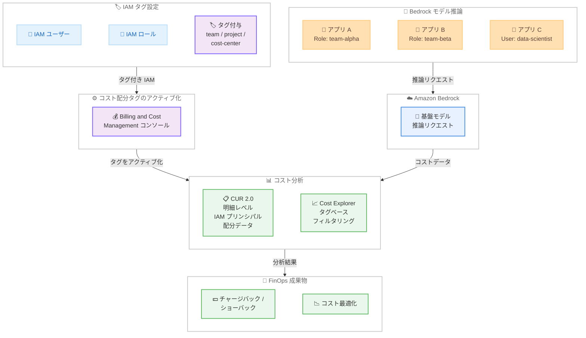

# Amazon Bedrock - IAM ユーザー・ロール別のコスト配分が可能に

**リリース日**: 2026 年 4 月 9 日
**サービス**: Amazon Bedrock
**機能**: Cost allocation by IAM user and role

📊 [このアップデートのインフォグラフィックを見る](https://takech9203.github.io/aws-news-summary/20260409-bedrock-iam-cost-allocation.html)

## 概要

Amazon Bedrock が IAM プリンシパル (IAM ユーザーおよび IAM ロール) 単位でのコスト配分に対応しました。AWS Cost and Usage Report 2.0 (CUR 2.0) および Cost Explorer で、Bedrock のモデル推論コストをユーザー、チーム、プロジェクト、アプリケーション単位で把握・帰属させることが可能になります。

この機能により、IAM ユーザーやロールにチーム、プロジェクト、コストセンターなどの属性をタグとして付与し、コスト配分タグとしてアクティブ化することで、Cost Explorer でのタグベースのフィルタリングや CUR 2.0 での明細レベルの分析が実現します。生成 AI ワークロードの FinOps (クラウド財務管理) を推進するうえで重要な機能です。

主な対象ユーザーは、生成 AI ワークロードのコスト管理を行う FinOps チーム、複数のプロジェクトで Bedrock を利用する組織のクラウド管理者、およびコスト最適化を推進するプラットフォームチームです。

**アップデート前の課題**

- Bedrock のモデル推論コストを特定の IAM ユーザーやロールに帰属させる標準的な手段がなく、チームやプロジェクト単位でのコスト可視化が困難だった
- 生成 AI ワークロードの利用が拡大する中で、どのチーム・アプリケーションがどれだけのコストを発生させているかを把握するには、独自のログ分析やカスタムソリューションが必要だった
- コスト配分の粒度がアカウント単位に限定されており、同一アカウント内の複数プロジェクト間でのコスト按分が実質的に不可能だった

**アップデート後の改善**

- IAM ユーザー・ロールに付与したタグをコスト配分タグとして活用し、チーム・プロジェクト・コストセンター単位での Bedrock コスト分析が可能になった
- Cost Explorer でタグベースのフィルタリングを行うことで、追加のツールなしで直感的にコスト配分を可視化できるようになった
- CUR 2.0 の明細レベルで IAM プリンシパルの配分データを含めることで、詳細なコスト分析とチャージバック/ショーバックの運用が実現可能になった

## アーキテクチャ図



IAM ユーザー・ロールにタグを付与し、Billing and Cost Management コンソールでコスト配分タグとしてアクティブ化すると、Bedrock の推論コストが CUR 2.0 および Cost Explorer でタグ別に分析可能になるフローを示しています。

## サービスアップデートの詳細

### 主要機能

1. **IAM プリンシパル単位のコスト配分**
   - IAM ユーザーおよび IAM ロールに付与したタグを使用して、Bedrock モデル推論コストを配分
   - チーム、プロジェクト、コストセンター、アプリケーションなど任意の属性でコストを分類可能
   - 同一 AWS アカウント内で複数のプロジェクトやチームが Bedrock を利用する環境で特に有効

2. **CUR 2.0 での明細レベル分析**
   - CUR 2.0 データエクスポートで「Include caller identity (IAM principal) allocation data」オプションを選択することで、IAM プリンシパルの配分データを明細に含めることが可能
   - 明細レベルの粒度でコスト帰属が行えるため、詳細なチャージバック/ショーバック運用に対応

3. **Cost Explorer でのタグベースフィルタリング**
   - Cost Explorer でアクティブ化されたコスト配分タグによるフィルタリングが可能
   - 視覚的なダッシュボードで、タグ別の Bedrock コスト推移を確認
   - 追加ツール不要で即座にコスト分析を開始可能

## 技術仕様

### コスト配分の仕組み

| 項目 | 詳細 |
|------|------|
| 対象プリンシパル | IAM ユーザー、IAM ロール |
| タグの種類 | AWS コスト配分タグ (ユーザー定義タグ) |
| 対応レポート | AWS Cost and Usage Report 2.0 (CUR 2.0)、Cost Explorer |
| 配分対象コスト | Bedrock モデル推論コスト |
| データ粒度 | CUR 2.0: 明細レベル、Cost Explorer: タグベースの集約 |

### タグ付与例

| タグキー | タグ値の例 | 用途 |
|----------|------------|------|
| team | alpha, beta, data-science | チーム別コスト配分 |
| project | chatbot-v2, rag-pipeline | プロジェクト別コスト配分 |
| cost-center | CC-1001, CC-2002 | コストセンター別配分 |
| environment | production, staging, development | 環境別コスト配分 |

### API 変更履歴

今回のアップデートに直接関連する API 変更は確認されていません。コスト配分タグの設定は既存の IAM タグ付け API と Billing and Cost Management の機能を通じて行います。

### IAM タグ付与の例

```json
{
    "Tags": [
        {
            "Key": "team",
            "Value": "data-science"
        },
        {
            "Key": "project",
            "Value": "rag-pipeline"
        },
        {
            "Key": "cost-center",
            "Value": "CC-1001"
        }
    ]
}
```

## 設定方法

### 前提条件

1. Amazon Bedrock が利用可能な AWS アカウントを保有していること
2. IAM ユーザー・ロールにタグを付与する権限 (`iam:TagUser`、`iam:TagRole`) を保有していること
3. Billing and Cost Management コンソールでコスト配分タグを管理する権限を保有していること

### 手順

#### ステップ 1: IAM ユーザー・ロールにタグを付与

```bash
# IAM ロールにタグを付与
aws iam tag-role \
    --role-name bedrock-app-role \
    --tags Key=team,Value=data-science Key=project,Value=rag-pipeline Key=cost-center,Value=CC-1001

# IAM ユーザーにタグを付与
aws iam tag-user \
    --user-name bedrock-developer \
    --tags Key=team,Value=alpha Key=project,Value=chatbot-v2
```

Bedrock のモデル推論を実行する IAM ユーザーやロールに、コスト配分に使用するタグを付与します。チーム名、プロジェクト名、コストセンターなど、コスト分析で使用したい属性をタグとして設定します。

#### ステップ 2: コスト配分タグのアクティブ化

Billing and Cost Management コンソールで、ステップ 1 で付与したタグをコスト配分タグとしてアクティブ化します。

1. AWS マネジメントコンソールで Billing and Cost Management を開く
2. 左メニューから「Cost allocation tags」を選択
3. 「User-defined cost allocation tags」タブで、付与したタグキー (team、project、cost-center など) を選択
4. 「Activate」をクリックしてアクティブ化

タグをアクティブ化してからコストデータに反映されるまで最大 24 時間かかる場合があります。

#### ステップ 3: CUR 2.0 データエクスポートの設定

```bash
# CUR 2.0 データエクスポートの作成
# Billing and Cost Management コンソールで以下を設定:
# 1. Data Exports に移動
# 2. 新しい CUR 2.0 エクスポートを作成
# 3. 「Include caller identity (IAM principal) allocation data」を選択
# 4. 出力先の S3 バケットを指定
```

CUR 2.0 データエクスポートを作成する際に、「Include caller identity (IAM principal) allocation data」オプションを選択します。これにより、明細レベルで IAM プリンシパルのコスト配分データが含まれます。

#### ステップ 4: Cost Explorer でのコスト分析

Cost Explorer を開き、フィルタで先ほどアクティブ化したコスト配分タグを使用して Bedrock のコストを分析します。

1. Cost Explorer を開く
2. 「Filter」でサービスを「Amazon Bedrock」に設定
3. 「Group by」でアクティブ化したタグキー (例: team) を選択
4. チームやプロジェクト別のコスト推移を確認

## メリット

### ビジネス面

- **正確なコスト帰属**: チーム・プロジェクト・アプリケーション単位で Bedrock の推論コストを正確に帰属させ、チャージバックやショーバックの運用が実現できる
- **生成 AI の FinOps 推進**: 生成 AI ワークロードのコスト可視化により、投資対効果 (ROI) の評価と予算計画の精度向上に貢献する
- **コスト意識の醸成**: チームやプロジェクト単位のコスト可視化により、各チームのコスト意識を高め、無駄な推論リクエストの削減につなげられる

### 技術面

- **追加ツール不要**: 既存の IAM タグ機能と Cost Explorer / CUR 2.0 を活用するため、サードパーティツールや独自のコスト追跡ソリューションが不要
- **既存の IAM 構成を活用**: 既に IAM ユーザー・ロールを適切に分離している組織では、タグを追加するだけで即座にコスト配分を開始できる
- **明細レベルの分析**: CUR 2.0 の明細データを Amazon Athena や Amazon QuickSight で分析することで、推論モデル別・時間帯別など多角的なコスト分析が可能

## デメリット・制約事項

### 制限事項

- コスト配分タグのアクティブ化からデータ反映まで最大 24 時間のタイムラグが生じる
- IAM タグの変更はリアルタイムではなく、変更後のコストデータに対してのみ反映される (過去データへの遡及適用は不可)
- 対象は Bedrock モデル推論コストに限定されており、Bedrock の他の料金項目 (カスタムモデルのトレーニングなど) への適用範囲は公式発表の情報から確認が必要

### 考慮すべき点

- IAM ユーザー・ロールのタグ運用ルールを組織全体で統一する必要がある (タグキーの命名規則、必須タグの定義など)
- 共有ロールを複数のプロジェクトで使用している場合は、プロジェクト単位のコスト配分が正確に行えないため、ロールの分離が必要
- CUR 2.0 データのエクスポート先 S3 バケットのコストが追加で発生する

## ユースケース

### ユースケース 1: マルチチーム環境での生成 AI コスト管理

**シナリオ**: 1 つの AWS アカウントで複数のチーム (データサイエンス、カスタマーサポート、マーケティング) がそれぞれ異なる Bedrock モデルを活用しており、チームごとのコストを正確に把握してチャージバックを実施したい場合。

**実装例**:
```bash
# 各チームのロールにタグを付与
aws iam tag-role --role-name bedrock-data-science \
    --tags Key=team,Value=data-science Key=cost-center,Value=CC-100

aws iam tag-role --role-name bedrock-customer-support \
    --tags Key=team,Value=customer-support Key=cost-center,Value=CC-200

aws iam tag-role --role-name bedrock-marketing \
    --tags Key=team,Value=marketing Key=cost-center,Value=CC-300
```

**効果**: Cost Explorer でチーム別の Bedrock コスト推移をリアルタイムに確認でき、月次のチャージバック処理を自動化するための正確なデータが得られる。

### ユースケース 2: プロジェクト別 ROI 分析

**シナリオ**: 複数の生成 AI プロジェクト (RAG パイプライン、チャットボット、コード生成) を並行して運用しており、プロジェクトごとの推論コストと業務効果を比較して投資優先度を決定したい場合。

**実装例**:
```bash
# プロジェクトごとの IAM ロールにタグを付与
aws iam tag-role --role-name bedrock-rag-pipeline \
    --tags Key=project,Value=rag-pipeline Key=environment,Value=production

aws iam tag-role --role-name bedrock-chatbot \
    --tags Key=project,Value=chatbot-v2 Key=environment,Value=production

aws iam tag-role --role-name bedrock-codegen \
    --tags Key=project,Value=code-generation Key=environment,Value=staging
```

**効果**: プロジェクトごとの Bedrock 推論コストを明確に把握でき、コスト対効果の高いプロジェクトへの投資を増やし、ROI の低いプロジェクトの見直し判断が可能になる。

### ユースケース 3: 開発・本番環境のコスト分離

**シナリオ**: 開発環境とステージング環境で大量のテスト推論が行われており、本番環境の実コストと開発関連コストを分離して正確な運用コストを把握したい場合。

**実装例**:
```bash
# 環境別のロールにタグを付与
aws iam tag-role --role-name bedrock-prod-role \
    --tags Key=environment,Value=production

aws iam tag-role --role-name bedrock-staging-role \
    --tags Key=environment,Value=staging

aws iam tag-role --role-name bedrock-dev-role \
    --tags Key=environment,Value=development
```

**効果**: 環境ごとの推論コストが明確に分離され、本番環境の正確な運用コスト把握とキャパシティプランニング、開発コストの予算管理が可能になる。

## 料金

今回のコスト配分機能自体に追加料金は発生しません。IAM タグの付与、コスト配分タグのアクティブ化、Cost Explorer での分析は無料で利用できます。CUR 2.0 データエクスポートについては、出力先の S3 バケットのストレージコストが発生します。

### 料金例

| 項目 | 料金 |
|------|------|
| IAM タグ付与 | 無料 |
| コスト配分タグアクティブ化 | 無料 |
| Cost Explorer でのタグベース分析 | 無料 |
| CUR 2.0 データエクスポート | S3 ストレージコストのみ |

Bedrock のモデル推論コスト自体は [Amazon Bedrock の料金ページ](https://aws.amazon.com/bedrock/pricing/)を参照してください。

## 利用可能リージョン

Amazon Bedrock が利用可能なすべての AWS 商用リージョンでこの機能を利用できます。

## 関連サービス・機能

- **AWS Cost and Usage Report 2.0 (CUR 2.0)**: 明細レベルの IAM プリンシパル配分データを含むコストレポート。Athena や QuickSight と連携した詳細分析に使用
- **AWS Cost Explorer**: タグベースのフィルタリングで Bedrock コストを視覚的に分析するダッシュボード
- **AWS Identity and Access Management (IAM)**: ユーザー・ロールへのタグ付与とコスト配分の基盤となるサービス
- **AWS Billing and Cost Management**: コスト配分タグのアクティブ化と全体的なコスト管理を行うサービス
- **Amazon Athena**: CUR 2.0 データを SQL で分析し、カスタムコストレポートを作成する際に活用
- **Amazon QuickSight**: CUR 2.0 データを可視化し、コスト配分ダッシュボードの構築に活用

## 参考リンク

- 📊 [インフォグラフィック](https://takech9203.github.io/aws-news-summary/20260409-bedrock-iam-cost-allocation.html)
- [公式発表 (What's New)](https://aws.amazon.com/about-aws/whats-new/2026/04/bedrock-iam-cost-allocation/)
- [Amazon Bedrock ドキュメント](https://docs.aws.amazon.com/bedrock/latest/userguide/)
- [AWS Cost and Usage Report 2.0 ドキュメント](https://docs.aws.amazon.com/cur/latest/userguide/)
- [コスト配分タグの使用](https://docs.aws.amazon.com/awsaccountbilling/latest/aboutv2/cost-alloc-tags.html)
- [Amazon Bedrock 料金ページ](https://aws.amazon.com/bedrock/pricing/)

## まとめ

Amazon Bedrock の IAM プリンシパル単位でのコスト配分機能は、生成 AI ワークロードの FinOps を推進するうえで不可欠なアップデートです。IAM ユーザー・ロールにタグを付与してコスト配分タグとしてアクティブ化するだけで、Cost Explorer や CUR 2.0 を通じてチーム・プロジェクト・コストセンター別のコスト分析が可能になります。生成 AI の利用が拡大する組織では、早期にタグ戦略を策定し、Bedrock 推論コストの可視化とチャージバック/ショーバック運用を開始することを推奨します。
