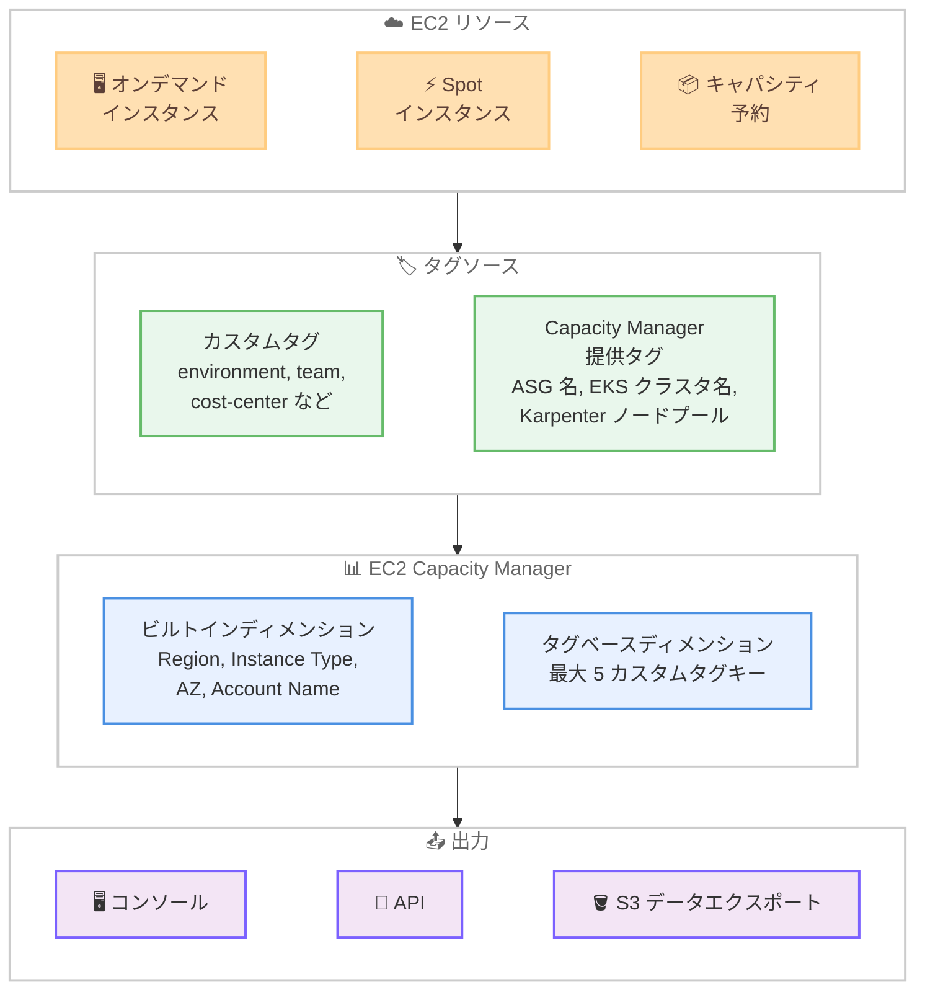

# Amazon EC2 Capacity Manager - タグベースディメンションのサポート

**リリース日**: 2026 年 4 月 9 日
**サービス**: Amazon EC2 Capacity Manager
**機能**: タグベースディメンション

📊 [このアップデートのインフォグラフィックを見る](https://takech9203.github.io/aws-news-summary/20260409-ec2-capacity-manager-tag-based-dimensions.html)

## 概要

Amazon EC2 Capacity Manager がタグベースディメンションをサポートし、EC2 リソースのタグを使用してキャパシティメトリクスのグループ化やフィルタリングが可能になりました。EC2 Capacity Manager は、オンデマンドインスタンス、Spot インスタンス、キャパシティ予約にわたるキャパシティ使用状況を監視・最適化するサービスです。

今回のアップデートでは、最大 5 つのカスタムタグキー (environment、team、cost-center など) をアクティベートし、既存のビルトインディメンション (Region、Instance Type、Availability Zone) と組み合わせて使用できます。さらに、Account Name が新しいビルトインディメンションとして追加され、組織全体のクロスアカウントキャパシティデータの分析がより容易になりました。

**アップデート前の課題**

- キャパシティメトリクスのグループ化はリージョン、インスタンスタイプ、アベイラビリティゾーンなどのビルトインディメンションに限定されていた
- チーム、環境、コストセンターなどのビジネス属性でキャパシティ使用状況を分析することが困難だった
- クロスアカウント分析時にアカウント ID のみが表示され、アカウントの識別が難しかった
- S3 データエクスポートにタグ情報を含めることができなかった

**アップデート後の改善**

- 最大 5 つのカスタムタグキーでキャパシティメトリクスをグループ化・フィルタリング可能になった
- EC2 Auto Scaling グループ名、EKS クラスタ名、EKS Kubernetes ノードプール、Karpenter ノードプールの 4 つの Capacity Manager 提供タグがデフォルトで利用可能になった
- Account Name ディメンションの追加により、クロスアカウント分析でのアカウント識別が容易になった
- S3 データエクスポートに新規作成分からタグデータを追加カラムとして含めることが可能になった

## アーキテクチャ図



EC2 リソースに付与されたタグを Capacity Manager のディメンションとして使用し、コンソール、API、S3 エクスポートで分析できる構成を示しています。

## サービスアップデートの詳細

### 主要機能

1. **カスタムタグベースディメンション**
   - 最大 5 つのカスタムタグキーをアクティベート可能
   - environment、team、cost-center などの任意のタグキーを指定
   - ビルトインディメンションと組み合わせてメトリクスをグループ化・フィルタリング
   - コンソールおよび API の両方で利用可能

2. **Capacity Manager 提供タグ**
   - デフォルトで 4 つのタグが自動的に提供される
   - EC2 Auto Scaling グループ名
   - EKS クラスタ名
   - EKS Kubernetes ノードプール
   - Karpenter ノードプール

3. **Account Name ビルトインディメンション**
   - 新しいビルトインディメンションとして Account Name を追加
   - AWS Organizations のクロスアカウント分析でアカウントを名前で識別可能
   - アカウント ID だけでなく、わかりやすい名前でフィルタリング・グループ化が可能

4. **S3 データエクスポートへのタグデータ追加**
   - 新規作成した S3 データエクスポートにタグデータを追加カラムとして含めることが可能
   - 外部の BI ツールやデータ分析パイプラインでのタグベース分析に対応

## 技術仕様

### ディメンション一覧

| カテゴリ | ディメンション | 説明 |
|---------|--------------|------|
| ビルトイン | Region | AWS リージョン |
| ビルトイン | Instance Type | EC2 インスタンスタイプ |
| ビルトイン | Availability Zone | アベイラビリティゾーン |
| ビルトイン | Account Name | AWS アカウント名 (新規) |
| Capacity Manager 提供タグ | EC2 Auto Scaling group name | Auto Scaling グループの名前 |
| Capacity Manager 提供タグ | EKS cluster name | EKS クラスタの名前 |
| Capacity Manager 提供タグ | EKS Kubernetes node pool | EKS ノードプールの名前 |
| Capacity Manager 提供タグ | Karpenter node pool | Karpenter ノードプールの名前 |
| カスタムタグ | ユーザー定義 | 最大 5 つまで任意のタグキーを指定 |

### タグベースディメンションの制約

| 項目 | 詳細 |
|------|------|
| カスタムタグキーの上限 | 5 個 |
| Capacity Manager 提供タグ | 4 個 (デフォルト有効) |
| 利用可能な出力先 | コンソール、API、S3 データエクスポート |
| S3 エクスポートのタグデータ | 新規作成のエクスポートのみ対応 |

### API 変更履歴

本アップデートに直接関連する EC2 Capacity Manager の API 変更は、調査時点では awsapichanges.com に記録されていません。今後 API ドキュメントが更新される可能性があります。

## 設定方法

### 前提条件

1. AWS アカウントへのアクセス権限
2. EC2 Capacity Manager へのアクセス権限
3. EC2 リソースに適切なタグが付与されていること
4. クロスアカウント分析を行う場合は AWS Organizations が設定されていること

### 手順

#### ステップ 1: EC2 Capacity Manager にアクセス

AWS マネジメントコンソールから EC2 Capacity Manager にアクセスします。

```
https://console.aws.amazon.com/ec2/home#CapacityManagerHome
```

EC2 コンソールの左側メニューから Capacity Manager を選択してアクセスします。

#### ステップ 2: カスタムタグキーのアクティベート

Capacity Manager の設定画面でカスタムタグキーをアクティベートします。

```
設定 > タグベースディメンション > カスタムタグキーを追加
```

使用したいタグキー (例: environment、team、cost-center) を最大 5 つまで選択してアクティベートします。アクティベート後、該当するタグの値に基づいてメトリクスがグループ化されます。

#### ステップ 3: タグベースディメンションでフィルタリング

ダッシュボードでビルトインディメンションとカスタムタグディメンションを組み合わせてメトリクスを分析します。

```
例: Region = ap-northeast-1 AND environment = production
```

複数のディメンションを組み合わせることで、特定の環境やチームのキャパシティ使用状況を詳細に分析できます。

#### ステップ 4: S3 データエクスポートの設定

タグデータを含む S3 データエクスポートを新規作成します。

```
設定 > データエクスポート > 新規エクスポートを作成 > タグカラムを選択
```

エクスポートにタグデータを含めることで、Amazon Athena や Amazon QuickSight などの外部ツールでの分析が可能になります。

## メリット

### ビジネス面

- **コスト配分の精度向上**: チーム、プロジェクト、コストセンターごとにキャパシティ使用状況を正確に把握し、コスト配分の精度を向上
- **ガバナンスの強化**: 環境 (本番、ステージング、開発) ごとのキャパシティ使用状況を監視し、リソースの適正利用を促進
- **クロスアカウント分析の効率化**: Account Name ディメンションにより、組織全体のキャパシティ分析がより直感的になり、意思決定の速度が向上

### 技術面

- **柔軟なメトリクス分析**: カスタムタグとビルトインディメンションの組み合わせにより、多次元的な分析が可能
- **Kubernetes 統合**: EKS クラスタ名や Karpenter ノードプールなどの Capacity Manager 提供タグにより、コンテナワークロードのキャパシティ分析が容易
- **データパイプライン統合**: S3 エクスポートへのタグデータ追加により、既存の分析パイプラインとの統合が容易

## デメリット・制約事項

### 制限事項

- カスタムタグキーは最大 5 つまでに制限されている
- S3 データエクスポートへのタグデータ追加は新規作成のエクスポートのみが対象で、既存のエクスポートには適用されない
- タグが付与されていないリソースは、タグベースディメンションでのグループ化に含まれない場合がある

### 考慮すべき点

- タグの命名規則を組織全体で統一する必要がある (例: "Environment" と "environment" は別のタグとして扱われる)
- カスタムタグキーの変更が反映されるまでに時間がかかる場合がある
- 5 つのカスタムタグキーの選択は、組織のタグ戦略と整合させて慎重に決定する必要がある

## ユースケース

### ユースケース 1: チーム別キャパシティコスト配分

**シナリオ**: 複数のチームが共有 AWS アカウントで EC2 インスタンスを運用しており、チームごとのキャパシティ使用状況を把握したい

**実装例**:
```
1. EC2 インスタンスに "team" タグを付与 (例: team=platform, team=data, team=ml)
2. Capacity Manager でカスタムタグキーとして "team" をアクティベート
3. ダッシュボードで team ディメンションでグループ化して分析
```

**効果**: チームごとのオンデマンド、Spot、キャパシティ予約の使用状況を可視化し、公平なコスト配分を実現

### ユースケース 2: 環境別キャパシティ管理

**シナリオ**: 本番環境、ステージング環境、開発環境でキャパシティの使用状況が異なり、環境ごとに適切なキャパシティ戦略を策定したい

**実装例**:
```
1. EC2 インスタンスに "environment" タグを付与 (例: environment=production, environment=staging, environment=development)
2. Capacity Manager でカスタムタグキーとして "environment" をアクティベート
3. environment=production でフィルタリングし、本番環境のキャパシティ使用傾向を分析
4. S3 データエクスポートにタグデータを含めて定期的なレポートを生成
```

**効果**: 環境ごとのキャパシティ使用パターンを把握し、開発環境での過剰プロビジョニングの削減や本番環境の適切なキャパシティ計画を実現

### ユースケース 3: EKS クラスタのキャパシティ最適化

**シナリオ**: 複数の EKS クラスタを運用しており、クラスタごとのキャパシティ使用状況と Spot 中断の影響を分析したい

**実装例**:
```
1. Capacity Manager 提供タグの "EKS cluster name" と "Karpenter node pool" を使用
2. クラスタ名でグループ化し、各クラスタのインスタンスタイプ別使用状況を分析
3. Karpenter ノードプール別の Spot インスタンス使用率を確認
4. Account Name ディメンションと組み合わせてマルチアカウントの EKS キャパシティを横断分析
```

**効果**: EKS クラスタごとのキャパシティ効率を把握し、Karpenter のノードプール設定やインスタンスタイプの多様化を最適化

## 料金

EC2 Capacity Manager のタグベースディメンション機能は追加料金なしで利用できます。EC2 Capacity Manager 自体の基本機能に含まれています。

S3 データエクスポートについては、S3 のストレージ料金とデータ転送料金が別途発生します。

## 利用可能リージョン

EC2 Capacity Manager が利用可能なすべての AWS リージョンで利用できます。

## 関連サービス・機能

- **AWS Cost Allocation Tags**: AWS 請求レベルでのタグベースコスト配分。Capacity Manager のタグベースディメンションと組み合わせることで、キャパシティとコストの両面からタグベースの分析が可能
- **Amazon EKS**: Capacity Manager 提供タグとして EKS クラスタ名とノードプール情報が自動的に提供され、Kubernetes ワークロードのキャパシティ分析を支援
- **Karpenter**: Capacity Manager 提供タグとして Karpenter ノードプールが提供され、Karpenter によるキャパシティプロビジョニングの可視性を向上
- **EC2 Auto Scaling**: Auto Scaling グループ名が Capacity Manager 提供タグとして利用可能で、スケーリンググループ単位のキャパシティ分析が可能
- **AWS Organizations**: Account Name ディメンションを活用したクロスアカウントキャパシティ分析の基盤

## 参考リンク

- 📊 [インフォグラフィック](https://takech9203.github.io/aws-news-summary/20260409-ec2-capacity-manager-tag-based-dimensions.html)
- [公式発表 (What's New)](https://aws.amazon.com/about-aws/whats-new/2026/04/ec2-capacity-manager-tag-based-dimensions/)
- [EC2 Capacity Manager ドキュメント](https://docs.aws.amazon.com/AWSEC2/latest/UserGuide/capacity-manager.html)
- [EC2 Capacity Manager コンソール](https://console.aws.amazon.com/ec2/home#CapacityManagerHome)
- [AWS リソースのタグ付け](https://docs.aws.amazon.com/general/latest/gr/aws_tagging.html)

## まとめ

EC2 Capacity Manager のタグベースディメンションサポートにより、組織のタグ戦略に合わせたキャパシティメトリクスの分析が可能になりました。カスタムタグキー、Capacity Manager 提供タグ、新しい Account Name ディメンションを活用することで、チーム別、環境別、クラスタ別など多角的なキャパシティ分析を実現できます。既に EC2 リソースにタグを付与している組織では、タグキーをアクティベートするだけで、すぐにタグベースのキャパシティ分析を開始できます。
