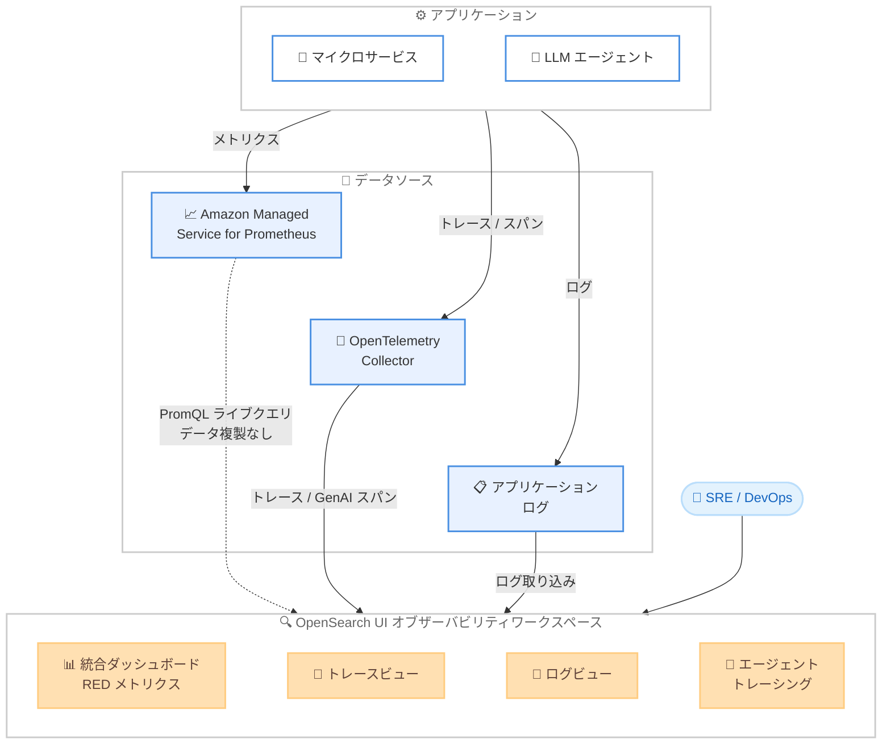

# Amazon OpenSearch Service - Managed Prometheus 統合とエージェントトレーシング

**リリース日**: 2026年04月09日
**サービス**: Amazon OpenSearch Service
**機能**: 統合オブザーバビリティ体験 (Managed Prometheus 連携 / AI エージェントトレーシング)

📊 [このアップデートのインフォグラフィックを見る](https://takech9203.github.io/aws-news-summary/20260409-opensearch-managed-prometheus-agent-tracing.html)

## 概要

AWS は 2026 年 4 月 9 日、Amazon OpenSearch Service において統合オブザーバビリティ体験の提供を発表しました。このアップデートでは、メトリクス、ログ、トレース、AI エージェントトレーシングを単一のインターフェースに統合し、Amazon Managed Service for Prometheus とのネイティブ統合および包括的なエージェントトレーシング機能を導入しています。

この機能強化は、プレミアムオブザーバビリティプラットフォームの高額なコストと、断片化されたツールによるオペレーション上の複雑さという 2 つの課題を解決します。Site Reliability Engineers (SRE)、DevOps エンジニア、プラットフォームエンジニアリングチームは、コストのかかるデータ重複や複数ツール間のコンテキストスイッチングなしに、オブザーバビリティスタックを統合できます。

OpenSearch UI のオブザーバビリティワークスペースで、ネイティブな PromQL 構文を使用して Prometheus メトリクスを直接クエリし、ログやトレースと並行して確認できます。RED メトリクス (Rate, Errors, Duration) を活用した新しいアプリケーション監視ワークフローと、OpenTelemetry GenAI セマンティック規約に基づく AI エージェントトレーシングにより、運用チームは遅いトレースとアプリケーションログの相関分析、サービスダッシュボード上での Prometheus メトリクスのオーバーレイ、LLM エージェント実行のトレースを、ツールを切り替えることなく実行できます。

**アップデート前の課題**

- プレミアムオブザーバビリティプラットフォームの利用コストが高く、特に大規模環境ではコスト負担が大きかった
- メトリクス、ログ、トレースが異なるツールに分散しており、障害調査時のコンテキストスイッチングに時間がかかっていた
- Prometheus メトリクスを OpenSearch に取り込む際にデータの重複が発生し、ストレージコストが増大していた
- LLM エージェントの実行フローを可視化・トレースする統合的な手段が存在しなかった

**アップデート後の改善**

- 単一の OpenSearch UI からメトリクス、ログ、トレース、エージェントトレーシングを統合的に確認可能になった
- ライブクエリアーキテクチャにより、データを複製せずに Prometheus メトリクスを PromQL で直接クエリ可能になった
- RED メトリクスベースのアプリケーション監視により、Rate / Errors / Duration の統合的な可視化が実現した
- OpenTelemetry GenAI セマンティック規約に基づく AI エージェントトレーシングにより、LLM エージェントの実行フローを追跡可能になった

## アーキテクチャ図



この図は、統合オブザーバビリティの全体アーキテクチャを示しています。アプリケーションからのメトリクス、トレース、ログが各データソースを経由して OpenSearch UI のオブザーバビリティワークスペースに集約され、Prometheus メトリクスはデータ複製なしにライブクエリで参照されます。

## サービスアップデートの詳細

### 主要機能

1. **Amazon Managed Service for Prometheus とのネイティブ統合**
   - OpenSearch UI から直接 PromQL 構文を使用して Prometheus メトリクスをクエリ可能
   - ライブクエリアーキテクチャにより、メトリクスデータの重複なしにリアルタイムで参照
   - ログやトレースと同一のワークスペースで Prometheus メトリクスを並行して確認可能
   - サービスダッシュボード上に Prometheus メトリクスをオーバーレイ表示可能

2. **RED メトリクスベースのアプリケーション監視**
   - Rate (リクエスト頻度)、Errors (エラー率)、Duration (レイテンシー) の 3 つの指標を統合的に可視化
   - アプリケーションレベルのパフォーマンス監視ワークフローを提供
   - 遅いトレースからアプリケーションログへの相関分析をワンクリックで実行

3. **AI エージェントトレーシング**
   - OpenTelemetry GenAI セマンティック規約に準拠したトレーシング機能
   - LLM エージェントの実行フロー (プロンプト送信、モデル推論、ツール呼び出し) を可視化
   - エージェントの各ステップにおけるレイテンシーやエラーの特定が可能
   - 複数の LLM 呼び出しやツール実行を含む複雑なエージェントワークフローのデバッグに対応

## 技術仕様

### 統合オブザーバビリティ機能

| 項目 | 詳細 |
|------|------|
| Prometheus クエリ言語 | PromQL (ネイティブサポート) |
| データ転送方式 | ライブクエリ (データ複製なし) |
| 監視メトリクス | RED メトリクス (Rate, Errors, Duration) |
| トレーシング規約 | OpenTelemetry GenAI セマンティック規約 |
| 統合データタイプ | メトリクス、ログ、トレース、AI エージェントトレーシング |
| UI | OpenSearch UI オブザーバビリティワークスペース |

### PromQL クエリの対応範囲

| 機能 | 説明 |
|------|------|
| インスタントクエリ | 特定時点のメトリクス値を取得 |
| レンジクエリ | 時間範囲を指定したメトリクスの推移を取得 |
| 集計関数 | sum、avg、max、min、count などの集計処理 |
| レート計算 | rate、irate によるカウンターメトリクスの変化率計算 |
| ラベルフィルタリング | ラベルによるメトリクスの絞り込み |

### API 変更履歴

本アップデートに関連する API 変更は、調査期間内で確認されませんでした。統合オブザーバビリティ機能は OpenSearch UI のフロントエンド機能として提供され、Prometheus メトリクスへのアクセスはライブクエリ接続を通じて行われます。

## 設定方法

### 前提条件

1. Amazon OpenSearch Service ドメインが対応リージョンで稼働していること
2. Amazon Managed Service for Prometheus ワークスペースが設定済みであること
3. OpenTelemetry Collector がアプリケーションからのトレースデータを収集する構成になっていること
4. 適切な IAM ポリシーで OpenSearch Service および Prometheus へのアクセスが許可されていること

### 手順

#### ステップ 1: Prometheus データソースの接続設定

OpenSearch UI のオブザーバビリティワークスペースから、Prometheus データソースを追加します。

```yaml
# OpenTelemetry Collector 設定例
receivers:
  otlp:
    protocols:
      grpc:
        endpoint: 0.0.0.0:4317
      http:
        endpoint: 0.0.0.0:4318

exporters:
  prometheusremotewrite:
    endpoint: "https://aps-workspaces.<region>.amazonaws.com/workspaces/<workspace-id>/api/v1/remote_write"
    auth:
      authenticator: sigv4auth

  otlp/opensearch:
    endpoint: "https://<opensearch-domain-endpoint>"

extensions:
  sigv4auth:
    region: "<region>"
    service: "aps"

service:
  extensions: [sigv4auth]
  pipelines:
    metrics:
      receivers: [otlp]
      exporters: [prometheusremotewrite]
    traces:
      receivers: [otlp]
      exporters: [otlp/opensearch]
```

この設定は、OpenTelemetry Collector を使用してメトリクスを Amazon Managed Service for Prometheus に、トレースを OpenSearch Service にそれぞれ送信する構成です。

#### ステップ 2: AI エージェントトレーシングの計装

```python
from opentelemetry import trace
from opentelemetry.sdk.trace import TracerProvider
from opentelemetry.sdk.trace.export import BatchSpanProcessor
from opentelemetry.exporter.otlp.proto.grpc.trace_exporter import OTLPSpanExporter

# TracerProvider の初期化
provider = TracerProvider()
processor = BatchSpanProcessor(
    OTLPSpanExporter(endpoint="http://localhost:4317")
)
provider.add_span_processor(processor)
trace.set_tracer_provider(provider)

tracer = trace.get_tracer("llm-agent")

# LLM エージェント実行のトレーシング
with tracer.start_as_current_span("agent.workflow") as workflow_span:
    workflow_span.set_attribute("gen_ai.system", "openai")

    with tracer.start_as_current_span("gen_ai.chat") as chat_span:
        chat_span.set_attribute("gen_ai.request.model", "gpt-4")
        chat_span.set_attribute("gen_ai.usage.prompt_tokens", 150)
        chat_span.set_attribute("gen_ai.usage.completion_tokens", 50)
        # LLM 呼び出し処理

    with tracer.start_as_current_span("agent.tool_call") as tool_span:
        tool_span.set_attribute("gen_ai.tool.name", "search_documents")
        tool_span.set_attribute("gen_ai.tool.status", "success")
        # ツール実行処理
```

このコードは、OpenTelemetry GenAI セマンティック規約に基づいて LLM エージェントの実行フローを計装する例です。各スパンにエージェント固有の属性を設定することで、OpenSearch UI でエージェントの動作を詳細に追跡できます。

#### ステップ 3: OpenSearch UI でのダッシュボード設定

OpenSearch UI のオブザーバビリティワークスペースにアクセスし、以下の操作を行います。

1. Prometheus データソースを追加し、ワークスペース URL とリージョンを指定
2. RED メトリクスダッシュボードを作成し、対象サービスの Rate / Errors / Duration を設定
3. トレースビューで AI エージェントのスパンをフィルタリングし、実行フローを確認

## メリット

### ビジネス面

- **大幅なコスト削減**: ライブクエリアーキテクチャによりデータの重複が不要となり、プレミアムオブザーバビリティプラットフォームと比較して大幅なコスト削減を実現
- **運用効率の向上**: メトリクス、ログ、トレースを単一のインターフェースで確認でき、複数ツール間のコンテキストスイッチングが不要に
- **AI エージェントの運用可視化**: LLM エージェントの実行フローを詳細にトレースでき、生成 AI アプリケーションの品質管理とデバッグが容易に

### 技術面

- **PromQL ネイティブサポート**: 既存の Prometheus クエリ資産をそのまま活用でき、学習コストが最小限
- **OpenTelemetry 標準準拠**: GenAI セマンティック規約に準拠しており、ベンダーロックインを回避しつつ標準的なトレーシングが可能
- **統合相関分析**: 遅いトレースからログへのドリルダウン、Prometheus メトリクスのオーバーレイなど、シグナル間の相関分析をシームレスに実行可能
- **スケーラブルなアーキテクチャ**: データを複製しないライブクエリにより、大規模環境でもストレージコストを抑制しつつ統合的な可視化を実現

## デメリット・制約事項

### 制限事項

- 利用可能リージョンは 20 リージョンに限定されている (全リージョン対応ではない)
- Prometheus メトリクスのライブクエリは、Amazon Managed Service for Prometheus が前提であり、セルフホスト型 Prometheus への直接接続は対象外
- AI エージェントトレーシングは OpenTelemetry GenAI セマンティック規約に準拠した計装が必要であり、独自のトレーシング形式には対応しない

### 考慮すべき点

- Prometheus メトリクスのライブクエリでは、ネットワークレイテンシーによりローカルデータと比較して若干の遅延が発生する可能性がある
- 既存のオブザーバビリティツールからの移行には、ダッシュボードの再構築やアラートルールの再設定が必要
- AI エージェントトレーシングの計装には、アプリケーションコードへの OpenTelemetry SDK の組み込みが必要であり、既存アプリケーションへの適用には開発工数がかかる
- RED メトリクスの効果を最大限に活用するには、適切なサービスメッシュやアプリケーション計装が前提となる

## ユースケース

### ユースケース 1: マイクロサービスの統合障害調査

**シナリオ**: マイクロサービスアーキテクチャを採用する企業で、特定のサービスのレイテンシーが増加している原因を調査する。RED メトリクスで異常を検知し、トレースとログを相関分析して根本原因を特定したい。

**実装例**:
```promql
# RED メトリクス - Duration の p99 レイテンシーを確認
histogram_quantile(0.99,
  sum(rate(http_request_duration_seconds_bucket{service="payment-service"}[5m])) by (le)
)

# エラー率の確認
sum(rate(http_requests_total{service="payment-service", status=~"5.."}[5m]))
/
sum(rate(http_requests_total{service="payment-service"}[5m]))
```

**効果**: Prometheus メトリクスで異常なレイテンシーを検知した後、同一画面でトレースを確認し、遅延の原因となっているスパンを特定。さらにそのスパンに対応するログにドリルダウンすることで、MTTR (平均復旧時間) を大幅に短縮できる。

### ユースケース 2: LLM エージェントのパフォーマンス最適化

**シナリオ**: 生成 AI を活用したカスタマーサポートエージェントの応答速度が低下している。エージェントの実行フローをトレースし、ボトルネックとなっているステップを特定したい。

**実装例**:
```python
# OpenTelemetry GenAI セマンティック規約によるエージェント計装
with tracer.start_as_current_span("agent.customer_support") as span:
    span.set_attribute("gen_ai.system", "bedrock")
    span.set_attribute("gen_ai.request.model", "anthropic.claude-v3")

    # ステップ 1: コンテキスト検索
    with tracer.start_as_current_span("agent.tool_call") as tool_span:
        tool_span.set_attribute("gen_ai.tool.name", "knowledge_base_search")
        results = search_knowledge_base(query)

    # ステップ 2: LLM 推論
    with tracer.start_as_current_span("gen_ai.chat") as chat_span:
        chat_span.set_attribute("gen_ai.usage.prompt_tokens", 500)
        response = invoke_model(prompt, results)
```

**効果**: エージェントの各ステップ (ナレッジベース検索、LLM 推論、ツール呼び出し) のレイテンシーを個別に計測でき、ボトルネックの特定とパフォーマンス最適化が容易になる。

### ユースケース 3: オブザーバビリティスタックの統合によるコスト最適化

**シナリオ**: 現在、Prometheus でメトリクスを管理し、別のツールでログ管理、さらに別のツールでトレース管理を行っている企業が、オブザーバビリティコストを削減しつつ運用を統合したい。

**実装例**:
```yaml
# 統合オブザーバビリティ構成の OpenTelemetry Collector 設定
service:
  pipelines:
    metrics:
      receivers: [otlp, prometheus]
      exporters: [prometheusremotewrite]
    traces:
      receivers: [otlp]
      exporters: [otlp/opensearch]
    logs:
      receivers: [otlp, filelog]
      exporters: [opensearch]
```

**効果**: メトリクスは Prometheus に保持したまま OpenSearch UI からライブクエリで参照し、ログとトレースは OpenSearch に集約することで、データ重複を排除してストレージコストを削減。プレミアムプラットフォームのライセンスコストも不要になる。

## 料金

統合オブザーバビリティ機能は OpenSearch UI の一部として提供されます。料金は主に以下のコンポーネントで構成されます。

### 料金例

| コンポーネント | 料金体系 |
|---------------|----------|
| Amazon OpenSearch Service | インスタンスタイプ、ストレージ、データ転送量に基づく従量課金 |
| Amazon Managed Service for Prometheus | メトリクスサンプルの取り込み量とクエリ処理量に基づく従量課金 |
| OpenTelemetry データ転送 | OpenSearch Ingestion を使用する場合はパイプライン処理量に基づく課金 |

Prometheus メトリクスのライブクエリ自体には追加料金は発生しませんが、Amazon Managed Service for Prometheus 側のクエリ処理料金が適用されます。詳細な料金については、[Amazon OpenSearch Service の料金ページ](https://aws.amazon.com/opensearch-service/pricing/)および [Amazon Managed Service for Prometheus の料金ページ](https://aws.amazon.com/prometheus/pricing/)をご確認ください。

## 利用可能リージョン

統合オブザーバビリティ機能は、以下の 20 リージョンで利用可能です。

**北米**:
- 米国東部 (バージニア北部) - us-east-1
- 米国東部 (オハイオ) - us-east-2
- 米国西部 (北カリフォルニア) - us-west-1
- 米国西部 (オレゴン) - us-west-2
- カナダ (中部) - ca-central-1

**欧州**:
- 欧州 (フランクフルト) - eu-central-1
- 欧州 (アイルランド) - eu-west-1
- 欧州 (ロンドン) - eu-west-2
- 欧州 (ミラノ) - eu-south-1
- 欧州 (パリ) - eu-west-3
- 欧州 (スペイン) - eu-south-2
- 欧州 (ストックホルム) - eu-north-1

**アジアパシフィック**:
- アジアパシフィック (香港) - ap-east-1
- アジアパシフィック (ムンバイ) - ap-south-1
- アジアパシフィック (大阪) - ap-northeast-3
- アジアパシフィック (ソウル) - ap-northeast-2
- アジアパシフィック (シンガポール) - ap-southeast-1
- アジアパシフィック (シドニー) - ap-southeast-2
- アジアパシフィック (東京) - ap-northeast-1

**南米**:
- 南米 (サンパウロ) - sa-east-1

## 関連サービス・機能

- **Amazon Managed Service for Prometheus**: フルマネージドの Prometheus 互換モニタリングサービス。本アップデートにより OpenSearch UI からライブクエリで直接参照可能に
- **Amazon OpenSearch Ingestion**: OpenSearch へのデータ取り込みパイプライン。トレースやログの効率的な取り込みに利用
- **AWS Distro for OpenTelemetry**: AWS がサポートする OpenTelemetry ディストリビューション。メトリクス、トレース、ログの収集に活用
- **Amazon CloudWatch**: AWS のネイティブモニタリングサービス。OpenSearch Service のドメインレベルのメトリクス監視に使用
- **Amazon Bedrock**: 生成 AI モデルへのアクセスを提供するサービス。AI エージェントトレーシングの対象となるエージェントの基盤

## 参考リンク

- 📊 [インフォグラフィック](https://takech9203.github.io/aws-news-summary/20260409-opensearch-managed-prometheus-agent-tracing.html)
- [公式発表 (What's New)](https://aws.amazon.com/about-aws/whats-new/2026/04/opensearch-managed-prometheus-agent-tracing/)
- [Amazon OpenSearch Service ドキュメント](https://docs.aws.amazon.com/opensearch-service/)
- [Amazon OpenSearch Service 料金ページ](https://aws.amazon.com/opensearch-service/pricing/)
- [Amazon Managed Service for Prometheus](https://aws.amazon.com/prometheus/)
- [OpenTelemetry GenAI セマンティック規約](https://opentelemetry.io/docs/specs/semconv/gen-ai/)

## まとめ

Amazon OpenSearch Service の統合オブザーバビリティ体験は、メトリクス、ログ、トレース、AI エージェントトレーシングを単一のインターフェースに統合する重要なアップデートです。Amazon Managed Service for Prometheus とのネイティブ統合によりデータ複製なしに PromQL でメトリクスを参照でき、プレミアムオブザーバビリティプラットフォームと比較して大幅なコスト削減が期待できます。特に、生成 AI アプリケーションの運用監視を検討しているチームは、OpenTelemetry GenAI セマンティック規約に基づくエージェントトレーシング機能を活用し、LLM エージェントの実行フローの可視化と最適化に取り組むことを推奨します。
