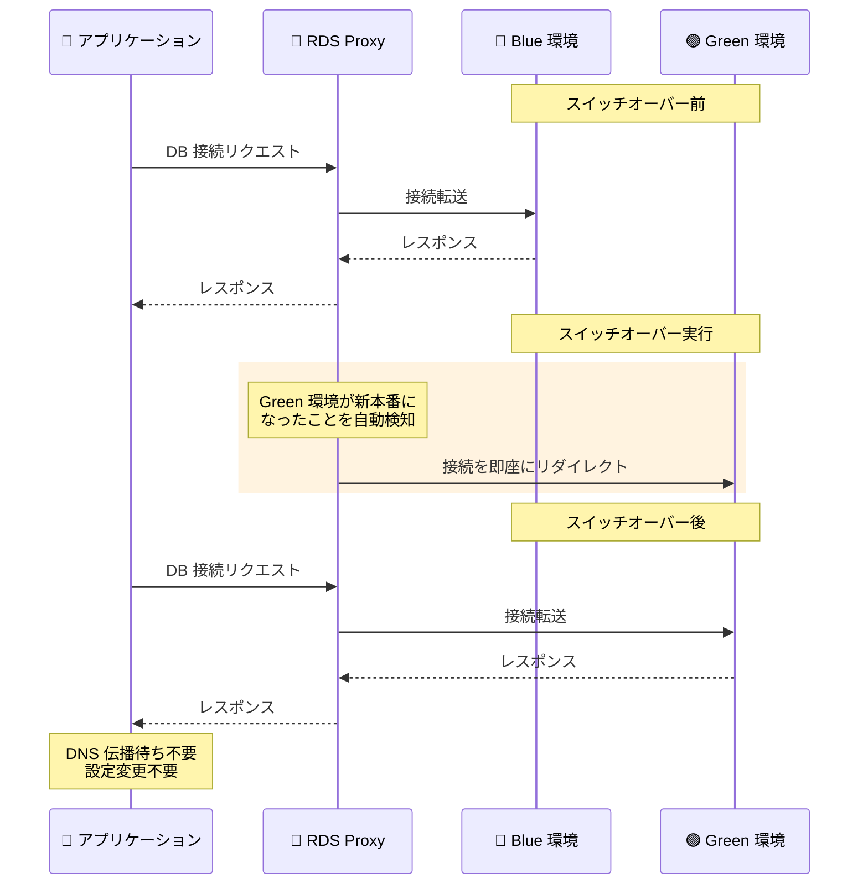

# Amazon RDS - Blue/Green Deployments の Amazon RDS Proxy サポート

**リリース日**: 2026 年 04 月 09 日
**サービス**: Amazon RDS (Relational Database Service)
**機能**: Blue/Green Deployments の Amazon RDS Proxy 統合

:bar_chart: [このアップデートのインフォグラフィックを見る](https://takech9203.github.io/aws-news-summary/20260409-rds-proxy-blue-green.html)

## 概要

Amazon RDS Blue/Green Deployments が Amazon RDS Proxy をサポートしました。これにより、Blue/Green Deployments のスイッチオーバー時に DNS 伝播の遅延を排除し、アプリケーションの復旧時間を大幅に短縮できます。

Blue/Green Deployments は、本番環境 (Blue) を安全に保ちながら、フルマネージドのステージング環境 (Green) を作成してデータベースの変更をテスト・検証できる機能です。今回のアップデートにより、RDS Proxy がスイッチオーバー時に Green 環境が新しい本番環境になったことを自動的に検知し、接続を迅速にリダイレクトします。ドライバーの変更やアプリケーションの設定変更は一切不要です。

**アップデート前の課題**

- Blue/Green Deployments のスイッチオーバー後、DNS 伝播に時間がかかり、アプリケーションが新しい本番環境に接続するまでに遅延が発生していた
- DNS キャッシュの影響で、一部のアプリケーションが古い Blue 環境への接続を維持し続ける可能性があった
- スイッチオーバー時のダウンタイムを最小限に抑えるために、アプリケーション側で DNS TTL の調整や接続リトライロジックの実装が必要だった

**アップデート後の改善**

- RDS Proxy がデータベースインスタンスを能動的に監視し、Green 環境への切り替えを自動検知して接続を即座にリダイレクト
- DNS 伝播の遅延に依存しないため、アプリケーションの復旧時間が大幅に短縮
- ドライバーの変更やアプリケーションの設定変更が不要で、既存の環境にそのまま適用可能

## アーキテクチャ図



この図は、RDS Proxy を使用した Blue/Green Deployments のスイッチオーバーフローを示しています。RDS Proxy が Green 環境への切り替えを自動検知し、アプリケーションからの接続を即座にリダイレクトすることで、DNS 伝播の遅延を排除します。

## サービスアップデートの詳細

### 主要機能

1. **自動接続リダイレクト**
   - RDS Proxy がデータベースインスタンスを能動的に監視
   - Green 環境が新しい本番環境になったことを自動検知
   - アプリケーションの接続を Green 環境に即座にリダイレクト

2. **DNS 伝播遅延の排除**
   - 従来の Blue/Green Deployments では DNS エンドポイントの変更に伴う伝播遅延が発生
   - RDS Proxy 経由の接続では DNS に依存しない接続管理により遅延を排除
   - アプリケーションの復旧時間を大幅に短縮

3. **ゼロ設定変更での導入**
   - 既存のドライバーやアプリケーション設定の変更が不要
   - RDS Proxy エンドポイントに接続しているアプリケーションは自動的に恩恵を受ける
   - 追加のコード変更やデプロイメントが不要

4. **シングルリージョン構成のサポート**
   - シングルリージョン構成の Blue/Green Deployments でスイッチオーバー時の高速リダイレクトを提供
   - RDS Proxy が利用可能な全ての商用 AWS リージョンで利用可能

## 技術仕様

### 対応データベースエンジン

| データベースエンジン | サポート状況 |
|---------------------|-------------|
| Amazon Aurora MySQL 互換 | 対応 |
| Amazon Aurora PostgreSQL 互換 | 対応 |
| Amazon RDS for MySQL | 対応 |
| Amazon RDS for PostgreSQL | 対応 |
| Amazon RDS for MariaDB | 対応 |

### RDS Proxy の主要仕様

| 項目 | 詳細 |
|------|------|
| 接続管理方式 | RDS Proxy による能動的なデータベースインスタンス監視 |
| スイッチオーバー検知 | 自動検知 (手動操作不要) |
| 対応構成 | シングルリージョン構成 |
| アプリケーション変更 | 不要 (ドライバー変更不要) |
| 追加料金 | RDS Proxy の既存料金のみ (本機能の追加料金なし) |

### API 変更履歴

本アップデートに関連する API 変更は、調査時点では AWS API Changes フィードに記録されていませんでした。RDS Proxy が Blue/Green Deployments のスイッチオーバーを自動的に処理するため、新しい API パラメータの追加なしで機能する可能性があります。

### RDS Proxy 設定例

```json
{
  "DBProxyName": "my-rds-proxy",
  "EngineFamily": "MYSQL",
  "Auth": [
    {
      "AuthScheme": "SECRETS",
      "SecretArn": "arn:aws:secretsmanager:us-east-1:123456789012:secret:my-db-secret",
      "IAMAuth": "REQUIRED"
    }
  ],
  "RoleArn": "arn:aws:iam::123456789012:role/rds-proxy-role",
  "VpcSubnetIds": ["subnet-01234567", "subnet-89abcdef"]
}
```

## 設定方法

### 前提条件

1. Amazon RDS または Amazon Aurora のデータベースインスタンスが作成済みであること
2. Amazon RDS Proxy が設定済みで、対象のデータベースインスタンスに関連付けられていること
3. アプリケーションが RDS Proxy エンドポイント経由でデータベースに接続していること

### 手順

#### ステップ 1: RDS Proxy の作成と設定

```bash
# RDS Proxy を作成
aws rds create-db-proxy \
    --db-proxy-name my-rds-proxy \
    --engine-family MYSQL \
    --auth '[{"AuthScheme":"SECRETS","SecretArn":"arn:aws:secretsmanager:us-east-1:123456789012:secret:my-db-secret","IAMAuth":"REQUIRED"}]' \
    --role-arn arn:aws:iam::123456789012:role/rds-proxy-role \
    --vpc-subnet-ids subnet-01234567 subnet-89abcdef \
    --region us-east-1
```

RDS Proxy を作成し、対象のデータベースエンジンファミリー、認証情報、VPC サブネットを設定します。

#### ステップ 2: ターゲットグループの登録

```bash
# RDS Proxy のターゲットグループにデータベースインスタンスを登録
aws rds register-db-proxy-targets \
    --db-proxy-name my-rds-proxy \
    --db-instance-identifiers my-blue-db-instance \
    --region us-east-1
```

RDS Proxy のターゲットグループに Blue 環境のデータベースインスタンスを登録します。

#### ステップ 3: Blue/Green Deployments の作成とスイッチオーバー

```bash
# Blue/Green Deployment を作成
aws rds create-blue-green-deployment \
    --blue-green-deployment-name my-blue-green-deployment \
    --source arn:aws:rds:us-east-1:123456789012:db:my-blue-db-instance \
    --region us-east-1

# Green 環境の準備完了後、スイッチオーバーを実行
aws rds switchover-blue-green-deployment \
    --blue-green-deployment-identifier my-blue-green-deployment \
    --region us-east-1
```

Blue/Green Deployment を作成し、Green 環境での変更テスト後にスイッチオーバーを実行します。RDS Proxy が自動的に接続を Green 環境にリダイレクトします。

## メリット

### ビジネス面

- **ダウンタイムの最小化**: DNS 伝播遅延を排除することで、データベースの切り替えに伴うアプリケーションのダウンタイムを最小限に抑制
- **リスクの低減**: Blue/Green Deployments による安全なテスト環境と RDS Proxy による高速切り替えの組み合わせにより、本番環境への変更リスクを大幅に低減
- **運用コストの削減**: アプリケーション側の設定変更やドライバー更新が不要なため、デプロイメントに関連する運用作業を削減

### 技術面

- **高速な接続リダイレクト**: RDS Proxy の能動的な監視により、DNS 伝播を待たずに接続を即座にリダイレクト
- **コネクションプーリングとの統合**: RDS Proxy のコネクションプーリング機能と Blue/Green Deployments の切り替え機能が統合され、接続管理が最適化
- **透過的な動作**: 既存のアプリケーションコードやドライバー設定を変更せずに、スイッチオーバー時の復旧高速化を実現

## デメリット・制約事項

### 制限事項

- シングルリージョン構成のみサポート (マルチリージョン構成は対象外)
- RDS Proxy の利用に追加料金が発生 (vCPU あたりの時間課金)
- RDS Proxy がサポートするデータベースエンジンに限定 (Aurora MySQL/PostgreSQL、RDS MySQL/PostgreSQL/MariaDB)

### 考慮すべき点

- RDS Proxy を経由しない直接接続のアプリケーションは、従来通り DNS 伝播の遅延が発生するため、全てのアプリケーションを RDS Proxy 経由に移行する必要がある
- RDS Proxy のエンドポイントを使用するようアプリケーションの接続先を事前に変更しておく必要がある
- Blue/Green Deployments のスイッチオーバー中は短時間のダウンタイムが発生する可能性がある (RDS Proxy により最小化されるが完全にゼロではない)

## ユースケース

### ユースケース 1: データベースメジャーバージョンアップグレード

**シナリオ**: 本番環境の MySQL 5.7 から MySQL 8.0 へのメジャーバージョンアップグレードを実施する。アプリケーションのダウンタイムを最小限に抑えつつ、安全にアップグレードを完了したい。

**実装例**:
```bash
# Blue/Green Deployment で MySQL 8.0 の Green 環境を作成
aws rds create-blue-green-deployment \
    --blue-green-deployment-name mysql-upgrade \
    --source arn:aws:rds:us-east-1:123456789012:db:prod-mysql57 \
    --target-engine-version 8.0.35 \
    --region us-east-1

# Green 環境でのテスト完了後にスイッチオーバー
aws rds switchover-blue-green-deployment \
    --blue-green-deployment-identifier mysql-upgrade \
    --region us-east-1
```

**効果**: RDS Proxy が接続を即座にリダイレクトするため、メジャーバージョンアップグレードのスイッチオーバー時のアプリケーション復旧時間を大幅に短縮。DNS 伝播待ちが不要になり、ダウンタイムを数秒レベルに抑制。

### ユースケース 2: パラメータグループの変更適用

**シナリオ**: パフォーマンスチューニングのために、本番データベースのパラメータグループを変更する必要がある。直接変更はリスクが高いため、Blue/Green Deployments でテストしてから適用したい。

**実装例**:
```bash
# 新しいパラメータグループを指定して Green 環境を作成
aws rds create-blue-green-deployment \
    --blue-green-deployment-name param-update \
    --source arn:aws:rds:us-east-1:123456789012:db:prod-db \
    --target-db-parameter-group-name optimized-params \
    --region us-east-1

# パフォーマンステスト後にスイッチオーバー
aws rds switchover-blue-green-deployment \
    --blue-green-deployment-identifier param-update \
    --region us-east-1
```

**効果**: パラメータ変更を安全にテストし、問題がなければ即座にスイッチオーバー。RDS Proxy により接続の中断を最小限に抑え、ユーザーへの影響をほぼゼロに。

### ユースケース 3: スキーマ変更のゼロダウンタイムデプロイ

**シナリオ**: アプリケーションの新機能リリースに伴い、テーブルスキーマの変更が必要。大規模なテーブルに対する ALTER TABLE は長時間のロックが発生するため、Blue/Green Deployments で事前にスキーマ変更を適用した Green 環境を準備する。

**実装例**:
```bash
# Green 環境を作成
aws rds create-blue-green-deployment \
    --blue-green-deployment-name schema-migration \
    --source arn:aws:rds:us-east-1:123456789012:db:prod-db \
    --region us-east-1

# Green 環境でスキーマ変更を実行後、スイッチオーバー
aws rds switchover-blue-green-deployment \
    --blue-green-deployment-identifier schema-migration \
    --region us-east-1
```

**効果**: スキーマ変更が事前に適用された Green 環境へ RDS Proxy 経由で即座に切り替え。アプリケーションは接続先の変更を意識することなく、新しいスキーマを使用するデータベースにシームレスに接続。

## 料金

RDS Proxy と Blue/Green Deployments の統合自体に追加料金はかかりませんが、それぞれのサービス利用に対して料金が発生します。

### 料金例

| 項目 | 月額料金 (概算) |
|------|-----------------|
| RDS Proxy (db.m5.large, 2 vCPU) | 約 $21.60/月 ($0.015/vCPU/時間 x 2 vCPU x 720 時間) |
| Green 環境 (db.m5.large, スイッチオーバーまで) | Blue 環境と同等のインスタンス料金 |
| Blue/Green Deployment 作成 | 追加料金なし (Green 環境のリソース料金のみ) |

- **RDS Proxy**: vCPU あたり $0.015/時間 (リージョンにより異なる)
- **Green 環境**: スイッチオーバーまでの期間、Blue 環境と同等のインスタンスおよびストレージ料金が発生
- **スイッチオーバー後の Blue 環境**: 不要になった場合は削除してコストを削減

詳細な料金情報については、[Amazon RDS Proxy 料金ページ](https://aws.amazon.com/rds/proxy/pricing/)および [Amazon RDS 料金ページ](https://aws.amazon.com/rds/pricing/)を参照してください。

## 利用可能リージョン

Amazon RDS Blue/Green Deployments と Amazon RDS Proxy の統合は、RDS Proxy が利用可能な全ての商用 AWS リージョンで提供されています。主なリージョンは以下の通りです。

| リージョン | 名称 |
|-----------|------|
| us-east-1 | 米国東部 (バージニア北部) |
| us-east-2 | 米国東部 (オハイオ) |
| us-west-1 | 米国西部 (北カリフォルニア) |
| us-west-2 | 米国西部 (オレゴン) |
| ap-northeast-1 | アジアパシフィック (東京) |
| ap-northeast-2 | アジアパシフィック (ソウル) |
| ap-northeast-3 | アジアパシフィック (大阪) |
| ap-southeast-1 | アジアパシフィック (シンガポール) |
| ap-southeast-2 | アジアパシフィック (シドニー) |
| ap-south-1 | アジアパシフィック (ムンバイ) |
| eu-west-1 | 欧州 (アイルランド) |
| eu-west-2 | 欧州 (ロンドン) |
| eu-west-3 | 欧州 (パリ) |
| eu-central-1 | 欧州 (フランクフルト) |
| eu-north-1 | 欧州 (ストックホルム) |
| ca-central-1 | カナダ (中部) |
| sa-east-1 | 南米 (サンパウロ) |

最新のリージョン対応状況は [AWS リージョン表](https://aws.amazon.com/about-aws/global-infrastructure/regional-product-services/)を参照してください。

## 関連サービス・機能

- **Amazon RDS Blue/Green Deployments**: 本番環境に影響を与えずにデータベース変更をテスト・検証するためのフルマネージドなステージング環境機能
- **Amazon RDS Proxy**: データベース接続のプーリングと管理を行うフルマネージドプロキシ。接続の効率化、フェイルオーバー時間の短縮に貢献
- **Amazon Aurora**: MySQL および PostgreSQL 互換のクラウドネイティブリレーショナルデータベース。Blue/Green Deployments と RDS Proxy の両方をサポート
- **AWS Secrets Manager**: RDS Proxy の認証情報管理に使用。データベースのクレデンシャルを安全に保存・ローテーション

## 参考リンク

- :bar_chart: [インフォグラフィック](https://takech9203.github.io/aws-news-summary/20260409-rds-proxy-blue-green.html)
- [公式発表 (What's New)](https://aws.amazon.com/about-aws/whats-new/2026/04/rds-proxy-blue-green/)
- [Amazon RDS Blue/Green Deployments ドキュメント](https://docs.aws.amazon.com/AmazonRDS/latest/UserGuide/blue-green-deployments.html)
- [Amazon RDS Proxy ドキュメント](https://docs.aws.amazon.com/AmazonRDS/latest/UserGuide/rds-proxy.html)
- [Amazon RDS Proxy 料金ページ](https://aws.amazon.com/rds/proxy/pricing/)
- [Amazon RDS 料金ページ](https://aws.amazon.com/rds/pricing/)

## まとめ

Amazon RDS Blue/Green Deployments の Amazon RDS Proxy サポートにより、スイッチオーバー時の DNS 伝播遅延が排除され、アプリケーションの復旧時間が大幅に短縮されました。ドライバーの変更やアプリケーション設定の変更は不要で、RDS Proxy エンドポイントを使用している既存環境にそのまま適用できます。データベースのメジャーバージョンアップグレード、パラメータ変更、スキーマ変更など、本番データベースへの変更を安全かつ迅速に実施したい場合は、RDS Proxy と Blue/Green Deployments の組み合わせを検討してください。
