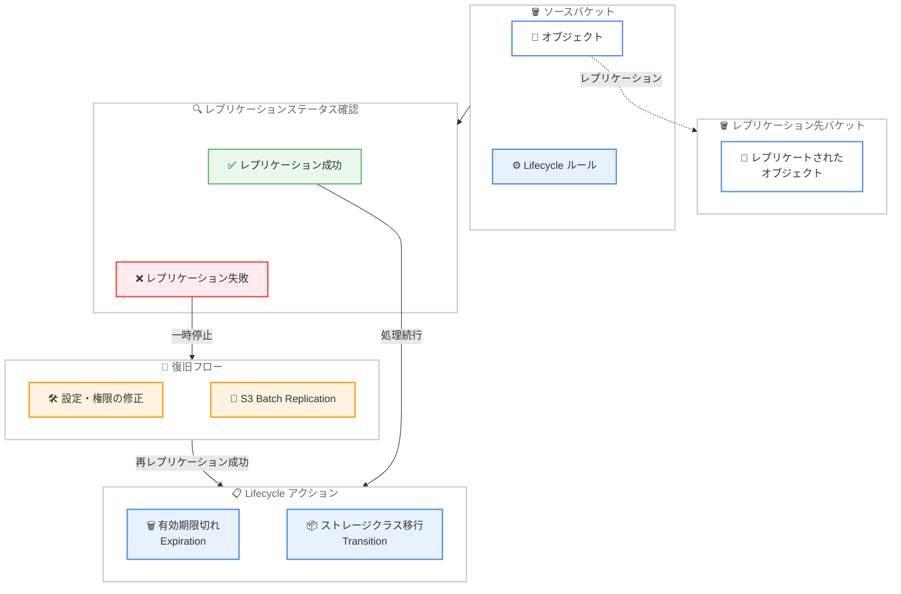

# Amazon S3 Lifecycle - レプリケーション失敗オブジェクトに対するアクションの一時停止

**リリース日**: 2026 年 4 月 9 日
**サービス**: Amazon S3
**機能**: S3 Lifecycle Pauses Actions on Objects Unable to Replicate

📊 [このアップデートのインフォグラフィックを見る](https://takech9203.github.io/aws-news-summary/20260409-s3-lifecycle-pauses-actions-on-objects.html)

## 概要

Amazon S3 Lifecycle に、レプリケーションに失敗したオブジェクトに対する有効期限 (Expiration) およびストレージクラス移行 (Transition) アクションを自動的に一時停止する機能が追加されました。これにより、レプリケーション設定やアクセス権限の変更とライフサイクルルールの整合性を確保しやすくなります。

従来、レプリケーション設定やアクセス権限に問題があった場合、ソースバケットのオブジェクトがレプリケーション先にコピーされる前にライフサイクルルールによって削除または移行されてしまうリスクがありました。今回の変更により、レプリケーションに失敗したオブジェクトはライフサイクルルールに一致していても、有効期限切れや移行の対象から除外されます。ユーザーがレプリケーション設定や権限を修正し、S3 Batch Replication で失敗したオブジェクトを再レプリケーションすると、S3 Lifecycle が自動的にルールに基づいた処理を再開します。

この変更は全 37 の AWS リージョン (AWS China および AWS GovCloud (US) リージョンを含む) で自動的に適用され、既存および新規のすべての S3 Lifecycle 設定に適用されます。

**アップデート前の課題**

- レプリケーションに失敗したオブジェクトがライフサイクルルールによって削除され、レプリケーション先にデータが存在しない状態が発生する可能性があった
- 権限やレプリケーション設定の一時的な問題により、意図しないデータ損失が起こりうるリスクがあった
- ライフサイクルルールとレプリケーション設定の間で手動による整合性管理が必要だった

**アップデート後の改善**

- レプリケーションに失敗したオブジェクトは自動的にライフサイクルの有効期限切れ・移行アクションから除外されるようになった
- レプリケーション設定の修正後、S3 Batch Replication で再レプリケーションすれば、ライフサイクルが自動的に処理を再開する
- 既存・新規のすべての S3 Lifecycle 設定に自動適用されるため、ユーザー側の追加設定が不要になった

## アーキテクチャ図



S3 Lifecycle がオブジェクトのレプリケーションステータスを確認し、レプリケーション失敗時にはアクションを一時停止する動作フローを示しています。設定修正後に S3 Batch Replication で再レプリケーションが完了すると、ライフサイクルアクションが自動的に再開されます。

## サービスアップデートの詳細

### 主要機能

1. **レプリケーション失敗オブジェクトの自動保護**
   - レプリケーションに失敗したオブジェクトに対して、Expiration および Transition アクションを自動的に一時停止
   - ライフサイクルルールに一致していても、レプリケーション未完了のオブジェクトは削除・移行されない
   - レプリケーションステータスに基づく自動判定のため、ユーザーの手動介入は不要

2. **S3 Batch Replication との連携**
   - レプリケーション設定や権限を修正した後、S3 Batch Replication を使用して失敗したオブジェクトを再レプリケーション可能
   - 再レプリケーション成功後、S3 Lifecycle が自動的にルールに基づいた処理を再開
   - 大量のオブジェクトの一括再レプリケーションに対応

3. **全リージョン自動適用**
   - 37 の AWS リージョンで自動的にデプロイ
   - AWS China および AWS GovCloud (US) リージョンを含む
   - 既存および新規のすべての S3 Lifecycle 設定に自動適用

## 技術仕様

### レプリケーションステータスとライフサイクル動作

| レプリケーションステータス | Expiration アクション | Transition アクション |
|------|------|------|
| COMPLETED | 通常通り実行 | 通常通り実行 |
| FAILED | 一時停止 | 一時停止 |
| PENDING | 通常通り実行 | 通常通り実行 |
| REPLICA | 通常通り実行 | 通常通り実行 |

### API 変更履歴

今回のアップデートに直接関連する API 変更はありません。これは S3 Lifecycle の内部動作の変更であり、新しい API やパラメータの追加は伴いません。

なお、関連する最近の S3 サービスの API 変更として以下があります。

| 日付 | サービス | 変更内容 |
|------|----------|----------|
| 2026/04/07 | [Amazon S3 Files](https://awsapichanges.com/archive/changes/0db175-s3files.html) | 21 new api methods - S3 Files の新規 API 追加 |

### レプリケーション失敗の主な原因

| 原因 | 説明 |
|------|------|
| IAM 権限の不足 | レプリケーションロールにレプリケーション先バケットへの書き込み権限がない |
| バケットポリシーの設定ミス | レプリケーション先バケットのポリシーがソースからのアクセスを許可していない |
| KMS キーの権限不足 | 暗号化されたオブジェクトのレプリケーションに必要な KMS キーへのアクセスがない |
| レプリケーションルールの設定ミス | フィルタ条件やレプリケーション先バケットの指定に誤りがある |

## 設定方法

### 前提条件

1. S3 クロスリージョンレプリケーション (CRR) または同一リージョンレプリケーション (SRR) が設定済みであること
2. レプリケーション設定に関連する IAM ロールとポリシーが作成済みであること
3. AWS CLI v2 がインストールされていること

### 手順

#### ステップ 1: レプリケーションステータスの確認

```bash
# レプリケーション失敗オブジェクトの確認
aws s3api head-object \
  --bucket my-source-bucket \
  --key my-object-key \
  --query 'ReplicationStatus'
```

特定のオブジェクトのレプリケーションステータスを確認します。`FAILED` と表示された場合、そのオブジェクトに対するライフサイクルアクションは一時停止されています。

#### ステップ 2: レプリケーション設定の修正

```bash
# 現在のレプリケーション設定を確認
aws s3api get-bucket-replication \
  --bucket my-source-bucket

# IAM ロールのポリシーを確認
aws iam get-role-policy \
  --role-name S3ReplicationRole \
  --policy-name S3ReplicationPolicy
```

レプリケーション設定と IAM ポリシーを確認し、レプリケーション先バケットへの適切な権限が設定されていることを検証します。

#### ステップ 3: S3 Batch Replication による再レプリケーション

```bash
# S3 Batch Replication ジョブの作成
aws s3control create-job \
  --account-id 123456789012 \
  --operation '{"S3ReplicateObject":{}}' \
  --manifest-generator '{
    "S3JobManifestGenerator": {
      "SourceS3BucketArn": "arn:aws:s3:::my-source-bucket",
      "EnableManifestOutput": true,
      "ManifestOutputLocation": {
        "Bucket": "arn:aws:s3:::my-manifest-bucket",
        "ManifestPrefix": "batch-replication"
      },
      "Filter": {
        "ReplicationStatusFilter": {
          "IncludeReplicationStatuses": ["FAILED"]
        }
      }
    }
  }' \
  --report '{
    "Bucket": "arn:aws:s3:::my-report-bucket",
    "Prefix": "batch-replication-report",
    "Format": "Report_CSV_20180820",
    "Enabled": true,
    "ReportScope": "AllTasks"
  }' \
  --role-arn arn:aws:iam::123456789012:role/S3BatchReplicationRole \
  --priority 1 \
  --confirmation-required
```

レプリケーション失敗ステータスのオブジェクトをフィルタして、S3 Batch Replication ジョブを作成します。再レプリケーションが成功すると、S3 Lifecycle が自動的にルールに基づいた処理を再開します。

## メリット

### ビジネス面

- **データ損失リスクの低減**: レプリケーション失敗時にオブジェクトが意図せず削除されるリスクを排除し、データの整合性を確保できる
- **コンプライアンス対応の強化**: 規制要件でデータのレプリケーションが必須な環境において、レプリケーション完了前のデータ削除を防止できる
- **運用負荷の削減**: 手動でのライフサイクルルールとレプリケーション設定の整合性管理が不要になり、運用コストが低減する

### 技術面

- **自動的なセーフガード**: レプリケーションステータスに基づく自動判定により、人的ミスによるデータ損失を防止できる
- **追加設定不要**: 既存・新規のすべての S3 Lifecycle 設定に自動適用されるため、設定変更の手間がかからない
- **S3 Batch Replication との統合**: 失敗したオブジェクトの一括再レプリケーションと、その後のライフサイクル処理の自動再開がシームレスに連携する

## デメリット・制約事項

### 制限事項

- レプリケーション失敗が長期間放置されると、本来ライフサイクルで削除・移行されるはずのオブジェクトがソースバケットに残り続け、ストレージコストが増加する可能性がある
- この変更は自動適用であり、従来の動作 (レプリケーション失敗オブジェクトもライフサイクル処理の対象とする) に戻すオプションは提供されていない
- デプロイは段階的に進行中であり、すべてのリージョンへの完全なデプロイ完了までに数日かかる場合がある

### 考慮すべき点

- レプリケーション失敗の根本原因を早期に特定・修正するためのモニタリング体制の構築が重要になる
- S3 レプリケーションメトリクスと CloudWatch アラームを活用して、レプリケーション失敗を迅速に検知する運用設計を推奨
- 大量のオブジェクトがレプリケーション失敗状態にある場合、S3 Batch Replication のジョブ実行コストを事前に見積もる必要がある

## ユースケース

### ユースケース 1: ディザスタリカバリ環境でのデータ保護

**シナリオ**: マルチリージョンのディザスタリカバリ構成で、IAM ポリシーの変更によりレプリケーションが一時的に失敗した場合でも、ソースバケットのオブジェクトがライフサイクルルールで削除されるのを防止する。

**実装例**:
```json
{
    "Rules": [
        {
            "ID": "ExpireOldLogs",
            "Filter": {
                "Prefix": "logs/"
            },
            "Status": "Enabled",
            "Expiration": {
                "Days": 90
            }
        }
    ]
}
```

**効果**: 上記ライフサイクルルールが設定されていても、レプリケーション失敗中のオブジェクトは 90 日経過後も自動削除されず、DR 先へのレプリケーション完了まで保持される。

### ユースケース 2: コンプライアンス要件のあるデータ管理

**シナリオ**: 金融機関や医療機関など、規制要件でデータの地理的冗長性が必須な環境において、レプリケーション先へのコピー完了を保証しつつ、ストレージクラスの移行を管理する。

**実装例**:
```json
{
    "Rules": [
        {
            "ID": "TransitionToGlacier",
            "Filter": {
                "Prefix": "compliance-data/"
            },
            "Status": "Enabled",
            "Transitions": [
                {
                    "Days": 365,
                    "StorageClass": "GLACIER"
                }
            ]
        }
    ]
}
```

**効果**: レプリケーション失敗中のオブジェクトは Glacier への移行が一時停止されるため、レプリケーション先でも Standard ストレージクラスのオブジェクトとして確実にコピーされた後に移行が実行される。

### ユースケース 3: KMS 暗号化環境でのレプリケーション復旧

**シナリオ**: KMS キーポリシーの変更により暗号化されたオブジェクトのレプリケーションが失敗した場合、キーポリシーの修正と S3 Batch Replication による一括復旧を行う。

**実装例**:
```bash
# KMS キーポリシーの修正後、失敗オブジェクトを確認
aws s3api list-objects-v2 \
  --bucket my-source-bucket \
  --prefix encrypted-data/ \
  --query "Contents[?contains(Key, 'encrypted-data/')].[Key]" \
  --output text | while read key; do
    status=$(aws s3api head-object \
      --bucket my-source-bucket \
      --key "$key" \
      --query 'ReplicationStatus' \
      --output text)
    if [ "$status" = "FAILED" ]; then
      echo "FAILED: $key"
    fi
done

# S3 Batch Replication で一括再レプリケーション
aws s3control create-job \
  --account-id 123456789012 \
  --operation '{"S3ReplicateObject":{}}' \
  --manifest-generator '{
    "S3JobManifestGenerator": {
      "SourceS3BucketArn": "arn:aws:s3:::my-source-bucket",
      "EnableManifestOutput": true,
      "ManifestOutputLocation": {
        "Bucket": "arn:aws:s3:::my-manifest-bucket",
        "ManifestPrefix": "kms-recovery"
      },
      "Filter": {
        "KeyNameConstraint": {
          "MatchAnyPrefix": ["encrypted-data/"]
        },
        "ReplicationStatusFilter": {
          "IncludeReplicationStatuses": ["FAILED"]
        }
      }
    }
  }' \
  --report '{
    "Bucket": "arn:aws:s3:::my-report-bucket",
    "Prefix": "kms-recovery-report",
    "Format": "Report_CSV_20180820",
    "Enabled": true,
    "ReportScope": "AllTasks"
  }' \
  --role-arn arn:aws:iam::123456789012:role/S3BatchReplicationRole \
  --priority 1 \
  --confirmation-required
```

**効果**: KMS キーポリシーの修正後、レプリケーション失敗オブジェクトを S3 Batch Replication で一括復旧できる。復旧完了後、ライフサイクルルールが自動的に適用される。

## 料金

今回のアップデートに伴う追加料金はありません。S3 Lifecycle の動作変更は既存の料金体系の中で自動的に適用されます。

ただし、レプリケーション失敗オブジェクトがソースバケットに残り続けることで、通常よりストレージコストが増加する可能性があります。また、S3 Batch Replication を使用した再レプリケーションには、S3 バッチオペレーションおよびデータ転送の料金が適用されます。

### 料金例

| 項目 | 料金 (概算) |
|--------|------------------|
| S3 Standard ストレージ (レプリケーション失敗で保持されるオブジェクト) | $0.023/GB/月 (us-east-1) |
| S3 Batch Operations ジョブ | $0.25/ジョブ + $1.00/100 万オブジェクト |
| クロスリージョンデータ転送 (再レプリケーション時) | $0.02/GB (リージョンにより異なる) |

## 利用可能リージョン

全 37 の AWS リージョンで利用可能です。AWS China および AWS GovCloud (US) リージョンを含む、すべての AWS リージョンに自動適用されます。デプロイは段階的に進行中で、数日以内に全リージョンへの展開が完了する予定です。

## 関連サービス・機能

- **Amazon S3 Replication**: クロスリージョンレプリケーション (CRR) および同一リージョンレプリケーション (SRR) でオブジェクトを自動コピーする機能。今回のアップデートでライフサイクルとの連携が強化された
- **S3 Batch Replication**: レプリケーション失敗オブジェクトを一括で再レプリケーションする機能。ライフサイクル一時停止からの復旧に使用
- **S3 Batch Operations**: 大量の S3 オブジェクトに対するバッチ処理を実行するサービス。S3 Batch Replication の基盤となる機能
- **Amazon CloudWatch**: S3 レプリケーションメトリクスを監視し、レプリケーション失敗を検知するためのモニタリングサービス

## 参考リンク

- 📊 [インフォグラフィック](https://takech9203.github.io/aws-news-summary/20260409-s3-lifecycle-pauses-actions-on-objects.html)
- [公式発表 (What's New)](https://aws.amazon.com/about-aws/whats-new/2026/03/s3-lifecycle-pauses-actions-on-objects/)
- [S3 Lifecycle ドキュメント](https://docs.aws.amazon.com/AmazonS3/latest/userguide/object-lifecycle-mgmt.html)
- [S3 Replication ドキュメント](https://docs.aws.amazon.com/AmazonS3/latest/userguide/replication.html)
- [S3 Batch Replication ドキュメント](https://docs.aws.amazon.com/AmazonS3/latest/userguide/s3-batch-replication-batch.html)
- [Amazon S3 料金ページ](https://aws.amazon.com/s3/pricing/)

## まとめ

Amazon S3 Lifecycle がレプリケーション失敗オブジェクトに対するアクションを自動的に一時停止する機能は、データの整合性と耐久性を確保するための重要なセーフガードです。ユーザー側の追加設定は不要で、全 37 リージョンに自動適用されるため、既存のレプリケーション環境を持つすべてのユーザーに即座にメリットがあります。レプリケーション失敗を迅速に検知するための CloudWatch モニタリングの設定と、S3 Batch Replication を活用した復旧手順の確立を推奨します。
