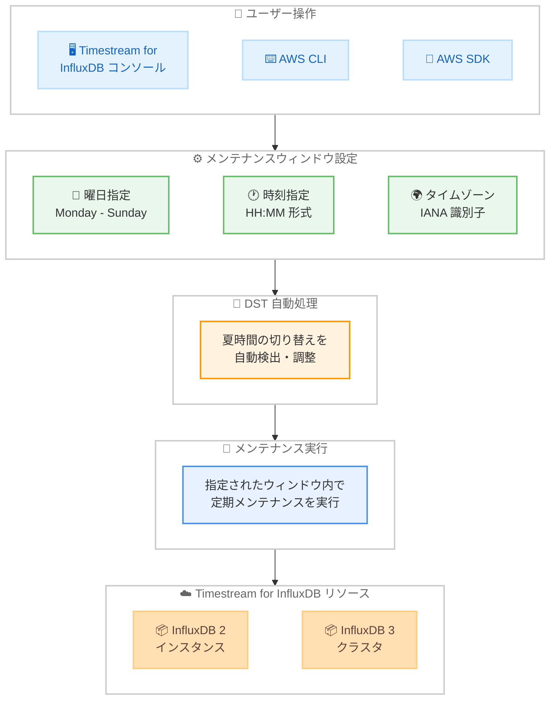

# Amazon Timestream for InfluxDB - カスタマー定義メンテナンスウィンドウのサポート

**リリース日**: 2026 年 4 月 9 日
**サービス**: Amazon Timestream for InfluxDB
**機能**: カスタマー定義メンテナンスウィンドウ

📊 [このアップデートのインフォグラフィックを見る](https://takech9203.github.io/aws-news-summary/20260409-timestream-influxdb-maintenance-windows.html)

## 概要

Amazon Timestream for InfluxDB がカスタマー定義メンテナンスウィンドウをサポートし、InfluxDB データベースに対する定期メンテナンスの実行タイミングを自分で制御できるようになりました。この機能は InfluxDB 2 インスタンスおよび InfluxDB 3 クラスタの両方で、すべてのサポート対象エディションにわたって利用可能です。

今回のアップデートでは、曜日と時刻の形式で週次メンテナンスウィンドウを指定でき、IANA タイムゾーン識別子 (America/New_York、Europe/London、Asia/Tokyo など) を使用して希望のタイムゾーンで設定できます。さらに、夏時間 (DST) の切り替えも自動的に処理されるため、手動でのスケジュール調整は不要です。

**アップデート前の課題**

- メンテナンスの実行タイミングをユーザーが制御できず、サービス側が自動的に決定していた
- ビジネスのピーク時間帯にメンテナンスが実行される可能性があり、ワークロードへの影響を予測できなかった
- タイムゾーンの指定ができず、グローバルに展開するチームにとってメンテナンス時間の管理が困難だった
- 夏時間の切り替わりに伴うメンテナンス時間のずれを手動で考慮する必要があった

**アップデート後の改善**

- 曜日と時刻を指定して週次メンテナンスウィンドウをカスタム定義できるようになった
- IANA タイムゾーン識別子による希望タイムゾーンでの指定が可能になった
- 夏時間 (DST) の切り替えが自動処理され、手動調整が不要になった
- コンソール、AWS CLI、AWS SDK のいずれからでもメンテナンスウィンドウの設定・更新が可能になった

## アーキテクチャ図



ユーザーがコンソール、CLI、SDK からメンテナンスウィンドウの曜日・時刻・タイムゾーンを設定し、DST の自動処理を経て InfluxDB 2 インスタンスおよび InfluxDB 3 クラスタに対して定期メンテナンスが実行される流れを示しています。

## サービスアップデートの詳細

### 主要機能

1. **週次メンテナンスウィンドウの指定**
   - 曜日と時刻の組み合わせで週次のメンテナンスウィンドウを定義可能
   - リソースの作成時または変更時に設定・更新が可能
   - メンテナンスウィンドウを指定しない場合は、従来どおりサービスが自動的にタイミングを管理

2. **IANA タイムゾーン識別子のサポート**
   - America/New_York、Europe/London、Asia/Tokyo などの IANA タイムゾーン識別子を使用可能
   - UTC オフセットではなく、地域ベースのタイムゾーン名で直感的に指定
   - グローバルに分散したチームでも、各拠点のローカルタイムゾーンで設定可能

3. **夏時間 (DST) の自動処理**
   - 夏時間の切り替わりを自動的に検出し、メンテナンスウィンドウを調整
   - 手動でのスケジュール変更が不要
   - 年 2 回の DST 切り替え時にもメンテナンスが意図したローカル時間に実行される

4. **InfluxDB 2 および InfluxDB 3 の両方に対応**
   - InfluxDB 2 インスタンスで利用可能
   - InfluxDB 3 クラスタで利用可能
   - すべてのサポート対象エディションに対応

## 技術仕様

### メンテナンスウィンドウの設定項目

| 項目 | 詳細 |
|------|------|
| 形式 | 曜日 + 時刻 (day-and-time format) |
| 頻度 | 週次 |
| タイムゾーン | IANA タイムゾーン識別子 |
| DST 処理 | 自動 |
| デフォルト動作 | サービスによる自動管理 |

### サポート対象タイムゾーンの例

| IANA 識別子 | 地域 | UTC オフセット |
|-------------|------|---------------|
| America/New_York | 米国東部 | UTC-5 / UTC-4 (DST) |
| Europe/London | 英国 | UTC+0 / UTC+1 (DST) |
| Asia/Tokyo | 日本 | UTC+9 (DST なし) |

### サポート対象リソース

| リソースタイプ | エディション |
|---------------|-------------|
| InfluxDB 2 インスタンス | すべてのサポート対象エディション |
| InfluxDB 3 クラスタ | すべてのサポート対象エディション |

### API 変更履歴

本アップデートに直接関連する Timestream for InfluxDB の API 変更は、調査時点では awsapichanges.com に記録されていません。今後、CreateDbInstance や UpdateDbInstance などの API にメンテナンスウィンドウ関連のパラメータが追加される可能性があります。

### 設定インターフェース

| インターフェース | サポート |
|-----------------|---------|
| Amazon Timestream for InfluxDB コンソール | 対応 |
| AWS CLI | 対応 |
| AWS SDK | 対応 |

## 設定方法

### 前提条件

1. AWS アカウントへのアクセス権限
2. Amazon Timestream for InfluxDB へのアクセス権限
3. 既存の InfluxDB 2 インスタンスまたは InfluxDB 3 クラスタ (既存リソースに設定する場合)

### 手順

#### ステップ 1: コンソールからメンテナンスウィンドウを設定

AWS マネジメントコンソールから Amazon Timestream for InfluxDB にアクセスし、リソースの作成時または変更時にメンテナンスウィンドウを設定します。

```
Amazon Timestream > InfluxDB > インスタンス/クラスタ > メンテナンスウィンドウ設定
```

リソースの詳細設定でメンテナンスウィンドウのセクションを展開し、希望する曜日、時刻、タイムゾーンを指定します。

#### ステップ 2: AWS CLI でメンテナンスウィンドウを設定

AWS CLI を使用して、InfluxDB インスタンスの作成時にメンテナンスウィンドウを指定します。

```bash
aws timestream-influxdb create-db-instance \
  --db-instance-identifier my-influxdb \
  --db-instance-type db.influx.medium \
  --allocated-storage 100 \
  --preferred-maintenance-window "Sun:03:00" \
  --maintenance-window-timezone "Asia/Tokyo"
```

このコマンドは、毎週日曜日の日本時間 3:00 にメンテナンスウィンドウを設定した InfluxDB インスタンスを作成します。

#### ステップ 3: 既存リソースのメンテナンスウィンドウを更新

既存のリソースに対してメンテナンスウィンドウを追加または変更します。

```bash
aws timestream-influxdb update-db-instance \
  --db-instance-identifier my-influxdb \
  --preferred-maintenance-window "Sat:02:00" \
  --maintenance-window-timezone "Asia/Tokyo"
```

このコマンドは、既存の InfluxDB インスタンスのメンテナンスウィンドウを毎週土曜日の日本時間 2:00 に変更します。

## メリット

### ビジネス面

- **ビジネスへの影響最小化**: メンテナンスをトラフィックの少ない時間帯に設定することで、エンドユーザーへの影響を最小限に抑制
- **運用の予測可能性向上**: メンテナンスの実行タイミングが事前に把握できるため、運用チームの計画が立てやすくなる
- **グローバルチームの利便性**: IANA タイムゾーン識別子により、各拠点のローカル時間で直感的にメンテナンス時間を把握可能

### 技術面

- **DST 自動処理**: 夏時間の切り替わりを自動的に処理するため、年 2 回のスケジュール調整作業が不要
- **柔軟な設定方法**: コンソール、CLI、SDK の 3 つのインターフェースから設定可能で、Infrastructure as Code にも対応
- **InfluxDB 2/3 両対応**: バージョンに関係なく統一的にメンテナンスウィンドウを管理可能

## デメリット・制約事項

### 制限事項

- メンテナンスウィンドウは週次単位での指定のみで、日次やカスタム頻度の設定はできない
- メンテナンスウィンドウ内での正確な開始時刻はサービス側で決定されるため、ウィンドウ開始時刻と実際のメンテナンス開始時刻にずれが生じる可能性がある
- メンテナンスウィンドウを設定しても、緊急のセキュリティパッチなどは指定ウィンドウ外で適用される場合がある

### 考慮すべき点

- メンテナンスウィンドウ中はデータベースのパフォーマンスに一時的な影響が生じる可能性がある
- 複数のリソースを運用している場合、メンテナンスウィンドウが重複しないよう計画的に設定する必要がある
- DST が適用されないタイムゾーン (Asia/Tokyo など) では、DST 自動処理の恩恵はないが、設定上の影響もない

## ユースケース

### ユースケース 1: IoT データ収集基盤のメンテナンス最適化

**シナリオ**: 工場の IoT センサーから Timestream for InfluxDB にデータを収集しており、製造ラインの稼働時間外にメンテナンスを実施したい

**実装例**:
```bash
# 日曜日の深夜 2:00 (JST) にメンテナンスウィンドウを設定
aws timestream-influxdb update-db-instance \
  --db-instance-identifier factory-iot-influxdb \
  --preferred-maintenance-window "Sun:02:00" \
  --maintenance-window-timezone "Asia/Tokyo"
```

**効果**: 工場の非稼働時間帯にメンテナンスを集中させることで、製造データの収集に影響を与えずに定期メンテナンスを実施可能

### ユースケース 2: グローバル分散システムのメンテナンス調整

**シナリオ**: 米国、欧州、アジアの各リージョンで InfluxDB クラスタを運用しており、各拠点のトラフィックが少ない時間帯にメンテナンスを実施したい

**実装例**:
```bash
# 米国東部: 日曜日の深夜 3:00 (EST/EDT)
aws timestream-influxdb update-db-instance \
  --db-instance-identifier us-east-influxdb \
  --preferred-maintenance-window "Sun:03:00" \
  --maintenance-window-timezone "America/New_York"

# 欧州: 日曜日の深夜 3:00 (GMT/BST)
aws timestream-influxdb update-db-instance \
  --db-instance-identifier eu-west-influxdb \
  --preferred-maintenance-window "Sun:03:00" \
  --maintenance-window-timezone "Europe/London"

# 日本: 日曜日の深夜 3:00 (JST)
aws timestream-influxdb update-db-instance \
  --db-instance-identifier ap-northeast-influxdb \
  --preferred-maintenance-window "Sun:03:00" \
  --maintenance-window-timezone "Asia/Tokyo"
```

**効果**: IANA タイムゾーン識別子と DST 自動処理により、各拠点のローカル時間でメンテナンスウィンドウを統一的に管理可能。夏時間の切り替わり時にも手動調整が不要

### ユースケース 3: SLA 対応のメンテナンス管理

**シナリオ**: 監視システムの時系列データベースとして InfluxDB を使用しており、SLA で定められたメンテナンスウィンドウ内でのみ定期メンテナンスを許可したい

**実装例**:
```bash
# SLA で承認された土曜日の早朝 4:00 (JST) にメンテナンスを設定
aws timestream-influxdb update-db-instance \
  --db-instance-identifier monitoring-influxdb \
  --preferred-maintenance-window "Sat:04:00" \
  --maintenance-window-timezone "Asia/Tokyo"
```

**効果**: SLA の要件に準拠したメンテナンススケジュールを明示的に設定でき、コンプライアンス要件への対応が容易になる

## 料金

カスタマー定義メンテナンスウィンドウの機能自体に追加料金は発生しません。Amazon Timestream for InfluxDB の通常の利用料金 (インスタンス/クラスタの実行時間、ストレージ、データ転送など) が引き続き適用されます。

## 利用可能リージョン

Amazon Timestream for InfluxDB が提供されているすべての AWS リージョンで利用できます。

## 関連サービス・機能

- **Amazon Timestream for InfluxDB**: 時系列データベースサービス。InfluxDB 2 インスタンスと InfluxDB 3 クラスタをマネージドサービスとして提供
- **Amazon RDS メンテナンスウィンドウ**: Amazon RDS でも同様のカスタマー定義メンテナンスウィンドウ機能を提供しており、同じ設計思想でデータベースのメンテナンスを管理
- **AWS Systems Manager メンテナンスウィンドウ**: EC2 インスタンスなどのインフラストラクチャリソースに対するメンテナンスウィンドウ機能。データベース以外のリソースのメンテナンス管理に活用

## 参考リンク

- 📊 [インフォグラフィック](https://takech9203.github.io/aws-news-summary/20260409-timestream-influxdb-maintenance-windows.html)
- [公式発表 (What's New)](https://aws.amazon.com/about-aws/whats-new/2026/04/timestream-influxdb-maintenance-windows/)
- [Amazon Timestream for InfluxDB ドキュメント](https://docs.aws.amazon.com/timestream/latest/developerguide/influxdb.html)
- [Amazon Timestream for InfluxDB 料金](https://aws.amazon.com/timestream/influxdb/pricing/)

## まとめ

Amazon Timestream for InfluxDB のカスタマー定義メンテナンスウィンドウにより、InfluxDB データベースの定期メンテナンスをビジネスニーズに合わせた最適なタイミングで実行できるようになりました。特に IANA タイムゾーン識別子のサポートと夏時間の自動処理は、グローバルに展開する組織にとって運用負荷の大幅な軽減につながります。既存の InfluxDB 2 インスタンスや InfluxDB 3 クラスタに対しても、コンソール、CLI、SDK からすぐにメンテナンスウィンドウを設定できるため、早期の導入を推奨します。
