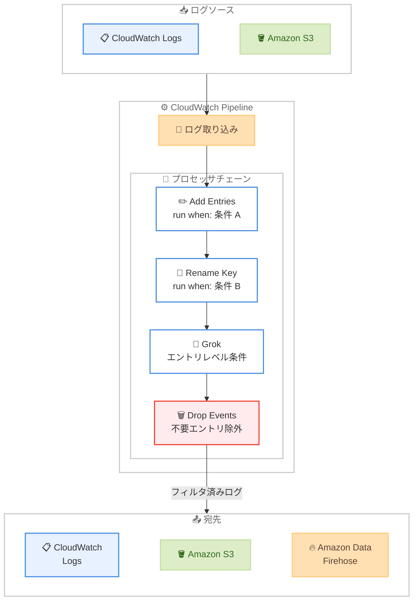

# Amazon CloudWatch Pipelines - 条件付き処理と Drop Events プロセッサのサポート

**リリース日**: 2026 年 4 月 10 日
**サービス**: Amazon CloudWatch
**機能**: CloudWatch Pipelines の条件付き処理および Drop Events プロセッサ

📊 [このアップデートのインフォグラフィックを見る](https://takech9203.github.io/aws-news-summary/20260410-amazon-cloudwatch-pipelines-conditional.html)

## 概要

Amazon CloudWatch Pipelines に条件付き処理 (conditional processing) と新しい Drop Events プロセッサが追加されました。これにより、パイプライン内のログデータ変換処理をより柔軟に制御できるようになり、特定の条件に基づいてプロセッサの実行をスキップしたり、不要なログエントリをフィルタリングして除外したりすることが可能になります。

条件付き処理は 21 種類のプロセッサ (Add Entries、Delete Entries、Copy Values、Grok、Rename Key など) で利用でき、プロセッサレベルの "run when" 条件とエントリレベルの条件の 2 つの粒度で制御が可能です。Drop Events プロセッサは不要なログエントリをパイプラインから除外する専用のプロセッサとして機能します。

これらの機能は CloudWatch Pipelines が一般提供 (GA) されているすべてのリージョンで追加コストなしで利用可能です。

**アップデート前の課題**

- パイプライン内のすべてのプロセッサがすべてのログエントリに対して一律に実行され、特定の条件でプロセッサの実行を制御できなかった
- 不要なログエントリをパイプライン内でフィルタリングする手段がなく、すべてのログが宛先に送信されていた
- ログの種類やフィールドの値に基づいて異なる変換処理を適用するには、複数のパイプラインを作成する必要があった

**アップデート後の改善**

- 21 種類のプロセッサに条件付き処理を設定でき、プロセッサレベルまたはエントリレベルで実行条件を制御できるようになった
- Drop Events プロセッサにより、不要なログエントリをパイプライン内で除外できるようになった
- 単一のパイプラインで条件に基づいた柔軟なログ変換が可能になり、パイプライン管理が簡素化された

## アーキテクチャ図



CloudWatch Pipelines の条件付き処理フローを示しています。ログソースから取り込まれたデータが各プロセッサの条件に基づいて選択的に処理され、Drop Events プロセッサで不要なエントリが除外された後、宛先に配信されます。

## サービスアップデートの詳細

### 主要機能

1. **条件付き処理 - プロセッサレベル "run when" 条件**
   - プロセッサ全体の実行をスキップするかどうかを条件で制御できる
   - 21 種類のプロセッサで利用可能
   - 条件が満たされない場合、プロセッサの処理全体がスキップされ、ログエントリはそのまま次のプロセッサに渡される

2. **条件付き処理 - エントリレベル条件**
   - 個々のログエントリに対してアクションを適用するかどうかを制御できる
   - 同一プロセッサ内でエントリごとに異なる処理を適用可能
   - 特定のフィールド値やパターンに基づいた精密なフィルタリングが可能

3. **Drop Events プロセッサ**
   - 不要なログエントリをパイプラインから完全に除外する新しいプロセッサ
   - 条件に一致するログエントリを宛先に送信せずにドロップ
   - ログボリュームの削減と下流の処理コスト最適化に有効

### 対応プロセッサ一覧

条件付き処理は以下の 21 種類のプロセッサで利用可能です。

| プロセッサ | 機能概要 |
|------|------|
| Add Entries | ログエントリにフィールドを追加 |
| Delete Entries | ログエントリからフィールドを削除 |
| Copy Values | フィールド値を別のフィールドにコピー |
| Grok | Grok パターンでログをパース |
| Rename Key | フィールド名を変更 |
| その他 16 種類 | 各種変換・加工プロセッサ |

## 技術仕様

### 条件付き処理の仕組み

| 条件タイプ | 適用レベル | 動作 |
|------|------|------|
| run when | プロセッサレベル | 条件を満たさない場合、プロセッサ全体をスキップ |
| エントリレベル条件 | 個別エントリ | 条件を満たすエントリのみにアクションを適用 |

### API 変更履歴

今回のアップデートに直接対応する CloudWatch Pipelines の API 変更は確認されていません。

なお、関連する最近の CloudWatch サービスの API 変更として以下があります。

| 日付 | サービス | 変更内容 |
|------|----------|----------|
| 2026/04/10 | [CloudWatch Observability Admin Service](https://awsapichanges.com/archive/changes/974e23-observabilityadmin.html) | 8 updated api methods - マルチリージョンテレメトリ評価とテレメトリ有効化ルールのサポート追加 |

### 条件付き処理の設定例

```json
{
  "PipelineName": "my-log-pipeline",
  "Processors": [
    {
      "Type": "AddEntries",
      "RunWhen": {
        "MatchField": "source",
        "Equals": "application"
      },
      "Configuration": {
        "Entries": [
          {
            "Key": "environment",
            "Value": "production"
          }
        ]
      }
    },
    {
      "Type": "DropEvents",
      "Configuration": {
        "Condition": {
          "MatchField": "level",
          "Equals": "DEBUG"
        }
      }
    }
  ]
}
```

## 設定方法

### 前提条件

1. AWS アカウントで CloudWatch Pipelines が利用可能なリージョンであること
2. CloudWatch Pipelines のパイプラインが作成済み、または新規作成予定であること
3. パイプラインの設定に必要な IAM 権限が付与されていること

### 手順

#### ステップ 1: 条件付きプロセッサを含むパイプラインの作成

```bash
# 条件付き処理を含むパイプラインを作成
aws logs create-pipeline \
  --pipeline-name "conditional-processing-pipeline" \
  --log-group-name "/aws/application/my-app" \
  --processors '[
    {
      "type": "AddEntries",
      "runWhen": {
        "matchField": "source",
        "equals": "web-server"
      },
      "configuration": {
        "entries": [
          {"key": "tier", "value": "frontend"}
        ]
      }
    }
  ]'
```

ソースフィールドが "web-server" の場合にのみ、ログエントリに "tier" フィールドを追加するプロセッサを設定します。

#### ステップ 2: Drop Events プロセッサの追加

```bash
# Drop Events プロセッサで不要なログを除外
aws logs update-pipeline \
  --pipeline-name "conditional-processing-pipeline" \
  --processors '[
    {
      "type": "AddEntries",
      "runWhen": {
        "matchField": "source",
        "equals": "web-server"
      },
      "configuration": {
        "entries": [
          {"key": "tier", "value": "frontend"}
        ]
      }
    },
    {
      "type": "DropEvents",
      "configuration": {
        "condition": {
          "matchField": "level",
          "equals": "DEBUG"
        }
      }
    }
  ]'
```

DEBUG レベルのログエントリをパイプラインから除外する Drop Events プロセッサを追加します。

#### ステップ 3: CloudWatch コンソールでの設定確認

CloudWatch コンソールの Pipelines セクションからも条件付き処理の設定が可能です。各プロセッサの設定画面で "Run when" 条件を追加し、エントリレベルの条件を個別のアクションに対して設定できます。

## メリット

### ビジネス面

- **コスト最適化**: Drop Events プロセッサにより不要なログを除外することで、ログストレージと下流の分析コストを削減できる
- **運用効率の向上**: 単一のパイプラインで条件に基づいた柔軟な処理が可能になり、複数のパイプラインを管理する必要がなくなる
- **追加コストなし**: 条件付き処理と Drop Events プロセッサは CloudWatch Pipelines が GA のすべてのリージョンで追加料金なしで利用可能

### 技術面

- **精密なログ制御**: プロセッサレベルとエントリレベルの 2 つの粒度で条件を設定でき、きめ細かなログ変換制御が可能
- **パイプラインの簡素化**: 条件分岐を単一パイプライン内で処理できるため、アーキテクチャがシンプルになる
- **21 プロセッサ対応**: Add Entries、Delete Entries、Copy Values、Grok、Rename Key など主要な 21 種類のプロセッサで条件付き処理が利用可能

## デメリット・制約事項

### 制限事項

- 条件付き処理で利用できる条件式の種類や複雑さには制限がある可能性がある (公式ドキュメントでの確認を推奨)
- Drop Events プロセッサでドロップされたログは復元できないため、条件の設定には注意が必要
- CloudWatch Pipelines が GA されていないリージョンでは本機能を利用できない

### 考慮すべき点

- 条件の設定ミスにより意図しないログが除外される可能性があるため、本番環境への適用前にテスト環境での十分な検証が推奨される
- 複雑な条件を多数設定した場合のパイプラインのパフォーマンスへの影響を事前に評価する必要がある
- 既存のパイプラインに条件付き処理を追加する際は、現在の処理フローへの影響を確認する必要がある

## ユースケース

### ユースケース 1: 本番環境のデバッグログ除外

**シナリオ**: アプリケーションが大量の DEBUG レベルログを出力しており、本番環境ではこれらのログが不要であるため、ログストレージコストが増大している。

**実装例**:
```json
{
  "Processors": [
    {
      "Type": "DropEvents",
      "Configuration": {
        "Condition": {
          "MatchField": "level",
          "Equals": "DEBUG"
        }
      }
    }
  ]
}
```

**効果**: DEBUG レベルのログがパイプラインで除外され、ログストレージコストの大幅な削減が期待できる。

### ユースケース 2: マルチテナント環境での条件付きログ加工

**シナリオ**: SaaS アプリケーションで、テナントごとに異なるログ加工ルールを適用したい。特定のテナントのログにのみ追加フィールドを付与し、別のテナントのログにはフィールド名の変更を適用する。

**実装例**:
```json
{
  "Processors": [
    {
      "Type": "AddEntries",
      "RunWhen": {
        "MatchField": "tenant_id",
        "Equals": "tenant-A"
      },
      "Configuration": {
        "Entries": [
          {"Key": "compliance_level", "Value": "high"}
        ]
      }
    },
    {
      "Type": "RenameKey",
      "RunWhen": {
        "MatchField": "tenant_id",
        "Equals": "tenant-B"
      },
      "Configuration": {
        "OldKey": "user_email",
        "NewKey": "contact"
      }
    }
  ]
}
```

**効果**: 単一のパイプラインでテナントごとの要件に対応でき、パイプラインの管理が大幅に簡素化される。

### ユースケース 3: セキュリティログの選択的処理

**シナリオ**: セキュリティ関連のログのみに Grok パターンを適用して構造化し、それ以外のログはそのまま通過させたい。また、ヘルスチェックのログは不要なので除外したい。

**実装例**:
```json
{
  "Processors": [
    {
      "Type": "Grok",
      "RunWhen": {
        "MatchField": "log_type",
        "Equals": "security"
      },
      "Configuration": {
        "Match": "%{TIMESTAMP_ISO8601:timestamp} %{WORD:action} %{IP:source_ip} %{GREEDYDATA:message}"
      }
    },
    {
      "Type": "DropEvents",
      "Configuration": {
        "Condition": {
          "MatchField": "request_path",
          "Equals": "/health"
        }
      }
    }
  ]
}
```

**効果**: セキュリティログのみが構造化されて分析しやすくなり、ヘルスチェックログの除外によりノイズが削減される。

## 料金

条件付き処理と Drop Events プロセッサは、CloudWatch Pipelines の既存料金に含まれており、追加コストは発生しません。CloudWatch Pipelines の料金は取り込みデータ量に基づきます。

### 料金例

| 項目 | 月額料金 (概算) |
|--------|------------------|
| CloudWatch Pipelines データ取り込み | リージョンおよび使用量に基づく従量課金 |
| 条件付き処理 | 追加料金なし |
| Drop Events プロセッサ | 追加料金なし |

最新の料金情報は [Amazon CloudWatch 料金ページ](https://aws.amazon.com/cloudwatch/pricing/) を確認してください。

## 利用可能リージョン

CloudWatch Pipelines が一般提供 (GA) されているすべてのリージョンで利用可能です。具体的なリージョンの一覧については [CloudWatch Pipelines のドキュメント](https://docs.aws.amazon.com/AmazonCloudWatch/latest/logs/CloudWatch-Logs-Transformation.html) を参照してください。

## 関連サービス・機能

- **Amazon CloudWatch Logs**: CloudWatch Pipelines のソースおよび宛先として利用されるログ管理サービス。パイプラインはロググループに対して設定される
- **Amazon CloudWatch Pipelines**: ログデータの変換・加工・ルーティングを行うサービス。今回のアップデートで条件付き処理が追加された
- **Amazon Data Firehose**: CloudWatch Pipelines の宛先の 1 つとして利用可能なストリーミング配信サービス。条件付き処理でフィルタリングされたログを Firehose 経由で外部システムに配信できる
- **Amazon S3**: CloudWatch Pipelines の宛先の 1 つとして利用可能なオブジェクトストレージ。Drop Events で不要ログを除外することで S3 へのストレージコストを削減できる

## 参考リンク

- 📊 [インフォグラフィック](https://takech9203.github.io/aws-news-summary/20260410-amazon-cloudwatch-pipelines-conditional.html)
- [公式発表 (What's New)](https://aws.amazon.com/about-aws/whats-new/2026/04/amazon-cloudwatch-pipelines-conditional/)
- [CloudWatch Pipelines ドキュメント](https://docs.aws.amazon.com/AmazonCloudWatch/latest/logs/CloudWatch-Logs-Transformation.html)
- [Amazon CloudWatch 料金ページ](https://aws.amazon.com/cloudwatch/pricing/)

## まとめ

Amazon CloudWatch Pipelines に条件付き処理と Drop Events プロセッサが追加されたことにより、ログパイプラインの柔軟性と効率性が大幅に向上しました。21 種類のプロセッサで利用可能な条件付き処理により、単一のパイプラインで複雑なログ変換ロジックを実現でき、Drop Events プロセッサにより不要なログの除外によるコスト最適化が可能になります。CloudWatch Pipelines を利用しているユーザーは、既存パイプラインに条件付き処理を追加して運用効率の改善とコスト削減を検討することを推奨します。
