# Amazon EC2 - X8i インスタンスのヨーロッパ (パリ) リージョン提供開始

**リリース日**: 2026 年 4 月 10 日
**サービス**: Amazon EC2
**機能**: X8i インスタンスのヨーロッパ (パリ) リージョン提供開始

📊 [このアップデートのインフォグラフィックを見る](https://takech9203.github.io/aws-news-summary/20260410-amazon-ec2-x8i-instances-CDG-region.html)

## 概要

Amazon EC2 X8i インスタンスがヨーロッパ (パリ) リージョンで利用可能になりました。X8i インスタンスは、AWS 独自のカスタム Intel Xeon 6 プロセッサを搭載した次世代メモリ最適化インスタンスであり、クラウド上の同等 Intel プロセッサの中で最高のパフォーマンスと最速のメモリ帯域幅を提供します。SAP 認定を取得しており、SAP HANA、大規模データベース、データ分析、EDA (電子設計自動化) などのメモリ集約型ワークロードに最適です。

前世代の X2i インスタンスと比較して、最大 43% の高パフォーマンス、1.5 倍のメモリ容量 (最大 6TB)、3.3 倍のメモリ帯域幅を実現します。さらに、SAPS パフォーマンスが最大 50% 向上、PostgreSQL パフォーマンスが最大 47% 高速化、Memcached パフォーマンスが 88% 高速化、AI 推論パフォーマンスが 46% 高速化されています。

今回のパリリージョン追加により、X8i インスタンスは合計 6 リージョンで利用可能となり、ヨーロッパの顧客は 3 つのリージョン (フランクフルト、ストックホルム、パリ) から選択できるようになりました。

**アップデート前の課題**

- ヨーロッパ (パリ) リージョンでは X8i インスタンスが利用できず、次世代メモリ最適化インスタンスを使用するにはフランクフルトまたはストックホルムリージョンを選択する必要があった
- フランスのデータレジデンシー要件を持つ顧客は、X8i インスタンスの高パフォーマンスを享受できなかった
- ヨーロッパ西部のユーザーにとって、フランクフルトやストックホルムへのレイテンシーが課題となる場合があった

**アップデート後の改善**

- ヨーロッパ (パリ) リージョンで X8i インスタンスが利用可能になり、フランス国内でのデータレジデンシー要件に対応しながら次世代メモリ最適化インスタンスを使用できるようになった
- ヨーロッパの顧客は 3 つのリージョン (フランクフルト、ストックホルム、パリ) から X8i インスタンスを選択でき、ワークロードの配置に柔軟性が増した
- フランスおよびヨーロッパ西部のユーザーに対するレイテンシーが改善された

## アーキテクチャ図

```mermaid
flowchart TD
    subgraph X8i["⚙️ Amazon EC2 X8i インスタンス"]
        direction LR
        CPU["🔧 カスタム Intel<br/>Xeon 6 プロセッサ"]
        MEM["💾 メモリ<br/>最大 6TB"]
        PERF["📈 パフォーマンス<br/>X2i 比 43% 向上"]
        CPU ~~~ MEM ~~~ PERF
    end

    subgraph Workloads["🏢 対象ワークロード"]
        direction LR
        SAP["📊 SAP HANA"]
        DB["🗄️ 大規模<br/>データベース"]
        Analytics["📉 データ分析"]
        EDA["🔬 EDA"]
        SAP ~~~ DB ~~~ Analytics ~~~ EDA
    end

    subgraph USRegions["🇺🇸 米国リージョン"]
        direction LR
        Virginia["us-east-1<br/>バージニア北部"]
        Ohio["us-east-2<br/>オハイオ"]
        Oregon["us-west-2<br/>オレゴン"]
        Virginia ~~~ Ohio ~~~ Oregon
    end

    subgraph EURegions["🇪🇺 ヨーロッパリージョン"]
        direction LR
        Frankfurt["eu-central-1<br/>フランクフルト"]
        Stockholm["eu-north-1<br/>ストックホルム"]
        Paris["eu-west-3<br/>パリ 🆕"]
        Frankfurt ~~~ Stockholm ~~~ Paris
    end

    X8i --> Workloads
    X8i --> USRegions
    X8i --> EURegions

    classDef cloud fill:none,stroke:#CCCCCC,stroke-width:2px,color:#666666
    classDef compute fill:#FFE0B2,stroke:#FFCC80,stroke-width:2px,color:#5D4037
    classDef storage fill:#DCEDC8,stroke:#C5E1A5,stroke-width:2px,color:#33691E
    classDef process fill:#FFFFFF,stroke:#4A90E2,stroke-width:2px,color:#333333
    classDef internal fill:#E8F1FF,stroke:#4A90E2,stroke-width:2px,color:#333333
    classDef input fill:#E9F7EC,stroke:#66BB6A,stroke-width:2px,color:#333333
    classDef decision fill:#F3E5F5,stroke:#7B61FF,stroke-width:2px,color:#333333

    class X8i,Workloads,USRegions,EURegions cloud
    class CPU,MEM,PERF compute
    class SAP,DB,Analytics,EDA input
    class Virginia,Ohio,Oregon internal
    class Frankfurt,Stockholm process
    class Paris decision
```



X8i インスタンスのアーキテクチャと利用可能リージョンを示しています。今回新たに追加されたパリリージョンにより、ヨーロッパでの選択肢が 3 リージョンに拡大しました。

## サービスアップデートの詳細

### 主要機能

1. **次世代メモリ最適化インスタンス**
   - AWS 独自のカスタム Intel Xeon 6 プロセッサを搭載 (AWS でのみ利用可能)
   - クラウド上の同等 Intel プロセッサの中で最高のパフォーマンスと最速のメモリ帯域幅を実現
   - SAP 認定取得済みで、エンタープライズワークロードに対応

2. **前世代からの大幅なパフォーマンス向上**
   - X2i 比で最大 43% の総合パフォーマンス向上
   - 1.5 倍のメモリ容量 (最大 6TB)
   - 3.3 倍のメモリ帯域幅向上
   - ワークロード別: SAPS 最大 50% 向上、PostgreSQL 最大 47% 高速化、Memcached 88% 高速化、AI 推論 46% 高速化

3. **豊富なインスタンスサイズ**
   - 14 種類のサイズを提供 (large から 96xlarge まで)
   - 2 つのベアメタルオプションを含む
   - ワークロードの規模に応じた柔軟なサイズ選択が可能

## 技術仕様

### X8i インスタンスの性能比較 (X2i 比)

| 項目 | X8i の改善 |
|------|------|
| 総合パフォーマンス | 最大 43% 向上 |
| メモリ容量 | 1.5 倍 (最大 6TB) |
| メモリ帯域幅 | 3.3 倍 |
| SAPS パフォーマンス | 最大 50% 向上 |
| PostgreSQL パフォーマンス | 最大 47% 高速化 |
| Memcached パフォーマンス | 88% 高速化 |
| AI 推論パフォーマンス | 46% 高速化 |

### インスタンスサイズ一覧

| サイズ範囲 | 詳細 |
|------|------|
| 最小サイズ | x8i.large |
| 最大サイズ | x8i.96xlarge |
| ベアメタル | 2 オプション |
| 合計サイズ数 | 14 種類 |

### API 変更履歴

今回のアップデートはリージョン拡張であり、新しい API やパラメータの追加は伴いません。X8i インスタンスの起動には既存の EC2 RunInstances API を使用します。

直近 7 日間の EC2 コアサービスに関連する API 変更はありませんでした。

### 購入オプション

```json
{
    "InstanceType": "x8i.xlarge",
    "Placement": {
        "AvailabilityZone": "eu-west-3a"
    },
    "PurchaseOptions": [
        "On-Demand",
        "Savings Plans",
        "Spot Instances"
    ]
}
```

## 設定方法

### 前提条件

1. AWS アカウントが有効化されていること
2. ヨーロッパ (パリ) リージョン (eu-west-3) へのアクセスが可能であること
3. AWS CLI v2 がインストールおよび設定されていること
4. 適切な IAM 権限 (ec2:RunInstances など) が付与されていること

### 手順

#### ステップ 1: リージョンとインスタンスタイプの確認

```bash
# パリリージョンで X8i インスタンスの利用可能状況を確認
aws ec2 describe-instance-type-offerings \
  --location-type availability-zone \
  --filters "Name=instance-type,Values=x8i.*" \
  --region eu-west-3 \
  --query "InstanceTypeOfferings[].{Type:InstanceType,Zone:Location}" \
  --output table
```

パリリージョンで利用可能な X8i インスタンスサイズとアベイラビリティゾーンを一覧表示します。

#### ステップ 2: X8i インスタンスの起動

```bash
# X8i インスタンスをパリリージョンで起動
aws ec2 run-instances \
  --instance-type x8i.xlarge \
  --image-id ami-xxxxxxxxxxxxxxxxx \
  --key-name my-key-pair \
  --security-group-ids sg-xxxxxxxxxxxxxxxxx \
  --subnet-id subnet-xxxxxxxxxxxxxxxxx \
  --region eu-west-3 \
  --tag-specifications 'ResourceType=instance,Tags=[{Key=Name,Value=x8i-paris-instance}]'
```

パリリージョンで X8i インスタンスを起動します。AMI ID はリージョン固有のため、パリリージョンで利用可能な AMI を指定してください。

#### ステップ 3: Savings Plans の確認

```bash
# 利用可能な Savings Plans を確認
aws savingsplans describe-savings-plans-offering-rates \
  --filters '[{"type":"instanceFamily","values":["x8i"]},{"type":"region","values":["eu-west-3"]}]' \
  --products EC2 \
  --service-codes AmazonEC2
```

X8i インスタンスファミリー向けの Savings Plans 割引率を確認します。長期利用を予定している場合は Savings Plans の購入を検討してください。

## メリット

### ビジネス面

- **フランスのデータレジデンシー対応**: フランス国内にデータを保持する必要がある規制要件に対応しながら、最新のメモリ最適化インスタンスの高パフォーマンスを活用できる
- **ヨーロッパでの SAP ワークロードの選択肢拡大**: SAP 認定の X8i インスタンスがパリリージョンで利用可能になり、ヨーロッパの SAP 顧客にとってリージョン選択の柔軟性が向上した
- **レイテンシーの最適化**: フランスおよびヨーロッパ西部の顧客は、地理的に近いパリリージョンを利用することでエンドユーザーへのレイテンシーを削減できる

### 技術面

- **大幅なパフォーマンス向上**: X2i からの移行により、同等コストで最大 43% のパフォーマンス向上と 1.5 倍のメモリ容量を実現できる
- **柔軟なサイズ選択**: 14 種類のインスタンスサイズとベアメタルオプションにより、ワークロードの規模に応じた最適なリソース配分が可能
- **マルチリージョン構成の強化**: ヨーロッパ 3 リージョンでの提供により、高可用性構成やディザスタリカバリ構成を構築しやすくなった

## デメリット・制約事項

### 制限事項

- X8i インスタンスは現時点で 6 リージョンのみで利用可能であり、アジアパシフィックやその他のリージョンではまだ提供されていない
- ベアメタルインスタンスは特定のユースケースに限定されるため、すべてのワークロードに適しているわけではない
- X2i からの移行にあたり、オペレーティングシステムやアプリケーションの互換性確認が必要

### 考慮すべき点

- 大規模メモリインスタンスは起動時間が通常のインスタンスより長くなる場合がある
- X8i インスタンスの料金は X2i と異なるため、移行前にコスト分析を実施することを推奨
- Savings Plans や Reserved Instances の既存の契約がある場合、X8i への適用可否を確認する必要がある

## ユースケース

### ユースケース 1: フランス国内での SAP HANA ワークロード

**シナリオ**: フランスに拠点を置く企業が、データレジデンシー要件に準拠しながら SAP HANA を高パフォーマンスで運用する必要がある。

**実装例**:
```bash
# SAP HANA 向け X8i 大規模インスタンスの起動
aws ec2 run-instances \
  --instance-type x8i.24xlarge \
  --image-id ami-xxxxxxxxxxxxxxxxx \
  --region eu-west-3 \
  --placement '{"AvailabilityZone":"eu-west-3a"}' \
  --block-device-mappings '[{
    "DeviceName": "/dev/sda1",
    "Ebs": {
      "VolumeSize": 500,
      "VolumeType": "gp3",
      "Iops": 16000,
      "Throughput": 1000
    }
  }]' \
  --tag-specifications 'ResourceType=instance,Tags=[{Key=Name,Value=sap-hana-production},{Key=Application,Value=SAP-HANA}]'
```

**効果**: フランス国内のデータレジデンシー要件を満たしながら、X2i 比で最大 50% 高い SAPS パフォーマンスにより SAP HANA のレスポンスタイムが大幅に改善される。

### ユースケース 2: ヨーロッパのマルチリージョンデータベース構成

**シナリオ**: ヨーロッパの顧客向けに高可用性が求められる大規模データベースを、複数のヨーロッパリージョンに分散して運用する。

**実装例**:
```bash
# フランクフルトのプライマリインスタンス
aws ec2 run-instances \
  --instance-type x8i.16xlarge \
  --region eu-central-1 \
  --tag-specifications 'ResourceType=instance,Tags=[{Key=Role,Value=primary-db}]'

# パリのスタンバイインスタンス
aws ec2 run-instances \
  --instance-type x8i.16xlarge \
  --region eu-west-3 \
  --tag-specifications 'ResourceType=instance,Tags=[{Key=Role,Value=standby-db}]'
```

**効果**: フランクフルトとパリの 2 リージョンで X8i インスタンスを使用した高可用性データベース構成を構築でき、リージョン障害時のフェイルオーバーが可能になる。PostgreSQL の場合は X2i 比で最大 47% の高速化が期待できる。

### ユースケース 3: インメモリデータ分析

**シナリオ**: 大量のデータセットをメモリ上に展開してリアルタイム分析を行うデータ分析基盤を、パリリージョンで構築する。

**実装例**:
```bash
# データ分析向けの大容量メモリインスタンスの起動
aws ec2 run-instances \
  --instance-type x8i.48xlarge \
  --region eu-west-3 \
  --tag-specifications 'ResourceType=instance,Tags=[{Key=Name,Value=analytics-node},{Key=Workload,Value=in-memory-analytics}]'
```

**効果**: 最大 6TB のメモリ容量を活用して大規模なデータセットをインメモリで処理でき、3.3 倍のメモリ帯域幅向上により Memcached で 88% の高速化が期待できる。フランスのデータを国外に転送することなく分析が可能。

## 料金

X8i インスタンスは On-Demand、Savings Plans、Spot Instances の 3 つの購入オプションで利用可能です。料金はインスタンスサイズとリージョンによって異なります。

### 料金例

| 購入オプション | 説明 |
|--------|------------------|
| On-Demand | 長期契約なしの従量課金。短期利用やテストに適している |
| Savings Plans | 1 年または 3 年の使用量コミットメントにより最大 72% の割引 |
| Spot Instances | 未使用キャパシティを最大 90% 割引で利用。中断耐性のあるワークロード向け |

最新の料金情報は [Amazon EC2 料金ページ](https://aws.amazon.com/ec2/pricing/) を確認してください。

## 利用可能リージョン

X8i インスタンスは以下の 6 つの AWS リージョンで利用可能です。

| リージョン名 | リージョンコード |
|------|------|
| 米国東部 (バージニア北部) | us-east-1 |
| 米国東部 (オハイオ) | us-east-2 |
| 米国西部 (オレゴン) | us-west-2 |
| ヨーロッパ (フランクフルト) | eu-central-1 |
| ヨーロッパ (ストックホルム) | eu-north-1 |
| ヨーロッパ (パリ) 🆕 | eu-west-3 |

## 関連サービス・機能

- **Amazon EC2 X2i インスタンス**: X8i の前世代にあたるメモリ最適化インスタンス。X8i への移行により大幅なパフォーマンス向上が期待できる
- **AWS Savings Plans**: X8i インスタンスの長期利用に対する割引を提供。Compute Savings Plans は X2i から X8i への移行時にも自動的に適用される
- **Amazon EBS**: X8i インスタンスと組み合わせるブロックストレージサービス。高い帯域幅を活用してデータベースワークロードのパフォーマンスを最大化できる
- **SAP on AWS**: SAP 認定インスタンスとして、SAP HANA やその他の SAP ワークロードの実行をサポートする AWS のプログラム
- **AWS Nitro System**: X8i インスタンスの基盤となるハードウェアおよびソフトウェアプラットフォーム。セキュリティとパフォーマンスを向上させる

## 参考リンク

- 📊 [インフォグラフィック](https://takech9203.github.io/aws-news-summary/20260410-amazon-ec2-x8i-instances-CDG-region.html)
- [公式発表 (What's New)](https://aws.amazon.com/about-aws/whats-new/2026/04/amazon-ec2-x8i-instances-CDG-region/)
- [Amazon EC2 X8i インスタンスページ](https://aws.amazon.com/ec2/instance-types/x8i/)
- [Amazon EC2 料金ページ](https://aws.amazon.com/ec2/pricing/)
- [SAP on AWS ドキュメント](https://aws.amazon.com/sap/)

## まとめ

Amazon EC2 X8i インスタンスがヨーロッパ (パリ) リージョンで利用可能になったことにより、フランスのデータレジデンシー要件を持つ顧客やヨーロッパ西部のユーザーが、次世代メモリ最適化インスタンスの高パフォーマンスを活用できるようになりました。X2i 比で最大 43% のパフォーマンス向上と 1.5 倍のメモリ容量を提供する X8i は、SAP HANA、大規模データベース、データ分析などのメモリ集約型ワークロードに最適です。既存の X2i ユーザーはパフォーマンス改善とコスト効率の観点から X8i への移行を検討することを推奨します。
