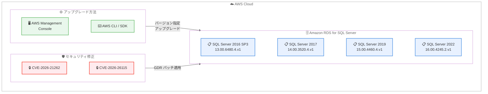

# Amazon RDS for SQL Server - 最新 CU および GDR セキュリティアップデート

**リリース日**: 2026 年 4 月 10 日
**サービス**: Amazon RDS for SQL Server
**機能**: 累積更新プログラム (CU) と一般配布リリース (GDR) セキュリティアップデート

📊 [このアップデートのインフォグラフィックを見る](https://takech9203.github.io/aws-news-summary/20260410-amazon-rds-supports-latest-cu-gdr-updates-microsoft-sq-server.html)

## 概要

Amazon RDS for SQL Server が、Microsoft SQL Server の最新の累積更新プログラム (CU) および一般配布リリース (GDR) のサポートを開始しました。今回のリリースでは、SQL Server 2016、2017、2019、2022 の 4 バージョンに対するアップデートが提供されています。特に重要な点として、GDR アップデートにはセキュリティ脆弱性 CVE-2026-21262 および CVE-2026-26115 に対処する修正が含まれており、早急なパッチ適用が推奨されます。

このアップデートは、すべての Amazon RDS for SQL Server が利用可能な AWS リージョンおよび AWS GovCloud (US) リージョンで提供されています。AWS は、Amazon RDS Management Console、AWS SDK、または CLI を使用して、データベースインスタンスをアップグレードし、これらのアップデートを適用することを強く推奨しています。

**アップデート前の課題**

- セキュリティ脆弱性 CVE-2026-21262 および CVE-2026-26115 が存在し、SQL Server インスタンスが攻撃にさらされるリスクがあった
- 最新の累積更新プログラムが適用されておらず、バグ修正やパフォーマンス改善を利用できなかった
- セキュリティコンプライアンス要件を満たすために、手動でのパッチ適用状況の追跡が必要だった

**アップデート後の改善**

- CVE-2026-21262 および CVE-2026-26115 のセキュリティ脆弱性が修正され、SQL Server インスタンスのセキュリティが向上
- 最新の CU により、バグ修正、パフォーマンス改善、機能強化を利用可能
- AWS Management Console、SDK、CLI から簡単にアップグレードでき、運用負荷を削減

## アーキテクチャ図



AWS Management Console または AWS CLI/SDK を使用して、4 バージョンの SQL Server に対して CU および GDR アップデートを適用するフローを示しています。GDR アップデートにより 2 件の CVE 脆弱性が修正されます。

## サービスアップデートの詳細

### 主要機能

1. **セキュリティ脆弱性 CVE-2026-21262 および CVE-2026-26115 の修正**
   - GDR アップデートにより 2 件のセキュリティ脆弱性に対処
   - SQL Server 2016 SP3、2017、2019 の GDR アップデートに含まれる
   - Microsoft のセキュリティ勧告に基づいた緊急パッチ

2. **SQL Server 2022 CU24 のサポート**
   - KB5080999 (ビルド番号 16.00.4245.2.v1) を RDS for SQL Server で利用可能
   - バグ修正、パフォーマンス改善、機能強化を含む最新の累積更新プログラム
   - Microsoft が推奨する最新の安定バージョン

3. **4 バージョンの SQL Server に対する包括的なアップデート**
   - SQL Server 2016 SP3+GDR、2017 CU31+GDR、2019 CU32+GDR、2022 CU24
   - 各バージョンに対してセキュリティ修正とバグ修正を提供
   - レガシーバージョンを含む幅広いサポート

4. **簡単なアップグレードプロセス**
   - AWS Management Console から数クリックでアップグレード可能
   - AWS CLI/SDK を使用した自動化されたアップグレードをサポート
   - メンテナンスウィンドウ中の自動アップグレード設定にも対応

## 技術仕様

### サポートされる SQL Server バージョン

| SQL Server バージョン | CU/GDR | KB 番号 | RDS バージョン |
|----------------------|--------|---------|---------------|
| SQL Server 2016 SP3 | SP3+GDR | KB5077474 | 13.00.6480.4.v1 |
| SQL Server 2017 | CU31+GDR | KB5077471 | 14.00.3520.4.v1 |
| SQL Server 2019 | CU32+GDR | KB5077469 | 15.00.4460.4.v1 |
| SQL Server 2022 | CU24 | KB5080999 | 16.00.4245.2.v1 |

### セキュリティ脆弱性の詳細

| CVE ID | 影響を受けるバージョン | 対策 |
|--------|----------------------|------|
| CVE-2026-21262 | SQL Server 2016 SP3、2017、2019 | GDR アップデートを適用 |
| CVE-2026-26115 | SQL Server 2016 SP3、2017、2019 | GDR アップデートを適用 |

これらの CVE は Microsoft SQL Server に影響するセキュリティ脆弱性であり、GDR アップデートの適用により修正されます。セキュリティリスクを軽減するため、対象のインスタンスには早急なパッチ適用が推奨されます。

### アップグレード方法

```bash
# AWS CLI を使用した RDS インスタンスのアップグレード (SQL Server 2022 CU24 の例)
aws rds modify-db-instance \
  --db-instance-identifier mydbinstance \
  --engine-version 16.00.4245.2.v1 \
  --apply-immediately

# SQL Server 2019 CU32+GDR の場合
aws rds modify-db-instance \
  --db-instance-identifier mydbinstance \
  --engine-version 15.00.4460.4.v1 \
  --apply-immediately
```

## 設定方法

### 前提条件

1. Amazon RDS for SQL Server のインスタンスが稼働している
2. AWS Management Console へのアクセス権限、または AWS CLI/SDK の設定が完了している
3. アップグレード前のバックアップが取得済み (推奨)

### 手順

#### ステップ 1: バックアップの作成

```bash
# 手動スナップショットを作成
aws rds create-db-snapshot \
  --db-instance-identifier mydbinstance \
  --db-snapshot-identifier mydbinstance-pre-cu-gdr-snapshot
```

アップグレード前に、データベースの手動スナップショットを作成します。万が一アップグレード後に問題が発生した場合に備え、ロールバック手段を確保します。

#### ステップ 2: AWS Management Console からアップグレード

1. AWS Management Console を開き、Amazon RDS サービスに移動
2. ナビゲーションペインで「データベース」を選択
3. アップグレードするデータベースインスタンスを選択
4. 「変更」ボタンをクリック
5. 「DB エンジンのバージョン」セクションで、新しいバージョンを選択
   - SQL Server 2022 の場合: `16.00.4245.2.v1`
   - SQL Server 2019 の場合: `15.00.4460.4.v1`
   - SQL Server 2017 の場合: `14.00.3520.4.v1`
   - SQL Server 2016 SP3 の場合: `13.00.6480.4.v1`
6. 「すぐに適用」または「次のメンテナンスウィンドウ中に適用」を選択
7. 「データベースの変更」をクリック

AWS Management Console を使用して、数クリックでアップグレードを実行します。セキュリティパッチの緊急性が高い場合は「すぐに適用」を選択してください。

#### ステップ 3: アップグレードの確認

```bash
# アップグレードの進行状況を確認
aws rds describe-db-instances \
  --db-instance-identifier mydbinstance \
  --query 'DBInstances[0].[EngineVersion,DBInstanceStatus]'

# 接続してバージョンを確認
sqlcmd -S mydbinstance.xxxxxx.region.rds.amazonaws.com \
  -U admin -P password \
  -Q "SELECT @@VERSION"
```

アップグレードが完了したら、データベースに接続してバージョンを確認し、アプリケーションが正常に動作することをテストします。

#### ステップ 4: アプリケーションのテスト

```sql
-- アプリケーションの主要な機能をテスト
SELECT TOP 10 * FROM YourTable;

-- エラーログを確認
EXEC sp_readerrorlog;

-- パフォーマンスへの影響を確認
SELECT TOP 20
    qs.total_elapsed_time / qs.execution_count AS avg_elapsed_time,
    qs.execution_count,
    SUBSTRING(qt.text, 1, 100) AS query_text
FROM sys.dm_exec_query_stats qs
CROSS APPLY sys.dm_exec_sql_text(qs.sql_handle) qt
ORDER BY avg_elapsed_time DESC;
```

アップグレード後、アプリケーションの主要な機能をテストし、エラーログとクエリパフォーマンスを確認して、問題がないことを確認します。

## メリット

### ビジネス面

- **セキュリティリスクの軽減**: CVE-2026-21262 および CVE-2026-26115 の脆弱性を修正し、データ侵害のリスクを削減
- **コンプライアンスの維持**: 最新のセキュリティパッチを適用することで、PCI DSS、SOC 2、HIPAA などの業界標準とコンプライアンス要件を満たす
- **ビジネス継続性**: 安定した最新バージョンにより、予期しないダウンタイムやセキュリティインシデントを防止

### 技術面

- **複数 CVE の同時修正**: 2 件のセキュリティ脆弱性を 1 回のアップグレードで解消
- **パフォーマンス改善**: 累積更新プログラムに含まれるパフォーマンス最適化を利用可能
- **バグ修正**: 既知のバグが修正され、システムの安定性が向上
- **簡単な管理**: AWS Management Console または CLI から簡単にアップグレード可能

## デメリット・制約事項

### 制限事項

- アップグレード中は、データベースインスタンスが一時的に利用不可になる (数分から数十分)
- ダウングレードは直接サポートされていない (スナップショットからの復元が必要)
- Multi-AZ 構成の場合もフェイルオーバーが発生し、短時間のダウンタイムが生じる

### 考慮すべき点

- アップグレード前に、テスト環境で互換性を確認することを強く推奨
- ビジネスに影響の少ない時間帯 (メンテナンスウィンドウ) にアップグレードを計画
- アップグレード後にクエリプランが変更される可能性があるため、パフォーマンスを監視
- セキュリティパッチの緊急性を考慮し、適用のタイミングを適切に判断

## ユースケース

### ユースケース 1: 本番環境のセキュリティパッチ適用

**シナリオ**: 本番環境で Amazon RDS for SQL Server 2019 を使用しており、CVE-2026-21262 および CVE-2026-26115 のセキュリティ脆弱性に対処する必要がある。

**実装例**:
```bash
# 1. 手動スナップショットを作成
aws rds create-db-snapshot \
  --db-instance-identifier prod-sqlserver-2019 \
  --db-snapshot-identifier prod-sqlserver-2019-pre-gdr

# 2. メンテナンスウィンドウ中にアップグレード
aws rds modify-db-instance \
  --db-instance-identifier prod-sqlserver-2019 \
  --engine-version 15.00.4460.4.v1 \
  --no-apply-immediately
```

**効果**: メンテナンスウィンドウ中にセキュリティパッチが自動的に適用され、ビジネスへの影響を最小限に抑えながら、2 件の CVE に対するセキュリティリスクを軽減します。

### ユースケース 2: SQL Server 2022 の最新 CU への更新

**シナリオ**: SQL Server 2022 を使用しており、最新の CU24 に含まれるバグ修正とパフォーマンス改善を適用したい。

**実装例**:
```bash
# SQL Server 2022 を CU24 にアップグレード
aws rds modify-db-instance \
  --db-instance-identifier prod-sqlserver-2022 \
  --engine-version 16.00.4245.2.v1 \
  --apply-immediately
```

**効果**: SQL Server 2022 CU24 に含まれるバグ修正とパフォーマンス改善により、システムの安定性と処理効率が向上します。

### ユースケース 3: 開発環境での事前検証

**シナリオ**: GDR アップデートを本番環境に適用する前に、開発環境で互換性を検証したい。

**実装例**:
```bash
# 開発環境を即座にアップグレード
aws rds modify-db-instance \
  --db-instance-identifier dev-sqlserver \
  --engine-version 15.00.4460.4.v1 \
  --apply-immediately

# アプリケーションのテストスイートを実行して互換性を確認
```

**効果**: 開発環境で事前にアップグレードを検証し、アプリケーションの互換性やパフォーマンスへの影響を本番適用前に確認できます。問題が発見された場合は、本番環境へのロールアウトを延期し、修正を行うことができます。

## 料金

SQL Server のバージョンアップグレード自体に追加料金はかかりません。Amazon RDS for SQL Server の標準的な料金体系が適用されます。

| 項目 | 説明 |
|------|------|
| インスタンス時間 | DB インスタンスの稼働時間に基づいて課金 |
| ストレージ | プロビジョニングされたストレージ容量に基づいて課金 |
| バックアップ | 自動バックアップと手動スナップショットのストレージに対して課金 |
| データ転送 | リージョン間のデータ転送に対して課金 |

詳細な料金については、[Amazon RDS for SQL Server 料金ページ](https://aws.amazon.com/rds/sqlserver/pricing/)を参照してください。

## 利用可能リージョン

これらのアップデートは、Amazon RDS for SQL Server が利用可能なすべての AWS リージョンおよび AWS GovCloud (US) リージョンで提供されています。

主要リージョン。

- 米国東部 (バージニア北部、オハイオ)
- 米国西部 (オレゴン、北カリフォルニア)
- 欧州 (アイルランド、フランクフルト、ロンドン、パリ)
- アジアパシフィック (東京、大阪、シンガポール、シドニー、ソウル)
- AWS GovCloud (US-East、US-West)

詳細なリージョン一覧については、[AWS グローバルインフラストラクチャ](https://aws.amazon.com/about-aws/global-infrastructure/regional-product-services/)を参照してください。

## 関連サービス・機能

- **Amazon RDS Automated Backups**: アップグレード前に自動バックアップを作成し、万が一の場合に復元
- **Amazon RDS Performance Insights**: アップグレード後のパフォーマンスを監視し、クエリプランの変更を確認
- **Amazon RDS Custom for SQL Server**: OS レベルのカスタマイズが必要な場合に利用可能な代替サービス
- **Amazon CloudWatch**: RDS インスタンスのメトリクスを監視し、アップグレード後の動作を確認
- **AWS Database Migration Service (DMS)**: 他のデータベースから RDS SQL Server へ移行する際、最新バージョンに直接移行可能

## 参考リンク

- 📊 [インフォグラフィック](https://takech9203.github.io/aws-news-summary/20260410-amazon-rds-supports-latest-cu-gdr-updates-microsoft-sq-server.html)
- [公式発表 (What's New)](https://aws.amazon.com/about-aws/whats-new/2026/04/amazon-rds-supports-latest-cu-gdr-updates-microsoft-sq-server/)
- [ドキュメント: Upgrading RDS for SQL Server](https://docs.aws.amazon.com/AmazonRDS/latest/UserGuide/USER_UpgradeDBInstance.SQLServer.html)
- [Microsoft KB5077474 - SQL Server 2016 SP3+GDR](https://support.microsoft.com/help/5077474)
- [Microsoft KB5077471 - SQL Server 2017 CU31+GDR](https://support.microsoft.com/help/5077471)
- [Microsoft KB5077469 - SQL Server 2019 CU32+GDR](https://support.microsoft.com/help/5077469)
- [Microsoft KB5080999 - SQL Server 2022 CU24](https://support.microsoft.com/help/5080999)
- [料金ページ](https://aws.amazon.com/rds/sqlserver/pricing/)

## まとめ

Amazon RDS for SQL Server の最新 CU および GDR アップデートは、セキュリティ脆弱性 CVE-2026-21262 および CVE-2026-26115 を修正する重要なセキュリティリリースです。SQL Server 2016 SP3、2017、2019、2022 の 4 バージョンに対するアップデートが提供されており、すべての RDS for SQL Server ユーザーに早急なアップグレードが推奨されます。AWS Management Console または CLI から簡単にアップグレードでき、セキュリティリスクを軽減し、システムの安定性を向上させることができます。アップグレード前には、必ずバックアップを作成し、テスト環境で互換性を確認してください。
