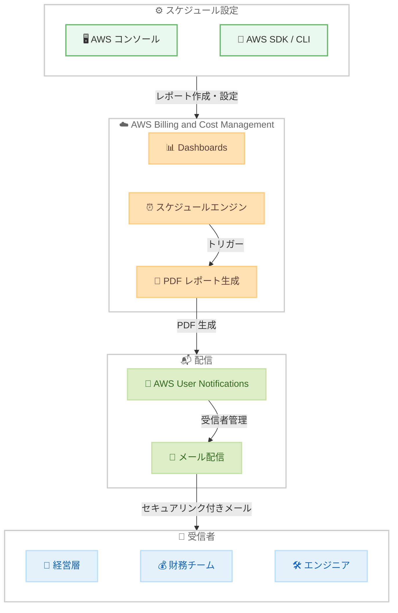

# AWS Billing and Cost Management Dashboards - スケジュールメール配信

**リリース日**: 2026 年 4 月 10 日
**サービス**: AWS Billing and Cost Management
**機能**: Dashboards Scheduled Email Delivery

📊 [このアップデートのインフォグラフィックを見る](https://takech9203.github.io/aws-news-summary/20260410-aws-billing-and-cost-management-dashboards-scheduled-email-delivery.html)

## 概要

AWS Billing and Cost Management Dashboards にスケジュールメール配信機能が追加されました。この機能により、ダッシュボードのレポートを日次、週次、月次の柔軟なスケジュールで自動配信できるようになります。受信者にはパスワード保護された PDF レポートへのセキュアリンクを含むメールが送信され、コンソールにアクセスすることなくオフラインで財務データを確認できます。

この機能は、コスト管理に関する情報を意思決定者へ定期的に届ける必要がある組織にとって大きな価値を提供します。受信者の管理は AWS User Notifications を通じて行い、一度設定すれば指定したスケジュールに従ってレポートが自動的に生成・配信されます。AWS SDK や CLI ツールを使用してプログラムからこれらの機能にアクセスすることも可能です。

この機能はすべての商用 AWS リージョンで追加コストなしで利用可能です (AWS 中国リージョンを除く)。

**アップデート前の課題**

- ダッシュボードの情報を共有するには、手動でコンソールにログインしてデータを確認・エクスポートする必要があった
- コスト情報を意思決定者に定期的に届けるために、手動でレポートを作成・配布する作業が発生していた
- コンソールへのアクセス権限を持たない関係者 (経営層やビジネスリーダーなど) にコスト情報を共有する手段が限られていた

**アップデート後の改善**

- 日次、週次、月次のスケジュールでダッシュボードレポートを自動配信できるようになった
- パスワード保護された PDF レポートにより、コンソールアクセスなしでオフラインで財務データを確認できるようになった
- 6 つの新しい API メソッドにより、スケジュールレポートの作成・管理・実行をプログラムから制御できるようになった

## アーキテクチャ図



コンソールまたは SDK / CLI からスケジュールレポートを設定し、AWS Billing and Cost Management Dashboards がスケジュールに従って PDF レポートを自動生成、AWS User Notifications を通じてメールで受信者に配信するフローを示しています。

## サービスアップデートの詳細

### 主要機能

1. **スケジュールレポートの自動配信**
   - 日次、週次、月次の柔軟な配信スケジュールを設定可能
   - スケジュール式とタイムゾーンを指定して、組織の業務サイクルに合わせた配信タイミングを制御
   - スケジュールの有効期間 (開始時刻・終了時刻) を設定可能
   - スケジュールの有効・無効を切り替えて一時停止も可能

2. **セキュアな PDF レポート**
   - ダッシュボードの内容をパスワード保護された PDF として自動生成
   - オフラインでの閲覧に最適化されたレポート形式
   - 受信者にはセキュアリンクを含むメールが送信される

3. **ウィジェットの選択と日付範囲のカスタマイズ**
   - 配信対象のウィジェット ID を指定して、必要な情報のみを含むレポートを作成可能
   - ウィジェットの日付範囲を絶対値 (ABSOLUTE) または相対値 (RELATIVE) でオーバーライド可能
   - レポートの内容を受信者のニーズに合わせて柔軟にカスタマイズ

4. **受信者管理と通知**
   - AWS User Notifications を通じて受信者リストを管理
   - IAM の実行ロールを指定してレポート生成時の権限を制御
   - ヘルスステータスにより配信状態を監視可能

5. **プログラムによるアクセス**
   - 6 つの新しい API メソッドにより、スケジュールレポートの完全なライフサイクルを制御
   - AWS SDK および CLI ツールから操作可能
   - ドライラン機能により、実際の配信前に設定を検証可能

## 技術仕様

### API メソッド一覧

| メソッド名 | 用途 | 主なパラメータ |
|------------|------|----------------|
| `CreateScheduledReport` | スケジュールレポートの作成 | `name`、`dashboardArn`、`scheduleConfig`、`widgetIds` |
| `GetScheduledReport` | スケジュールレポートの詳細取得 | `arn` |
| `ListScheduledReports` | スケジュールレポートの一覧取得 | `nextToken`、`maxResults` |
| `UpdateScheduledReport` | スケジュールレポートの更新 | `arn`、`name`、`scheduleConfig`、`widgetIds` |
| `DeleteScheduledReport` | スケジュールレポートの削除 | `arn` |
| `ExecuteScheduledReport` | スケジュールレポートの即時実行 | `arn`、`dryRun` |

### スケジュール設定パラメータ

| パラメータ | 説明 |
|------------|------|
| `scheduleExpression` | スケジュール式 (cron 式または rate 式) |
| `scheduleExpressionTimeZone` | スケジュールのタイムゾーン |
| `schedulePeriod.startTime` | スケジュールの開始時刻 |
| `schedulePeriod.endTime` | スケジュールの終了時刻 |
| `state` | `ENABLED` または `DISABLED` |

### ヘルスステータスコード

| ステータス | 説明 |
|------------|------|
| `HEALTHY` | レポートは正常に動作中 |
| `UNHEALTHY` | レポートにエラーが発生 |

### ヘルスステータスの理由コード

| 理由コード | 説明 |
|------------|------|
| `DATA_SOURCE_ACCESS_DENIED` | データソースへのアクセスが拒否されている |
| `EXECUTION_ROLE_ASSUME_FAILED` | 実行ロールの引き受けに失敗 |
| `EXECUTION_ROLE_INSUFFICIENT_PERMISSIONS` | 実行ロールの権限が不足 |
| `DASHBOARD_NOT_FOUND` | 指定されたダッシュボードが見つからない |
| `DASHBOARD_ACCESS_DENIED` | ダッシュボードへのアクセスが拒否されている |
| `INTERNAL_FAILURE` | 内部エラーが発生 |
| `WIDGET_ID_NOT_FOUND` | 指定されたウィジェット ID が見つからない |

### API 変更履歴

| 日付 | サービス | 変更内容 |
|------|----------|----------|
| 2026/04/09 | [AWS Billing and Cost Management Dashboards](https://awsapichanges.com/archive/changes/215aec-bcm-dashboards.html) | 6 new api methods - CreateScheduledReport、GetScheduledReport、ListScheduledReports、UpdateScheduledReport、DeleteScheduledReport、ExecuteScheduledReport |

### IAM ポリシー例

```json
{
    "Version": "2012-10-17",
    "Statement": [
        {
            "Effect": "Allow",
            "Action": [
                "bcm-dashboards:CreateScheduledReport",
                "bcm-dashboards:GetScheduledReport",
                "bcm-dashboards:ListScheduledReports",
                "bcm-dashboards:UpdateScheduledReport",
                "bcm-dashboards:DeleteScheduledReport",
                "bcm-dashboards:ExecuteScheduledReport"
            ],
            "Resource": "*"
        }
    ]
}
```

## 設定方法

### 前提条件

1. AWS アカウントを保有していること
2. AWS Billing and Cost Management Dashboards でダッシュボードが作成済みであること
3. AWS User Notifications で受信者が設定されていること
4. スケジュールレポート実行用の IAM ロールが作成されていること

### 手順

#### ステップ 1: 実行用 IAM ロールの作成

```bash
aws iam create-role \
    --role-name BCMDashboardScheduledReportRole \
    --assume-role-policy-document '{
        "Version": "2012-10-17",
        "Statement": [
            {
                "Effect": "Allow",
                "Principal": {
                    "Service": "bcm-dashboards.amazonaws.com"
                },
                "Action": "sts:AssumeRole"
            }
        ]
    }'
```

スケジュールレポートの生成時に使用される IAM ロールを作成します。このロールは AWS Billing and Cost Management Dashboards サービスが引き受けてレポートを生成します。

#### ステップ 2: スケジュールレポートの作成

```python
import boto3

client = boto3.client('bcm-dashboards')

# 週次でダッシュボードレポートを配信するスケジュールを作成
response = client.create_scheduled_report(
    scheduledReport={
        'name': 'weekly-cost-report',
        'dashboardArn': 'arn:aws:bcm-dashboards:us-east-1:123456789012:dashboard/my-cost-dashboard',
        'scheduledReportExecutionRoleArn': 'arn:aws:iam::123456789012:role/BCMDashboardScheduledReportRole',
        'scheduleConfig': {
            'scheduleExpression': 'cron(0 9 ? * MON *)',
            'scheduleExpressionTimeZone': 'Asia/Tokyo',
            'state': 'ENABLED'
        },
        'description': 'Weekly cost report for leadership team'
    }
)

print(f"Scheduled report ARN: {response['arn']}")
```

`CreateScheduledReport` API を使用して、毎週月曜日の午前 9 時 (日本時間) にダッシュボードレポートを配信するスケジュールを作成します。

#### ステップ 3: スケジュールレポートの確認とテスト実行

```python
# 作成したスケジュールレポートの詳細を確認
report = client.get_scheduled_report(
    arn=response['arn']
)
print(f"Name: {report['scheduledReport']['name']}")
print(f"State: {report['scheduledReport']['scheduleConfig']['state']}")
print(f"Health: {report['scheduledReport']['healthStatus']['statusCode']}")

# ドライランで設定を検証
dry_run_result = client.execute_scheduled_report(
    arn=response['arn'],
    dryRun=True
)
print(f"Health Status: {dry_run_result['healthStatus']['statusCode']}")

# 即時実行でテスト配信
execution_result = client.execute_scheduled_report(
    arn=response['arn'],
    dryRun=False
)
print(f"Execution Triggered: {execution_result['executionTriggered']}")
```

`GetScheduledReport` でスケジュールレポートの詳細とヘルスステータスを確認し、`ExecuteScheduledReport` のドライラン機能で設定の妥当性を検証した後、即時実行でテスト配信を行います。

## メリット

### ビジネス面

- **意思決定の迅速化**: コスト情報が定期的に意思決定者へ自動配信されるため、コンソールにアクセスする必要がなく、迅速な経営判断が可能になる
- **手動作業の排除**: レポートの手動作成・配布作業が不要になり、FinOps チームの運用負荷を大幅に削減できる
- **情報の民主化**: コンソールアクセス権限がない経営層やビジネスリーダーにも、パスワード保護された PDF レポートを通じてコスト情報を安全に共有できる

### 技術面

- **完全な API サポート**: 6 つの API メソッドによりスケジュールレポートの作成・更新・削除・実行を完全にプログラムから制御でき、IaC (Infrastructure as Code) との統合が容易
- **柔軟なスケジュール設定**: cron 式やタイムゾーン指定により、組織の業務サイクルに合わせた配信タイミングを細かく制御可能
- **ヘルスモニタリング**: ヘルスステータスと理由コードにより、レポート配信の問題を迅速に検知・診断できる

## デメリット・制約事項

### 制限事項

- AWS 中国リージョンでは利用不可
- レポート形式は PDF のみ (CSV やその他のフォーマットには対応していない)
- 受信者管理は AWS User Notifications を通じて行う必要がある

### 考慮すべき点

- スケジュールレポート実行用の IAM ロールに適切な権限を付与する必要があり、権限不足の場合はヘルスステータスが `UNHEALTHY` となる
- ウィジェット ID の指定を誤るとレポート生成に失敗する可能性があるため、事前にドライラン機能で検証することを推奨
- パスワード保護された PDF レポートのパスワード管理ポリシーを組織内で策定する必要がある

## ユースケース

### ユースケース 1: 経営層向け週次コストサマリ

**シナリオ**: 毎週月曜日に、経営層向けのコストサマリダッシュボードを自動配信し、AWS 利用コストの傾向を報告する。

**実装例**:
```python
import boto3

client = boto3.client('bcm-dashboards')

response = client.create_scheduled_report(
    scheduledReport={
        'name': 'executive-weekly-cost-summary',
        'dashboardArn': 'arn:aws:bcm-dashboards:us-east-1:123456789012:dashboard/executive-overview',
        'scheduledReportExecutionRoleArn': 'arn:aws:iam::123456789012:role/BCMDashboardScheduledReportRole',
        'scheduleConfig': {
            'scheduleExpression': 'cron(0 8 ? * MON *)',
            'scheduleExpressionTimeZone': 'Asia/Tokyo',
            'state': 'ENABLED'
        },
        'description': 'Weekly cost summary for executives'
    }
)
```

**効果**: 経営層がコンソールにログインすることなく、毎週のコスト状況をメールで把握でき、コスト最適化に関する意思決定を迅速に行える。

### ユースケース 2: 月次 FinOps レポートの自動化

**シナリオ**: 月初にプロジェクト別のコスト配分レポートを自動生成し、各プロジェクトの責任者に配信する。

**実装例**:
```python
import boto3

client = boto3.client('bcm-dashboards')

# プロジェクト別コスト配分ダッシュボードの月次レポート
response = client.create_scheduled_report(
    scheduledReport={
        'name': 'monthly-project-cost-allocation',
        'dashboardArn': 'arn:aws:bcm-dashboards:us-east-1:123456789012:dashboard/project-cost-allocation',
        'scheduledReportExecutionRoleArn': 'arn:aws:iam::123456789012:role/BCMDashboardScheduledReportRole',
        'scheduleConfig': {
            'scheduleExpression': 'cron(0 9 1 * ? *)',
            'scheduleExpressionTimeZone': 'Asia/Tokyo',
            'state': 'ENABLED'
        },
        'description': 'Monthly project cost allocation report',
        'widgetDateRangeOverride': {
            'startTime': {
                'type': 'RELATIVE',
                'value': '-1M'
            },
            'endTime': {
                'type': 'RELATIVE',
                'value': 'now'
            }
        }
    }
)
```

**効果**: 月次のコスト配分レポート作成の手動作業が完全に自動化され、FinOps チームはレポート作成ではなくコスト最適化の分析に集中できる。

### ユースケース 3: 日次コスト異常検知アラート

**シナリオ**: 日次でコストダッシュボードのレポートを配信し、チームがコストの急増を早期に検知できるようにする。

**実装例**:
```python
import boto3

client = boto3.client('bcm-dashboards')

# 日次コストモニタリングレポート
response = client.create_scheduled_report(
    scheduledReport={
        'name': 'daily-cost-monitoring',
        'dashboardArn': 'arn:aws:bcm-dashboards:us-east-1:123456789012:dashboard/daily-cost-trend',
        'scheduledReportExecutionRoleArn': 'arn:aws:iam::123456789012:role/BCMDashboardScheduledReportRole',
        'scheduleConfig': {
            'scheduleExpression': 'cron(0 7 * * ? *)',
            'scheduleExpressionTimeZone': 'Asia/Tokyo',
            'state': 'ENABLED'
        },
        'description': 'Daily cost monitoring report',
        'widgetIds': [
            'cost-trend-widget',
            'top-services-widget',
            'anomaly-detection-widget'
        ]
    }
)
```

**効果**: 毎朝チームメンバーがコスト状況を確認でき、予期しないコスト増加を早期に発見して対応できる。

## 料金

スケジュールメール配信機能は、すべての商用 AWS リージョンで**追加コストなし**で利用できます。AWS Billing and Cost Management Dashboards の既存の利用料金に含まれています。

| 項目 | 詳細 |
|------|------|
| スケジュールメール配信機能 | 追加コストなし |
| AWS Billing and Cost Management Dashboards | 既存の料金体系に準拠 |

## 利用可能リージョン

すべての商用 AWS リージョンで利用可能です (AWS 中国リージョンを除く)。

## 関連サービス・機能

- **AWS Billing and Cost Management Dashboards**: コスト管理のためのダッシュボード機能。今回のアップデートにより、ダッシュボードの内容を自動配信する機能が追加された
- **AWS User Notifications**: スケジュールレポートの受信者管理に使用するサービス。メール配信先の設定と管理を担当する
- **AWS Cost Explorer**: コストと使用量の分析ツール。Billing and Cost Management Dashboards と連携してコストデータの可視化を提供する
- **AWS Budgets**: 予算管理とアラート機能。スケジュールレポートと組み合わせることで、コスト管理の自動化をさらに強化できる

## 参考リンク

- 📊 [インフォグラフィック](https://takech9203.github.io/aws-news-summary/20260410-aws-billing-and-cost-management-dashboards-scheduled-email-delivery.html)
- [公式発表 (What's New)](https://aws.amazon.com/about-aws/whats-new/2026/04/aws-billing-and-cost-management-dashboards-scheduled-email-delivery/)
- [AWS Blog - Automate AWS Cost Reporting with Scheduled Dashboard Email Delivery](https://aws.amazon.com/blogs/aws-cloud-financial-management/automate-aws-cost-reporting-with-scheduled-dashboard-email-delivery/)
- [AWS API Changes - BCM Dashboards](https://awsapichanges.com/archive/changes/215aec-bcm-dashboards.html)
- [AWS Billing and Cost Management ドキュメント](https://docs.aws.amazon.com/account-billing/)
- [AWS Billing and Cost Management 料金ページ](https://aws.amazon.com/aws-cost-management/pricing/)

## まとめ

AWS Billing and Cost Management Dashboards のスケジュールメール配信機能は、コスト情報の共有を自動化する実用的なアップデートです。6 つの新しい API メソッドにより、レポートの作成・管理・実行をプログラムから完全に制御でき、日次から月次まで柔軟なスケジュールで意思決定者へコスト情報を自動配信できます。追加コストなしですべての商用リージョンで利用可能なため、まずは既存のダッシュボードに対してスケジュールレポートを設定し、FinOps ワークフローの効率化を開始することを推奨します。
