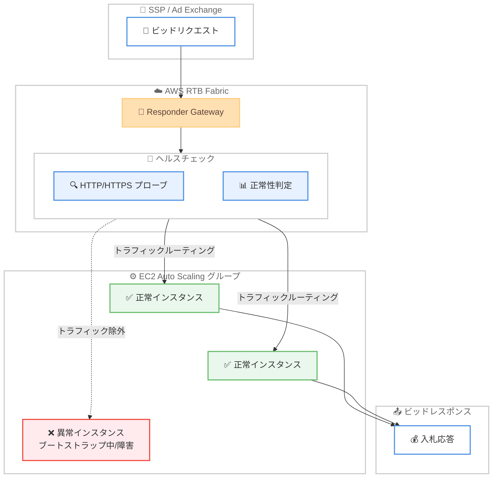

# AWS RTB Fabric - リアルタイムビディングワークロード向けヘルスチェック機能

**リリース日**: 2026 年 4 月 10 日
**サービス**: AWS RTB Fabric
**機能**: Responder Gateway の ASG マネージドエンドポイント向けヘルスチェック

📊 [このアップデートのインフォグラフィックを見る](https://takech9203.github.io/aws-news-summary/20260410-aws-rtb-fabric-health-checks.html)

## 概要

AWS RTB Fabric が EC2 Auto Scaling グループ (ASG) を使用したリアルタイムビディング (RTB) ワークロードに対するヘルスチェック機能のサポートを開始しました。RTB Fabric の Responder Gateway に設定可能なヘルスチェックを追加することで、インスタンスの IP アドレスを継続的にプローブし、正常なインスタンスにのみトラフィックを自動ルーティングできるようになります。

この機能により、ブートストラップ中、ドレイニング中、または障害が発生したインスタンスへのリクエスト送信によるリアルタイムビディングトランザクションの失敗を排除できます。AdTech 企業にとって、稼働率の向上、エラー率の低減、収益損失の防止に直結する重要なアップデートです。

パートナー企業として Amazon Ads、GumGum、Kargo、MobileFuse、Sovrn、TripleLift、Viant、Yieldmo が挙げられており、RTB Fabric はミリ秒単位のレイテンシーと最大 80% のコスト削減を実現するサービスです。

**アップデート前の課題**

- ASG 内のインスタンスがブートストラップ中やドレイニング中でも、RTB Fabric がトラフィックをルーティングしてしまい、ビディングトランザクションが失敗していた
- 障害が発生したインスタンスの検出と除外を手動で管理する必要があり、デプロイメントやスケーリングイベント時にエラー率が増加していた
- インスタンスの正常性に基づくトラフィック制御をカスタムで実装する必要があり、運用負荷が高かった

**アップデート後の改善**

- Responder Gateway がインスタンスの IP を継続的にプローブし、正常なインスタンスにのみトラフィックを自動ルーティングするようになった
- デプロイメント、スケーリングイベント、インスタンス障害時のエラーが自動的に軽減されるようになった
- ヘルスチェックのプロトコル、ポート、パス、タイムアウト、しきい値などを柔軟に設定可能になった

## アーキテクチャ図



SSP / Ad Exchange からのビッドリクエストが Responder Gateway に到着すると、ヘルスチェック機能が ASG 内の各インスタンスの正常性を判定し、正常なインスタンスにのみトラフィックをルーティングします。異常なインスタンスはトラフィックから自動的に除外されます。

## サービスアップデートの詳細

### 主要機能

1. **継続的ヘルスプローブ**
   - Responder Gateway が ASG マネージドエンドポイント内の各インスタンス IP を定期的にプローブ
   - HTTP または HTTPS プロトコルによるヘルスチェックに対応
   - 設定可能なインターバルでインスタンスの正常性を監視

2. **自動トラフィックルーティング**
   - ヘルスチェックの結果に基づき、正常なインスタンスにのみトラフィックを自動ルーティング
   - ブートストラップ中、ドレイニング中、障害発生中のインスタンスを自動的にトラフィックから除外
   - デプロイメントやスケーリングイベント時のエラーを最小化

3. **柔軟な設定オプション**
   - ヘルスチェックのポート、パス、プロトコル、タイムアウト、インターバルを個別に設定可能
   - 正常/異常判定のしきい値カウントを設定可能
   - ステータスコードマッチャーによる応答コードの柔軟な判定

## 技術仕様

### ヘルスチェック設定パラメータ

| パラメータ | 型 | 説明 |
|------|------|------|
| `port` | integer | ヘルスチェック対象のポート番号 |
| `path` | string | ヘルスチェックリクエストのパス |
| `protocol` | string | `HTTP` または `HTTPS` |
| `timeoutMs` | integer | ヘルスチェックのタイムアウト (ミリ秒) |
| `intervalSeconds` | integer | ヘルスチェックのインターバル (秒) |
| `statusCodeMatcher` | string | 正常とみなすステータスコードのマッチャー |
| `healthyThresholdCount` | integer | 正常と判定するための連続成功回数 |
| `unhealthyThresholdCount` | integer | 異常と判定するための連続失敗回数 |

### API 変更履歴

| 日付 | サービス | 変更内容 |
|------|----------|----------|
| 2026/04/10 | [RTBFabric](https://awsapichanges.com/archive/changes/974e23-rtbfabric.html) | 3 updated methods - Responder Gateway の ASG マネージドエンドポイントにヘルスチェック設定を追加 |
| 2026/04/07 | [RTBFabric](https://awsapichanges.com/archive/changes/0db175-rtbfabric.html) | 11 updated methods - External Responder Gateway が HTTP プロトコルをサポート |

### 更新された API メソッド

今回のヘルスチェック機能追加により、以下の 3 つの API メソッドが更新されました。

- **CreateResponderGateway**: `managedEndpointConfiguration.autoScalingGroups.healthCheckConfig` パラメータが追加
- **GetResponderGateway**: レスポンスに `healthCheckConfig` が含まれるように拡張
- **UpdateResponderGateway**: 既存の Responder Gateway に対するヘルスチェック設定の変更が可能

### ヘルスチェック設定例

```json
{
  "managedEndpointConfiguration": {
    "autoScalingGroups": {
      "autoScalingGroupNames": ["my-rtb-asg"],
      "roleArn": "arn:aws:iam::123456789012:role/RTBFabricRole",
      "healthCheckConfig": {
        "port": 8080,
        "path": "/health",
        "protocol": "HTTP",
        "timeoutMs": 5000,
        "intervalSeconds": 10,
        "statusCodeMatcher": "200",
        "healthyThresholdCount": 3,
        "unhealthyThresholdCount": 2
      }
    }
  }
}
```

## 設定方法

### 前提条件

1. AWS RTB Fabric の利用が有効化されていること
2. EC2 Auto Scaling グループが作成済みであること
3. RTB Fabric 用の IAM ロールが適切に設定されていること
4. ビディングアプリケーションにヘルスチェック用のエンドポイントが実装されていること

### 手順

#### ステップ 1: ヘルスチェックエンドポイントの準備

ビディングアプリケーションにヘルスチェック用のエンドポイントを実装します。このエンドポイントはアプリケーションの準備状態を返す必要があります。

```python
# Flask の例
@app.route('/health')
def health_check():
    if app_is_ready and bid_engine_initialized:
        return jsonify({"status": "healthy"}), 200
    return jsonify({"status": "unhealthy"}), 503
```

アプリケーションがブートストラップ完了後に 200 を返し、ドレイニング中や障害時に非 200 を返すようにします。

#### ステップ 2: Responder Gateway の作成時にヘルスチェックを設定

```bash
aws rtb-fabric create-responder-gateway \
  --vpc-id vpc-0123456789abcdef0 \
  --subnet-ids '["subnet-abc123","subnet-def456"]' \
  --security-group-ids '["sg-0123456789abcdef0"]' \
  --domain-name bidder.example.com \
  --port 443 \
  --protocol HTTPS \
  --managed-endpoint-configuration '{
    "autoScalingGroups": {
      "autoScalingGroupNames": ["my-rtb-asg"],
      "roleArn": "arn:aws:iam::123456789012:role/RTBFabricRole",
      "healthCheckConfig": {
        "port": 8080,
        "path": "/health",
        "protocol": "HTTP",
        "timeoutMs": 5000,
        "intervalSeconds": 10,
        "statusCodeMatcher": "200",
        "healthyThresholdCount": 3,
        "unhealthyThresholdCount": 2
      }
    }
  }'
```

RTB Fabric の Responder Gateway を作成し、ASG マネージドエンドポイントにヘルスチェック設定を含めます。`healthCheckConfig` 内の各パラメータでプローブの動作を制御します。

#### ステップ 3: 既存の Responder Gateway にヘルスチェックを追加

```bash
aws rtb-fabric update-responder-gateway \
  --gateway-id gw-0123456789abcdef0 \
  --managed-endpoint-configuration '{
    "autoScalingGroups": {
      "autoScalingGroupNames": ["my-rtb-asg"],
      "roleArn": "arn:aws:iam::123456789012:role/RTBFabricRole",
      "healthCheckConfig": {
        "port": 8080,
        "path": "/health",
        "protocol": "HTTP",
        "timeoutMs": 5000,
        "intervalSeconds": 10,
        "statusCodeMatcher": "200",
        "healthyThresholdCount": 3,
        "unhealthyThresholdCount": 2
      }
    }
  }'
```

既存の Responder Gateway に対して `UpdateResponderGateway` API を使用してヘルスチェック設定を追加または変更します。

#### ステップ 4: ヘルスチェック設定の確認

```bash
aws rtb-fabric get-responder-gateway \
  --gateway-id gw-0123456789abcdef0
```

`GetResponderGateway` API で現在のヘルスチェック設定を確認します。レスポンスの `managedEndpointConfiguration.autoScalingGroups.healthCheckConfig` に設定内容が含まれます。

## メリット

### ビジネス面

- **収益損失の防止**: 障害インスタンスへのビッドリクエスト送信を排除し、入札機会の損失を防止
- **稼働率の向上**: 正常なインスタンスにのみトラフィックをルーティングすることで、サービス全体の可用性が向上
- **デプロイメントリスクの軽減**: ローリングデプロイメントやスケーリングイベント時のエラー率を自動的に低減

### 技術面

- **自動化された正常性管理**: 手動でのインスタンス除外や復旧操作が不要になり、運用負荷を削減
- **柔軟な設定**: ポート、パス、プロトコル、タイムアウト、しきい値など、ビディングワークロードの特性に応じた詳細な設定が可能
- **ミリ秒単位のレイテンシー維持**: RTB Fabric の低レイテンシー特性を維持しながらヘルスチェック機能を提供

## デメリット・制約事項

### 制限事項

- ヘルスチェック機能は ASG マネージドエンドポイントでのみ利用可能で、EKS エンドポイントには適用されない
- ヘルスチェック設定はオプションであり、設定しない場合は従来どおりの動作となる
- 利用可能なリージョンは現時点で 6 リージョンに限定されている

### 考慮すべき点

- ヘルスチェックのインターバルとしきい値の設定は、ビディングアプリケーションの起動時間やドレイニング時間に合わせて調整する必要がある
- ヘルスチェック用のエンドポイントをアプリケーション側で実装・維持する必要がある
- ヘルスチェックのタイムアウトやしきい値が不適切な場合、正常なインスタンスが一時的にトラフィックから除外される可能性がある

## ユースケース

### ユースケース 1: ローリングデプロイメント時のゼロダウンタイム

**シナリオ**: DSP (Demand-Side Platform) がビディングアプリケーションの新バージョンをローリングデプロイメントでリリースする場合、新しいインスタンスのブートストラップ中に入札リクエストが送信されてエラーが発生する。

**実装例**:
```json
{
  "healthCheckConfig": {
    "port": 8080,
    "path": "/ready",
    "protocol": "HTTP",
    "timeoutMs": 3000,
    "intervalSeconds": 5,
    "statusCodeMatcher": "200",
    "healthyThresholdCount": 3,
    "unhealthyThresholdCount": 2
  }
}
```

**効果**: 新しいインスタンスがヘルスチェックに 3 回連続で成功するまでトラフィックが送信されず、ブートストラップ完了前のリクエスト失敗を排除できる。

### ユースケース 2: スケーリングイベント時のトラフィック保護

**シナリオ**: トラフィックのピーク時に ASG がスケールアウトし、新しいインスタンスが追加される際、ビディングエンジンの初期化が完了する前にリクエストが到着してエラーレスポンスが返される。

**実装例**:
```json
{
  "healthCheckConfig": {
    "port": 8080,
    "path": "/health",
    "protocol": "HTTP",
    "timeoutMs": 5000,
    "intervalSeconds": 10,
    "statusCodeMatcher": "200-299",
    "healthyThresholdCount": 2,
    "unhealthyThresholdCount": 3
  }
}
```

**効果**: スケールアウト時にビディングエンジンが完全に初期化されたインスタンスのみがトラフィックを受信し、エラー率の急増を防止できる。

### ユースケース 3: 障害インスタンスの自動除外

**シナリオ**: メモリリークやアプリケーション障害により一部のインスタンスが正常に応答できなくなった場合、そのインスタンスへのビッドリクエスト送信による収益損失が発生する。

**実装例**:
```json
{
  "healthCheckConfig": {
    "port": 8080,
    "path": "/health",
    "protocol": "HTTP",
    "timeoutMs": 2000,
    "intervalSeconds": 5,
    "statusCodeMatcher": "200",
    "healthyThresholdCount": 3,
    "unhealthyThresholdCount": 2
  }
}
```

**効果**: 障害インスタンスが 2 回連続でヘルスチェックに失敗すると自動的にトラフィックから除外され、ASG による新しいインスタンスの起動後にヘルスチェックが成功するとトラフィックが復旧する。

## 料金

AWS RTB Fabric のヘルスチェック機能に関する追加料金の詳細は公式発表では明示されていません。RTB Fabric 自体の料金体系については、AWS の公式料金ページを参照してください。RTB Fabric は最大 80% のコスト削減を実現するとされています。

## 利用可能リージョン

以下の 6 リージョンで利用可能です。

| リージョン名 | リージョンコード |
|------|------|
| 米国東部 (バージニア北部) | us-east-1 |
| 米国西部 (オレゴン) | us-west-2 |
| アジアパシフィック (シンガポール) | ap-southeast-1 |
| アジアパシフィック (東京) | ap-northeast-1 |
| 欧州 (フランクフルト) | eu-central-1 |
| 欧州 (アイルランド) | eu-west-1 |

## 関連サービス・機能

- **EC2 Auto Scaling**: RTB Fabric のヘルスチェックは ASG マネージドエンドポイントと連携し、ASG 内のインスタンスの正常性を監視
- **Amazon EC2**: ビディングワークロードを実行するコンピューティング基盤として RTB Fabric と統合
- **Elastic Load Balancing**: ELB のヘルスチェックと同様の概念だが、RTB Fabric はリアルタイムビディング専用に最適化されたミリ秒単位のルーティングを提供

## 参考リンク

- 📊 [インフォグラフィック](https://takech9203.github.io/aws-news-summary/20260410-aws-rtb-fabric-health-checks.html)
- [公式発表 (What's New)](https://aws.amazon.com/about-aws/whats-new/2026/04/aws-rtb-fabric-health-checks/)
- [AWS RTB Fabric ドキュメント](https://docs.aws.amazon.com/rtb-fabric/latest/userguide/)
- [AWS RTB Fabric 料金ページ](https://aws.amazon.com/rtb-fabric/pricing/)

## まとめ

AWS RTB Fabric のヘルスチェック機能は、AdTech 企業がリアルタイムビディングワークロードの信頼性を大幅に向上させるための重要なアップデートです。ASG マネージドエンドポイントにおけるインスタンスの正常性を自動的に監視し、障害インスタンスをトラフィックから除外することで、デプロイメントやスケーリングイベント時のエラーを排除できます。RTB Fabric を利用している AdTech 企業は、Responder Gateway にヘルスチェック設定を追加し、ビディングアプリケーションにヘルスチェックエンドポイントを実装することを推奨します。
