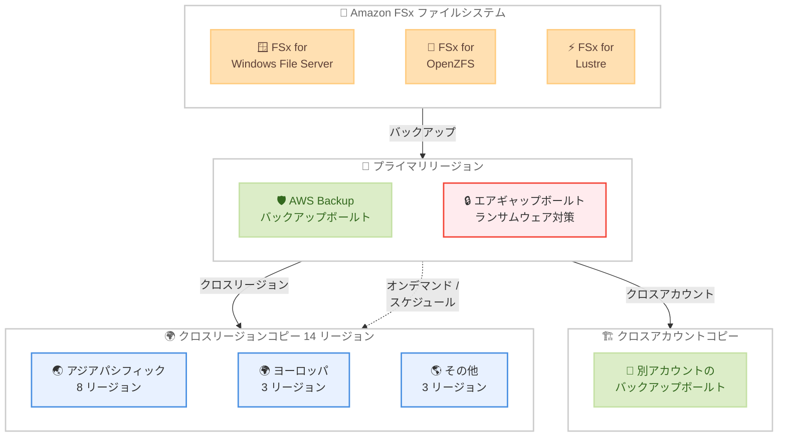

# AWS Backup - Amazon FSx サポートの 5 リージョン追加およびクロスリージョン・クロスアカウントコピーの 14 リージョン拡張

**リリース日**: 2026 年 4 月 10 日
**サービス**: AWS Backup
**機能**: Amazon FSx サポートのリージョン拡張およびクロスリージョン・クロスアカウントコピーの拡張

📊 [このアップデートのインフォグラフィックを見る](https://takech9203.github.io/aws-news-summary/20260410-backup-extends-fsx-support.html)

## 概要

AWS Backup が Amazon FSx for Windows File Server、Amazon FSx for OpenZFS、Amazon FSx for Lustre に対するサポートを 2 つの側面で拡張しました。まず、5 つの追加 AWS リージョンで FSx ファイルシステムのバックアップとリストアが利用可能になりました。次に、14 の AWS リージョンで FSx バックアップのクロスリージョンおよびクロスアカウントコピーが新たにサポートされました。

今回の拡張により、オプトインリージョンでも FSx バックアップを AWS Backup の論理的エアギャップボールト (logically air-gapped vault) に保存できるようになり、意図しない削除や悪意のある削除に対する追加の防御層を提供します。これはランサムウェアイベントからの復旧にも役立つ重要な機能です。

クロスリージョンおよびクロスアカウントコピーは、オンデマンドコピーとコピールールを含むスケジュールされたバックアッププランの両方で利用可能です。

**アップデート前の課題**

- アジアパシフィック (マレーシア、台北、タイ)、カナダ西部 (カルガリー)、メキシコ (中部) の 5 リージョンでは FSx ファイルシステムのバックアップとリストアが利用できなかった
- アフリカ、アジアパシフィック、カナダ西部、ヨーロッパ、イスラエル、メキシコの 14 リージョンでは FSx バックアップのクロスリージョン・クロスアカウントコピーが利用できなかった
- オプトインリージョンでの FSx バックアップに対するエアギャップボールトの利用が制限されていた

**アップデート後の改善**

- 5 つの追加リージョンで FSx ファイルシステムのバックアップとリストアが利用可能になった
- 14 リージョンで FSx バックアップのクロスリージョンおよびクロスアカウントコピーが利用可能になった
- オプトインリージョンでもエアギャップボールトに FSx バックアップを保存できるようになり、ランサムウェア対策が強化された

## アーキテクチャ図



AWS Backup による FSx ファイルシステムのバックアップフローを示しています。プライマリリージョンのバックアップボールトまたはエアギャップボールトからクロスリージョン (14 リージョン) およびクロスアカウントへのコピーが可能です。

## サービスアップデートの詳細

### 主要機能

1. **5 リージョンでの FSx バックアップ・リストアサポート追加**
   - 対象リージョン: アジアパシフィック (マレーシア、台北、タイ)、カナダ西部 (カルガリー)、メキシコ (中部)
   - Amazon FSx for Windows File Server、Amazon FSx for OpenZFS、Amazon FSx for Lustre のすべてに対応
   - バックアップの作成およびリストアの両方を完全サポート

2. **14 リージョンでのクロスリージョン・クロスアカウントコピーサポート**
   - 対象リージョン: アフリカ (ケープタウン)、アジアパシフィック (香港、ハイデラバード、ジャカルタ、マレーシア、メルボルン、台北、タイ)、カナダ西部 (カルガリー)、ヨーロッパ (ミラノ、スペイン、チューリッヒ)、イスラエル (テルアビブ)、メキシコ (中部)
   - オンデマンドコピーとスケジュールされたバックアッププラン (コピールール付き) の両方に対応
   - クロスリージョンおよびクロスアカウントの両方のコピーをサポート

3. **エアギャップボールトのサポート拡張**
   - オプトインリージョンでも FSx バックアップをエアギャップボールトに保存可能
   - 論理的エアギャップにより、意図しない削除や悪意のある削除から保護
   - ランサムウェアイベントからの復旧を支援する追加の防御層を提供

## 技術仕様

### 新規サポートリージョン (バックアップ・リストア)

| リージョン名 | リージョンコード |
|------|------|
| アジアパシフィック (マレーシア) | ap-southeast-5 |
| アジアパシフィック (台北) | ap-east-2 |
| アジアパシフィック (タイ) | ap-southeast-7 |
| カナダ西部 (カルガリー) | ca-west-1 |
| メキシコ (中部) | mx-central-1 |

### クロスリージョン・クロスアカウントコピー対応リージョン

| リージョン名 | リージョンコード |
|------|------|
| アフリカ (ケープタウン) | af-south-1 |
| アジアパシフィック (香港) | ap-east-1 |
| アジアパシフィック (ハイデラバード) | ap-south-2 |
| アジアパシフィック (ジャカルタ) | ap-southeast-3 |
| アジアパシフィック (マレーシア) | ap-southeast-5 |
| アジアパシフィック (メルボルン) | ap-southeast-4 |
| アジアパシフィック (台北) | ap-east-2 |
| アジアパシフィック (タイ) | ap-southeast-7 |
| カナダ西部 (カルガリー) | ca-west-1 |
| ヨーロッパ (ミラノ) | eu-south-1 |
| ヨーロッパ (スペイン) | eu-south-2 |
| ヨーロッパ (チューリッヒ) | eu-central-2 |
| イスラエル (テルアビブ) | il-central-1 |
| メキシコ (中部) | mx-central-1 |

### 対象 FSx ファイルシステム

| ファイルシステム | 主な用途 |
|------|------|
| Amazon FSx for Windows File Server | Windows ベースのファイル共有、Active Directory 統合 |
| Amazon FSx for OpenZFS | Linux/macOS ワークロード、高性能ファイルストレージ |
| Amazon FSx for Lustre | ハイパフォーマンスコンピューティング、機械学習ワークロード |

### API 変更履歴

今回のアップデートはリージョン拡張であり、新しい API やパラメータの追加は伴いません。

なお、関連する最近の AWS Backup サービスの API 変更として以下があります。

| 日付 | サービス | 変更内容 |
|------|----------|----------|
| 2026/04/08 | [AWS Backup](https://awsapichanges.com/archive/changes/d831a0-backup.html) | 2 updated api methods - EKS 固有のバックアップボールト通知タイプの追加 |

### エアギャップボールトの設定例

```json
{
    "BackupVaultName": "my-fsx-airgapped-vault",
    "BackupVaultType": "LOGICALLY_AIR_GAPPED",
    "MinRetentionDays": 7,
    "MaxRetentionDays": 365,
    "BackupVaultTags": {
        "Purpose": "FSx-RansomwareProtection",
        "Environment": "Production"
    }
}
```

## 設定方法

### 前提条件

1. AWS Backup が利用可能なリージョンで AWS アカウントが有効化されていること
2. オプトインリージョンを使用する場合は、対象リージョンが有効化されていること
3. Amazon FSx ファイルシステムが作成済みであること
4. AWS CLI v2 がインストールされていること

### 手順

#### ステップ 1: バックアッププランの作成

```bash
# FSx ファイルシステムのバックアッププランを作成
aws backup create-backup-plan \
  --backup-plan '{
    "BackupPlanName": "fsx-cross-region-plan",
    "Rules": [
      {
        "RuleName": "daily-backup-with-copy",
        "TargetBackupVaultName": "Default",
        "ScheduleExpression": "cron(0 5 ? * * *)",
        "StartWindowMinutes": 60,
        "CompletionWindowMinutes": 180,
        "Lifecycle": {
          "DeleteAfterDays": 35
        },
        "CopyActions": [
          {
            "DestinationBackupVaultArn": "arn:aws:backup:ap-southeast-5:123456789012:backup-vault:Default",
            "Lifecycle": {
              "DeleteAfterDays": 35
            }
          }
        ]
      }
    ]
  }'
```

日次バックアップを作成し、アジアパシフィック (マレーシア) リージョンへのクロスリージョンコピーを自動実行するバックアッププランを定義します。

#### ステップ 2: FSx ファイルシステムのリソース割り当て

```bash
# バックアッププランに FSx ファイルシステムを割り当て
aws backup create-backup-selection \
  --backup-plan-id "your-backup-plan-id" \
  --backup-selection '{
    "SelectionName": "fsx-resources",
    "IamRoleArn": "arn:aws:iam::123456789012:role/AWSBackupDefaultServiceRole",
    "Resources": [
      "arn:aws:fsx:ap-northeast-1:123456789012:file-system/fs-0123456789abcdef0"
    ]
  }'
```

作成したバックアッププランに保護対象の FSx ファイルシステムを割り当てます。

#### ステップ 3: エアギャップボールトの作成

```bash
# 論理的エアギャップボールトを作成
aws backup create-logically-air-gapped-backup-vault \
  --backup-vault-name "fsx-airgapped-vault" \
  --min-retention-days 7 \
  --max-retention-days 365 \
  --backup-vault-tags Purpose=RansomwareProtection
```

ランサムウェア対策用の論理的エアギャップボールトを作成します。このボールトに保存されたバックアップは、最低保持期間内に削除することができません。

#### ステップ 4: オンデマンドのクロスアカウントコピー

```bash
# 別アカウントへのオンデマンドコピー
aws backup start-copy-job \
  --source-backup-vault-name "Default" \
  --destination-backup-vault-arn "arn:aws:backup:ap-southeast-5:987654321098:backup-vault:Default" \
  --recovery-point-arn "arn:aws:backup:ap-northeast-1:123456789012:recovery-point:xxxxxxxx-xxxx-xxxx-xxxx-xxxxxxxxxxxx" \
  --iam-role-arn "arn:aws:iam::123456789012:role/AWSBackupDefaultServiceRole"
```

既存のバックアップリカバリポイントを別アカウントのバックアップボールトにオンデマンドでコピーします。

## メリット

### ビジネス面

- **グローバル展開の加速**: 新興リージョン (マレーシア、台北、タイ、カルガリー、メキシコ中部) でのデータ保護が可能になり、これらのリージョンでの FSx ワークロード展開が容易になる
- **ランサムウェア対策の強化**: エアギャップボールトによりバックアップデータの改ざん・削除を防止し、ランサムウェア攻撃からの確実な復旧が可能になる
- **コンプライアンス要件への対応**: クロスリージョン・クロスアカウントコピーにより、データレジデンシー要件やディザスタリカバリ要件を満たすバックアップ戦略を構築できる

### 技術面

- **統一されたバックアップ管理**: AWS Backup の一元管理コンソールから FSx バックアップのクロスリージョン・クロスアカウントコピーを管理可能
- **自動化されたバックアップワークフロー**: バックアッププランのコピールールによりクロスリージョンコピーを自動化し、手動操作を排除
- **多層防御の実現**: エアギャップボールトとクロスリージョン・クロスアカウントコピーの組み合わせにより、複数の防御層を構築可能

## デメリット・制約事項

### 制限事項

- 今回のサポート対象は FSx for Windows File Server、FSx for OpenZFS、FSx for Lustre の 3 種類であり、FSx for NetApp ONTAP は対象に含まれていない場合がある (公式ドキュメントでの確認を推奨)
- クロスリージョンコピーにはデータ転送料金が発生する
- オプトインリージョンの利用には事前にリージョンの有効化が必要

### 考慮すべき点

- クロスリージョンコピー先のリージョンでの暗号化キー管理 (KMS キー) の設計が必要
- クロスアカウントコピーには、送信元と送信先の両方のアカウントで適切な AWS Backup 組織ポリシーの設定が必要
- エアギャップボールトの最低保持期間を設定する際、ストレージコストとセキュリティ要件のバランスを考慮する必要がある

## ユースケース

### ユースケース 1: アジアパシフィック地域のディザスタリカバリ

**シナリオ**: タイのリージョンで稼働する FSx for Windows File Server のバックアップを、マレーシアリージョンにクロスリージョンコピーしてディザスタリカバリ体制を構築する。

**実装例**:
```json
{
    "BackupPlanName": "apac-fsx-dr-plan",
    "Rules": [
        {
            "RuleName": "daily-backup-to-malaysia",
            "TargetBackupVaultName": "Default",
            "ScheduleExpression": "cron(0 18 ? * * *)",
            "Lifecycle": {
                "DeleteAfterDays": 30
            },
            "CopyActions": [
                {
                    "DestinationBackupVaultArn": "arn:aws:backup:ap-southeast-5:123456789012:backup-vault:Default",
                    "Lifecycle": {
                        "DeleteAfterDays": 30
                    }
                }
            ]
        }
    ]
}
```

**効果**: タイリージョンで障害が発生した場合でも、マレーシアリージョンのバックアップから FSx ファイルシステムをリストアして業務を継続できる。

### ユースケース 2: ランサムウェア対策のためのエアギャップボールト活用

**シナリオ**: 重要な業務データを保持する FSx for OpenZFS のバックアップをエアギャップボールトに保存し、ランサムウェア攻撃によるバックアップデータの改ざんや削除を防止する。

**実装例**:
```bash
# エアギャップボールトを作成
aws backup create-logically-air-gapped-backup-vault \
  --backup-vault-name "fsx-ransomware-protection" \
  --min-retention-days 30 \
  --max-retention-days 365

# エアギャップボールトへのバックアップルールを含むプランを作成
aws backup create-backup-plan \
  --backup-plan '{
    "BackupPlanName": "fsx-airgap-plan",
    "Rules": [
      {
        "RuleName": "weekly-to-airgap",
        "TargetBackupVaultName": "fsx-ransomware-protection",
        "ScheduleExpression": "cron(0 3 ? * SUN *)",
        "Lifecycle": {
          "DeleteAfterDays": 365
        }
      }
    ]
  }'
```

**効果**: エアギャップボールト内のバックアップは最低保持期間 (30 日) 内に削除できないため、ランサムウェア攻撃を受けても確実にクリーンなバックアップからリストアが可能になる。

### ユースケース 3: マルチアカウント環境でのバックアップ集約

**シナリオ**: AWS Organizations を使用したマルチアカウント環境で、各アカウントの FSx for Lustre バックアップをセキュリティアカウントに集約し、一元的にバックアップデータを保護する。

**実装例**:
```json
{
    "BackupPlanName": "fsx-cross-account-plan",
    "Rules": [
        {
            "RuleName": "daily-to-security-account",
            "TargetBackupVaultName": "Default",
            "ScheduleExpression": "cron(0 2 ? * * *)",
            "Lifecycle": {
                "DeleteAfterDays": 90
            },
            "CopyActions": [
                {
                    "DestinationBackupVaultArn": "arn:aws:backup:ap-northeast-1:999888777666:backup-vault:centralized-backup",
                    "Lifecycle": {
                        "DeleteAfterDays": 365
                    }
                }
            ]
        }
    ]
}
```

**効果**: 個別アカウントが侵害された場合でも、セキュリティアカウントのバックアップボールトから FSx ファイルシステムをリストアでき、データ損失リスクを最小化できる。

## 料金

AWS Backup の FSx バックアップに関する料金は、既存の AWS Backup 料金体系に基づきます。今回のリージョン拡張に伴う追加のサービス料金はありません。

### 料金例

| 項目 | 料金 (概算) |
|--------|------------------|
| FSx for Windows File Server バックアップストレージ | $0.05/GB/月 (リージョンにより異なる) |
| FSx for OpenZFS バックアップストレージ | $0.05/GB/月 (リージョンにより異なる) |
| FSx for Lustre バックアップストレージ | $0.05/GB/月 (リージョンにより異なる) |
| クロスリージョンデータ転送 | $0.02/GB (リージョン間により異なる) |
| エアギャップボールトストレージ | 通常のバックアップボールトと同等のストレージ料金 + プレミアムが適用される場合あり |

料金はリージョンによって異なるため、最新の情報は [AWS Backup 料金ページ](https://aws.amazon.com/backup/pricing/) を確認してください。

## 利用可能リージョン

### バックアップ・リストア (今回追加された 5 リージョン)

アジアパシフィック (マレーシア)、アジアパシフィック (台北)、アジアパシフィック (タイ)、カナダ西部 (カルガリー)、メキシコ (中部)

### クロスリージョン・クロスアカウントコピー (今回追加された 14 リージョン)

アフリカ (ケープタウン)、アジアパシフィック (香港)、アジアパシフィック (ハイデラバード)、アジアパシフィック (ジャカルタ)、アジアパシフィック (マレーシア)、アジアパシフィック (メルボルン)、アジアパシフィック (台北)、アジアパシフィック (タイ)、カナダ西部 (カルガリー)、ヨーロッパ (ミラノ)、ヨーロッパ (スペイン)、ヨーロッパ (チューリッヒ)、イスラエル (テルアビブ)、メキシコ (中部)

## 関連サービス・機能

- **Amazon FSx for Windows File Server**: Windows ベースのファイル共有ワークロード向けのフルマネージドファイルストレージ。今回のアップデートでバックアップ対象リージョンが拡張された
- **Amazon FSx for OpenZFS**: Linux および macOS ワークロード向けの高性能ファイルストレージ。クロスリージョンコピーによるデータ保護が強化された
- **Amazon FSx for Lustre**: HPC や機械学習ワークロード向けの高性能ファイルシステム。新リージョンでのバックアップが利用可能になった
- **AWS Backup Logically Air-Gapped Vault**: バックアップデータの改ざん・削除を防止する保護機能。ランサムウェア対策に有効
- **AWS Organizations**: マルチアカウント環境でのクロスアカウントバックアップコピーの管理に必要な組織管理サービス

## 参考リンク

- 📊 [インフォグラフィック](https://takech9203.github.io/aws-news-summary/20260410-backup-extends-fsx-support.html)
- [公式発表 (What's New)](https://aws.amazon.com/about-aws/whats-new/2026/04/backup-extends-fsx-support/)
- [AWS Backup ドキュメント](https://docs.aws.amazon.com/aws-backup/latest/devguide/whatisbackup.html)
- [Amazon FSx ドキュメント](https://docs.aws.amazon.com/fsx/)
- [AWS Backup 料金ページ](https://aws.amazon.com/backup/pricing/)
- [AWS Backup のエアギャップボールト](https://docs.aws.amazon.com/aws-backup/latest/devguide/vault-lock.html)

## まとめ

AWS Backup の Amazon FSx サポートが 5 つの追加リージョンでのバックアップ・リストアと 14 リージョンでのクロスリージョン・クロスアカウントコピーに拡張されたことにより、グローバルに展開する FSx ワークロードのデータ保護戦略がより柔軟に構築できるようになりました。特にエアギャップボールトのオプトインリージョンでのサポートは、ランサムウェア対策として重要な防御層を提供します。新リージョンで FSx ファイルシステムを運用しているユーザーは、バックアッププランにクロスリージョンコピールールを追加し、エアギャップボールトの導入を検討することを推奨します。
