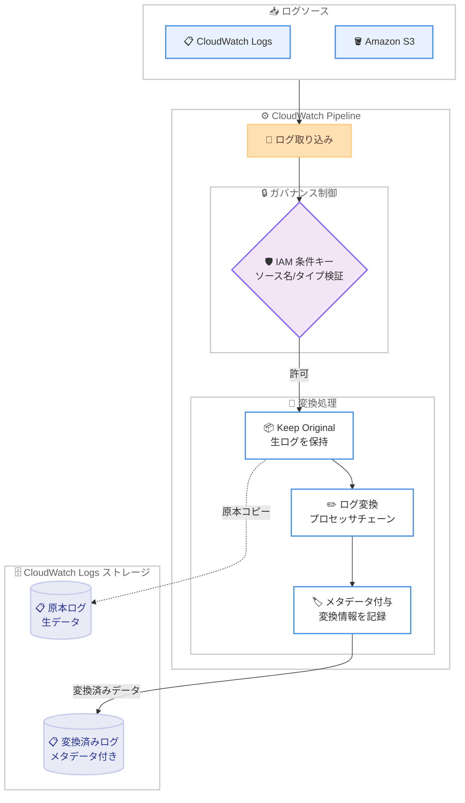

# Amazon CloudWatch Pipelines - コンプライアンスおよびガバナンス機能の追加

**リリース日**: 2026 年 4 月 10 日
**サービス**: Amazon CloudWatch
**機能**: CloudWatch Pipelines のコンプライアンスおよびガバナンス機能

📊 [このアップデートのインフォグラフィックを見る](https://takech9203.github.io/aws-news-summary/20260410-cloudwatch-pipelines-compliance-governance.html)

## 概要

Amazon CloudWatch Pipelines に新しいコンプライアンスおよびガバナンス機能が追加されました。このアップデートにより、ログデータの変換処理における監査証跡の確保、原本データの保持、およびパイプライン作成の権限制御が強化されます。規制要件やセキュリティポリシーへの準拠が求められる組織にとって重要な機能です。

主な新機能として、変換前の生ログを保持する "Keep original" トグル、変換処理が行われたことを示すメタデータの自動付与、およびログソース名やタイプに基づいてパイプライン作成を制限する新しい IAM 条件キーの 3 つが導入されました。これらの機能は追加コストなしで利用可能であり、原本と変換後の両方のコピーに対して標準の CloudWatch Logs ストレージ料金が適用されます。

**アップデート前の課題**

- パイプラインで変換されたログの原本データを保持する仕組みがなく、変換後のデータのみが保存されていたため、監査やフォレンジック調査時に元のログを参照できなかった
- ログエントリがパイプラインで変換されたものか、元のまま取り込まれたものかを区別する手段がなく、データの来歴を追跡することが困難だった
- パイプライン作成に対する IAM ベースの細かなアクセス制御がなく、特定のログソースに対してのみパイプライン作成を許可するといったガバナンスポリシーの適用が難しかった

**アップデート後の改善**

- "Keep original" トグルを有効にすることで、変換前の生ログを自動的に保持でき、コンプライアンス要件や監査要件に対応可能になった
- 変換処理済みのログエントリにメタデータが自動的に付与され、データの変換履歴を追跡可能になった
- 新しい IAM 条件キーにより、ログソース名やタイプに基づいたパイプライン作成の制限が可能になり、組織レベルでのガバナンスが強化された

## アーキテクチャ図



CloudWatch Pipelines のコンプライアンスおよびガバナンス機能のデータフローを示しています。IAM 条件キーによるパイプライン作成制御、"Keep original" トグルによる原本ログの保持、変換処理後のメタデータ付与、および原本と変換済みログの両方の保存フローを表しています。

## サービスアップデートの詳細

### 主要機能

1. **"Keep original" トグル - 生ログの原本保持**
   - パイプラインの設定で "Keep original" トグルを有効にすることで、変換前の生ログを自動的に保持できる
   - 原本データは変換処理とは別に CloudWatch Logs に保存され、後から参照可能
   - コンプライアンス監査やセキュリティインシデント調査時に元のログデータを確認できる

2. **変換メタデータの自動付与**
   - パイプラインで処理されたログエントリに、変換が行われたことを示すメタデータが自動的に追加される
   - ログエントリが変換済みか原本かを明確に区別でき、データの来歴を追跡可能
   - 監査目的でのログの整合性検証が容易になる

3. **IAM 条件キーによるパイプライン作成制限**
   - ログソース名に基づいてパイプライン作成を制限する新しい IAM 条件キーが追加された
   - ログソースタイプに基づいた制限も可能で、特定の種類のログに対してのみパイプライン作成を許可できる
   - 組織のセキュリティポリシーに合わせたきめ細かなアクセス制御が実現可能

## 技術仕様

### コンプライアンス機能の詳細

| 項目 | 詳細 |
|------|------|
| Keep original トグル | パイプライン設定で有効化。生ログを変換前の状態で保持 |
| メタデータ | 変換処理済みログエントリに自動付与。変換の事実を記録 |
| IAM 条件キー - ソース名 | ログソース名に基づくパイプライン作成の制限 |
| IAM 条件キー - ソースタイプ | ログソースタイプに基づくパイプライン作成の制限 |
| 追加コスト | なし。標準の CloudWatch Logs ストレージ料金が適用 |

### API 変更履歴

今回のアップデートに直接対応する CloudWatch Pipelines の API 変更は確認されていません。

なお、関連する最近の CloudWatch サービスの API 変更として以下があります。

| 日付 | サービス | 変更内容 |
|------|----------|----------|
| 2026/04/10 | [CloudWatch Observability Admin Service](https://awsapichanges.com/archive/changes/974e23-observabilityadmin.html) | 8 updated api methods - マルチリージョンテレメトリ評価とテレメトリ有効化ルールのサポート追加 |

### IAM 条件キーの設定例

```json
{
  "Version": "2012-10-17",
  "Statement": [
    {
      "Effect": "Allow",
      "Action": "logs:CreatePipeline",
      "Resource": "*",
      "Condition": {
        "StringEquals": {
          "logs:LogSourceName": "application-logs",
          "logs:LogSourceType": "CloudWatchLogs"
        }
      }
    }
  ]
}
```

上記は、ログソース名が "application-logs" かつログソースタイプが "CloudWatchLogs" の場合にのみパイプライン作成を許可する IAM ポリシーの例です。実際の条件キー名は公式ドキュメントで確認してください。

## 設定方法

### 前提条件

1. AWS アカウントで CloudWatch Pipelines が利用可能なリージョンであること
2. CloudWatch Pipelines のパイプラインが作成済み、または新規作成予定であること
3. パイプラインの設定に必要な IAM 権限が付与されていること

### 手順

#### ステップ 1: Keep original トグルを有効にしたパイプラインの作成

```bash
# Keep original を有効にしたパイプラインを作成
aws logs create-pipeline \
  --pipeline-name "compliance-pipeline" \
  --log-group-name "/aws/application/my-app" \
  --keep-original true \
  --processors '[
    {
      "type": "RenameKey",
      "configuration": {
        "oldKey": "user_email",
        "newKey": "contact_info"
      }
    }
  ]'
```

"Keep original" トグルを有効にすることで、変換前の生ログが自動的に保持されます。変換処理としてフィールド名の変更を行いつつ、原本データも保存されます。

#### ステップ 2: IAM ポリシーによるパイプライン作成制限の設定

```bash
# パイプライン作成を特定のログソースに制限する IAM ポリシーを作成
aws iam create-policy \
  --policy-name "RestrictPipelineCreation" \
  --policy-document '{
    "Version": "2012-10-17",
    "Statement": [
      {
        "Effect": "Allow",
        "Action": "logs:CreatePipeline",
        "Resource": "*",
        "Condition": {
          "StringEquals": {
            "logs:LogSourceType": "CloudWatchLogs"
          }
        }
      }
    ]
  }'
```

IAM 条件キーを使用して、CloudWatch Logs タイプのログソースに対してのみパイプライン作成を許可するポリシーを設定します。

#### ステップ 3: メタデータの確認

CloudWatch Logs コンソールまたは CLI を使用して、変換済みログエントリに付与されたメタデータを確認できます。メタデータにはパイプラインによる変換処理が行われたことを示す情報が含まれており、ログの来歴追跡に活用できます。

## メリット

### ビジネス面

- **コンプライアンス対応の強化**: "Keep original" トグルにより変換前の生ログを保持でき、規制要件やコンプライアンス監査への対応が容易になる
- **ガバナンスの一元管理**: IAM 条件キーにより、組織全体でパイプライン作成のガバナンスポリシーを統一的に管理できる
- **追加コストなし**: コンプライアンスおよびガバナンス機能自体に追加料金が発生せず、既存のパイプラインに容易に導入できる

### 技術面

- **データの来歴追跡**: メタデータの自動付与により、ログエントリの変換履歴を追跡でき、データの整合性を検証可能
- **原本データの保全**: 変換処理によるデータ損失のリスクを排除し、フォレンジック調査や障害分析時に元のログを参照可能
- **きめ細かなアクセス制御**: ログソース名やタイプに基づいた IAM 条件キーにより、最小権限の原則に沿ったパイプライン管理が実現可能

## デメリット・制約事項

### 制限事項

- "Keep original" トグルを有効にした場合、原本と変換後の両方のコピーが保存されるため、CloudWatch Logs のストレージ使用量が増加する
- IAM 条件キーの具体的なキー名や利用可能な値については、公式ドキュメントでの確認が必要
- CloudWatch Pipelines が一般提供されていないリージョンでは本機能を利用できない

### 考慮すべき点

- "Keep original" トグルを有効にすると、ストレージコストが最大で 2 倍になる可能性があるため、保持期間の設定とコストのバランスを事前に検討する必要がある
- 既存のパイプラインに本機能を追加する際は、ストレージ使用量の増加による影響を評価してから適用することを推奨する
- メタデータの具体的なフォーマットや含まれる情報については、公式ドキュメントでの確認が推奨される

## ユースケース

### ユースケース 1: 金融機関におけるログ監査対応

**シナリオ**: 金融機関では規制要件により、ログデータの原本保持が義務付けられている。CloudWatch Pipelines でログを変換・正規化しつつ、監査対応のために元のログも保持する必要がある。

**実装例**:
```json
{
  "PipelineName": "financial-audit-pipeline",
  "KeepOriginal": true,
  "Processors": [
    {
      "Type": "DeleteEntries",
      "Configuration": {
        "Keys": ["credit_card_number", "ssn"]
      }
    },
    {
      "Type": "AddEntries",
      "Configuration": {
        "Entries": [
          {"Key": "compliance_processed", "Value": "true"},
          {"Key": "processing_timestamp", "Value": "${now}"}
        ]
      }
    }
  ]
}
```

**効果**: PII データを除去した変換済みログを運用チームが利用しつつ、監査チームは原本ログにアクセスして完全なデータを確認できる。

### ユースケース 2: マルチチームでのパイプラインガバナンス

**シナリオ**: 大規模組織で複数のチームが CloudWatch Pipelines を利用しており、各チームが自分のログソースに対してのみパイプラインを作成できるように制限したい。

**実装例**:
```json
{
  "Version": "2012-10-17",
  "Statement": [
    {
      "Effect": "Allow",
      "Action": "logs:CreatePipeline",
      "Resource": "*",
      "Condition": {
        "StringLike": {
          "logs:LogSourceName": "team-alpha-*"
        }
      }
    }
  ]
}
```

**効果**: Team Alpha は自チームのログソースに対してのみパイプラインを作成でき、他チームのログソースへの不正なパイプライン作成を防止できる。

### ユースケース 3: セキュリティインシデント対応のための原本保持

**シナリオ**: セキュリティチームがインシデント調査のために、パイプラインで正規化される前の生ログにアクセスする必要がある。変換処理で情報が失われることなく、フォレンジック分析が可能な環境を構築したい。

**実装例**:
```json
{
  "PipelineName": "security-forensics-pipeline",
  "KeepOriginal": true,
  "Processors": [
    {
      "Type": "Grok",
      "Configuration": {
        "Match": "%{TIMESTAMP_ISO8601:timestamp} %{WORD:severity} %{IP:source_ip} %{GREEDYDATA:message}"
      }
    }
  ]
}
```

**効果**: 正規化されたログを日常のセキュリティ監視に使用しつつ、インシデント発生時には原本ログを用いた詳細なフォレンジック分析が可能になる。メタデータにより、どのログが変換処理を経たものかを即座に判別できる。

## 料金

コンプライアンスおよびガバナンス機能自体には追加コストは発生しません。ただし、"Keep original" トグルを有効にした場合、原本ログと変換済みログの両方が CloudWatch Logs に保存されるため、標準の CloudWatch Logs ストレージ料金が両方のコピーに適用されます。

### 料金例

| 項目 | 月額料金 (概算) |
|--------|------------------|
| コンプライアンス/ガバナンス機能 | 追加料金なし |
| Keep original 有効時の原本ログストレージ | CloudWatch Logs 標準ストレージ料金 |
| 変換済みログストレージ | CloudWatch Logs 標準ストレージ料金 |
| IAM 条件キーによるアクセス制御 | 追加料金なし |

最新の料金情報は [Amazon CloudWatch 料金ページ](https://aws.amazon.com/cloudwatch/pricing/) を確認してください。

## 利用可能リージョン

CloudWatch Pipelines が一般提供 (GA) されているすべてのリージョンで利用可能です。具体的なリージョンの一覧については [CloudWatch Pipelines のドキュメント](https://docs.aws.amazon.com/AmazonCloudWatch/latest/logs/CloudWatch-Logs-Transformation.html) を参照してください。

## 関連サービス・機能

- **Amazon CloudWatch Logs**: CloudWatch Pipelines のソースおよび宛先として利用されるログ管理サービス。原本ログと変換済みログの両方のストレージとして機能する
- **AWS Identity and Access Management**: 新しい IAM 条件キーによりパイプライン作成のアクセス制御を実現する。ログソース名やタイプに基づいた条件付きポリシーの設定が可能
- **Amazon CloudWatch Pipelines 条件付き処理**: 同日にリリースされた条件付き処理および Drop Events プロセッサと組み合わせることで、より高度なログパイプラインの構築が可能
- **AWS CloudTrail**: パイプライン作成や設定変更の API コールを記録し、ガバナンス機能と合わせて包括的な監査証跡を構築できる

## 参考リンク

- 📊 [インフォグラフィック](https://takech9203.github.io/aws-news-summary/20260410-cloudwatch-pipelines-compliance-governance.html)
- [公式発表 (What's New)](https://aws.amazon.com/about-aws/whats-new/2026/04/cloudwatch-pipelines-compliance-governance/)
- [CloudWatch Pipelines ドキュメント](https://docs.aws.amazon.com/AmazonCloudWatch/latest/logs/CloudWatch-Logs-Transformation.html)
- [Amazon CloudWatch 料金ページ](https://aws.amazon.com/cloudwatch/pricing/)

## まとめ

Amazon CloudWatch Pipelines にコンプライアンスおよびガバナンス機能が追加されたことにより、規制要件への準拠やログデータの統制が大幅に強化されました。"Keep original" トグルによる原本ログの保持、変換メタデータの自動付与、IAM 条件キーによるパイプライン作成制限の 3 つの機能により、セキュリティやコンプライアンスが重視される環境でも CloudWatch Pipelines を安心して活用できるようになります。特に金融、医療、公共機関などの規制が厳しい業界でログ変換を行うユーザーには、本機能の導入を推奨します。
