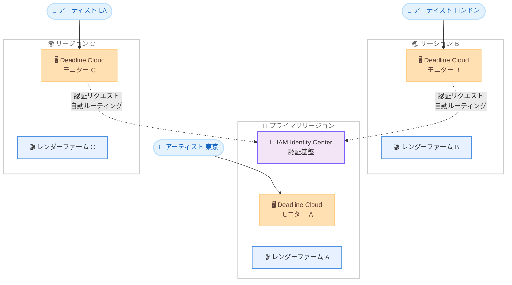

# AWS Deadline Cloud - 複数リージョンでのモニター作成サポート

**リリース日**: 2026 年 4 月 10 日
**サービス**: AWS Deadline Cloud
**機能**: 複数リージョンでのモニター作成 (IAM Identity Center 追加設定不要)

📊 [このアップデートのインフォグラフィックを見る](https://takech9203.github.io/aws-news-summary/20260410-deadline-cloud-monitor-creation.html)

## 概要

AWS Deadline Cloud が、追加の IAM Identity Center 設定なしに複数の AWS リージョンでモニターを作成できるようになりました。これにより、既存の IAM Identity Center の構成を変更することなく、複数リージョンにまたがるレンダーファームにモニターをデプロイできるようになります。

モニターは Deadline Cloud のウェブベースのユーザーインターフェースであり、アーティストやスタジオのスタッフがレンダリングジョブの送信、進捗の確認、リソースの管理を行うために使用します。従来はモニターの作成時に IAM Identity Center のインスタンスが同一リージョンに存在する必要がありましたが、今回のアップデートにより認証リクエストがプライマリリージョンに自動的にルーティングされるようになりました。

このアップデートは、世界中のアーティストやスタジオの近くにレンダリングリソースを配置したい企業や、複数リージョン間でワークロードを実行・比較したい VFX / アニメーション制作チームにとって大きなメリットがあります。

**アップデート前の課題**

- モニターを作成するには、そのリージョンに IAM Identity Center のインスタンスが必要であり、複数リージョンでモニターをデプロイする際に追加の IAM Identity Center 設定が求められていた
- IAM Identity Center は組織内で 1 つのリージョンにのみ設定できるため、他のリージョンでモニターを作成する際に構成上の制約があった
- レンダリングリソースをアーティストに近い複数リージョンに分散させたい場合でも、認証基盤の制約によりモニターの展開が困難だった

**アップデート後の改善**

- IAM Identity Center の追加設定なしに、複数の AWS リージョンでモニターを作成可能になった
- 認証リクエストがプライマリリージョンに自動ルーティングされるため、既存の IAM Identity Center 構成を変更する必要がなくなった
- 世界中のアーティストやスタジオの近くにレンダリングリソースとモニターを配置できるようになった

## アーキテクチャ図



各リージョンのモニターから IAM Identity Center が存在するプライマリリージョンへ認証リクエストが自動的にルーティングされる仕組みを示しています。アーティストは最寄りのリージョンのモニターにアクセスし、追加の認証設定なしにレンダーファームを利用できます。

## サービスアップデートの詳細

### 主要機能

1. **複数リージョンでのモニター作成**
   - IAM Identity Center の追加設定なしに、Deadline Cloud が利用可能な任意のリージョンでモニターを作成可能
   - `CreateMonitor` API に新しい `identityCenterRegion` パラメータが追加され、IAM Identity Center インスタンスが存在するリージョンを指定可能
   - 既存のモニターの `GetMonitor` および `ListMonitors` API レスポンスにも `identityCenterRegion` フィールドが追加

2. **認証リクエストの自動ルーティング**
   - 他リージョンのモニターからの認証リクエストが、IAM Identity Center が存在するプライマリリージョンに自動的にルーティングされる
   - ユーザーやアーティストは認証の仕組みを意識することなく、最寄りのリージョンのモニターにアクセス可能
   - 既存の IAM Identity Center の設定やユーザー・グループの構成を変更する必要がない

3. **グローバルなレンダリングリソース配置**
   - アーティストやスタジオの所在地に近いリージョンにレンダリングリソースとモニターを配置可能
   - 複数リージョン間でレンダリングワークロードを実行・比較することが可能
   - レイテンシーの低減によるアーティストの作業効率向上が期待できる

## 技術仕様

### API の変更点

| 項目 | 詳細 |
|------|------|
| 対象 API | `CreateMonitor`、`GetMonitor`、`ListMonitors` |
| 新規パラメータ | `identityCenterRegion` (リクエスト / レスポンス) |
| パラメータの型 | String |
| 用途 | IAM Identity Center インスタンスが存在するリージョンを指定 |

### API 変更履歴

| 日付 | サービス | 変更内容 |
|------|----------|----------|
| 2026/04/06 | [AWSDeadlineCloud](https://awsapichanges.com/archive/changes/0bb499-deadline.html) | 8 new 3 updated api methods - バッチ API の追加 (BatchGetJob、BatchGetStep、BatchGetTask、BatchGetSession、BatchGetSessionAction、BatchGetWorker、BatchUpdateJob、BatchUpdateTask) および CreateMonitor、GetMonitor、ListMonitors への `identityCenterRegion` パラメータの追加 |

### CreateMonitor API リクエスト例

```json
{
    "clientToken": "unique-token-string",
    "displayName": "London Studio Monitor",
    "identityCenterInstanceArn": "arn:aws:sso:::instance/ssoins-1234567890abcdef0",
    "identityCenterRegion": "us-east-1",
    "subdomain": "london-studio",
    "roleArn": "arn:aws:iam::123456789012:role/DeadlineCloudMonitorRole",
    "tags": {
        "Studio": "London",
        "Environment": "Production"
    }
}
```

`identityCenterRegion` パラメータに IAM Identity Center のプライマリリージョンを指定することで、異なるリージョンでもモニターを作成できます。

## 設定方法

### 前提条件

1. AWS アカウントで IAM Identity Center が有効化されていること
2. IAM Identity Center のプライマリリージョン (例: us-east-1) が把握できていること
3. Deadline Cloud のレンダーファームが作成済みであること
4. AWS CLI v2 がインストールされ、適切な権限が付与されていること

### 手順

#### ステップ 1: IAM Identity Center のリージョン確認

```bash
# IAM Identity Center のインスタンス情報を確認
aws sso-admin list-instances --region us-east-1
```

IAM Identity Center がどのリージョンに設定されているかを確認します。出力結果の `InstanceArn` とリージョンを控えておきます。

#### ステップ 2: 別リージョンでのモニター作成

```bash
# ロンドンに近い eu-west-2 リージョンでモニターを作成
aws deadline create-monitor \
  --region eu-west-2 \
  --display-name "London Studio Monitor" \
  --identity-center-instance-arn "arn:aws:sso:::instance/ssoins-1234567890abcdef0" \
  --identity-center-region "us-east-1" \
  --subdomain "london-studio" \
  --role-arn "arn:aws:iam::123456789012:role/DeadlineCloudMonitorRole"
```

`--identity-center-region` パラメータに IAM Identity Center が存在するプライマリリージョンを指定します。これにより、eu-west-2 リージョンにモニターが作成され、認証リクエストは自動的に us-east-1 の IAM Identity Center にルーティングされます。

#### ステップ 3: モニターの動作確認

```bash
# 作成したモニターの情報を確認
aws deadline get-monitor \
  --region eu-west-2 \
  --monitor-id "monitor-1234567890abcdef0"
```

レスポンスに `identityCenterRegion` フィールドが含まれ、正しいリージョンが設定されていることを確認します。出力される `url` フィールドにアクセスして、モニターの Web インターフェースが正常に表示されることを確認します。

#### ステップ 4: 追加リージョンでのモニター作成

```bash
# アジアパシフィックリージョンにもモニターを作成
aws deadline create-monitor \
  --region ap-northeast-1 \
  --display-name "Tokyo Studio Monitor" \
  --identity-center-instance-arn "arn:aws:sso:::instance/ssoins-1234567890abcdef0" \
  --identity-center-region "us-east-1" \
  --subdomain "tokyo-studio" \
  --role-arn "arn:aws:iam::123456789012:role/DeadlineCloudMonitorRole"
```

同様の手順で追加のリージョンにもモニターを作成できます。すべてのモニターが同一の IAM Identity Center インスタンスを使用するため、ユーザー管理は一元化されたままです。

## メリット

### ビジネス面

- **グローバル制作体制の実現**: 世界各地のスタジオやアーティストの近くにレンダリングリソースを配置でき、分散型の制作ワークフローを構築可能
- **管理コストの削減**: IAM Identity Center の追加設定が不要になるため、複数リージョンへの展開時の管理オーバーヘッドが大幅に低減
- **リージョン間のワークロード最適化**: 複数リージョンでレンダリングジョブを実行・比較することで、コストとパフォーマンスの最適なバランスを見つけることが可能

### 技術面

- **認証の一元管理**: IAM Identity Center のユーザーやグループの管理はプライマリリージョンで一元的に行いながら、モニターは任意のリージョンにデプロイ可能
- **シームレスな認証フロー**: 認証リクエストの自動ルーティングにより、アーティストは認証基盤のリージョンを意識することなくモニターにアクセス可能
- **API の後方互換性**: `identityCenterRegion` パラメータはオプショナルであり、既存のモニター構成に影響を与えない

## デメリット・制約事項

### 制限事項

- 認証リクエストがプライマリリージョンにルーティングされるため、プライマリリージョンの IAM Identity Center に障害が発生した場合、すべてのリージョンのモニターが影響を受ける可能性がある
- IAM Identity Center は AWS 組織あたり 1 つのインスタンスのみサポートされるため、完全に独立したマルチリージョン認証基盤は構築できない
- リージョン間の認証リクエストのルーティングにより、ログイン時にわずかなレイテンシーが追加される可能性がある

### 考慮すべき点

- プライマリリージョンの IAM Identity Center の可用性がすべてのリージョンのモニターに影響するため、プライマリリージョンの選択は慎重に行う必要がある
- 複数リージョンでモニターを運用する場合、各リージョンの IAM ロール (`roleArn`) やネットワーク設定が適切に構成されていることを確認する必要がある
- Deadline Cloud のサービスクォータはリージョンごとに適用されるため、各リージョンのモニター数やレンダーファームの制限を事前に確認する必要がある

## ユースケース

### ユースケース 1: 国際的な VFX スタジオのマルチリージョン展開

**シナリオ**: 米国、ヨーロッパ、アジアに拠点を持つ VFX スタジオが、各拠点のアーティストに最寄りのリージョンでレンダリングリソースとモニターを提供する。IAM Identity Center は us-east-1 に設定済み。

**実装例**:
```bash
# 米国拠点用モニター
aws deadline create-monitor \
  --region us-west-2 \
  --display-name "LA Studio Monitor" \
  --identity-center-instance-arn "arn:aws:sso:::instance/ssoins-abc123" \
  --identity-center-region "us-east-1" \
  --subdomain "la-studio" \
  --role-arn "arn:aws:iam::123456789012:role/DeadlineCloudMonitorRole"

# ヨーロッパ拠点用モニター
aws deadline create-monitor \
  --region eu-west-1 \
  --display-name "Dublin Studio Monitor" \
  --identity-center-instance-arn "arn:aws:sso:::instance/ssoins-abc123" \
  --identity-center-region "us-east-1" \
  --subdomain "dublin-studio" \
  --role-arn "arn:aws:iam::123456789012:role/DeadlineCloudMonitorRole"

# アジア拠点用モニター
aws deadline create-monitor \
  --region ap-northeast-1 \
  --display-name "Tokyo Studio Monitor" \
  --identity-center-instance-arn "arn:aws:sso:::instance/ssoins-abc123" \
  --identity-center-region "us-east-1" \
  --subdomain "tokyo-studio" \
  --role-arn "arn:aws:iam::123456789012:role/DeadlineCloudMonitorRole"
```

**効果**: 各拠点のアーティストが低レイテンシーでモニターにアクセスでき、レンダリングジョブの送信や進捗確認がスムーズになる。ユーザー管理は us-east-1 の IAM Identity Center で一元的に行える。

### ユースケース 2: リージョン間でのレンダリングコスト比較

**シナリオ**: アニメーション制作会社が、レンダリングコストの最適化のために複数リージョンでワークロードを実行し、コストとパフォーマンスを比較する。

**実装例**:
```bash
# 比較用にアジアパシフィックリージョンのモニターを作成
aws deadline create-monitor \
  --region ap-southeast-1 \
  --display-name "Singapore Cost Test Monitor" \
  --identity-center-instance-arn "arn:aws:sso:::instance/ssoins-abc123" \
  --identity-center-region "us-east-1" \
  --subdomain "sg-cost-test" \
  --role-arn "arn:aws:iam::123456789012:role/DeadlineCloudMonitorRole"

# 各リージョンのモニター一覧を確認
aws deadline list-monitors --region ap-southeast-1
```

**効果**: 同一のレンダリングジョブを複数リージョンで実行し、EC2 スポットインスタンスの価格やレンダリング時間を比較することで、最もコスト効率の良いリージョンを特定できる。

### ユースケース 3: ディザスタリカバリ用のセカンダリモニター

**シナリオ**: 映像制作の納期が厳しいプロジェクトで、プライマリリージョンに障害が発生した場合に備えてセカンダリリージョンにもモニターとレンダーファームを準備しておく。

**実装例**:
```bash
# セカンダリリージョンにモニターを事前作成
aws deadline create-monitor \
  --region us-west-2 \
  --display-name "DR Monitor - Oregon" \
  --identity-center-instance-arn "arn:aws:sso:::instance/ssoins-abc123" \
  --identity-center-region "us-east-1" \
  --subdomain "dr-oregon" \
  --role-arn "arn:aws:iam::123456789012:role/DeadlineCloudMonitorRole"
```

**効果**: プライマリリージョンのレンダーファームに障害が発生した場合、アーティストはセカンダリリージョンのモニターに切り替えてレンダリングジョブを継続でき、プロジェクトの納期への影響を最小化できる。

## 料金

AWS Deadline Cloud のモニター作成自体に追加料金はかかりません。料金はレンダリングに使用するワーカーのコンピューティングリソースに基づきます。

### 料金例

| 項目 | 料金 (概算) |
|--------|------------------|
| Deadline Cloud モニター | 追加料金なし |
| サービスマネージドフリートのワーカー | EC2 インスタンス料金 + Deadline Cloud 使用料 |
| カスタマーマネージドフリートのワーカー | EC2 インスタンス料金のみ |
| リージョン間のデータ転送 | リージョン間の標準データ転送料金が適用 |

料金の詳細は [AWS Deadline Cloud 料金ページ](https://aws.amazon.com/deadline-cloud/pricing/) を確認してください。

## 利用可能リージョン

AWS Deadline Cloud が利用可能なすべてのリージョンで、今回のマルチリージョンモニター作成機能が利用可能です。具体的な対応リージョンについては [AWS Deadline Cloud のリージョン別サービス一覧](https://aws.amazon.com/about-aws/global-infrastructure/regional-product-services/) を確認してください。

## 関連サービス・機能

- **AWS IAM Identity Center**: Deadline Cloud モニターのユーザー認証に使用される ID 管理サービス。今回のアップデートにより、異なるリージョンのモニターからプライマリリージョンへの認証ルーティングが自動化された
- **Amazon EC2**: Deadline Cloud のレンダリングワーカーが稼働するコンピューティング基盤。複数リージョンでのモニター展開に伴い、各リージョンの EC2 リソースを活用可能
- **AWS Deadline Cloud Farm**: レンダリングジョブを管理するファーム。各リージョンのモニターからファームのジョブを管理・監視できる
- **AWS Deadline Cloud Fleet**: レンダリングワーカーのグループ。サービスマネージドフリートまたはカスタマーマネージドフリートとして各リージョンに配置可能

## 参考リンク

- 📊 [インフォグラフィック](https://takech9203.github.io/aws-news-summary/20260410-deadline-cloud-monitor-creation.html)
- [公式発表 (What's New)](https://aws.amazon.com/about-aws/whats-new/2026/04/deadline-cloud-monitor-creation/)
- [AWS Deadline Cloud ドキュメント](https://docs.aws.amazon.com/deadline-cloud/latest/userguide/what-is-deadline-cloud.html)
- [AWS Deadline Cloud モニターの管理](https://docs.aws.amazon.com/deadline-cloud/latest/userguide/manage-monitor.html)
- [AWS Deadline Cloud 料金ページ](https://aws.amazon.com/deadline-cloud/pricing/)
- [AWS Deadline Cloud API リファレンス - CreateMonitor](https://docs.aws.amazon.com/deadline-cloud/latest/APIReference/API_CreateMonitor.html)

## まとめ

AWS Deadline Cloud のマルチリージョンモニター作成サポートにより、IAM Identity Center の追加設定なしに複数の AWS リージョンでモニターをデプロイできるようになりました。認証リクエストの自動ルーティングにより、世界中のアーティストやスタジオが最寄りのリージョンからレンダリングリソースに低レイテンシーでアクセスできます。VFX やアニメーション制作においてグローバルな分散型制作体制を構築している組織は、`identityCenterRegion` パラメータを活用して各拠点に対応するモニターを作成し、レンダリングワークフローの地理的な最適化を検討することを推奨します。
