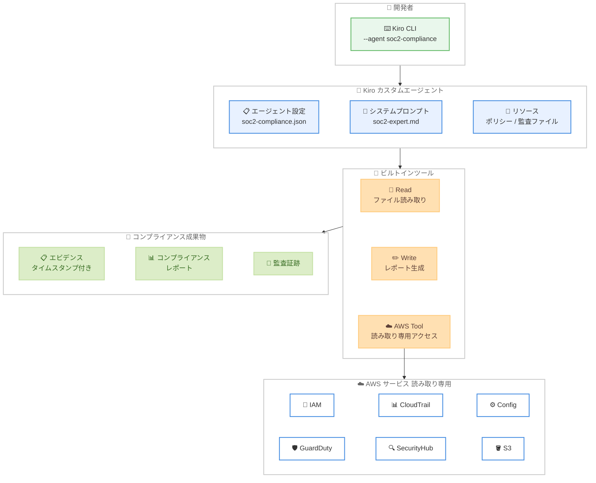

# Kiro CLI - カスタムエージェントによる SOC 2 コンプライアンス自動化

**リリース日**: 2026 年 4 月 10 日
**サービス**: Kiro
**機能**: Kiro CLI カスタムエージェントを活用した SOC 2 コンプライアンスの自動化

📊 [このアップデートのインフォグラフィックを見る](https://takech9203.github.io/aws-news-summary/20260410-kiro-automating-soc-2-compliance.html)

## 概要

Kiro Blog にて、戦略的ポートフォリオ管理のリーダー企業である Planview が、Kiro CLI のカスタムエージェント機能を活用して SOC 2 コンプライアンスプロセスを自動化し、監査サイクルあたり 40 時間以上の工数削減を実現した事例が公開されました。

Planview はグローバルで 3,000 社以上の顧客を持つ企業であり、マルチサービスの AWS インフラストラクチャ全体で SOC 2 コンプライアンスを維持するために多大なエンジニアリング工数を費やしていました。Kiro CLI のカスタムエージェントを導入することで、手動でのエビデンス収集を自動化し、エンジニアリングリソースをプロダクト開発に再配分することに成功しています。

この事例は、Kiro CLI のカスタムエージェント機能がコンプライアンス管理においてどのような価値を提供できるかを示す実践的なケーススタディです。

**アップデート前の課題**

- 20 以上のクラウドサービスからエビデンスを手動で収集する必要があり、コンソールや API からデータを取得していた
- セキュリティコントロール、タイムスタンプ、監査証跡をスプレッドシートで追跡管理していた
- 監査準備サイクルに 40 時間以上を費やし、エンジニアがプロダクト開発から離れていた
- クラウドプロバイダーと SOC 2 要件の両方に精通した複数チームメンバー間の調整が必要だった

**アップデート後の改善**

- Kiro CLI カスタムエージェントにより、コンプライアンスエビデンスの収集がタイムスタンプ付きで自動化された
- 監査サイクルあたり 40 時間以上の工数を削減し、全体で 60% の効率化を達成した
- 監査リクエストへの対応速度が 3-4 倍に向上した
- チームメンバーあたり 1-1.5 スプリント分の開発工数を機能開発に再配分できるようになった

## アーキテクチャ図



Kiro CLI カスタムエージェントが開発者のターミナルから AWS サービスへ読み取り専用でアクセスし、コンプライアンスエビデンスを自動収集してレポートを生成するワークフローを示しています。

## サービスアップデートの詳細

### 主要機能

1. **Kiro CLI カスタムエージェント**
   - 目的別に特化した AI アシスタントを JSON 設定ファイルで定義可能
   - ツールの権限、アクセス可能なサービス、書き込み可能なパスを細かく制御できる
   - `~/.kiro/agents/soc2-compliance.json` にエージェント設定を保存し、`kiro-cli --agent soc2-compliance` で起動
   - `--tui` フラグで新しい UX を利用可能、`--classic` フラグで従来のターミナル体験も選択可能

2. **AWS Tool による読み取り専用アクセス**
   - `aws.allowedServices` で IAM、CloudTrail、Config、GuardDuty、SecurityHub、Inspector、KMS、S3 などのセキュリティ関連サービスへのアクセスを制限
   - `aws.autoAllowReadonly` により `describe-*`、`list-*`、`get-*` などの読み取り専用操作は承認不要で自動実行
   - 書き込み操作は個別に確認が必要なため、インフラストラクチャの安全性を確保

3. **`/help` エージェントによる設定生成**
   - `/help Help me create a custom agent for soc-2 compliance` のように自然言語でエージェント設定を自動生成
   - Kiro の内部ドキュメントを参照して正しいスキーマとベストプラクティスに基づいた設定を提案
   - 手動で JSON を記述する必要がなく、生成後に必要に応じてカスタマイズ可能

4. **リソースの自動読み込み**
   - エージェント起動時にポリシーファイル、コンプライアンスドキュメント、監査 JSON ファイル、セキュリティコントロール YAML ファイルを自動的にコンテキストに読み込み
   - SOC 2 の要件に即した回答と証跡収集が可能

## 技術仕様

### カスタムエージェント設定構造

| 項目 | 説明 |
|------|------|
| `name` | エージェントの識別名 |
| `description` | エージェントの目的を記述 |
| `prompt` | システムプロンプトファイルへのパス |
| `tools` | 使用可能なツール (read, write, aws) |
| `allowedTools` | ユーザー承認なしで実行可能なツール |
| `toolsSettings.write.allowedPaths` | 書き込み可能なディレクトリのリスト |
| `toolsSettings.aws.allowedServices` | アクセス可能な AWS サービスのリスト |
| `toolsSettings.aws.autoAllowReadonly` | 読み取り専用操作の自動承認設定 |
| `resources` | 起動時に読み込むファイルパターン |

### エージェント設定例

```json
{
  "name": "soc2-compliance",
  "description": "SOC 2 compliance assistant for security controls, audit preparation, and policy enforcement",
  "prompt": "./prompts/soc2-expert.md",
  "tools": ["read", "write", "aws"],
  "allowedTools": ["read"],
  "toolsSettings": {
    "write": {
      "allowedPaths": [
        "./compliance-docs/**",
        "./policies/**",
        "./audit/**",
        "./security/**"
      ]
    },
    "aws": {
      "allowedServices": [
        "iam", "cloudtrail", "config", "guardduty",
        "securityhub", "inspector", "kms", "s3"
      ],
      "autoAllowReadonly": true
    }
  },
  "resources": [
    "./policies/*.md",
    "./compliance-docs/**/*.md",
    "./audit/**/*.json",
    "./security/**/*.yaml"
  ]
}
```

## 設定方法

### 前提条件

1. Kiro CLI がインストールされていること
2. AWS CLI が設定済みで、対象の AWS サービスへの読み取りアクセス権限があること
3. SOC 2 コンプライアンスに関連するポリシーファイルやドキュメントが準備されていること

### 手順

#### ステップ 1: カスタムエージェント設定ファイルの作成

```bash
mkdir -p ~/.kiro/agents
```

`~/.kiro/agents/` ディレクトリを作成します。このディレクトリにカスタムエージェントの JSON 設定ファイルを配置します。

#### ステップ 2: `/help` エージェントによる設定生成 (オプション)

```bash
kiro-cli
```

Kiro CLI を起動した後、以下のコマンドを実行して設定を自動生成できます。

```
/help Help me create a custom agent for soc-2 compliance
```

`/help` エージェントが Kiro の内部ドキュメントを参照し、SOC 2 コンプライアンス用のエージェント設定を推奨してくれます。生成された設定を `~/.kiro/agents/soc2-compliance.json` として保存します。

#### ステップ 3: システムプロンプトの準備

```bash
mkdir -p ./prompts
```

`soc2-expert.md` ファイルを作成し、エージェントのシステムプロンプトとして SOC 2 の要件やコンプライアンスチェックの指針を記述します。

#### ステップ 4: カスタムエージェントの起動

```bash
kiro-cli --tui --agent soc2-compliance
```

`--tui` フラグを付けることで新しい TUI を使用してエージェントを起動します。エージェントは設定ファイルで指定されたリソースを自動読み込みし、AWS サービスへの読み取り専用アクセスが有効になります。

#### ステップ 5: コンプライアンスエビデンスの収集

エージェントに対して、以下のようなプロンプトを入力してエビデンスを収集します。

```
Generate a SOC 2 CC6.1 compliance report showing all S3 buckets with their
encryption status, public access settings, and access logging configuration.
```

エージェントが AWS サービスに対して読み取り専用のクエリを実行し、タイムスタンプ付きのコンプライアンスレポートを生成します。

## メリット

### ビジネス面

- **監査工数の大幅削減**: 監査サイクルあたり 40 時間以上の手動作業を自動化し、エンジニアリングリソースをプロダクト開発に再配分可能
- **監査対応速度の向上**: 監査リクエストへの対応が 3-4 倍高速化し、コンプライアンスチームとのやり取りが効率化
- **オンデマンドのエビデンス収集**: 年次の監査準備期間に集中するのではなく、年間を通じていつでもエビデンスを収集可能
- **開発生産性の回復**: チームメンバーあたり 1-1.5 スプリント分の開発工数を機能開発やエンハンスメントに充当可能

### 技術面

- **読み取り専用アクセスによる安全性**: `autoAllowReadonly` により読み取り操作のみ自動承認され、インフラストラクチャへの変更リスクがない
- **細粒度のアクセス制御**: `allowedServices` と `allowedPaths` により、エージェントがアクセスできるサービスとファイルパスを厳密に制限可能
- **既存ワークフローとの統合**: 開発環境を変更することなく、既存の開発プロセスに組み込める
- **対話型インターフェース**: 会話形式でフィードバックを受けながらエビデンス収集と分析を進められる

## デメリット・制約事項

### 制限事項

- AI が生成したコンプライアンス出力は、エージェントに提供されるプロンプトの具体性と範囲に大きく依存する
- AI 生成の推奨事項、ポリシーテキスト、監査エビデンスは、資格を持つコンプライアンス専門家によるレビューと検証が必要
- 決定論的なコンプライアンスツールの代替としてではなく、監査プロセスを加速するためのツールとして位置づけられる

### 考慮すべき点

- プロンプトの品質がエビデンス収集の精度に直接影響するため、SOC 2 コントロール要件に基づいた適切なプロンプト設計が重要
- 本番環境や監査人への提出前に、生成されたすべての成果物の正確性を確認する必要がある
- Planview は長期的には商用の継続的コンプライアンスプラットフォームの導入も計画しており、Kiro CLI は中間ソリューションとしても活用できる

## ユースケース

### ユースケース 1: SOC 2 CC6.1 暗号化ステータスの監査

**シナリオ**: セキュリティチームが SOC 2 の CC6.1 コントロール (論理的および物理的アクセス制御) に対応するため、すべての S3 バケットの暗号化設定を確認する必要がある。

**実装例**:
```
# Kiro CLI エージェント起動後のプロンプト例
Generate a SOC 2 CC6.1 compliance report showing all S3 buckets with their
encryption status, public access settings, and access logging configuration.
```

**効果**: エージェントが全リージョンの S3 バケット設定を自動クエリし、暗号化ステータス、パブリックアクセス設定、アクセスログ設定をタイムスタンプ付きレポートとして出力する。

### ユースケース 2: IAM ポリシーと権限の棚卸し

**シナリオ**: 監査人から IAM ポリシーの一覧と最小権限の原則への準拠状況を求められた場合に、IAM のポリシー、ロール、ユーザー情報を体系的に収集する。

**実装例**:
```
# Kiro CLI エージェント起動後のプロンプト例
Review all IAM policies and roles, identify any overly permissive policies,
and generate a compliance report aligned with SOC 2 CC6.3 requirements.
```

**効果**: IAM の設定を包括的に分析し、過剰な権限を持つポリシーの特定と改善提案を含むレポートを生成する。

### ユースケース 3: CloudTrail による監査証跡の検証

**シナリオ**: SOC 2 の CC7.2 コントロール (システム監視) に対応するため、CloudTrail の設定が適切に有効化されているかを確認し、監査証跡の完全性を検証する。

**実装例**:
```
# Kiro CLI エージェント起動後のプロンプト例
Verify CloudTrail is enabled across all regions, check log file validation
settings, and confirm S3 bucket logging for audit trail completeness per
SOC 2 CC7.2 requirements.
```

**効果**: CloudTrail の設定を全リージョンで検証し、ログファイル検証やストレージ設定の状況を確認することで、監査証跡の完全性を保証するレポートを生成する。

## 料金

Kiro CLI は現在、無料で利用可能です。最新の料金情報については [Kiro Pricing ページ](https://kiro.dev/pricing/)を参照してください。なお、Kiro CLI を通じてアクセスする AWS サービス (CloudTrail、Config、GuardDuty など) の利用料金は別途発生します。

## 利用可能リージョン

グローバル -- Kiro CLI はグローバルに利用可能です。AWS サービスへのアクセスは、各サービスが利用可能なリージョンに依存します。

## 関連サービス・機能

- **Kiro IDE**: AWS が提供する AI 搭載の統合開発環境。Kiro CLI はその CLI 版として、ターミナルから同等の AI 機能を利用可能
- **Kiro カスタムエージェント**: 目的別に特化した AI アシスタントを定義し、ツール権限やリソースを細かく制御する機能
- **AWS CloudTrail**: API コールの記録と監査証跡の管理に利用。SOC 2 の監視コントロールに対応
- **AWS Security Hub**: セキュリティのベストプラクティスチェックとコンプライアンスステータスの集約管理
- **AWS Config**: リソース設定の変更追跡と評価。コンプライアンスルールの定義と監視に利用
- **Amazon GuardDuty**: 脅威検出サービス。不審なアクティビティの検出結果をコンプライアンスエビデンスとして活用

## 参考リンク

- 📊 [インフォグラフィック](https://takech9203.github.io/aws-news-summary/20260410-kiro-automating-soc-2-compliance.html)
- [Planview saves 40+ hours per audit cycle by automating SOC 2 compliance with Kiro CLI](https://kiro.dev/blog/automating-soc-2-compliance/) -- Kiro Blog
- [Kiro CLI ドキュメント](https://kiro.dev/docs/cli/)
- [Kiro カスタムエージェント ドキュメント](https://kiro.dev/docs/cli/custom-agents/)
- [Kiro Pricing](https://kiro.dev/pricing/)

## まとめ

Planview の事例は、Kiro CLI のカスタムエージェント機能がコンプライアンス管理において実用的な価値を提供できることを示しています。手動で 40 時間以上かかっていた SOC 2 監査のエビデンス収集を自動化し、60% の効率化と 3-4 倍の対応速度向上を実現しました。コンプライアンス管理に工数を費やしているチームは、Kiro CLI のカスタムエージェントを活用して、セキュリティ基準を維持しながらエンジニアリングリソースを顧客価値の創出に再配分することを検討してみてください。
