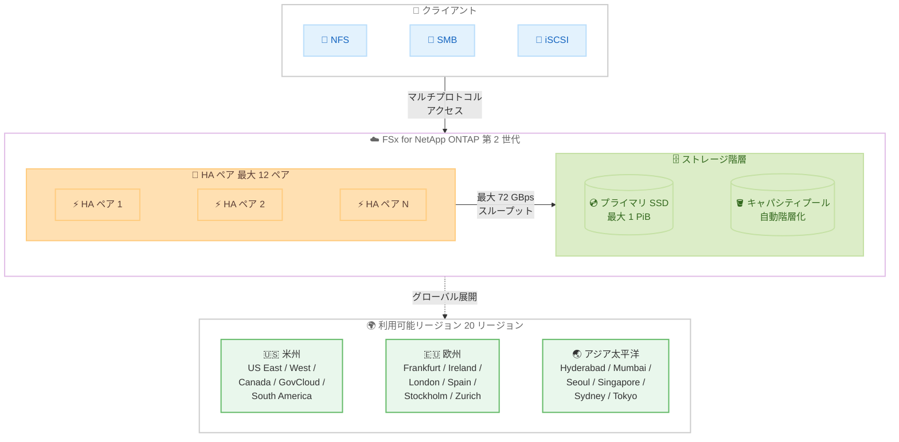

# Amazon FSx for NetApp ONTAP - 第 2 世代ファイルシステムが 4 つの追加リージョンで利用可能に

**リリース日**: 2026 年 4 月 10 日
**サービス**: Amazon FSx for NetApp ONTAP
**機能**: 第 2 世代ファイルシステムのリージョン拡張

📊 [このアップデートのインフォグラフィックを見る](https://takech9203.github.io/aws-news-summary/20260410-second-gen-amazon-fsx-ontap-regions.html)

## 概要

Amazon FSx for NetApp ONTAP の第 2 世代ファイルシステムが、新たに 4 つの AWS リージョン (欧州 (ロンドン)、アジアパシフィック (ハイデラバード)、南米 (サンパウロ)、AWS GovCloud (米国西部)) で利用可能になりました。これにより、第 2 世代ファイルシステムは合計 19 の商用リージョンと 1 つの GovCloud リージョンで提供されます。

第 2 世代 FSx for ONTAP ファイルシステムは、第 1 世代と比較して大幅なパフォーマンスのスケーラビリティと柔軟性を提供します。最大 12 の高可用性 (HA) ペアでファイルシステムを作成または拡張でき、最大 72 GBps のスループットと 1 PiB のプロビジョンド SSD ストレージをワークロードに提供できます。

今回のリージョン拡張により、欧州、南米、アジアパシフィックの主要な拠点で第 2 世代ファイルシステムを活用できるようになり、グローバルに展開する企業のデータレジデンシー要件や低レイテンシーアクセスのニーズに対応しやすくなりました。

**アップデート前の課題**

- 第 2 世代ファイルシステムが利用できるリージョンが限定されており、欧州 (ロンドン)、アジアパシフィック (ハイデラバード)、南米 (サンパウロ)、AWS GovCloud (米国西部) のユーザーは第 1 世代ファイルシステムのみ利用可能だった
- 対象リージョンのユーザーは第 1 世代の制限 (HA ペア数、スループット、ストレージ容量の上限) の範囲内でしか運用できなかった
- データレジデンシー要件により特定リージョンでの利用が必須なワークロードでは、第 2 世代の高性能な機能を活用できなかった

**アップデート後の改善**

- 4 つの追加リージョンで第 2 世代ファイルシステムが利用可能になり、合計 20 リージョンに拡大
- 新規対象リージョンのユーザーも最大 12 HA ペア、72 GBps スループット、1 PiB SSD ストレージの高スケーラビリティを活用可能に
- GovCloud (米国西部) での利用開始により、米国政府機関や規制対象のワークロードでも第 2 世代の性能を活用できるようになった

## アーキテクチャ図



第 2 世代 FSx for NetApp ONTAP ファイルシステムのアーキテクチャを示しています。クライアントは NFS、SMB、iSCSI のマルチプロトコルでアクセスし、最大 12 の HA ペアによる高スループットと SSD / キャパシティプールの 2 階層ストレージ構成でワークロードを処理します。

## サービスアップデートの詳細

### 主要機能

1. **4 リージョンの追加**
   - 欧州 (ロンドン) - eu-west-2
   - アジアパシフィック (ハイデラバード) - ap-south-2
   - 南米 (サンパウロ) - sa-east-1
   - AWS GovCloud (米国西部) - us-gov-west-1

2. **第 2 世代ファイルシステムの高スケーラビリティ**
   - 最大 12 の HA ペアでファイルシステムを作成または拡張可能
   - 最大 72 GBps のスループットキャパシティ
   - 最大 1 PiB のプロビジョンド SSD ストレージ
   - 第 1 世代と比較して大幅なパフォーマンスのスケーラビリティと柔軟性を実現

3. **NetApp ONTAP の完全な機能セット**
   - NFS、SMB、iSCSI のマルチプロトコルアクセス
   - SnapMirror によるデータレプリケーション
   - FlexClone によるスペース効率の高いデータクローニング
   - 自動ストレージ階層化 (SSD とキャパシティプールストレージ間)

## 技術仕様

### 第 2 世代ファイルシステムの性能比較

| 項目 | 第 1 世代 | 第 2 世代 |
|------|-----------|-----------|
| 最大 HA ペア数 | 1 | 12 |
| 最大スループット | 4 GBps | 72 GBps |
| 最大 SSD ストレージ | 192 TiB | 1 PiB |

### プロトコルサポート

| プロトコル | 用途 |
|------------|------|
| NFS (v3, v4.0, v4.1) | Linux / macOS ワークロード |
| SMB (2.0, 2.1, 3.0, 3.1.1) | Windows ワークロード |
| iSCSI | ブロックストレージアクセス |

### API 変更履歴

直近 7 日間で FSx に関連する API 変更は確認されませんでした。

## 設定方法

### 前提条件

1. AWS アカウントで対象リージョンが有効化されていること
2. 適切な IAM ポリシーで FSx 関連のアクションが許可されていること
3. ファイルシステムを配置する VPC とサブネットが準備されていること

### 手順

#### ステップ 1: 第 2 世代ファイルシステムの作成

```bash
aws fsx create-file-system \
    --file-system-type ONTAP \
    --storage-capacity 1024 \
    --storage-type SSD \
    --subnet-ids subnet-0123456789abcdef0 subnet-0123456789abcdef1 \
    --ontap-configuration '{
        "DeploymentType": "MULTI_AZ_2",
        "HAPairs": 2,
        "ThroughputCapacityPerHAPair": 6144,
        "PreferredSubnetId": "subnet-0123456789abcdef0"
    }' \
    --region eu-west-2
```

`create-file-system` コマンドで第 2 世代ファイルシステムを作成します。`MULTI_AZ_2` デプロイメントタイプを指定し、`HAPairs` で HA ペア数、`ThroughputCapacityPerHAPair` で HA ペアあたりのスループットキャパシティを設定します。

#### ステップ 2: ストレージ仮想マシンの作成

```bash
aws fsx create-storage-virtual-machine \
    --file-system-id fs-0123456789abcdef0 \
    --name "svm-production" \
    --root-volume-security-style UNIX
```

ファイルシステム上にストレージ仮想マシン (SVM) を作成します。SVM はマルチテナントのデータアクセスを管理する論理的なファイルサーバーとして機能します。

#### ステップ 3: ボリュームの作成

```bash
aws fsx create-volume \
    --volume-type ONTAP \
    --name "vol-data" \
    --ontap-configuration '{
        "JunctionPath": "/data",
        "StorageVirtualMachineId": "svm-0123456789abcdef0",
        "SizeInMegabytes": 102400,
        "StorageEfficiencyEnabled": true,
        "TieringPolicy": {
            "Name": "AUTO",
            "CoolingPeriod": 31
        }
    }'
```

SVM 上にボリュームを作成します。`TieringPolicy` で自動階層化を有効にすることで、アクセス頻度の低いデータを SSD からキャパシティプールストレージへ自動的に移動し、コストを最適化できます。

## メリット

### ビジネス面

- **グローバル展開の加速**: 4 つの追加リージョンにより、欧州、南米、アジアパシフィック、GovCloud での高性能ファイルストレージを迅速に展開できる
- **データレジデンシー要件への対応**: 各リージョンでデータを保持したまま第 2 世代の高性能機能を活用でき、規制要件を満たしやすくなる
- **コスト効率の向上**: 自動ストレージ階層化により、アクセスパターンに応じてデータを SSD とキャパシティプール間で自動移動し、ストレージコストを最適化できる

### 技術面

- **大幅なスケーラビリティ**: 最大 12 HA ペア、72 GBps スループット、1 PiB SSD ストレージにより、大規模ワークロードの要件に対応
- **柔軟な拡張性**: 既存のファイルシステムに HA ペアを追加して段階的にスケールアップ可能
- **マルチプロトコル対応**: NFS、SMB、iSCSI を同一ファイルシステムから提供でき、異種環境での統合が容易

## デメリット・制約事項

### 制限事項

- 第 2 世代ファイルシステムは全リージョンで利用可能なわけではなく、提供リージョンの確認が必要
- HA ペア数の増加に伴い、コストも比例して増加する点に留意が必要
- 第 1 世代から第 2 世代への直接的なインプレースアップグレードはサポートされておらず、データ移行が必要

### 考慮すべき点

- 複数 HA ペア構成では、ネットワーク設計やサブネット計画がより複雑になる可能性がある
- GovCloud リージョンでの利用には、GovCloud アカウントの取得と適切なコンプライアンス認証が前提となる
- スループットキャパシティは HA ペア単位でプロビジョニングされるため、ワークロードの要件に基づいた適切なサイジングが重要

## ユースケース

### ユースケース 1: グローバル企業のファイル共有基盤

**シナリオ**: 欧州やアジアパシフィックに拠点を持つグローバル企業が、各リージョンで高性能なファイル共有基盤を構築する必要がある場合。

**実装例**:
```bash
# ロンドンリージョンで第 2 世代ファイルシステムを作成
aws fsx create-file-system \
    --file-system-type ONTAP \
    --storage-capacity 2048 \
    --storage-type SSD \
    --subnet-ids subnet-london-1a subnet-london-1b \
    --ontap-configuration '{
        "DeploymentType": "MULTI_AZ_2",
        "HAPairs": 4,
        "ThroughputCapacityPerHAPair": 6144,
        "PreferredSubnetId": "subnet-london-1a"
    }' \
    --region eu-west-2
```

**効果**: 各拠点のデータレジデンシー要件を満たしながら、最大 24 GBps のスループットで高速なファイルアクセスを提供できる。

### ユースケース 2: GovCloud での高性能ストレージ

**シナリオ**: 米国政府機関の規制対象ワークロードで、大容量かつ高スループットの共有ファイルストレージが必要な場合。

**実装例**:
```bash
# GovCloud (米国西部) で第 2 世代ファイルシステムを作成
aws fsx create-file-system \
    --file-system-type ONTAP \
    --storage-capacity 10240 \
    --storage-type SSD \
    --subnet-ids subnet-gov-1a subnet-gov-1b \
    --ontap-configuration '{
        "DeploymentType": "MULTI_AZ_2",
        "HAPairs": 8,
        "ThroughputCapacityPerHAPair": 6144,
        "PreferredSubnetId": "subnet-gov-1a"
    }' \
    --region us-gov-west-1
```

**効果**: GovCloud の FedRAMP High や DoD IL5 などのコンプライアンス要件を満たしながら、最大 48 GBps のスループットで大規模な政府系ワークロードを処理できる。

### ユースケース 3: 大規模データ分析基盤

**シナリオ**: 南米のデータセンターでペタバイト規模のデータ分析基盤を構築し、複数の分析ツールからマルチプロトコルでアクセスする場合。

**実装例**:
```bash
# サンパウロリージョンで最大構成のファイルシステムを作成
aws fsx create-file-system \
    --file-system-type ONTAP \
    --storage-capacity 51200 \
    --storage-type SSD \
    --subnet-ids subnet-saopaulo-1a subnet-saopaulo-1b \
    --ontap-configuration '{
        "DeploymentType": "MULTI_AZ_2",
        "HAPairs": 12,
        "ThroughputCapacityPerHAPair": 6144,
        "PreferredSubnetId": "subnet-saopaulo-1a"
    }' \
    --region sa-east-1
```

**効果**: 最大 12 HA ペアによる 72 GBps のスループットで、NFS 経由の Linux 分析ツールと SMB 経由の Windows BI ツールの両方から同一データセットへの高速アクセスを実現できる。

## 料金

Amazon FSx for NetApp ONTAP の料金は、SSD ストレージ容量、スループットキャパシティ、キャパシティプールストレージ、バックアップストレージの各要素に基づいて課金されます。第 2 世代ファイルシステムでは、HA ペア数に応じてスループットキャパシティの料金が変動します。

### 料金例

| 項目 | 料金体系 |
|------|----------|
| SSD ストレージ | プロビジョニングした容量に基づく月額課金 |
| スループットキャパシティ | HA ペアあたりのスループット設定値に基づく月額課金 |
| キャパシティプールストレージ | 使用量に基づく月額課金 |
| バックアップストレージ | バックアップデータ量に基づく月額課金 |

料金はリージョンによって異なります。詳細は [Amazon FSx for NetApp ONTAP の料金ページ](https://aws.amazon.com/fsx/netapp-ontap/pricing/)を参照してください。

## 利用可能リージョン

第 2 世代 FSx for NetApp ONTAP ファイルシステムは、以下の 20 リージョンで利用可能です。

| リージョン | リージョンコード | 備考 |
|------------|------------------|------|
| 米国東部 (バージニア北部) | us-east-1 | |
| 米国東部 (オハイオ) | us-east-2 | |
| 米国西部 (北カリフォルニア) | us-west-1 | |
| 米国西部 (オレゴン) | us-west-2 | |
| カナダ (中部) | ca-central-1 | |
| 欧州 (フランクフルト) | eu-central-1 | |
| 欧州 (アイルランド) | eu-west-1 | |
| 欧州 (ロンドン) | eu-west-2 | **新規追加** |
| 欧州 (スペイン) | eu-south-2 | |
| 欧州 (ストックホルム) | eu-north-1 | |
| 欧州 (チューリッヒ) | eu-central-2 | |
| 南米 (サンパウロ) | sa-east-1 | **新規追加** |
| アジアパシフィック (ハイデラバード) | ap-south-2 | **新規追加** |
| アジアパシフィック (ムンバイ) | ap-south-1 | |
| アジアパシフィック (ソウル) | ap-northeast-2 | |
| アジアパシフィック (シンガポール) | ap-southeast-1 | |
| アジアパシフィック (シドニー) | ap-southeast-2 | |
| アジアパシフィック (東京) | ap-northeast-1 | |
| AWS GovCloud (米国西部) | us-gov-west-1 | **新規追加** |

## 関連サービス・機能

- **Amazon FSx for NetApp ONTAP**: NetApp ONTAP の完全マネージドファイルストレージサービス。第 2 世代ファイルシステムにより大幅な性能向上を実現
- **AWS Transfer Family**: FSx for ONTAP と統合して SFTP、FTPS、FTP プロトコルでのファイル転送を提供
- **AWS Backup**: FSx for ONTAP ファイルシステムの自動バックアップとポイントインタイムリカバリを提供
- **Amazon EC2**: FSx for ONTAP ファイルシステムへの NFS、SMB、iSCSI アクセスのコンピューティング基盤
- **Amazon ECS / EKS**: コンテナワークロードから FSx for ONTAP への永続ストレージとして利用可能

## 参考リンク

- 📊 [インフォグラフィック](https://takech9203.github.io/aws-news-summary/20260410-second-gen-amazon-fsx-ontap-regions.html)
- [公式発表 (What's New)](https://aws.amazon.com/about-aws/whats-new/2026/04/second-gen-amazon-fsx-ontap-regions/)
- [Amazon FSx for NetApp ONTAP ドキュメント](https://docs.aws.amazon.com/fsx/latest/ONTAPGuide/what-is-fsx-ontap.html)
- [料金ページ](https://aws.amazon.com/fsx/netapp-ontap/pricing/)

## まとめ

Amazon FSx for NetApp ONTAP の第 2 世代ファイルシステムが 4 つの追加リージョンで利用可能になったことで、グローバルなカバレッジが合計 20 リージョンに拡大しました。最大 12 HA ペア、72 GBps スループット、1 PiB SSD ストレージという高いスケーラビリティを、より多くの地域で活用できるようになっています。特に AWS GovCloud (米国西部) での提供開始は、米国政府機関や規制対象ワークロードにとって重要な進展です。対象リージョンで第 1 世代ファイルシステムを利用している場合は、第 2 世代への移行を検討することで、パフォーマンスとスケーラビリティの大幅な向上が期待できます。
