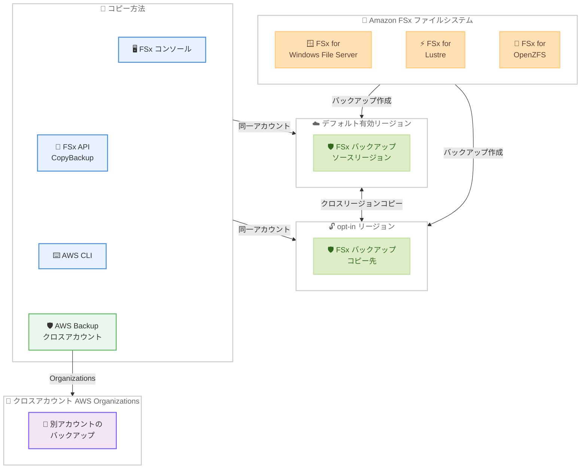

# Amazon FSx - opt-in リージョン間でのファイルシステムバックアップコピーをサポート

**リリース日**: 2026 年 4 月 13 日
**サービス**: Amazon FSx for Windows File Server、Amazon FSx for Lustre、Amazon FSx for OpenZFS
**機能**: opt-in リージョン間でのファイルシステムバックアップコピー

📊 [このアップデートのインフォグラフィックを見る](https://takech9203.github.io/aws-news-summary/20260413-amazon-fsx-copying-backups-opt-in-regions.html)

## 概要

Amazon FSx が、opt-in リージョン (デフォルトで無効な AWS リージョン) を含むリージョン間でのファイルシステムバックアップコピーをサポートしました。対象となるファイルシステムは Amazon FSx for Windows File Server、Amazon FSx for Lustre、Amazon FSx for OpenZFS の 3 種類です。

従来、Amazon FSx のファイルシステムバックアップのクロスリージョンコピーは、デフォルトで有効なリージョン間でのみ利用可能でした。同一 AWS アカウント内でのコピー、または AWS Organizations 内のアカウント間コピーが可能でしたが、opt-in リージョンへのコピーや opt-in リージョンからのコピーはサポートされていませんでした。

今回のアップデートにより、Amazon FSx コンソール、API、または CLI を使用して同一 AWS アカウント内で opt-in リージョンとの間でバックアップをコピーできるようになりました。また、AWS Backup を使用すれば、AWS Organizations 内のアカウント間でのコピーも可能です。これにより、事業継続性、ディザスタリカバリ、コンプライアンス要件に対応する、より広範なリージョンをカバーしたバックアップ・リカバリアーキテクチャを構築できるようになります。

**アップデート前の課題**

- Amazon FSx のバックアップコピーはデフォルトで有効な AWS リージョン間でのみ利用可能だった
- opt-in リージョンで稼働する FSx ファイルシステムのバックアップを他のリージョンにコピーできなかった
- opt-in リージョンへのバックアップコピーによるディザスタリカバリ構成が不可能だった
- opt-in リージョンでのデータ保護要件を満たすために、手動でのデータ移行やサードパーティツールが必要だった

**アップデート後の改善**

- opt-in リージョンへのバックアップコピーおよび opt-in リージョンからのバックアップコピーが可能になった
- Amazon FSx コンソール、API、CLI を使用した同一アカウント内のクロスリージョンバックアップコピーをサポート
- AWS Backup を使用した AWS Organizations 内のクロスアカウントバックアップコピーをサポート
- より広範なリージョンセットでマルチアカウント・クロスリージョンのバックアップ・リカバリアーキテクチャを設計可能になった

## アーキテクチャ図



Amazon FSx のバックアップコピーフローを示しています。デフォルト有効リージョンと opt-in リージョン間で双方向のバックアップコピーが可能になり、FSx コンソール、API、CLI での同一アカウント内コピーと AWS Backup でのクロスアカウントコピーをサポートします。

## サービスアップデートの詳細

### 主要機能

1. **opt-in リージョン間のバックアップコピー**
   - デフォルトで無効な AWS リージョン (opt-in リージョン) への、および opt-in リージョンからのバックアップコピーが可能
   - 双方向のコピーをサポート (opt-in リージョンへのコピーおよび opt-in リージョンからのコピー)
   - FSx for Windows File Server、FSx for Lustre、FSx for OpenZFS の 3 種類すべてに対応

2. **複数のコピー方法をサポート**
   - **Amazon FSx コンソール**: GUI ベースでのバックアップコピー操作
   - **Amazon FSx API**: CopyBackup API を使用したプログラムからのバックアップコピー
   - **AWS CLI**: コマンドラインからのバックアップコピー操作
   - **AWS Backup**: AWS Organizations 内のクロスアカウントバックアップコピー

3. **クロスアカウントコピー**
   - AWS Backup を使用して AWS Organizations 内の別アカウントへのバックアップコピーが可能
   - マルチアカウント環境でのバックアップ集約やディザスタリカバリに対応

### 技術仕様

#### 対象ファイルシステム

| ファイルシステム | 主な用途 | コピー方法 |
|------|------|------|
| Amazon FSx for Windows File Server | Windows ベースのファイル共有、SMB プロトコル | コンソール、API、CLI、AWS Backup |
| Amazon FSx for Lustre | HPC、機械学習ワークロード | コンソール、API、CLI、AWS Backup |
| Amazon FSx for OpenZFS | Linux/macOS ワークロード、NFS プロトコル | コンソール、API、CLI、AWS Backup |

#### コピー方式の比較

| 方式 | 同一アカウント | クロスアカウント | opt-in リージョン |
|------|------|------|------|
| FSx コンソール | 対応 | 非対応 | 対応 |
| FSx API / CLI | 対応 | 非対応 | 対応 |
| AWS Backup | 対応 | 対応 (Organizations) | 対応 |

#### opt-in リージョンの例

| リージョン名 | リージョンコード |
|------|------|
| アフリカ (ケープタウン) | af-south-1 |
| アジアパシフィック (香港) | ap-east-1 |
| アジアパシフィック (ハイデラバード) | ap-south-2 |
| アジアパシフィック (ジャカルタ) | ap-southeast-3 |
| アジアパシフィック (メルボルン) | ap-southeast-4 |
| アジアパシフィック (マレーシア) | ap-southeast-5 |
| アジアパシフィック (台北) | ap-east-2 |
| アジアパシフィック (タイ) | ap-southeast-7 |
| カナダ西部 (カルガリー) | ca-west-1 |
| ヨーロッパ (ミラノ) | eu-south-1 |
| ヨーロッパ (スペイン) | eu-south-2 |
| ヨーロッパ (チューリッヒ) | eu-central-2 |
| イスラエル (テルアビブ) | il-central-1 |
| メキシコ (中部) | mx-central-1 |

### API 変更履歴

今回のアップデートは既存の CopyBackup API の対応リージョン拡張であり、新しい API やパラメータの追加は伴いません。使用する主要な API オペレーションは以下の通りです。

| API オペレーション | 説明 |
|------|------|
| `CopyBackup` | バックアップを別のリージョンにコピー |
| `CreateBackup` | ファイルシステムのバックアップを作成 |
| `DescribeBackups` | バックアップの詳細を取得 |
| `DeleteBackup` | バックアップを削除 |

なお、関連する直近の AWS Backup サービスの API 変更として以下があります。

| 日付 | サービス | 変更内容 |
|------|----------|----------|
| 2026/04/08 | [AWS Backup](https://awsapichanges.com/archive/changes/d831a0-backup.html) | 2 updated api methods - EKS 固有のバックアップボールト通知タイプの追加 |

## 設定方法

### 前提条件

1. AWS アカウントで対象の opt-in リージョンが有効化されていること
2. ソースリージョンに Amazon FSx ファイルシステムのバックアップが存在すること
3. コピー先リージョンで適切な KMS キーが利用可能であること (暗号化バックアップの場合)
4. クロスアカウントコピーを行う場合は、AWS Organizations が設定され、AWS Backup によるクロスアカウントコピーが有効化されていること

### 手順

#### ステップ 1: opt-in リージョンの有効化

```bash
# opt-in リージョンのステータスを確認
aws account get-region-opt-status \
  --region-name ap-southeast-5

# opt-in リージョンを有効化
aws account enable-region \
  --region-name ap-southeast-5
```

opt-in リージョンへバックアップをコピーする前に、対象リージョンが AWS アカウントで有効化されている必要があります。リージョンの有効化には数分かかる場合があります。

#### ステップ 2: FSx バックアップの作成

```bash
# FSx for Windows File Server のバックアップを作成
aws fsx create-backup \
  --file-system-id fs-0123456789abcdef0 \
  --tags Key=Name,Value=pre-copy-backup \
  --region ap-northeast-1
```

ソースリージョンで FSx ファイルシステムのバックアップを作成します。既存のバックアップがある場合はこのステップをスキップできます。

#### ステップ 3: バックアップを opt-in リージョンにコピー (CLI)

```bash
# バックアップを opt-in リージョンにコピー
aws fsx copy-backup \
  --source-backup-id backup-0123456789abcdef0 \
  --source-region ap-northeast-1 \
  --region ap-southeast-5 \
  --tags Key=Name,Value=dr-copy
```

CopyBackup API を使用して、ソースリージョンのバックアップを opt-in リージョンにコピーします。`--source-region` でソースバックアップのリージョンを、`--region` でコピー先のリージョンを指定します。

#### ステップ 4: AWS Backup を使用したクロスアカウントコピー

```bash
# AWS Backup でクロスアカウントバックアップコピージョブを開始
aws backup start-copy-job \
  --source-backup-vault-name Default \
  --destination-backup-vault-arn \
    "arn:aws:backup:ap-southeast-5:987654321098:backup-vault:Default" \
  --recovery-point-arn \
    "arn:aws:backup:ap-northeast-1:123456789012:recovery-point:xxxxxxxx-xxxx-xxxx-xxxx-xxxxxxxxxxxx" \
  --iam-role-arn \
    "arn:aws:iam::123456789012:role/AWSBackupDefaultServiceRole"
```

AWS Backup の StartCopyJob API を使用して、AWS Organizations 内の別アカウントのバックアップボールトにバックアップをコピーします。

#### ステップ 5: コピーしたバックアップからのリストア

```bash
# コピー先リージョンでバックアップからファイルシステムをリストア
aws fsx create-file-system-from-backup \
  --backup-id backup-0987654321fedcba0 \
  --subnet-ids subnet-xxxxxxxxxxxxxxxxx \
  --security-group-ids sg-xxxxxxxxxxxxxxxxx \
  --region ap-southeast-5
```

コピー先の opt-in リージョンでバックアップからファイルシステムをリストアし、ディザスタリカバリを実行します。

## メリット

### ビジネス面

- **ディザスタリカバリの強化**: opt-in リージョンを含む幅広いリージョンでバックアップを保持することで、地理的に分散したディザスタリカバリ戦略を構築可能
- **コンプライアンス要件への対応**: データレジデンシー要件に基づき、特定の opt-in リージョンにバックアップを保持することで、規制要件に対応
- **事業継続性の向上**: デフォルトリージョンの大規模障害時にも、opt-in リージョンのバックアップから迅速に復旧可能
- **グローバル展開の加速**: opt-in リージョンでのワークロード展開時に、既存のバックアップをコピーしてデータ保護を即座に確立

### 技術面

- **統一されたバックアップ管理**: 既存の FSx コンソール、API、CLI を使用した一貫したバックアップコピー操作
- **マルチアカウント対応**: AWS Backup と AWS Organizations の連携により、組織全体でのバックアップガバナンスを実現
- **自動化の容易性**: CopyBackup API を使用して、バックアップコピーワークフローをプログラムで自動化可能
- **暗号化バックアップのサポート**: KMS キーを使用した暗号化バックアップのクロスリージョンコピーに対応

## デメリット・制約事項

### 制限事項

- opt-in リージョンを使用する前に、AWS アカウントでリージョンの有効化が必要 (有効化には数分かかる場合がある)
- クロスリージョンバックアップコピーにはデータ転送料金が発生する
- クロスアカウントコピーは AWS Backup 経由でのみサポートされ、FSx コンソール/API/CLI では同一アカウント内のコピーのみ対応
- Amazon FSx for NetApp ONTAP は今回のアップデートの対象に含まれていない

### 考慮すべき点

- コピー先リージョンでの暗号化キー (KMS) の管理設計が必要
- クロスリージョンコピーの所要時間はバックアップサイズとリージョン間の距離に依存する
- コピー先リージョンのサービスクォータ (バックアップ数の上限など) を事前に確認する必要がある
- クロスアカウントコピーには、送信元と送信先の両方のアカウントで適切な IAM ポリシーと AWS Backup の組織設定が必要

## ユースケース

### ユースケース 1: opt-in リージョンへのディザスタリカバリ

**シナリオ**: 東京リージョンで稼働する FSx for Windows File Server のバックアップを、アジアパシフィック (マレーシア) の opt-in リージョンにコピーしてディザスタリカバリ体制を構築する。

**実装例**:

```bash
#!/bin/bash
# ディザスタリカバリ用バックアップコピースクリプト

SOURCE_REGION="ap-northeast-1"
DEST_REGION="ap-southeast-5"
FILE_SYSTEM_ID="fs-0123456789abcdef0"

# 最新のバックアップを作成
BACKUP_ID=$(aws fsx create-backup \
  --file-system-id ${FILE_SYSTEM_ID} \
  --tags Key=Purpose,Value=DR \
  --region ${SOURCE_REGION} \
  --query 'Backup.BackupId' \
  --output text)

echo "Created backup: ${BACKUP_ID}"

# バックアップが利用可能になるまで待機
aws fsx describe-backups \
  --backup-ids ${BACKUP_ID} \
  --region ${SOURCE_REGION} \
  --query 'Backups[0].Lifecycle' \
  --output text

# opt-in リージョンにバックアップをコピー
COPY_BACKUP_ID=$(aws fsx copy-backup \
  --source-backup-id ${BACKUP_ID} \
  --source-region ${SOURCE_REGION} \
  --region ${DEST_REGION} \
  --tags Key=Purpose,Value=DR-Copy \
  --query 'Backup.BackupId' \
  --output text)

echo "Copied backup to ${DEST_REGION}: ${COPY_BACKUP_ID}"
```

**効果**: 東京リージョンで大規模障害が発生した場合でも、マレーシアリージョンのバックアップから FSx ファイルシステムをリストアして業務を継続できます。

### ユースケース 2: マルチアカウント環境でのコンプライアンス対応バックアップ

**シナリオ**: AWS Organizations を使用するマルチアカウント環境で、各本番アカウントの FSx for OpenZFS バックアップをセキュリティアカウントの opt-in リージョンに集約し、コンプライアンス要件を満たす。

**実装例**:

```json
{
    "BackupPlanName": "fsx-compliance-backup",
    "Rules": [
        {
            "RuleName": "daily-cross-region-cross-account",
            "TargetBackupVaultName": "production-vault",
            "ScheduleExpression": "cron(0 4 ? * * *)",
            "StartWindowMinutes": 60,
            "CompletionWindowMinutes": 360,
            "Lifecycle": {
                "DeleteAfterDays": 90
            },
            "CopyActions": [
                {
                    "DestinationBackupVaultArn": "arn:aws:backup:eu-south-2:999888777666:backup-vault:compliance-vault",
                    "Lifecycle": {
                        "DeleteAfterDays": 2555
                    }
                }
            ]
        }
    ]
}
```

```bash
# AWS Backup でバックアッププランを作成
aws backup create-backup-plan \
  --backup-plan file://backup-plan.json
```

**効果**: 規制要件に基づき、本番データのバックアップを opt-in リージョンのセキュリティアカウントに長期保存し、コンプライアンス監査に対応できます。

### ユースケース 3: HPC ワークロードの opt-in リージョン間データ移行

**シナリオ**: FSx for Lustre を使用した HPC ワークロードのデータを、デフォルトリージョンから opt-in リージョンに移行し、新しいリージョンで計算クラスターを展開する。

**実装例**:

```bash
#!/bin/bash
# FSx for Lustre バックアップの opt-in リージョンへのコピーとリストア

SOURCE_REGION="us-east-1"
DEST_REGION="ca-west-1"
BACKUP_ID="backup-0abcdef1234567890"

# Step 1: バックアップを opt-in リージョンにコピー
COPY_ID=$(aws fsx copy-backup \
  --source-backup-id ${BACKUP_ID} \
  --source-region ${SOURCE_REGION} \
  --region ${DEST_REGION} \
  --tags Key=Project,Value=HPC-Migration \
  --query 'Backup.BackupId' \
  --output text)

echo "Backup copied: ${COPY_ID}"

# Step 2: コピー先リージョンでバックアップからファイルシステムを作成
aws fsx create-file-system-from-backup \
  --backup-id ${COPY_ID} \
  --subnet-ids subnet-xxxxxxxxxxxxxxxxx \
  --security-group-ids sg-xxxxxxxxxxxxxxxxx \
  --lustre-configuration '{
    "DeploymentType": "PERSISTENT_2",
    "PerUnitStorageThroughput": 250,
    "DataCompressionType": "LZ4"
  }' \
  --region ${DEST_REGION}

echo "File system restore initiated in ${DEST_REGION}"
```

**効果**: HPC ワークロードのデータをバックアップコピーを通じて opt-in リージョンに移行し、新しいリージョンで低コストまたは高性能なコンピューティング環境を迅速に構築できます。

## 料金

Amazon FSx のバックアップコピーに関する料金は、既存の料金体系に基づきます。今回のアップデートに伴う追加のサービス料金はありません。

### 主な料金項目

| 項目 | 料金 (概算) |
|------|------|
| FSx バックアップストレージ | $0.05/GB/月 (リージョンにより異なる) |
| クロスリージョンデータ転送 | $0.02/GB (リージョン間により異なる) |
| AWS Backup クロスアカウントコピー | AWS Backup の料金に準拠 |

### 料金に関する注意事項

- クロスリージョンコピーのデータ転送料金はソースリージョンから課金される
- opt-in リージョンの料金はデフォルトリージョンと異なる場合がある
- バックアップストレージ料金はコピー先リージョンで課金される
- 最新の料金情報は各サービスの料金ページを参照

## 利用可能リージョン

今回のアップデートにより、デフォルトで有効な AWS リージョンに加えて、以下の opt-in リージョンとの間でバックアップコピーが可能になりました。

**opt-in リージョン**: アフリカ (ケープタウン)、アジアパシフィック (香港)、アジアパシフィック (ハイデラバード)、アジアパシフィック (ジャカルタ)、アジアパシフィック (メルボルン)、アジアパシフィック (マレーシア)、アジアパシフィック (台北)、アジアパシフィック (タイ)、カナダ西部 (カルガリー)、ヨーロッパ (ミラノ)、ヨーロッパ (スペイン)、ヨーロッパ (チューリッヒ)、イスラエル (テルアビブ)、メキシコ (中部)

Amazon FSx for Windows File Server、FSx for Lustre、FSx for OpenZFS が利用可能なすべてのリージョンで、この機能を利用できます。最新のリージョン情報は [AWS リージョン表](https://aws.amazon.com/about-aws/global-infrastructure/regional-product-services/) を確認してください。

## 関連サービス・機能

- **Amazon FSx for Windows File Server**: Windows ベースのフルマネージドファイルストレージ。SMB プロトコルと Active Directory 統合をサポート。今回のアップデートで opt-in リージョン間のバックアップコピーが可能になった
- **Amazon FSx for Lustre**: HPC や機械学習ワークロード向けの高性能並列ファイルシステム。今回のアップデートで opt-in リージョン間のバックアップコピーが可能になった
- **Amazon FSx for OpenZFS**: Linux/macOS ワークロード向けのフルマネージド OpenZFS ファイルストレージ。今回のアップデートで opt-in リージョン間のバックアップコピーが可能になった
- **AWS Backup**: AWS サービス全体のバックアップを一元管理するサービス。クロスアカウントバックアップコピーに必要
- **AWS Organizations**: マルチアカウント環境の管理サービス。クロスアカウントバックアップコピーの前提条件
- **AWS Key Management Service (KMS)**: 暗号化バックアップのクロスリージョンコピー時に、コピー先リージョンでの暗号化キー管理に使用

## 参考リンク

- 📊 [インフォグラフィック](https://takech9203.github.io/aws-news-summary/20260413-amazon-fsx-copying-backups-opt-in-regions.html)
- [公式発表 (What's New)](https://aws.amazon.com/about-aws/whats-new/2026/04/amazon-fsx-copying-backups-opt-in-regions/)
- [Amazon FSx for Windows File Server ドキュメント](https://docs.aws.amazon.com/fsx/latest/WindowsGuide/what-is.html)
- [Amazon FSx for Lustre ドキュメント](https://docs.aws.amazon.com/fsx/latest/LustreGuide/what-is.html)
- [Amazon FSx for OpenZFS ドキュメント](https://docs.aws.amazon.com/fsx/latest/OpenZFSGuide/what-is-fsx.html)
- [Amazon FSx for Windows File Server 料金ページ](https://aws.amazon.com/fsx/windows/pricing/)
- [Amazon FSx for Lustre 料金ページ](https://aws.amazon.com/fsx/lustre/pricing/)
- [Amazon FSx for OpenZFS 料金ページ](https://aws.amazon.com/fsx/openzfs/pricing/)
- [AWS Backup ドキュメント](https://docs.aws.amazon.com/aws-backup/latest/devguide/whatisbackup.html)

## まとめ

Amazon FSx が opt-in リージョン間でのファイルシステムバックアップコピーをサポートしたことにより、FSx for Windows File Server、FSx for Lustre、FSx for OpenZFS のバックアップ・リカバリアーキテクチャを、デフォルトで無効な AWS リージョンを含むより広範なリージョンセットで構築できるようになりました。同一アカウント内では FSx コンソール、API、CLI を使用したコピーが、クロスアカウントでは AWS Backup を使用したコピーが可能です。ディザスタリカバリ、コンプライアンス、事業継続性の要件に基づいて opt-in リージョンを活用するユーザーにとって、データ保護の選択肢が大幅に拡大する重要なアップデートです。
