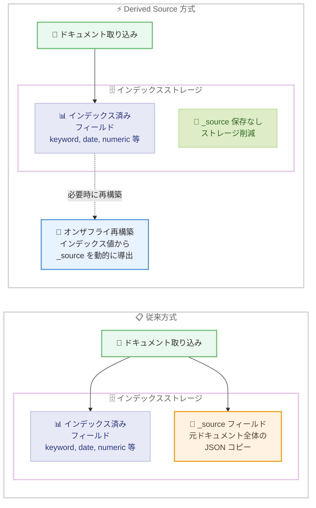

# Amazon OpenSearch Serverless - Derived Source によるストレージ最適化

**リリース日**: 2026 年 04 月 13 日
**サービス**: Amazon OpenSearch Serverless
**機能**: Derived Source (派生ソース)

📊 [このアップデートのインフォグラフィックを見る](https://takech9203.github.io/aws-news-summary/20260413-amazon-opensearch-serverless-supports-derived-source.html)

## 概要

AWS は 2026 年 4 月 13 日、Amazon OpenSearch Serverless において Derived Source (派生ソース) のサポートを発表しました。Derived Source は、インデックス内に `_source` フィールドの個別コピーを保持する代わりに、既にインデックスに格納されている値からオンザフライで `_source` フィールドを再構築する機能です。これにより、ドキュメントのソースデータを二重に保持する必要がなくなり、ストレージ消費量を大幅に削減できます。

OpenSearch では通常、ドキュメントをインデックスする際に元のドキュメント全体を `_source` フィールドとして保存します。このフィールドは検索結果の取得やハイライト、`_reindex` 操作などに使用されますが、インデックス済みフィールドとの間でデータの重複が発生します。Derived Source を有効にすると、この重複を排除し、必要な時にインデックスの値から `_source` を動的に導出します。

特に、多数のインデックス済みフィールドを含む時系列データやログ分析コレクションにおいて大きなストレージ削減効果が期待できます。Derived Source はインデックスレベルで設定でき、インデックスの作成時またはマッピングの更新時に有効化できます。

**アップデート前の課題**

- OpenSearch Serverless では、ドキュメントをインデックスする際に元の `_source` フィールドを個別に保存する必要があり、インデックス済みフィールドとの間でデータの重複が発生していた
- 時系列データやログ分析など多数のフィールドを持つドキュメントでは、`_source` の保持がストレージ消費量の大きな割合を占めていた
- ストレージコストの最適化にあたって、`_source` を無効化するとハイライトや `_reindex` などの機能が利用できなくなるトレードオフがあった

**アップデート後の改善**

- Derived Source を有効にすることで、`_source` フィールドの個別保存が不要になり、ストレージ消費量を大幅に削減可能になった
- `_source` を無効化するのではなく、必要時にインデックスの値から動的に再構築するため、検索結果の取得やハイライトなどの機能はそのまま利用可能
- インデックスの作成時またはマッピングの更新時に設定でき、既存のワークフローへの影響を最小限に抑えた導入が可能

## アーキテクチャ図



この図は、従来の `_source` フィールド保存方式と Derived Source 方式の違いを示しています。従来方式ではインデックス済みフィールドと `_source` フィールドの両方を保存しますが、Derived Source 方式では `_source` の個別保存を省略し、必要時にインデックスの値からオンザフライで再構築します。

## サービスアップデートの詳細

### 主要機能

1. **Derived Source による _source フィールドの動的再構築**
   - インデックスに格納されている値から `_source` フィールドをオンザフライで再構築
   - 元のドキュメントの個別コピーを保持する必要がなくなり、ストレージの重複を排除
   - 検索結果の返却時に `_source` が必要な場合にのみ再構築処理が実行される

2. **インデックスレベルでの柔軟な設定**
   - インデックスの作成時にマッピング設定で Derived Source を有効化可能
   - 既存インデックスのマッピング更新時にも設定を変更可能
   - コレクション内でインデックスごとに異なる設定を適用できるため、ワークロードに応じた最適化が可能

3. **既存機能との互換性**
   - `_source` フィールドの無効化とは異なり、検索結果の取得、ハイライト、スクリプトフィールドなどの `_source` 依存機能がそのまま利用可能
   - クエリや集計の動作に影響を与えずにストレージ最適化を実現
   - 既存のアプリケーションコードの変更は不要

## 技術仕様

### 従来方式と Derived Source の比較

| 項目 | 従来方式 | Derived Source |
|------|----------|---------------|
| _source フィールドの保存 | インデックスとは別に個別保存 | 保存しない |
| _source の取得方法 | ストレージから直接読み取り | インデックス値からオンザフライで再構築 |
| ストレージ消費 | インデックス + _source で二重保存 | インデックスのみ |
| 検索結果の _source 取得 | 高速 | 再構築のためわずかなオーバーヘッド |
| ハイライト / スクリプト | 対応 | 対応 |
| 推奨ワークロード | 頻繁な _source 取得が必要な場合 | 時系列データ、ログ分析 |

### Derived Source の有効化に関する設定

| 設定項目 | 説明 |
|----------|------|
| `derived_source` | マッピングの `_source` 設定内で有効化 |
| 設定レベル | インデックスレベル |
| 設定タイミング | インデックス作成時またはマッピング更新時 |
| 対象コレクションタイプ | 時系列コレクション、検索コレクション |

### API 変更履歴

本アップデートに関連する API 変更は、直近 7 日間の調査期間内で確認されませんでした。Derived Source の設定はインデックスのマッピング設定を通じて行われます。

### インデックスマッピング設定例

```json
{
  "mappings": {
    "_source": {
      "mode": "derived"
    },
    "properties": {
      "@timestamp": { "type": "date" },
      "message": { "type": "text" },
      "level": { "type": "keyword" },
      "service": { "type": "keyword" },
      "host": { "type": "keyword" }
    }
  }
}
```

## 設定方法

### 前提条件

1. Amazon OpenSearch Serverless コレクションが作成済みであること
2. 適切な IAM ポリシーでコレクションへのアクセスが許可されていること
3. OpenSearch Serverless のデータアクセスポリシーが設定済みであること

### 手順

#### ステップ 1: Derived Source を有効にしたインデックスの作成

```bash
# Derived Source を有効にしたインデックスを作成
curl -X PUT "https://<collection-endpoint>/my-logs-index" \
  -H "Content-Type: application/json" \
  -d '{
    "mappings": {
      "_source": {
        "mode": "derived"
      },
      "properties": {
        "@timestamp": { "type": "date" },
        "message": { "type": "text" },
        "level": { "type": "keyword" },
        "service": { "type": "keyword" },
        "trace_id": { "type": "keyword" },
        "duration_ms": { "type": "long" }
      }
    }
  }'
```

このコマンドは、Derived Source を有効にした新しいインデックスを作成します。`_source` の `mode` を `derived` に設定することで、ドキュメントのソースデータをインデックスの値から動的に再構築するようになります。

#### ステップ 2: 既存インデックスのマッピング更新

```bash
# 既存インデックスのマッピングを更新して Derived Source を有効化
curl -X PUT "https://<collection-endpoint>/my-existing-index/_mapping" \
  -H "Content-Type: application/json" \
  -d '{
    "_source": {
      "mode": "derived"
    }
  }'
```

このコマンドは、既存のインデックスのマッピングを更新して Derived Source を有効にします。更新後に取り込まれるドキュメントから Derived Source が適用されます。

#### ステップ 3: インデックス設定の確認

```bash
# インデックスのマッピング設定を確認
curl -X GET "https://<collection-endpoint>/my-logs-index/_mapping?pretty"
```

このコマンドは、インデックスのマッピング設定を表示し、Derived Source が正しく有効化されていることを確認します。`_source` の `mode` が `derived` と表示されることを確認してください。

#### ステップ 4: ドキュメントの取り込みと確認

```bash
# ドキュメントを取り込み
curl -X POST "https://<collection-endpoint>/my-logs-index/_doc" \
  -H "Content-Type: application/json" \
  -d '{
    "@timestamp": "2026-04-13T10:00:00Z",
    "message": "Application started successfully",
    "level": "INFO",
    "service": "api-gateway",
    "trace_id": "abc-123-def-456",
    "duration_ms": 150
  }'

# 検索して _source が正しく再構築されることを確認
curl -X GET "https://<collection-endpoint>/my-logs-index/_search?pretty" \
  -H "Content-Type: application/json" \
  -d '{
    "query": { "match_all": {} }
  }'
```

ドキュメントの取り込みと検索を実行し、`_source` フィールドが検索結果に正しく含まれることを確認します。Derived Source が有効な場合でも、検索結果にはインデックスの値から再構築された `_source` が返されます。

## メリット

### ビジネス面

- **ストレージコストの大幅削減**: `_source` フィールドの個別保存を省略することで、特にフィールド数が多いドキュメントにおいてマネージドストレージの課金対象データ量を大幅に削減可能
- **TCO の改善**: 大量のログデータや時系列データを扱うワークロードにおいて、ストレージコストは運用コストの大きな割合を占めるため、直接的な TCO 改善に寄与
- **既存投資の保護**: アプリケーションコードやクエリの変更なしに導入でき、既存のワークフローやダッシュボードへの影響がない

### 技術面

- **データ重複の排除**: インデックス済みフィールドと `_source` フィールドの間のデータ重複を根本的に解消
- **機能の維持**: `_source` の無効化とは異なり、ハイライト、スクリプトフィールド、`_reindex` 操作などの `_source` 依存機能がそのまま利用可能
- **インデックスレベルの粒度**: コレクション内でインデックスごとに設定を変更できるため、ワークロードの特性に応じた柔軟な最適化が可能

## デメリット・制約事項

### 制限事項

- `_source` の再構築にはインデックスの値を読み取る処理が必要なため、従来の直接読み取りと比較してわずかなクエリレイテンシーのオーバーヘッドが発生する可能性がある
- インデックスに格納されていないフィールド (例: `enabled: false` や `index: false` のみのフィールド) は再構築時に復元できない場合がある
- テキスト分析によってトークン化されたフィールドは、元のフィールド値と完全に一致する再構築が保証されない場合がある

### 考慮すべき点

- `_source` の頻繁な取得が必要なワークロード (例: 検索結果の詳細表示が多いアプリケーション) では、再構築のオーバーヘッドがクエリパフォーマンスに影響する可能性があるため、事前のベンチマークテストを推奨
- 全てのフィールドが適切にインデックスされていることを確認する必要がある。`_source` から値を取得していたフィールドが `index: false` に設定されている場合、Derived Source 有効時に値が取得できなくなる可能性がある
- 先日リリースされた Zstandard 圧縮コーデックと組み合わせることで、さらなるストレージ最適化が期待できる

## ユースケース

### ユースケース 1: 大規模ログ分析のストレージ最適化

**シナリオ**: マイクロサービスアーキテクチャを運用する企業で、1 日あたり数 TB のアプリケーションログを Amazon OpenSearch Serverless に取り込んでいる。各ログドキュメントには 20 以上のフィールドが含まれ、`_source` の保持がストレージ消費の大きな割合を占めている。

**実装例**:
```json
{
  "mappings": {
    "_source": {
      "mode": "derived"
    },
    "properties": {
      "@timestamp": { "type": "date" },
      "message": { "type": "text", "fields": { "keyword": { "type": "keyword" } } },
      "level": { "type": "keyword" },
      "service": { "type": "keyword" },
      "host": { "type": "keyword" },
      "trace_id": { "type": "keyword" },
      "span_id": { "type": "keyword" },
      "duration_ms": { "type": "long" },
      "status_code": { "type": "integer" },
      "request_path": { "type": "keyword" }
    }
  }
}
```

**効果**: 多数の keyword フィールドと数値フィールドを持つログドキュメントでは、`_source` がストレージの 30-50% を占めることがある。Derived Source を有効にすることで、この重複分のストレージを削減し、マネージドストレージコストを大幅に低減できる。

### ユースケース 2: IoT 時系列データの効率的な保存

**シナリオ**: 数万台の IoT デバイスからのセンサーデータを時系列コレクションに格納している。各デバイスから 1 分間隔でデータが送信され、デバイス ID、タイムスタンプ、複数のセンサー値で構成される。データ量の増加に伴いストレージコストが課題になっている。

**実装例**:
```json
{
  "mappings": {
    "_source": {
      "mode": "derived"
    },
    "properties": {
      "@timestamp": { "type": "date" },
      "device_id": { "type": "keyword" },
      "location": { "type": "geo_point" },
      "temperature": { "type": "float" },
      "humidity": { "type": "float" },
      "pressure": { "type": "float" },
      "battery_level": { "type": "float" },
      "signal_strength": { "type": "integer" }
    }
  }
}
```

**効果**: 時系列データでは各ドキュメントのフィールド構造が均一であるため、Derived Source による再構築の信頼性が高い。フィールド数が多い時系列データでは `_source` の重複排除によるストレージ削減効果が顕著であり、長期保持コストの大幅な低減が期待できる。

### ユースケース 3: セキュリティログの長期保持

**シナリオ**: コンプライアンス要件により、セキュリティイベントログを長期間保持する必要がある。大量のセキュリティログを Amazon OpenSearch Serverless に格納し、必要に応じて検索・分析を行うが、アクセス頻度は低い。

**実装例**:
```json
{
  "settings": {
    "index": {
      "codec": "zstd",
      "codec.compression_level": 3
    }
  },
  "mappings": {
    "_source": {
      "mode": "derived"
    },
    "properties": {
      "@timestamp": { "type": "date" },
      "event_type": { "type": "keyword" },
      "source_ip": { "type": "ip" },
      "destination_ip": { "type": "ip" },
      "action": { "type": "keyword" },
      "user": { "type": "keyword" },
      "resource": { "type": "keyword" },
      "severity": { "type": "keyword" }
    }
  }
}
```

**効果**: Derived Source と Zstandard 圧縮を組み合わせることで、二重のストレージ最適化を実現。`_source` の重複排除による削減に加え、インデックスデータ自体の圧縮率も向上するため、長期保持が必要なセキュリティログのストレージコストを最大限に低減できる。

## 料金

Derived Source 機能自体には追加料金は発生しません。Amazon OpenSearch Serverless の既存の料金体系が適用されます。

### 料金への影響

| コンポーネント | Derived Source の影響 |
|---------------|----------------------|
| OpenSearch Compute Units (OCU) | `_source` 再構築のためわずかなコンピューティングオーバーヘッドが発生する可能性あり |
| マネージドストレージ | `_source` の個別保存が不要になるため、保存データ量が削減されストレージコストが低減 |

Derived Source を有効にすることで `_source` フィールドの個別保存が不要になるため、マネージドストレージの課金対象となるデータ量が減少し、ストレージコストの直接的な削減につながります。特にフィールド数が多いドキュメントでは、削減効果が大きくなります。詳細な料金については [Amazon OpenSearch Serverless の料金ページ](https://aws.amazon.com/opensearch-service/pricing/) をご確認ください。

## 利用可能リージョン

Derived Source サポートは、Amazon OpenSearch Serverless が利用可能な全ての AWS リージョンで本日より提供開始されています。

## 関連サービス・機能

- **Amazon OpenSearch Serverless - Zstandard 圧縮**: 2026 年 4 月 9 日にリリースされた Zstandard コーデックサポートと組み合わせることで、さらなるストレージ最適化が可能
- **Amazon OpenSearch Ingestion**: OpenSearch Serverless へのデータ取り込みパイプライン。Derived Source が有効なインデックスへのデータ取り込みにも影響なく利用可能
- **Amazon OpenSearch Serverless - Collection Groups**: コレクションのグループ化による管理機能。Derived Source と組み合わせたコレクション管理に活用可能
- **Amazon CloudWatch**: OpenSearch Serverless コレクションのモニタリングに使用。ストレージ使用量の推移を監視し、Derived Source による削減効果を測定可能

## 参考リンク

- 📊 [インフォグラフィック](https://takech9203.github.io/aws-news-summary/20260413-amazon-opensearch-serverless-supports-derived-source.html)
- [公式発表 (What's New)](https://aws.amazon.com/about-aws/whats-new/2026/04/amazon-opensearch-serverless-supports-derived-source/)
- [Amazon OpenSearch Serverless ドキュメント](https://docs.aws.amazon.com/opensearch-service/latest/developerguide/serverless.html)
- [Amazon OpenSearch Service 料金ページ](https://aws.amazon.com/opensearch-service/pricing/)

## まとめ

Amazon OpenSearch Serverless における Derived Source のサポートは、`_source` フィールドの個別保存を省略しインデックスの値からオンザフライで再構築することで、ストレージ消費量を大幅に削減する機能です。特に時系列データやログ分析など多数のインデックス済みフィールドを持つワークロードで大きな削減効果が期待でき、先日リリースされた Zstandard 圧縮コーデックとの併用によりさらなる最適化が可能です。大規模なデータを Amazon OpenSearch Serverless に格納しているチームは、まず非本番環境で Derived Source を有効化し、ストレージ削減効果とクエリパフォーマンスへの影響を検証した上で本番環境への適用を検討することを推奨します。
