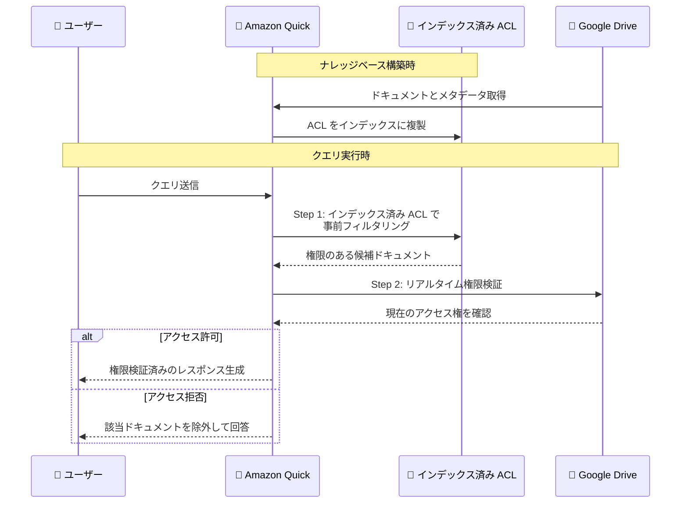

# Amazon Quick - Google Drive ナレッジベースのドキュメントレベルアクセス制御

**リリース日**: 2026 年 4 月 13 日
**サービス**: Amazon Quick
**機能**: Google Drive ナレッジベースのドキュメントレベルアクセス制御 (ACL)

:bar_chart: [このアップデートのインフォグラフィックを見る](https://takech9203.github.io/aws-news-summary/20260413-amazon-quick-document-level-access-controls-google-drive.html)

## 概要

Amazon Quick が Google Drive ナレッジベースに対するドキュメントレベルのアクセス制御 (ACL) をサポートしました。この機能により、Google Drive のネイティブな権限設定を Amazon Quick のナレッジベースにインデックスする際にそのまま維持できるようになります。組織は Google Drive で設定済みのファイルおよびフォルダ単位の権限を、Amazon Quick のコンテンツ検索とレスポンス生成に反映できます。

Amazon Quick は、インデックス済み ACL による効率的な事前フィルタリングと、クエリ時の Google Drive へのリアルタイム権限チェックを組み合わせたデュアルアプローチを採用しています。ユーザーがクエリを送信すると、Quick はまずインデックス済みの ACL で対象ドキュメントを絞り込み、さらに Google Drive に対してユーザーの現在の権限をリアルタイムで検証してからレスポンスを生成します。これにより、権限の失効や不正確なマッピングによる情報漏洩リスクを最小化しながら、高速な検索パフォーマンスを両立させます。

**アップデート前の課題**

- Google Drive のナレッジベースをインデックスする際、ファイルやフォルダ単位の権限を反映する手段がなかった
- 権限のないユーザーにも Google Drive のコンテンツがレスポンスに含まれる可能性があった
- Google Drive 側で権限を変更しても、インデックス済みデータに即座に反映されなかった
- エンタープライズ環境で Google Drive のコンテンツを安全に活用することが困難だった

**アップデート後の改善**

- Google Drive のネイティブ権限をナレッジベースに自動的に反映できるようになった
- デュアル ACL チェックにより、権限のないドキュメントがレスポンスに含まれるリスクが大幅に低減された
- リアルタイム権限検証により、Google Drive 側の権限変更が即座にクエリ結果に反映されるようになった
- エンタープライズ組織が Google Workspace のコンテンツを安心して Amazon Quick に統合できるようになった

## アーキテクチャ図

この図は、Amazon Quick がクエリ実行時にインデックス済み ACL による事前フィルタリングと Google Drive へのリアルタイム権限検証を組み合わせたデュアルアプローチで、ドキュメントレベルのアクセス制御を実現するフローを示しています。

## サービスアップデートの詳細

### 主要機能

1. **ACL レプリケーション**
   - Google Drive のファイルおよびフォルダ権限をインデックスに複製
   - 事前フィルタリングに使用し、検索パフォーマンスを最適化
   - ナレッジベース構築時に自動的に ACL データを取得・保存

2. **リアルタイム権限検証**
   - クエリ実行時に Google Drive に対してユーザーの現在のアクセス権を直接確認
   - 権限の失効やマッピングの不整合に対する追加の安全層として機能
   - ライブのアクセス権に基づいてレスポンスを生成

3. **デュアルアプローチによるセキュリティ**
   - インデックス済み ACL によるパフォーマンス最適化とリアルタイム検証によるセキュリティを両立
   - 古くなった権限データによる情報漏洩リスクを防止
   - Google Drive 側の権限変更が即座にクエリ結果に反映

## 技術仕様

### デュアル ACL チェックの仕組み

| フェーズ | 処理内容 | 目的 |
|----------|----------|------|
| 事前フィルタリング | インデックス済み ACL を使用してドキュメント候補を絞り込み | 検索パフォーマンスの最適化 |
| リアルタイム検証 | Google Drive API を通じて現在の権限を確認 | 最新のアクセス権に基づく正確な制御 |
| レスポンス生成 | 両フェーズで許可されたドキュメントのみを使用 | セキュリティとパフォーマンスの両立 |

### サポートされる権限タイプ

| 権限レベル | 説明 |
|------------|------|
| ファイル単位 | 個別ファイルに設定された閲覧・編集権限 |
| フォルダ単位 | フォルダに設定された権限とその継承 |
| 共有ドライブ | 共有ドライブのメンバーシップに基づく権限 |

### API 変更履歴

| 日付 | サービス | 変更内容 |
|------|----------|----------|
| 2026/03/31 | [Amazon QuickSight](https://awsapichanges.com/archive/changes/080f45-quicksight.html) | 2 new 19 updated api methods - StartAutomationJob、DescribeAutomationJob API の追加、Spaces およびチャットエージェント管理のカスタム権限追加 |

## 設定方法

### 前提条件

1. Amazon Quick のアカウントとアクセス権限
2. Google Workspace の管理者アクセス権 (Google Drive 連携の設定に必要)
3. Google Drive API の有効化と OAuth 2.0 認証情報の準備

### 手順

#### ステップ 1: Google Drive 連携の準備

Google Workspace 管理コンソールで Google Drive API を有効化し、Amazon Quick が使用する OAuth 2.0 クライアント認証情報を作成します。

#### ステップ 2: Amazon Quick でナレッジベースを作成

AWS Management Console から Amazon Quick にアクセスし、新しいナレッジベースを作成します。データソースとして Google Drive を選択してください。

#### ステップ 3: ドキュメントレベルアクセス制御を有効化

ナレッジベースの統合設定画面で、ドキュメントレベルアクセス制御 (ACL) を有効にします。これにより、Google Drive のネイティブ権限がインデックスに反映されます。

#### ステップ 4: コネクタの認証設定

Google Drive コネクタの認証情報を入力し、Amazon Quick が Google Drive のファイル、フォルダ、および権限情報にアクセスできるように設定します。

#### ステップ 5: インデックスの構築と確認

ナレッジベースのインデックスを構築し、ACL データが正しく取り込まれていることを確認します。インデックス完了後、テストクエリを実行して、権限に基づいたフィルタリングが正常に動作することを検証してください。

## メリット

### ビジネス面

- **情報ガバナンスの強化**: Google Drive の既存の権限体系をそのまま活用でき、追加の権限管理が不要
- **コンプライアンス対応**: 機密文書へのアクセスが適切に制御され、規制要件への対応が容易
- **Google Workspace との統合推進**: 既存の Google Workspace 環境を安全に AI ナレッジベースに活用可能

### 技術面

- **デュアルチェックによる堅牢性**: インデックス ACL とリアルタイム検証の二重チェックで、権限の一貫性を保証
- **パフォーマンスとセキュリティの両立**: 事前フィルタリングで高速検索を維持しつつ、リアルタイム検証で最新の権限状態を反映
- **権限変更の即時反映**: Google Drive 側の権限変更がクエリ時にリアルタイムで反映されるため、タイムラグによるリスクを排除

## デメリット・制約事項

### 制限事項

- リアルタイム権限チェックにより、Google Drive API への依存度が増加し、Google Drive の可用性がクエリ応答に影響する可能性がある
- 大量のドキュメントに対するリアルタイム検証は、クエリのレイテンシーに影響を与える場合がある
- Google Drive の権限モデルに完全に依存するため、Quick 側で独自の権限上書きを設定する柔軟性は限定的

### 考慮すべき点

- Google Drive API のレート制限に注意が必要。大規模な組織では、クエリ量に応じて API クォータの調整が必要になる場合がある
- インデックスの再構築頻度と ACL データの鮮度のバランスを適切に設定する必要がある
- Google Workspace の管理者が権限設定を適切に管理していることが前提条件となる

## ユースケース

### ユースケース 1: エンタープライズナレッジマネジメント

**シナリオ**: Google Workspace を全社的に利用する大規模組織が、部門ごとのドキュメント権限を維持しながら AI ナレッジベースを構築する

**実装例**:
- 全社の Google Drive を Amazon Quick のナレッジベースとして統合
- 各部門のフォルダ権限が自動的にインデックスに反映
- 人事部門の機密文書は人事担当者のみがクエリ結果で参照可能

**効果**: 部門間の情報バリアを維持しつつ、組織全体の知識を AI で活用できる環境を実現

### ユースケース 2: プロジェクト単位の情報共有

**シナリオ**: 複数のプロジェクトチームが共有ドライブで情報を管理し、プロジェクトメンバーのみがアクセスできるナレッジベースを利用する

**実装例**:
- 各プロジェクトの共有ドライブを Google Drive コネクタで接続
- プロジェクトメンバーシップに基づいた ACL が自動適用
- メンバーの追加・削除が Google Drive の権限変更として即座に反映

**効果**: プロジェクト固有の知識に安全にアクセスでき、メンバー変更時の権限管理コストを削減

### ユースケース 3: 規制産業でのドキュメント検索

**シナリオ**: 金融機関や医療機関が、コンプライアンス要件を満たしながら社内ドキュメントの AI 検索を導入する

**実装例**:
- 機密レベルに応じた Google Drive のフォルダ構造と権限設定を活用
- デュアル ACL チェックにより、権限の失効したユーザーの即時遮断を実現
- 監査ログと組み合わせてアクセス履歴を追跡

**効果**: 厳格なアクセス制御を維持しながら、社内ナレッジの AI 活用を推進できる

## 料金

ドキュメントレベルアクセス制御機能は、Amazon Quick の標準機能として提供されます。追加料金は発生しませんが、Amazon Quick の利用料金は引き続き適用されます。

詳細な料金情報は [Amazon Quick の料金ページ](https://aws.amazon.com/quicksight/pricing/)を参照してください。

## 利用可能リージョン

この機能は、Amazon Quick が利用可能なすべての AWS リージョンで使用できます。

## 関連サービス・機能

- **Amazon Quick ナレッジベース**: Google Drive を含む複数のデータソースからコンテンツを統合し、AI チャットの回答基盤を構築
- **Google Workspace**: Google Drive の権限管理と連携し、既存の組織構造をそのまま活用
- **Amazon Bedrock**: Quick の AI レスポンス生成に基盤モデルを提供
- **AWS IAM Identity Center**: Amazon Quick のユーザー認証と Google Workspace のアイデンティティフェデレーションを管理

## 参考リンク

- :bar_chart: [インフォグラフィック](https://takech9203.github.io/aws-news-summary/20260413-amazon-quick-document-level-access-controls-google-drive.html)
- [公式発表 (What's New)](https://aws.amazon.com/about-aws/whats-new/2026/04/amazon-quick-document-level-access-controls-google-drive/)
- [ドキュメント - Amazon Quick User Guide: Google Drive integration](https://docs.aws.amazon.com/quicksuite/latest/userguide/google-drive-integration.html)
- [料金ページ](https://aws.amazon.com/quicksight/pricing/)

## まとめ

Amazon Quick の Google Drive ナレッジベースに対するドキュメントレベルアクセス制御により、組織は Google Drive のネイティブ権限を維持したまま、安全に AI ナレッジベースを構築できるようになりました。インデックス済み ACL とリアルタイム権限検証のデュアルアプローチは、パフォーマンスとセキュリティを高い水準で両立させます。Google Workspace を利用している組織は、この機能を活用して社内ナレッジの AI 活用を推進し、情報ガバナンスを強化してください。
