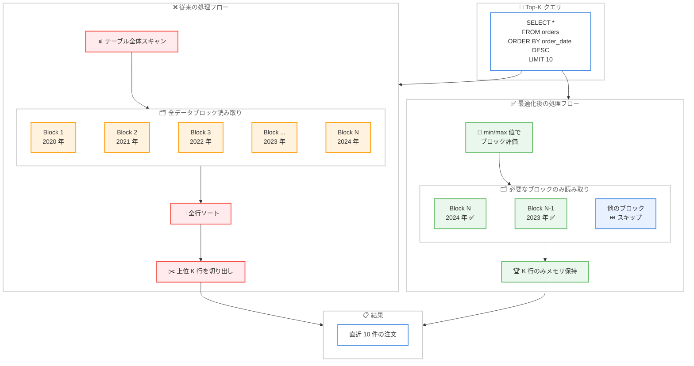

# Amazon Redshift - Top-K クエリのパフォーマンス最適化

**リリース日**: 2026 年 4 月 13 日
**サービス**: Amazon Redshift
**機能**: Top-K クエリ最適化 (ORDER BY + LIMIT の高速化)

📊 [このアップデートのインフォグラフィックを見る](https://takech9203.github.io/aws-news-summary/20260413-amazon-redshift-topk-optimization.html)

## 概要

Amazon Redshift が Top-K クエリ (ORDER BY と LIMIT 句を組み合わせたクエリ) の処理を大幅に最適化するアップデートをリリースした。この最適化では、ORDER BY カラムの min/max 値に基づいてデータブロックの読み取り順序をインテリジェントに再編成し、不要なデータブロックをスキップすることで、処理するデータ量を劇的に削減する。メモリ上には最も条件に合致する K 行のみが保持される。

従来の Top-K クエリでは、ORDER BY カラムがソート済みまたは部分的にソートされている場合でも、テーブル全体をスキャンする必要があった。今回の最適化により、Amazon Redshift は必要最小限のデータブロックのみを処理するようになり、不要な I/O とコンピュート処理のオーバーヘッドが排除される。特に降順ソートで LIMIT を指定するクエリ (ORDER BY ... DESC LIMIT K) において、データがストレージの末尾に追加される大規模テーブルに対して大きな効果を発揮する。

この最適化はパッチリリース P199 以降で追加費用なしで利用可能であり、Amazon Redshift が利用可能なすべての AWS リージョンに対応する。対象となるクエリに自動的に適用されるため、クエリの書き換えや設定変更は一切不要である。

**アップデート前の課題**

- Top-K クエリであっても、ORDER BY カラムがソート済みの場合にテーブル全体をフルスキャンしていた
- 数十億行規模のテーブルに対して「直近 K 件」を取得する場合でも、全データブロックの読み取りが発生していた
- 不要な I/O とコンピュート処理により、クエリのレイテンシが高くなっていた
- メモリ上にソート対象の全データを保持する必要があり、リソース消費が大きかった
- 降順ソート (DESC) で末尾に追加されたデータを取得する際の効率が特に低かった

**アップデート後の改善**

- ORDER BY カラムの min/max 値に基づいてデータブロックの読み取り順序がインテリジェントに再編成されるようになった
- 不要なデータブロックが自動的にスキップされ、処理するデータ量が劇的に削減された
- メモリ上には最も条件に合致する K 行のみが保持されるようになり、リソース効率が向上した
- 対象クエリに自動適用されるため、アプリケーション側の変更が不要になった
- 追加費用なしでパフォーマンスが大幅に改善された

## アーキテクチャ図



従来の処理フローではテーブル全体をスキャンしてからソートと切り出しを行っていたが、最適化後は ORDER BY カラムの min/max 値に基づいて必要最小限のデータブロックのみを読み取り、K 行だけをメモリに保持して結果を返す。

## サービスアップデートの詳細

### 主要機能

1. **データブロックのインテリジェントスキップ**
   - ORDER BY カラムの各データブロックに格納された min/max メタデータを活用する
   - 結果に含まれる可能性がないデータブロックを事前に判定してスキップする
   - テーブル全体のスキャンを回避し、I/O コストを大幅に削減する

2. **データブロック読み取り順序の最適化**
   - ORDER BY の方向 (ASC/DESC) に応じて、最も条件に合致するブロックから優先的に読み取る
   - 降順 (DESC) の場合、ストレージ末尾のブロックから読み取りを開始する
   - K 行が確定した時点で残りのブロックの読み取りを打ち切る

3. **メモリ効率の最適化**
   - 全行をメモリに展開するのではなく、常に K 行のみをメモリ上に保持する
   - 新しい行が既存の K 行より条件に合致する場合のみ入れ替えを行う
   - 大規模テーブルに対しても一定のメモリ消費量で処理が完了する

4. **自動適用**
   - 対象となる Top-K クエリに対して自動的に最適化が適用される
   - クエリの書き換えやヒントの追加は不要
   - 既存のアプリケーションやダッシュボードのクエリがそのまま高速化される

### 技術仕様

| 項目 | 詳細 |
|------|------|
| 最適化対象 | ORDER BY + LIMIT を含むクエリ |
| 適用条件 | ORDER BY カラムがソート済みまたは部分的にソート済み |
| 特に効果が高いケース | ORDER BY ... DESC LIMIT K (降順ソート + 末尾追記型テーブル) |
| メタデータ活用 | データブロックの min/max 値を使用 |
| メモリ管理 | K 行のみをメモリ上に保持 |
| 適用方式 | 自動適用 (設定変更不要) |
| パッチリリース | P199 以降 |
| 追加費用 | なし |

### API 変更履歴

今回のアップデートは Amazon Redshift の内部クエリエンジンの最適化であり、API レベルの変更はない。直近 7 日間の Redshift 関連 API 変更として、以下が確認された。

| 日付 | サービス | 変更内容 |
|------|----------|----------|
| 2026/04/09 | [Redshift Data API Service](https://awsapichanges.com/archive/changes/215aec-redshift-data.html) | 1 updated method - BatchExecuteStatement API に名前付き SQL パラメータのサポートを追加 |

### 最適化の動作条件

Top-K 最適化が効果的に動作するための条件を以下に示す。

| 条件 | 説明 |
|------|------|
| ORDER BY + LIMIT の組み合わせ | クエリに ORDER BY 句と LIMIT 句の両方が含まれること |
| ソートキーとの関連 | ORDER BY カラムがソートキーまたは部分的にソートされていると最大の効果を発揮 |
| データブロックの min/max 精度 | カラムの値がブロック内で偏りなく分布しているほど効率が高い |
| テーブルサイズ | 大規模テーブルほど、スキップされるブロック数が多くなり効果が大きい |

## 設定方法

### 前提条件

1. Amazon Redshift クラスターまたは Serverless ワークグループが稼働していること
2. パッチリリース P199 以降が適用されていること
3. クエリが ORDER BY と LIMIT の組み合わせを含んでいること

### 手順

#### ステップ 1: パッチバージョンの確認

```sql
SELECT version();
```

クラスターのバージョンが P199 以降であることを確認する。Redshift Serverless の場合は自動的に最新パッチが適用される。

#### ステップ 2: Top-K クエリの実行

```sql
-- 直近 10 件の注文を取得
SELECT order_id, customer_id, order_date, total_amount
FROM orders
ORDER BY order_date DESC
LIMIT 10;
```

特別な設定は不要であり、通常通り ORDER BY と LIMIT を含むクエリを実行するだけで最適化が自動的に適用される。

#### ステップ 3: 実行プランでの最適化確認

```sql
EXPLAIN
SELECT order_id, customer_id, order_date, total_amount
FROM orders
ORDER BY order_date DESC
LIMIT 10;
```

EXPLAIN コマンドで実行プランを確認し、Top-K 最適化が適用されていることを確認する。

## メリット

### ビジネス面

- **クエリレスポンスの高速化**: ダッシュボードやリアルタイムレポートで「直近 K 件」や「上位 K 件」を表示するクエリが大幅に高速化される
- **コスト効率の向上**: スキャンするデータ量が削減されるため、Redshift Serverless のコンピュート時間に基づく課金が最適化される
- **運用負荷ゼロ**: 自動適用であるため、DBA やアプリケーション開発者による追加作業が一切不要

### 技術面

- **I/O 削減**: 不要なデータブロックの読み取りが排除され、ストレージへの I/O 負荷が大幅に低減される
- **メモリ効率の向上**: K 行のみをメモリに保持する方式により、大規模テーブルでも効率的に処理が完了する
- **既存ワークロードへの即座の適用**: クエリの変更やテーブル設計の見直しが不要で、パッチ適用後すぐに恩恵を受けられる
- **ソートキー設計の活用**: 既にソートキーが適切に設定されているテーブルでは、最適化の効果が最大化される

## デメリット・制約事項

### 制限事項

- ORDER BY カラムがソートされていない場合、最適化の効果が限定的になる可能性がある
- 複合的な ORDER BY (複数カラムの組み合わせ) に対する最適化効果は、カラムの順序やソート状態に依存する
- LIMIT を伴わない ORDER BY のみのクエリには適用されない
- パッチリリース P199 以降が必要であり、古いバージョンのクラスターでは利用できない

### 考慮すべき点

- ソートキーの選択がこの最適化の効果に直接影響するため、Top-K クエリの頻度が高いテーブルではソートキー設計の見直しが推奨される
- 既存の EXPLAIN 出力に変化が生じるため、実行プランに基づく監視やアラートを設定している場合は確認が必要
- データの追記パターン (時系列データなど) とソート順序が一致する場合に最大の効果を発揮する

## ユースケース

### ユースケース 1: E コマースにおける直近注文の取得

**シナリオ**: 数十億件のトランザクションを保持する注文テーブルから、直近 K 件の注文情報をリアルタイムダッシュボードに表示する。

**実装例**:

```sql
-- 直近 100 件の注文を取得
SELECT
    order_id,
    customer_name,
    order_date,
    total_amount,
    status
FROM orders
ORDER BY order_date DESC
LIMIT 100;
```

**効果**: 数十億行のテーブルに対して、従来はフルスキャンが必要だったクエリが、末尾の数ブロックのみの読み取りで完了する。ダッシュボードの表示速度が劇的に改善される。

### ユースケース 2: IoT データにおけるセンサー最新値の取得

**シナリオ**: 数百万台のセンサーから収集された時系列データテーブルから、最新の K 件のセンサー読み取り値を取得してモニタリングに利用する。

**実装例**:

```sql
-- 特定のセンサーの直近 50 件のデータを取得
SELECT
    sensor_id,
    reading_timestamp,
    temperature,
    humidity,
    pressure
FROM sensor_readings
WHERE sensor_id = 'SENSOR-001'
ORDER BY reading_timestamp DESC
LIMIT 50;
```

**効果**: 時系列で追記されるセンサーデータは自然にソートされているため、最適化の効果が最大限に発揮される。大量のヒストリカルデータをスキップして最新データのみを効率的に取得できる。

### ユースケース 3: LLM 推論ログの分析

**シナリオ**: 基盤モデル (LLM) が処理した数十億件のプロンプトログから、直近の K 件または最も古い K 件のプロンプトを取得して分析する。

**実装例**:

```sql
-- 直近 200 件の LLM 推論ログを取得
SELECT
    prompt_id,
    model_id,
    prompt_text,
    response_tokens,
    latency_ms,
    inferred_at
FROM llm_inference_logs
ORDER BY inferred_at DESC
LIMIT 200;

-- 最も古い 50 件の推論ログを取得 (降順ストレージの場合)
SELECT
    prompt_id,
    model_id,
    prompt_text,
    inferred_at
FROM llm_inference_logs
ORDER BY inferred_at ASC
LIMIT 50;
```

**効果**: LLM の推論ログは継続的に蓄積されるため、テーブルが巨大化しやすい。Top-K 最適化により、最新または最古のログを効率的に取得でき、モデルパフォーマンスの監視や品質分析が高速化される。

### ユースケース 4: 売上ランキングの取得

**シナリオ**: 数十万の SKU と数十億の販売トランザクションを持つ商品カタログから、売上上位 K 件または下位 K 件の商品を取得する。

**実装例**:

```sql
-- 売上上位 20 商品を取得
SELECT
    product_id,
    product_name,
    category,
    total_sales
FROM product_sales_summary
ORDER BY total_sales DESC
LIMIT 20;

-- 売上下位 10 商品を取得
SELECT
    product_id,
    product_name,
    category,
    total_sales
FROM product_sales_summary
ORDER BY total_sales ASC
LIMIT 10;
```

**効果**: 商品のパフォーマンス分析において、最も売れている商品や最も売れていない商品を迅速に特定でき、在庫管理やマーケティング戦略の意思決定を加速する。

## 料金

Top-K クエリ最適化は Amazon Redshift の内部エンジン改善であり、追加費用は発生しない。パッチリリース P199 の適用により自動的に有効化される。

### 料金への影響

| 項目 | 詳細 |
|------|------|
| 最適化機能自体 | 無料 (追加費用なし) |
| Redshift Provisioned | 既存のノード料金内で利用可能 |
| Redshift Serverless | スキャンデータ量の削減により RPU 消費が低減し、コスト削減が期待される |
| パッチ適用 | 無料 (メンテナンスウィンドウで自動適用) |

## 利用可能リージョン

Amazon Redshift が利用可能なすべての AWS リージョンで利用可能である。パッチリリース P199 以降が適用されたクラスターおよび Serverless ワークグループで自動的に有効化される。

## 関連サービス・機能

- **Amazon Redshift ソートキー**: Top-K 最適化の効果を最大化するための基盤機能。適切なソートキー設計がパフォーマンス向上に直結する
- **Amazon Redshift Serverless**: 従量課金モデルにおいて、スキャンデータ量の削減がコスト削減に直接反映される
- **Amazon Redshift ゾーンマップ**: データブロックの min/max 値を管理する内部メタデータ機能。Top-K 最適化はこのゾーンマップを活用する
- **Amazon Redshift Advisor**: ソートキーの推奨やクエリパフォーマンスの改善提案を提供し、Top-K 最適化と組み合わせて活用できる
- **Amazon QuickSight**: Redshift と連携する BI サービス。ダッシュボードの Top-K 表示クエリが高速化される

## 参考リンク

- 📊 [インフォグラフィック](https://takech9203.github.io/aws-news-summary/20260413-amazon-redshift-topk-optimization.html)
- [公式発表 (What's New)](https://aws.amazon.com/about-aws/whats-new/2026/04/amazon-redshift-topk-optimization/)
- [Amazon Redshift ドキュメント](https://docs.aws.amazon.com/redshift/latest/dg/)
- [Amazon Redshift ソートキーの選択](https://docs.aws.amazon.com/redshift/latest/dg/c_best-practices-sort-key.html)
- [Amazon Redshift 料金](https://aws.amazon.com/redshift/pricing/)

## まとめ

Amazon Redshift の Top-K クエリ最適化は、ORDER BY と LIMIT を組み合わせたクエリの処理性能を劇的に向上させる内部エンジン改善である。データブロックの min/max 値を活用したインテリジェントなスキップ機構により、大規模テーブルに対するフルスキャンを回避し、必要最小限のデータブロックのみを処理する。追加費用なしでパッチ P199 から自動適用されるため、E コマースの直近注文取得、IoT センサーデータの最新値取得、LLM 推論ログの分析など、Top-K パターンを多用するワークロードを持つユーザーは、パッチの適用状況を確認し、ソートキー設計の見直しを検討することを推奨する。
