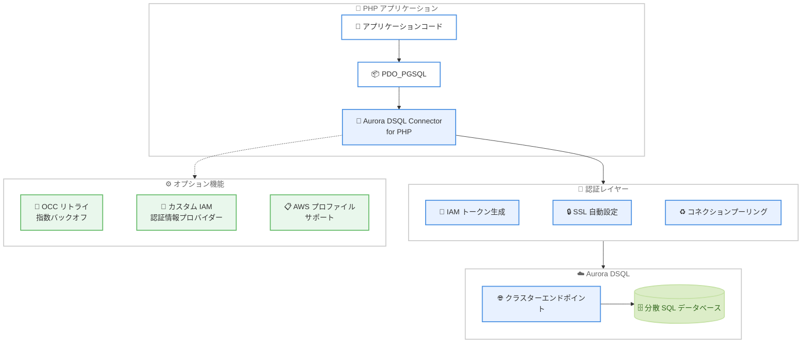

# Aurora DSQL - PHP 向けコネクタの提供開始

**リリース日**: 2026 年 4 月 13 日
**サービス**: Amazon Aurora DSQL
**機能**: Aurora DSQL Connector for PHP (PDO_PGSQL)

📊 [このアップデートのインフォグラフィックを見る](https://takech9203.github.io/aws-news-summary/20260413-aurora-dsql-connector-for-php.html)

## 概要

Amazon Aurora DSQL が PHP アプリケーション向けの公式コネクタをリリースした。このコネクタは PHP の標準的な PostgreSQL データベースアクセス拡張である PDO_PGSQL と完全な互換性を持ち、Aurora DSQL への接続における認証、SSL 設定、コネクションプーリングを自動的に処理する。

従来、Aurora DSQL に PHP アプリケーションから接続する際には、IAM トークンの生成や SSL 設定を開発者が手動で実装する必要があった。今回のコネクタにより、接続ごとに自動的にトークンが生成され、有効なトークンが常に使用されるため、従来のユーザー生成パスワードに関連するセキュリティリスクが排除される。さらに、楽観的同時実行制御 (OCC) リトライやカスタム IAM 認証情報プロバイダー、AWS プロファイルサポートなどの高度な機能もオプトインで利用可能である。

Aurora DSQL コネクタファミリーとしては、Go (pgx)、Python (asyncpg)、Node.js (Postgres.js)、Ruby (pg gem) に続く 5 番目の言語対応となり、PHP エコシステムにおけるサーバーレス分散 SQL データベースの活用を大幅に促進する。

**アップデート前の課題**

- PHP アプリケーションから Aurora DSQL に接続する際、IAM トークンの生成ロジックを独自に実装する必要があった
- SSL/TLS 設定を手動で構成する必要があり、設定ミスによるセキュリティリスクが存在した
- コネクションプーリングの実装やトークンの有効期限管理を開発者が自ら行う必要があった
- OCC リトライロジックの実装が複雑で、アプリケーションごとに独自の実装が必要だった
- 既存の PDO_PGSQL コードベースから Aurora DSQL への移行にボイラープレートコードが多く必要だった

**アップデート後の改善**

- PDO_PGSQL 互換のコネクタを導入するだけで、IAM 認証が自動的に処理されるようになった
- SSL 設定が自動構成され、セキュアな接続がデフォルトで確立されるようになった
- コネクションプーリングとトークン管理がコネクタ側で一元管理されるようになった
- オプトインの OCC リトライ機能により、指数バックオフ付きの再試行が簡単に利用可能になった
- 既存の PDO_PGSQL 機能との完全互換により、コード変更を最小限に抑えて移行が可能になった

## アーキテクチャ図



PHP アプリケーションから Aurora DSQL への接続フローを示す。コネクタが PDO_PGSQL と Aurora DSQL の間に位置し、IAM トークン生成、SSL 設定、コネクションプーリングを透過的に処理する。

## サービスアップデートの詳細

### 主要機能

1. **IAM トークン自動生成**
   - 接続ごとに有効な IAM 認証トークンを自動的に生成する
   - トークンの有効期限管理が不要になり、常に有効なトークンが使用される
   - 従来のユーザー生成パスワードに比べてセキュリティが大幅に向上する

2. **SSL 自動設定**
   - Aurora DSQL エンドポイントへの SSL/TLS 接続がデフォルトで有効化される
   - 証明書の設定や更新を手動で管理する必要がない
   - セキュアな通信がゼロコンフィグで実現される

3. **コネクションプーリング**
   - 接続の再利用と効率的な管理が組み込みで提供される
   - 簡単なスクリプトから本番ワークロードまで、認証方式を変更せずにスケール可能
   - 接続数の制御とリソースの効率的な利用が自動的に行われる

4. **OCC リトライ機能**
   - オプトインで楽観的同時実行制御 (OCC) のリトライ機能を有効化可能
   - 指数バックオフアルゴリズムにより、適切な間隔でリトライが実行される
   - 同時実行の競合が発生した場合にアプリケーション側での複雑なリトライロジックが不要になる

5. **カスタム IAM 認証情報プロバイダーと AWS プロファイルサポート**
   - カスタムの IAM 認証情報プロバイダーを指定して柔軟な認証設定が可能
   - AWS プロファイルを指定して複数のアカウントや環境を切り替え可能
   - 既存の AWS 認証情報管理の仕組みとシームレスに統合できる

### 技術仕様

| 項目 | 詳細 |
|------|------|
| コネクタ名 | Aurora DSQL Connector for PHP |
| 互換ライブラリ | PDO_PGSQL |
| 認証方式 | IAM トークンベース認証 (自動生成) |
| 暗号化 | SSL/TLS (自動設定) |
| リトライ機能 | OCC リトライ (オプトイン、指数バックオフ) |
| 認証情報 | カスタム IAM プロバイダー、AWS プロファイル対応 |
| ライセンス | オープンソース |

### Aurora DSQL コネクタ対応言語一覧

| 言語 | コネクタ名 | 互換ドライバ | リリース日 |
|------|-----------|-------------|-----------|
| Go | Aurora DSQL Connector for Go | pgx | 2026 年 2 月 19 日 |
| Python | Aurora DSQL Connector for Python | asyncpg | 2026 年 2 月 19 日 |
| Node.js | Aurora DSQL Connector for Node.js | Postgres.js (WebSocket) | 2026 年 2 月 19 日 |
| Ruby | Aurora DSQL Connector for Ruby | pg gem | 2026 年 3 月 26 日 |
| PHP | Aurora DSQL Connector for PHP | PDO_PGSQL | 2026 年 4 月 13 日 |

### API 変更履歴

今回のアップデートは Aurora DSQL サービス自体の API 変更ではなく、クライアント側のコネクタライブラリのリリースであるため、API レベルの変更はない。直近 7 日間の Aurora DSQL 関連の API 変更も確認されなかった。

## 設定方法

### 前提条件

1. PHP 8.0 以降がインストールされていること
2. PDO_PGSQL 拡張が有効化されていること
3. Aurora DSQL クラスターが作成済みであること
4. IAM ユーザーまたはロールに Aurora DSQL への接続権限が付与されていること
5. AWS 認証情報が設定されていること (環境変数、AWS プロファイルなど)

### 手順

#### ステップ 1: コネクタのインストール

```bash
composer require aws/aurora-dsql-connector
```

Composer を使用して Aurora DSQL Connector for PHP をインストールする。PDO_PGSQL への依存関係も自動的に解決される。

#### ステップ 2: 基本的な接続

```php
<?php

require_once 'vendor/autoload.php';

use Aws\Dsql\Pdo\DsqlConnection;

// Aurora DSQL コネクタを使用して接続
$conn = new DsqlConnection(
    host: 'your-cluster-endpoint.dsql.us-east-1.on.aws',
    dbname: 'postgres',
    user: 'admin'
);

// クエリの実行
$stmt = $conn->query('SELECT * FROM users LIMIT 10');
while ($row = $stmt->fetch(PDO::FETCH_ASSOC)) {
    print_r($row);
}
```

コネクタが IAM トークンの生成と SSL 設定を自動的に処理するため、パスワードや SSL パラメータの指定は不要である。

#### ステップ 3: OCC リトライの有効化

```php
<?php

require_once 'vendor/autoload.php';

use Aws\Dsql\Pdo\DsqlConnection;

// OCC リトライを有効化して接続
$conn = new DsqlConnection(
    host: 'your-cluster-endpoint.dsql.us-east-1.on.aws',
    dbname: 'postgres',
    user: 'admin',
    occRetry: true
);

// トランザクション内での操作
$conn->beginTransaction();
try {
    $conn->exec("UPDATE accounts SET balance = balance - 100 WHERE id = 1");
    $conn->exec("UPDATE accounts SET balance = balance + 100 WHERE id = 2");
    $conn->commit();
} catch (Exception $e) {
    $conn->rollBack();
    throw $e;
}
```

OCC リトライを有効化することで、同時実行の競合が発生した場合に自動的に指数バックオフ付きのリトライが実行される。

## メリット

### ビジネス面

- **開発速度の向上**: 認証やセキュリティ設定の実装にかかる時間を削減し、ビジネスロジックの開発に集中できる
- **セキュリティリスクの低減**: パスワードの管理が不要になり、認証情報の漏洩リスクが大幅に低減される
- **運用コストの削減**: トークン管理やコネクション管理の運用負荷が軽減される
- **PHP エコシステムの活用**: WordPress、Laravel、Symfony など広大な PHP エコシステムで Aurora DSQL を活用できる

### 技術面

- **PDO_PGSQL 互換性**: 既存の PDO_PGSQL を使用したコードベースへの導入が容易で、移行コストが低い
- **ゼロコンフィグセキュリティ**: SSL 設定や認証トークンの管理が自動化され、設定ミスによる脆弱性のリスクが排除される
- **スケーラビリティ**: コネクションプーリングと OCC リトライにより、小規模なスクリプトから大規模な本番ワークロードまで同一の接続方式で対応可能
- **既存 PDO コードとの互換性**: PDO インターフェースを通じた操作であるため、既存のデータベースアクセスコードの変更が最小限で済む

## デメリット・制約事項

### 制限事項

- Aurora DSQL 専用のコネクタであり、通常の Aurora PostgreSQL や Amazon RDS for PostgreSQL には使用できない
- PDO_PGSQL に依存するため、他の PHP 用 PostgreSQL クライアントライブラリとの互換性は別途確認が必要
- OCC リトライはオプトイン機能であり、デフォルトでは無効化されている
- PHP の PDO_PGSQL 拡張が事前にインストール・有効化されている必要がある

### 考慮すべき点

- IAM 認証情報の適切な設定が前提であるため、AWS 認証情報の管理ポリシーを事前に確立しておく必要がある
- Aurora DSQL のリージョン展開状況に応じて、コネクタの利用可能範囲が決まる
- 既存の PDO_PGSQL ベースのコードを移行する際、接続パラメータの変更が必要になる場合がある
- Laravel や Symfony などのフレームワーク固有のデータベース抽象レイヤーとの統合には追加の設定が必要な場合がある

## ユースケース

### ユースケース 1: Laravel アプリケーションからの接続

**シナリオ**: Laravel で構築された Web アプリケーションから Aurora DSQL に接続し、分散 SQL データベースの高可用性とスケーラビリティを活用する。

**実装例**:

```php
<?php

require_once 'vendor/autoload.php';

use Aws\Dsql\Pdo\DsqlConnection;

// Laravel のサービスプロバイダーやカスタムコネクションとして登録
$conn = new DsqlConnection(
    host: env('DSQL_CLUSTER_ENDPOINT'),
    dbname: env('DSQL_DATABASE', 'postgres'),
    user: env('DSQL_USER', 'admin')
);

// PDO インターフェースを通じたクエリ実行
$stmt = $conn->prepare('SELECT * FROM products WHERE category = :category');
$stmt->execute(['category' => 'electronics']);
$products = $stmt->fetchAll(PDO::FETCH_ASSOC);
```

**効果**: パスワード管理なしでセキュアな接続を確立でき、マルチリージョン対応の Laravel アプリケーションを構築できる。

### ユースケース 2: WordPress プラグインでのデータ処理

**シナリオ**: カスタム WordPress プラグインから Aurora DSQL に接続し、分散データベースで大規模なコンテンツ管理や分析処理を実行する。

**実装例**:

```php
<?php

require_once 'vendor/autoload.php';

use Aws\Dsql\Pdo\DsqlConnection;

// Aurora DSQL に接続して分析データを取得
$conn = new DsqlConnection(
    host: 'analytics-cluster.dsql.us-east-1.on.aws',
    dbname: 'analytics',
    user: 'analytics_reader'
);

// ページビューの集計クエリ
$stmt = $conn->prepare(
    'SELECT page_url, COUNT(*) as views
     FROM page_views
     WHERE viewed_at >= :start_date
     GROUP BY page_url
     ORDER BY views DESC
     LIMIT :limit'
);
$stmt->execute([
    'start_date' => date('Y-m-d', strtotime('-30 days')),
    'limit' => 100
]);

$topPages = $stmt->fetchAll(PDO::FETCH_ASSOC);
```

**効果**: WordPress のカスタムプラグインから Aurora DSQL の分散データベース機能を活用し、大規模な分析処理をスケーラブルに実行できる。

### ユースケース 3: マルチアカウント環境でのバッチ処理

**シナリオ**: 複数の AWS アカウントに跨がる環境で、異なるアカウントの Aurora DSQL クラスターにバッチ処理でアクセスする。

**実装例**:

```php
<?php

require_once 'vendor/autoload.php';

use Aws\Dsql\Pdo\DsqlConnection;

// 本番環境への接続 (AWS プロファイル指定)
$connProd = new DsqlConnection(
    host: 'prod-cluster.dsql.us-east-1.on.aws',
    dbname: 'production',
    user: 'batch_user',
    awsProfile: 'production',
    occRetry: true
);

// ステージング環境への接続
$connStaging = new DsqlConnection(
    host: 'staging-cluster.dsql.us-west-2.on.aws',
    dbname: 'staging',
    user: 'batch_user',
    awsProfile: 'staging',
    occRetry: true
);

// バッチデータの挿入
$stmt = $connProd->prepare(
    'INSERT INTO events (id, data, created_at) VALUES (:id, :data, :created_at)'
);

foreach ($records as $record) {
    $stmt->execute([
        'id' => $record['id'],
        'data' => json_encode($record['data']),
        'created_at' => date('Y-m-d H:i:s')
    ]);
}
```

**効果**: AWS プロファイルサポートにより、複数の環境やアカウントへの接続をコード内で簡潔に切り替えることができる。OCC リトライにより同時実行の競合も自動的に処理される。

## 料金

Aurora DSQL Connector for PHP はオープンソースのクライアントライブラリであり、コネクタ自体の利用に追加料金は発生しない。料金は Aurora DSQL の利用分に対してのみ課金される。

### 関連する料金

| 項目 | 料金 |
|------|------|
| Aurora DSQL Connector for PHP | 無料 |
| Aurora DSQL | 読み取り/書き込みリクエスト、ストレージ、データ転送に応じた従量課金 |
| IAM 認証 | 追加料金なし |
| AWS Free Tier | Aurora DSQL は AWS Free Tier で無料で開始可能 |

## 利用可能リージョン

Aurora DSQL Connector for PHP はクライアントサイドライブラリであるため、Aurora DSQL が利用可能なすべての AWS リージョンで使用できる。Aurora DSQL は以下のリージョンで利用可能である。

| リージョン | リージョンコード |
|-----------|----------------|
| 米国東部 (バージニア北部) | us-east-1 |
| 米国東部 (オハイオ) | us-east-2 |
| 米国西部 (オレゴン) | us-west-2 |
| アジアパシフィック (東京) | ap-northeast-1 |
| アジアパシフィック (大阪) | ap-northeast-3 |
| アジアパシフィック (ソウル) | ap-northeast-2 |
| アジアパシフィック (シドニー) | ap-southeast-2 |
| アジアパシフィック (メルボルン) | ap-southeast-4 |
| カナダ (セントラル) | ca-central-1 |
| カナダウエスト (カルガリー) | ca-west-1 |
| 欧州 (フランクフルト) | eu-central-1 |
| 欧州 (アイルランド) | eu-west-1 |
| 欧州 (スペイン) | eu-south-2 |
| 欧州 (ロンドン) | eu-west-2 |

最新のリージョン情報については、公式ドキュメントを参照のこと。

## 関連サービス・機能

- **Amazon Aurora DSQL**: コネクタの接続先となるサーバーレス分散 SQL データベースサービス
- **AWS Identity and Access Management (IAM)**: コネクタが使用するトークンベース認証の基盤
- **AWS Security Token Service (STS)**: IAM トークンの生成に使用されるサービス
- **PDO_PGSQL**: コネクタが互換性を持つ PHP の PostgreSQL データベースアクセス拡張
- **Aurora DSQL Connector for Go/Python/Node.js/Ruby**: 他言語向けのコネクタ

## 参考リンク

- 📊 [インフォグラフィック](https://takech9203.github.io/aws-news-summary/20260413-aurora-dsql-connector-for-php.html)
- [公式発表 (What's New)](https://aws.amazon.com/about-aws/whats-new/2026/04/aurora-dsql-connector-for-php/)
- [Aurora DSQL コネクタドキュメント](https://docs.aws.amazon.com/aurora-dsql/latest/userguide/SECTION_connectors.html)
- [Aurora DSQL ドキュメント](https://docs.aws.amazon.com/aurora-dsql/latest/userguide/)
- [Aurora DSQL ウェブページ](https://aws.amazon.com/aurora/dsql/)

## まとめ

Aurora DSQL Connector for PHP の提供開始により、PHP 開発者は PDO_PGSQL 互換のインターフェースを通じて Aurora DSQL にセキュアかつ効率的に接続できるようになった。IAM トークンの自動生成、SSL 自動設定、コネクションプーリングが組み込まれているため、セキュリティと運用の負担を大幅に軽減できる。これにより Aurora DSQL は Go、Python、Node.js、Ruby、PHP の 5 言語をカバーするコネクタファミリーを揃え、主要なサーバーサイド言語からのアクセスが容易になった。PHP で Aurora DSQL を利用する開発者は、コネクタを導入してパスワードレス認証への移行を検討することを推奨する。
