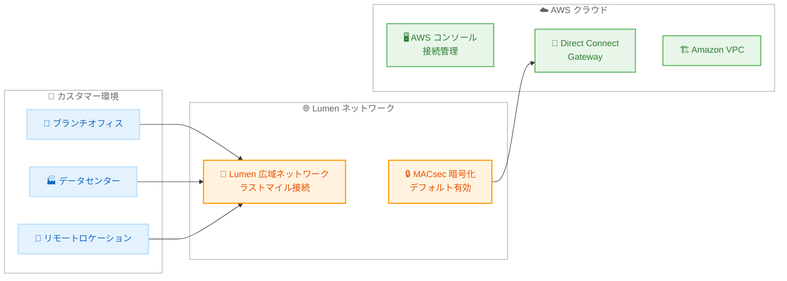

# AWS Interconnect - last mile 一般提供開始

**リリース日**: 2026 年 4 月 13 日
**サービス**: AWS Interconnect
**機能**: AWS Interconnect - last mile (フルマネージド型ラストマイル接続サービス)

[このアップデートのインフォグラフィックを見る](https://takech9203.github.io/aws-news-summary/20260413-aws-announces-ga-AWS-interconnect-last-mile.html)

## 概要

AWS は AWS Interconnect - last mile の一般提供 (GA) を発表しました。これは、ブランチオフィス、データセンター、リモートロケーションから AWS へのプライベート高速接続を数クリックで確立できるフルマネージド型の接続サービスです。ネットワークセットアップの煩雑さと複雑さを排除し、クラウド接続の体験を根本的に変革します。

本サービスは AWS と Lumen のマイルストーンとなるコラボレーションにより実現されました。AWS のクラウドイノベーションと Lumen の広大なネットワークフットプリントを組み合わせることで、企業がクラウドに接続する方法を再定義します。AWS コンソールから、希望する AWS リージョン、帯域幅速度、Direct Connect Gateway ID、パートナーサブスクライバー ID を選択するだけで、即座にプライベート高速接続を確立できます。接続開始後、AWS がアクティベーションキーを生成し、Lumen 側でのプロビジョニングを完了します。

キャパシティの事前プロビジョニング、BGP ピアリング、VLAN 構成、ASN 割り当てなどの複雑なネットワーク設定の自動化により、接続体験を大幅に簡素化しています。帯域幅は AWS コンソールを通じて 1 Gbps から 100 Gbps まで動的にスケーリング可能で、ゼロダウンタイムメンテナンスにも対応しています。高可用性設計で SLA に裏付けられたサービスであり、MACsec 暗号化がデフォルトで有効になっています。

**アップデート前の課題**

- AWS への専用接続の確立には、ネットワーク構成の手動設定 (BGP ピアリング、VLAN、ASN 割り当てなど) が必要で、数週間から数か月のリードタイムがかかっていた
- ブランチオフィスやリモートロケーションからの接続では、複数のプロバイダーとの契約やインフラ調整が必要で、運用負荷が高かった
- 帯域幅の変更には接続の再構成が必要な場合があり、ダウンタイムが発生する可能性があった
- 暗号化の設定には追加の構成作業が求められ、セキュリティ対応が手動に依存していた

**アップデート後の改善**

- AWS コンソールから数クリックでプライベート高速接続を即座に確立可能になった
- BGP ピアリング、VLAN 構成、ASN 割り当てなどの複雑なネットワーク設定が自動化された
- 1 Gbps から 100 Gbps まで帯域幅を動的にスケーリングでき、ゼロダウンタイムメンテナンスが実現された
- MACsec 暗号化がデフォルトで有効となり、AWS とパートナーデバイス間のセキュリティが強化された

## アーキテクチャ図



カスタマーのブランチオフィス、データセンター、リモートロケーションから Lumen のネットワークを経由して AWS クラウドに接続するアーキテクチャを示しています。MACsec 暗号化がデフォルトで有効化され、Direct Connect Gateway を通じて VPC に接続されます。

## サービスアップデートの詳細

### 主要機能

1. **ワンクリックプロビジョニング**
   - AWS コンソールから希望する AWS リージョン、帯域幅速度、Direct Connect Gateway ID、パートナーサブスクライバー ID を選択するだけで接続を確立
   - AWS がアクティベーションキーを自動生成し、Lumen 側でのプロビジョニングを完了
   - キャパシティの事前プロビジョニングにより、従来の数週間から数か月のリードタイムを大幅短縮

2. **自動化されたネットワーク構成**
   - BGP ピアリングの自動設定
   - VLAN 構成の自動化
   - ASN 割り当ての自動化
   - 複雑なネットワーク設定作業が不要

3. **動的帯域幅スケーリング**
   - AWS コンソールから 1 Gbps から 100 Gbps まで動的にスケーリング可能
   - ゼロダウンタイムメンテナンスをサポート
   - ビジネスニーズに応じた柔軟な帯域幅調整

4. **デフォルト MACsec 暗号化**
   - AWS とパートナーデバイス間の MACsec 暗号化がデフォルトで有効
   - レイヤー 2 レベルでのデータ保護
   - 追加設定なしでセキュリティを確保

5. **高可用性と SLA**
   - 高可用性設計
   - SLA に裏付けられたサービス品質保証
   - ゼロダウンタイムメンテナンス対応

6. **パートナーエコシステム**
   - ローンチパートナーとして Lumen が米国で利用可能
   - GitHub 上で公開されたオープン API パッケージによりパートナーが容易に参入可能

## 技術仕様

### 接続仕様

| 項目 | 詳細 |
|------|------|
| サービス名 | AWS Interconnect - last mile |
| 帯域幅範囲 | 1 Gbps - 100 Gbps |
| 暗号化 | MACsec (デフォルト有効) |
| ネットワーク自動設定 | BGP ピアリング、VLAN 構成、ASN 割り当て |
| 接続先 | Direct Connect Gateway |
| 可用性 | 高可用性設計、SLA 提供 |
| メンテナンス | ゼロダウンタイム |
| ローンチパートナー | Lumen (米国) |
| パートナー統合 | GitHub 上のオープン API パッケージ |

### API 変更履歴

| 日付 | サービス | 変更内容 |
|------|----------|----------|
| 2026/04/13 | [Interconnect](https://awsapichanges.com/archive/changes/9b76a6-interconnect.html) | 13 new api methods - 初回リリース。マネージドプライベート接続サービスの全 API を追加 |

### 新規 API メソッド一覧

今回の初回リリースで 13 の新規 API メソッドが追加されました。

| メソッド名 | 説明 |
|-----------|------|
| CreateConnection | 新しい接続を作成 |
| DeleteConnection | 既存の接続を削除 |
| GetConnection | 接続の詳細を取得 |
| UpdateConnection | 接続の帯域幅や説明を更新 |
| ListConnections | 接続の一覧を取得 |
| AcceptConnectionProposal | 接続提案を承認 |
| DescribeConnectionProposal | アクティベーションキーによる接続提案の詳細を取得 |
| GetEnvironment | 環境の詳細を取得 |
| ListEnvironments | 利用可能な環境の一覧を取得 |
| ListAttachPoints | アタッチポイントの一覧を取得 |
| TagResource | リソースにタグを追加 |
| UntagResource | リソースからタグを削除 |
| ListTagsForResource | リソースのタグ一覧を取得 |

### 接続の状態遷移

API レスポンスから、接続は以下の状態を持ちます。

| 状態 | 説明 |
|------|------|
| requested | 接続がリクエストされた初期状態 |
| pending | プロビジョニング中 |
| available | 接続が利用可能 |
| updating | 帯域幅変更などの更新中 |
| down | 接続がダウン |
| deleting | 削除処理中 |
| deleted | 削除完了 |
| failed | 接続の確立に失敗 |

### CreateConnection API の例

```python
import boto3

client = boto3.client('interconnect')

response = client.create_connection(
    description='Tokyo Office to AWS',
    bandwidth='10Gbps',
    attachPoint={
        'directConnectGateway': 'dxgw-xxxxxxxx',
        'arn': 'arn:aws:directconnect::123456789012:dx-gateway/dxgw-xxxxxxxx'
    },
    environmentId='env-xxxxxxxx',
    remoteAccount={
        'identifier': 'partner-subscriber-id'
    },
    tags={
        'Environment': 'Production',
        'CostCenter': 'IT-Network'
    }
)

# アクティベーションキーを取得
activation_key = response['connection']['activationKey']
print(f"Activation Key: {activation_key}")
```

## 設定方法

### 前提条件

1. AWS アカウントが有効であること
2. Direct Connect Gateway が作成済みであること
3. Lumen のサブスクライバー ID を取得済みであること
4. 適切な IAM 権限が設定されていること

### 手順

#### ステップ 1: Direct Connect Gateway の準備

```bash
# Direct Connect Gateway の作成 (未作成の場合)
aws directconnect create-direct-connect-gateway \
  --direct-connect-gateway-name "my-dxgw" \
  --amazon-side-asn 64512
```

AWS Interconnect - last mile の接続先となる Direct Connect Gateway を作成します。既存の Direct Connect Gateway がある場合はこのステップをスキップできます。

#### ステップ 2: 利用可能な環境の確認

```bash
# 利用可能な環境を一覧表示
aws interconnect list-environments \
  --provider '{"lastMileProvider": "Lumen"}'
```

Lumen が提供する利用可能な環境 (ロケーション) の一覧を確認します。各環境で利用可能な帯域幅も確認できます。

#### ステップ 3: AWS コンソールから接続を作成

1. AWS コンソールで AWS Interconnect サービスに移動
2. [接続の作成] をクリック
3. 以下の情報を入力:
   - 接続先の AWS リージョン
   - 希望する帯域幅 (1 Gbps - 100 Gbps)
   - Direct Connect Gateway ID
   - Lumen サブスクライバー ID
4. [作成] をクリック

#### ステップ 4: アクティベーションキーで Lumen 側を完了

```bash
# 接続の詳細を取得してアクティベーションキーを確認
aws interconnect get-connection \
  --identifier "conn-xxxxxxxx"
```

AWS が生成したアクティベーションキーを使用して、Lumen 側でのプロビジョニングを完了します。アクティベーションキーは接続詳細から取得できます。

#### ステップ 5: 接続状態の確認

```bash
# 接続状態を確認
aws interconnect list-connections \
  --state available
```

接続が `available` 状態になっていることを確認します。BGP ピアリング、VLAN 構成、ASN 割り当ては自動的に完了しています。

## メリット

### ビジネス面

- **導入期間の大幅短縮**: 従来のネットワーク接続セットアップに比べ、数クリックで接続を確立でき、ビジネスのスピードに合わせた IT 展開が可能
- **運用負荷の削減**: BGP ピアリングや VLAN 構成などの複雑なネットワーク設定が自動化され、ネットワークエンジニアの作業負荷を大幅に軽減
- **柔軟なコスト最適化**: 1 Gbps から 100 Gbps まで動的にスケーリング可能なため、ビジネス要件の変化に応じて帯域幅を最適化し、コストを適正化

### 技術面

- **完全自動化されたネットワーク構成**: BGP ピアリング、VLAN、ASN の自動設定により、ヒューマンエラーのリスクを排除し、構成の一貫性を確保
- **デフォルト MACsec 暗号化**: レイヤー 2 レベルの暗号化が追加設定なしで有効化され、データインモーションのセキュリティを強化
- **ゼロダウンタイムメンテナンス**: メンテナンス時もサービス中断が発生しないため、可用性要件の厳しいワークロードにも適用可能
- **API ファーストの設計**: 13 の新規 API メソッドにより、Infrastructure as Code やカスタム自動化との統合が容易

## デメリット・制約事項

### 制限事項

- ローンチ時点では米国のみで利用可能であり、他のリージョンへの展開は今後の対応
- ローンチパートナーは Lumen のみであり、他のネットワークプロバイダーのサポートは今後拡大予定
- Lumen のサブスクライバー ID が事前に必要であり、Lumen との契約が前提条件となる

### 考慮すべき点

- 既存の AWS Direct Connect 接続からの移行パスや共存方法について、事前にアーキテクチャレビューを行うことを推奨
- パートナーがオープン API パッケージを使用して参入する場合、GitHub 上の API 仕様を確認し、統合テストを実施する必要がある
- 帯域幅のスケーリング操作中のパフォーマンス影響について、本番環境適用前にテストを推奨

## ユースケース

### ユースケース 1: マルチブランチ企業のクラウド接続統合

**シナリオ**: 全米に 50 以上のブランチオフィスを持つ小売企業が、各拠点から AWS 上の基幹システムへのプライベート接続を確立する必要がある。従来の方法では拠点ごとに個別のネットワーク構成が必要で、全拠点の接続完了に 1 年以上かかっていた。

**実装例**:
```python
import boto3

client = boto3.client('interconnect')

branches = [
    {'name': 'New York Office', 'env': 'env-ny001', 'bw': '1Gbps'},
    {'name': 'Chicago Office', 'env': 'env-chi001', 'bw': '5Gbps'},
    {'name': 'LA Office', 'env': 'env-la001', 'bw': '10Gbps'},
]

for branch in branches:
    response = client.create_connection(
        description=branch['name'],
        bandwidth=branch['bw'],
        attachPoint={
            'directConnectGateway': 'dxgw-xxxxxxxx'
        },
        environmentId=branch['env'],
        remoteAccount={'identifier': 'lumen-subscriber-id'}
    )
    print(f"{branch['name']}: {response['connection']['activationKey']}")
```

**効果**: API を活用した自動化により、全拠点の接続セットアップを数日で完了でき、ネットワーク構成のヒューマンエラーも排除される。

### ユースケース 2: データセンターからのクラウドマイグレーション

**シナリオ**: オンプレミスデータセンターを AWS に移行する企業が、移行期間中に大容量のプライベート接続を必要としている。移行フェーズに応じて帯域幅を段階的に増減させたい。

**実装例**:
```bash
# 初期フェーズ: 10 Gbps で接続を作成
aws interconnect create-connection \
  --description "DC Migration - Phase 1" \
  --bandwidth "10Gbps" \
  --attach-point '{"directConnectGateway": "dxgw-xxxxxxxx"}' \
  --environment-id "env-dc001" \
  --remote-account '{"identifier": "lumen-sub-id"}'

# 移行ピーク時: 100 Gbps にスケールアップ
aws interconnect update-connection \
  --identifier "conn-xxxxxxxx" \
  --bandwidth "100Gbps"

# 移行完了後: 10 Gbps にスケールダウン
aws interconnect update-connection \
  --identifier "conn-xxxxxxxx" \
  --bandwidth "10Gbps"
```

**効果**: ゼロダウンタイムで帯域幅を動的にスケーリングでき、移行フェーズに応じたコスト最適化が実現される。100 Gbps の大容量接続により、大規模データ移行のリードタイムも短縮される。

### ユースケース 3: ハイブリッドクラウド環境のセキュア接続

**シナリオ**: 金融機関がオンプレミスの取引システムと AWS 上の分析基盤をセキュアに接続する必要がある。規制要件により、データ転送時の暗号化が必須であり、高可用性も求められる。

**実装例**:
```bash
# MACsec 暗号化がデフォルト有効の接続を作成
aws interconnect create-connection \
  --description "Trading System - Secure Link" \
  --bandwidth "50Gbps" \
  --attach-point '{"directConnectGateway": "dxgw-xxxxxxxx"}' \
  --environment-id "env-fin001" \
  --remote-account '{"identifier": "lumen-sub-id"}' \
  --tags '{"Compliance": "PCI-DSS", "Environment": "Production"}'
```

**効果**: MACsec 暗号化がデフォルトで有効なため、追加のセキュリティ構成作業なしに規制要件を満たすセキュアな接続を確立できる。SLA に裏付けられた高可用性により、ミッションクリティカルなワークロードにも適用可能。

## 料金

AWS Interconnect - last mile の具体的な料金体系は公式発表時点では公開されていません。料金の詳細については、AWS Interconnect の料金ページまたは AWS 営業担当にお問い合わせください。一般的に、帯域幅、接続時間、データ転送量に基づく料金体系が想定されます。

### 料金の構成要素 (想定)

| 項目 | 説明 |
|------|------|
| ポート時間料金 | 接続が確立されている時間に対する課金 |
| データ転送料金 | AWS から外部への送信データに対する課金 |
| 帯域幅に応じた料金 | 選択した帯域幅 (1 - 100 Gbps) に応じた段階的料金 |

## 利用可能リージョン

ローンチ時点では、ローンチパートナーの Lumen を通じて米国内で利用可能です。対象リージョンの詳細および今後のリージョン拡大については、AWS の公式ドキュメントを参照してください。

## 関連サービス・機能

- **AWS Direct Connect**: AWS Interconnect - last mile の接続先として Direct Connect Gateway を使用。既存の Direct Connect インフラストラクチャとの統合が可能
- **Amazon VPC**: Interconnect - last mile を通じた接続は、Direct Connect Gateway 経由で VPC に到達し、プライベートネットワーク内のリソースにアクセス可能
- **AWS Transit Gateway**: 複数の VPC やオンプレミスネットワークを集約する場合、Transit Gateway と組み合わせてハブアンドスポーク型のネットワークトポロジを構築可能
- **AWS CloudFormation / Terraform**: 新規 API メソッドにより、Infrastructure as Code での接続管理が可能
- **Lumen ネットワーク**: ローンチパートナーとして、ラストマイル接続のバックボーンを提供。Lumen の広大な米国内ネットワークフットプリントを活用

## 参考リンク

- [インフォグラフィック](https://takech9203.github.io/aws-news-summary/20260413-aws-announces-ga-AWS-interconnect-last-mile.html)
- [公式発表 (What's New)](https://aws.amazon.com/about-aws/whats-new/2026/04/aws-announces-ga-AWS-interconnect-last-mile/)
- [AWS Interconnect API Changes](https://awsapichanges.com/archive/changes/9b76a6-interconnect.html)
- [AWS Direct Connect ドキュメント](https://docs.aws.amazon.com/directconnect/latest/UserGuide/)

## まとめ

AWS Interconnect - last mile は、AWS と Lumen の協業により実現されたフルマネージド型接続サービスです。BGP ピアリングや VLAN 構成の自動化、1 Gbps から 100 Gbps の動的帯域幅スケーリング、デフォルト MACsec 暗号化などの機能により、エンタープライズのクラウド接続を劇的に簡素化します。現時点では米国の Lumen パートナーを通じた提供に限定されますが、オープン API パッケージによるパートナーエコシステムの拡大が見込まれます。ブランチオフィスの接続統合やデータセンター移行を検討している組織は、AWS Interconnect - last mile の導入を評価することを推奨します。
