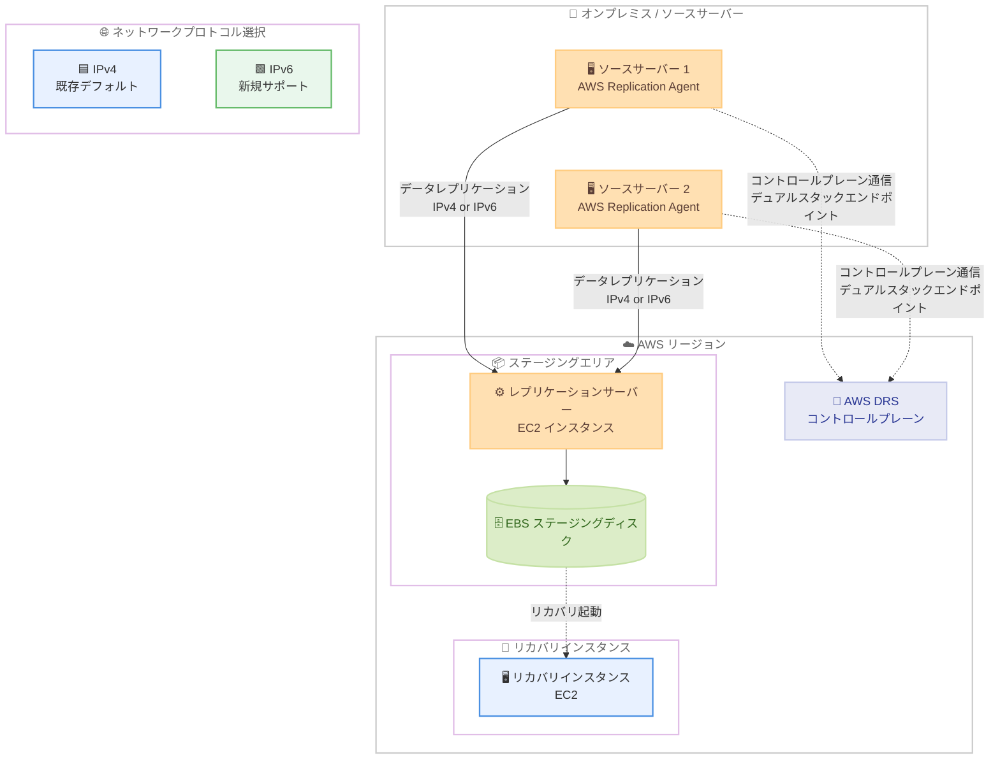

# AWS Elastic Disaster Recovery - IPv6 サポート

**リリース日**: 2026 年 4 月 13 日
**サービス**: AWS Elastic Disaster Recovery (AWS DRS)
**機能**: データレプリケーションおよびコントロールプレーン接続における IPv6 サポート

📊 [このアップデートのインフォグラフィックを見る](https://takech9203.github.io/aws-news-summary/20260413-aws-elastic-disaster-recovery-ipv6.html)

## 概要

AWS Elastic Disaster Recovery (AWS DRS) が、データレプリケーションおよびコントロールプレーン接続の両方で IPv6 をサポートしました。IPv6 のみ、またはデュアルスタックのネットワーク環境を運用しているユーザーは、AWS DRS のレプリケーション設定で IPv6 を使用するよう構成でき、ディザスタリカバリ環境における IPv4 アドレスの必要性を排除できます。

AWS DRS は、手頃なストレージコスト、最小限のコンピューティングリソース、およびポイントインタイムリカバリを活用して、オンプレミスおよびクラウドベースのアプリケーションの高速かつ信頼性の高いリカバリを提供するサービスです。これまで AWS DRS はすべてのレプリケーションおよびサービス通信において IPv4 接続を必要としていましたが、今回のアップデートにより、レプリケーション設定でインターネットプロトコルを IPv6 に設定することで、エージェントとサービス間の通信およびデータレプリケーションにデュアルスタックエンドポイントを使用できるようになりました。

これにより、ネットワークのモダナイゼーション要件への対応が可能となり、IPv4 アドレスが利用できないまたは制限されている環境でもディザスタリカバリを実現できます。既存のレプリケーション設定は影響を受けず、デフォルトでは引き続き IPv4 が使用されます。

**アップデート前の課題**

- AWS DRS のすべてのレプリケーションおよびサービス通信で IPv4 接続が必須であり、IPv6 のみの環境ではディザスタリカバリを構成できなかった
- IPv4 アドレスの枯渇が進む中、ディザスタリカバリ環境にも IPv4 アドレスの割り当てが必要であった
- 米国連邦政府の OMB M-21-07 等、IPv6 対応を求めるコンプライアンス要件を AWS DRS で満たすことが困難であった
- ネットワークモダナイゼーションの一環として IPv6 移行を進める組織において、AWS DRS が移行の障壁となっていた

**アップデート後の改善**

- レプリケーション設定でインターネットプロトコルを `IPV6` に変更するだけで、IPv6 ベースのデータレプリケーションが可能になった
- IPv6 のみのネットワーク環境でも AWS DRS によるディザスタリカバリの構成が可能になった
- デュアルスタックエンドポイントの使用により、エージェントとサービス間の通信が IPv6 経由で行われるようになった
- 既存のレプリケーション設定への影響がなく、段階的な IPv6 移行が可能になった
- IPv4 アドレスの割り当てが不要になるため、ネットワークリソースの効率的な管理が実現できるようになった

## アーキテクチャ図



ソースサーバーの AWS Replication Agent から AWS リージョン内のステージングエリアへのデータレプリケーション、およびコントロールプレーン通信における IPv4/IPv6 の選択肢を示しています。IPv6 を選択すると、デュアルスタックエンドポイント経由でエージェントとサービス間の通信が行われます。

## サービスアップデートの詳細

### 主要機能

1. **IPv6 対応のデータレプリケーション**
   - ソースサーバーから AWS ステージングエリアへのデータレプリケーションで IPv6 を使用可能
   - レプリケーション設定の `internetProtocol` パラメータを `IPV6` に設定することで有効化
   - デュアルスタックエンドポイントを経由して通信が行われる

2. **IPv6 対応のコントロールプレーン接続**
   - AWS Replication Agent と AWS DRS コントロールプレーン間の通信で IPv6 を使用可能
   - サービス API の呼び出しも IPv6 経由で実行可能

3. **既存環境との互換性**
   - 既存のレプリケーション設定は変更されず、デフォルトでは IPv4 が継続使用される
   - 個々のソースサーバーまたはデフォルトレプリケーション設定テンプレートで IPv6 に切り替え可能
   - IP バージョンの変更時には、ソースサーバーが新しいレプリケーターに再接続される際に短い一時停止が発生する

### 技術仕様

| 項目 | 詳細 |
|------|------|
| API パラメータ | `internetProtocol` |
| 有効な値 | `IPV4` (デフォルト)、`IPV6` |
| 対象 API | `UpdateReplicationConfiguration`、`UpdateReplicationConfigurationTemplate`、`CreateReplicationConfigurationTemplate` |
| 通信方式 | IPv6 選択時はデュアルスタックエンドポイントを使用 |
| データレプリケーション | IPv6 対応 |
| コントロールプレーン通信 | IPv6 対応 |
| 既存設定への影響 | なし (デフォルトは IPv4 を維持) |
| 設定変更時の影響 | ソースサーバーとレプリケーターの再接続で短い一時停止が発生 |

### API 変更履歴

**UpdateReplicationConfiguration API**

```json
POST /UpdateReplicationConfiguration HTTP/1.1
Content-type: application/json

{
  "sourceServerID": "s-123456789abcdefgh",
  "internetProtocol": "IPV6",
  "stagingAreaSubnetId": "subnet-123456789abcd",
  ...
}
```

**UpdateReplicationConfigurationTemplate API**

```json
POST /UpdateReplicationConfigurationTemplate HTTP/1.1
Content-type: application/json

{
  "replicationConfigurationTemplateID": "rct-123456789abcdefgh",
  "internetProtocol": "IPV6",
  ...
}
```

**`internetProtocol` パラメータの仕様**

| 属性 | 値 |
|------|------|
| 型 | String |
| 有効な値 | `IPV4`、`IPV6` |
| 必須 | No |
| デフォルト値 | `IPV4` |

## 設定方法

### 前提条件

- AWS DRS が初期化済みのリージョンであること
- ソースサーバーに AWS Replication Agent がインストール済みであること
- ステージングエリアのサブネットが IPv6 をサポートしている (デュアルスタックまたは IPv6 のみのサブネット) こと
- Amazon EC2 が IPv6 をサポートしているリージョンであること
- VPC とサブネットに IPv6 CIDR ブロックが関連付けられていること

### 手順

#### 方法 1: AWS マネジメントコンソールから設定

1. [AWS Elastic Disaster Recovery コンソール](https://console.aws.amazon.com/drs/) にサインインする
2. 左側のナビゲーションペインで「Source Servers」を選択する
3. 対象のソースサーバーを 1 つ以上選択し、「Replication」を選択する
4. 「Edit replication settings」を選択する
5. 「IP Version」セクションで IPv6 を選択する
6. 「Save replication settings」を選択して設定を保存する

#### 方法 2: AWS CLI から個別のソースサーバーの設定を変更

```bash
# 現在のレプリケーション設定を確認
aws drs get-replication-configuration \
  --source-server-id s-123456789abcdefgh

# IPv6 に変更
aws drs update-replication-configuration \
  --source-server-id s-123456789abcdefgh \
  --internet-protocol IPV6 \
  --staging-area-subnet-id subnet-123456789abcd
```

#### 方法 3: デフォルトレプリケーション設定テンプレートを変更

```bash
# デフォルトテンプレートの確認
aws drs describe-replication-configuration-templates

# デフォルトテンプレートを IPv6 に更新
aws drs update-replication-configuration-template \
  --replication-configuration-template-id rct-123456789abcdefgh \
  --internet-protocol IPV6
```

> **注意**: デフォルトレプリケーション設定の変更は、変更後に追加されるソースサーバーにのみ適用されます。既存のソースサーバーには自動的に反映されません。

## メリット

### ビジネス面

- **コンプライアンス対応**: 米国連邦政府の OMB M-21-07 等、IPv6 対応を求める規制要件への準拠が容易になる
- **ネットワークモダナイゼーション**: 組織全体の IPv6 移行計画において、ディザスタリカバリ環境が障壁にならなくなる
- **コスト最適化**: IPv4 アドレスの取得・維持コストが不要になり、AWS における IPv4 パブリックアドレス課金 (1 アドレスあたり $0.005/時間) を回避できる
- **運用の簡素化**: IPv6 のみの環境でディザスタリカバリを一元管理でき、ネットワーク構成の複雑さが軽減される

### 技術面

- **IPv6 ネイティブ対応**: IPv6 のみのネットワーク環境でも AWS DRS を利用したディザスタリカバリが構成可能になる
- **デュアルスタックエンドポイント**: IPv6 選択時にデュアルスタックエンドポイントが使用されるため、柔軟なネットワーク構成が可能
- **非破壊的な設定変更**: IP バージョンの変更は短い一時停止のみで完了し、フルシンクの再実行は不要
- **段階的移行**: 個々のソースサーバー単位で IP バージョンを切り替えられるため、段階的な IPv6 移行が可能
- **既存互換性の維持**: 既存のレプリケーション設定は影響を受けず、デフォルトの IPv4 動作が維持される

## デメリット・制約事項

- **デュアルスタック対応のサブネットが必須**: IPv6 でレプリケーションを行うには、ステージングエリアのサブネットが IPv6 をサポートしている必要がある。既存の IPv4 のみのサブネットでは利用できない
- **IPv6 のみのモードは非対応**: `internetProtocol` を `IPV6` に設定した場合でも、デュアルスタックエンドポイントが使用されるため、純粋な IPv6 のみの通信ではない
- **既存設定の自動更新なし**: デフォルトレプリケーション設定テンプレートを IPv6 に変更しても、既存のソースサーバーには反映されない。個別に設定変更が必要
- **リージョン制約**: AWS DRS が利用可能で、かつ Amazon EC2 が IPv6 をサポートしているリージョンでのみ利用可能
- **一時停止の発生**: IP バージョン変更時にソースサーバーとレプリケーターの再接続が発生し、レプリケーションに短い一時停止が生じる
- **フェイルバック時の考慮**: IPv6 を使用したレプリケーション環境でフェイルバックを行う場合、フェイルバック先のネットワーク環境も IPv6 をサポートしている必要がある

## ユースケース

### ユースケース 1: IPv6 のみのデータセンターからのディザスタリカバリ

IPv4 アドレスを廃止し、IPv6 のみで運用しているデータセンターから AWS へのディザスタリカバリを構成するケースです。

```bash
# VPC に IPv6 CIDR を関連付け
aws ec2 associate-vpc-cidr-block \
  --vpc-id vpc-0123456789abcdef0 \
  --amazon-provided-ipv6-cidr-block

# IPv6 対応のサブネットを作成
aws ec2 create-subnet \
  --vpc-id vpc-0123456789abcdef0 \
  --cidr-block 10.0.1.0/24 \
  --ipv6-cidr-block 2600:1f18:abc:def0::/64 \
  --availability-zone us-east-1a

# AWS DRS のレプリケーション設定を IPv6 に更新
aws drs update-replication-configuration \
  --source-server-id s-0abc123def456789a \
  --internet-protocol IPV6 \
  --staging-area-subnet-id subnet-0abc123def456789a

# レプリケーション状態を確認
aws drs describe-source-servers \
  --filters '{"sourceServerIDs": ["s-0abc123def456789a"]}'
```

### ユースケース 2: 大規模環境における段階的な IPv6 移行

数百台のソースサーバーを保護している環境で、段階的に IPv6 に移行するケースです。まずデフォルトテンプレートを変更し、新規サーバーは IPv6 で追加しつつ、既存サーバーは順次移行します。

```bash
# デフォルトレプリケーション設定テンプレートを IPv6 に更新
# (新規追加されるソースサーバーに適用される)
aws drs update-replication-configuration-template \
  --replication-configuration-template-id rct-0abc123def456789a \
  --internet-protocol IPV6

# 既存のソースサーバーを一括で IPv6 に移行するスクリプト例
#!/bin/bash
SOURCE_SERVERS=$(aws drs describe-source-servers \
  --query 'items[*].sourceServerID' \
  --output text)

for SERVER_ID in $SOURCE_SERVERS; do
  echo "Updating $SERVER_ID to IPv6..."
  aws drs update-replication-configuration \
    --source-server-id "$SERVER_ID" \
    --internet-protocol IPV6

  # 再接続の一時停止を考慮して間隔を空ける
  sleep 30
done
```

### ユースケース 3: マルチリージョンディザスタリカバリ環境での IPv6 統一

複数の AWS リージョンにまたがるディザスタリカバリ環境で、すべてのリージョンのレプリケーション設定を IPv6 に統一するケースです。

```python
import boto3

regions = ['us-east-1', 'us-west-2', 'eu-west-1', 'ap-northeast-1']

for region in regions:
    print(f"Processing region: {region}")
    drs_client = boto3.client('drs', region_name=region)

    try:
        # レプリケーション設定テンプレートを取得
        templates = drs_client.describe_replication_configuration_templates(
            maxResults=100
        )

        for template in templates.get('items', []):
            template_id = template['replicationConfigurationTemplateID']
            current_protocol = template.get('internetProtocol', 'IPV4')

            if current_protocol != 'IPV6':
                print(f"  Updating template {template_id} from {current_protocol} to IPV6")
                drs_client.update_replication_configuration_template(
                    replicationConfigurationTemplateID=template_id,
                    internetProtocol='IPV6'
                )

        # ソースサーバーの設定も更新
        source_servers = drs_client.describe_source_servers(
            filters={}
        )

        for server in source_servers.get('items', []):
            server_id = server['sourceServerID']
            config = drs_client.get_replication_configuration(
                sourceServerID=server_id
            )

            if config.get('internetProtocol', 'IPV4') != 'IPV6':
                print(f"  Updating server {server_id} to IPV6")
                drs_client.update_replication_configuration(
                    sourceServerID=server_id,
                    internetProtocol='IPV6',
                    stagingAreaSubnetId=config['stagingAreaSubnetId']
                )

    except drs_client.exceptions.UninitializedAccountException:
        print(f"  DRS not initialized in {region}, skipping")
    except Exception as e:
        print(f"  Error in {region}: {e}")
```

## 料金

IPv6 サポートの利用に追加料金は発生しません。AWS DRS の既存の料金体系が適用されます。

| 項目 | 料金 |
|------|------|
| AWS DRS 利用料 | $0.028/ソースサーバー/時間 |
| EBS ストレージ | ステージングディスクのボリュームタイプに応じた標準 EBS 料金 |
| EC2 インスタンス | レプリケーションサーバーおよびリカバリインスタンスの標準 EC2 料金 |
| データ転送 | 標準のデータ転送料金 |

**IPv6 移行によるコスト削減の可能性**

- IPv4 パブリックアドレス課金 ($0.005/アドレス/時間) の回避: レプリケーションサーバーでパブリック IPv4 アドレスを使用しない構成が可能になるため、IPv4 アドレス課金を削減できる可能性がある

## 利用可能リージョン

本機能は、AWS DRS が利用可能で、かつ Amazon EC2 が IPv6 をサポートしているすべての AWS リージョンで利用可能です。最新のリージョン対応状況は [AWS Regional Services List](https://aws.amazon.com/about-aws/global-infrastructure/regional-product-services/) を参照してください。

AWS DRS は以下のリージョンで提供されています。

| リージョン | リージョンコード |
|------------|------------------|
| 米国東部 (バージニア北部) | us-east-1 |
| 米国東部 (オハイオ) | us-east-2 |
| 米国西部 (北カリフォルニア) | us-west-1 |
| 米国西部 (オレゴン) | us-west-2 |
| アフリカ (ケープタウン) | af-south-1 |
| アジアパシフィック (香港) | ap-east-1 |
| アジアパシフィック (ムンバイ) | ap-south-1 |
| アジアパシフィック (ソウル) | ap-northeast-2 |
| アジアパシフィック (シンガポール) | ap-southeast-1 |
| アジアパシフィック (シドニー) | ap-southeast-2 |
| アジアパシフィック (東京) | ap-northeast-1 |
| カナダ (中部) | ca-central-1 |
| 欧州 (フランクフルト) | eu-central-1 |
| 欧州 (アイルランド) | eu-west-1 |
| 欧州 (ロンドン) | eu-west-2 |
| 欧州 (パリ) | eu-west-3 |
| 欧州 (ストックホルム) | eu-north-1 |
| 中東 (バーレーン) | me-south-1 |
| 南米 (サンパウロ) | sa-east-1 |

> **注意**: リージョン対応状況は変更される場合があります。最新情報は AWS 公式ドキュメントを確認してください。

## 関連サービス・機能

- **Amazon VPC IPv6**: VPC でのデュアルスタックおよび IPv6 のみのサブネット構成を提供し、AWS DRS の IPv6 レプリケーションの基盤となる
- **Amazon EC2 IPv6**: EC2 インスタンスでの IPv6 サポートを提供し、レプリケーションサーバーおよびリカバリインスタンスの IPv6 接続を実現する
- **AWS Application Migration Service (AWS MGN)**: AWS DRS の姉妹サービスであり、同様の IPv6 対応が将来的に期待される
- **Amazon ElastiCache Serverless IPv6**: 2026 年 4 月に発表された ElastiCache Serverless の IPv6 およびデュアルスタックサポート。AWS 全体での IPv6 対応拡大の流れの一部
- **Amazon MSK デュアルスタック**: 2026 年 2 月に発表された Amazon MSK の IPv4/IPv6 デュアルスタックサポート
- **Amazon RDS IPv6 VPC エンドポイント**: 2026 年 1 月に発表された Amazon RDS の IPv6 VPC エンドポイントサポート

## 参考リンク

- 📊 [インフォグラフィック](https://takech9203.github.io/aws-news-summary/20260413-aws-elastic-disaster-recovery-ipv6.html)
- [公式発表 (What's New)](https://aws.amazon.com/about-aws/whats-new/2026/04/aws-elastic-disaster-recovery-ipv6/)
- [AWS Elastic Disaster Recovery ドキュメント](https://docs.aws.amazon.com/drs/latest/userguide/what-is-drs.html)
- [AWS DRS レプリケーション設定](https://docs.aws.amazon.com/drs/latest/userguide/replication-settings.html)
- [AWS DRS 個別レプリケーション設定](https://docs.aws.amazon.com/drs/latest/userguide/individual-replication-settings.html)
- [UpdateReplicationConfiguration API リファレンス](https://docs.aws.amazon.com/drs/latest/APIReference/API_UpdateReplicationConfiguration.html)
- [UpdateReplicationConfigurationTemplate API リファレンス](https://docs.aws.amazon.com/drs/latest/APIReference/API_UpdateReplicationConfigurationTemplate.html)
- [料金ページ](https://aws.amazon.com/disaster-recovery/pricing/)
- [AWS Elastic Disaster Recovery コンソール](https://console.aws.amazon.com/drs/)
- [AWS Regional Services List](https://aws.amazon.com/about-aws/global-infrastructure/regional-product-services/)

## まとめ

AWS Elastic Disaster Recovery (AWS DRS) が IPv6 をサポートしたことにより、IPv6 のみまたはデュアルスタックのネットワーク環境においてもディザスタリカバリを構成できるようになりました。レプリケーション設定の `internetProtocol` パラメータを `IPV6` に設定するだけで、データレプリケーションおよびコントロールプレーン通信がデュアルスタックエンドポイント経由で行われます。

既存のレプリケーション設定には影響がなく、デフォルトでは引き続き IPv4 が使用されるため、段階的な IPv6 移行が可能です。IPv4 アドレスの枯渇対策、コンプライアンス要件への対応、ネットワークモダナイゼーションの推進など、多くのユースケースで有用なアップデートです。追加料金なしで、AWS DRS が利用可能なすべてのリージョン (Amazon EC2 が IPv6 をサポートしているリージョン) で即座に利用開始できます。
