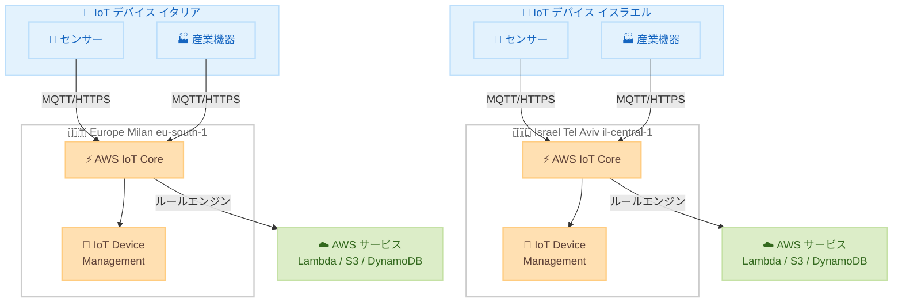

# AWS IoT - Israel (Tel Aviv) および Europe (Milan) リージョンでの提供開始

**リリース日**: 2026 年 4 月 13 日
**サービス**: AWS IoT Core、AWS IoT Device Management
**機能**: Israel (Tel Aviv) および Europe (Milan) リージョンへの拡大

📊 [このアップデートのインフォグラフィックを見る](https://takech9203.github.io/aws-news-summary/20260413-aws-iot-israel-tel-aviv-europe-milan.html)

## 概要

AWS IoT Core および AWS IoT Device Management が、Israel (Tel Aviv) リージョン (il-central-1) と Europe (Milan) リージョン (eu-south-1) で利用可能になりました。今回の拡大により、これらのリージョンで事業を展開する組織は、地元の顧客により近い場所で IoT ワークロードを実行できるようになります。

この拡大は、レスポンスタイムの短縮、データレジデンシー要件への対応強化、データ転送コストの削減など、複数のメリットをもたらします。AWS IoT Core は、数十億台の IoT デバイスをクラウドに安全に接続し、大規模に管理するためのマネージドクラウドサービスです。MQTT、HTTPS、LoRaWAN (一部リージョン) などの業界標準プロトコルを通じて、数兆件のメッセージを IoT デバイスと AWS エンドポイント間で双方向にルーティングします。

今回のリージョン拡大により、AWS IoT は世界 27 の AWS リージョンで利用可能となりました。イスラエルおよび南ヨーロッパの企業や開発者は、データを自国・自地域内に保持しながら、AWS IoT の豊富な機能を活用した IoT ソリューションを構築できるようになります。

**アップデート前の課題**

- Israel (Tel Aviv) および Europe (Milan) リージョンでは AWS IoT Core と AWS IoT Device Management が利用できなかった
- これらの地域の組織は、他のリージョン (例: Europe (Frankfurt) や Europe (Ireland)) にデータを送信する必要があり、レイテンシーが高かった
- イスラエルやイタリアの法規制に基づくデータレジデンシー要件を満たすことが困難だった
- リージョン間のデータ転送にコストがかかっていた

**アップデート後の改善**

- Israel (Tel Aviv) および Europe (Milan) リージョンで直接 AWS IoT Core と AWS IoT Device Management を利用可能になった
- デバイスとクラウド間の通信レイテンシーが大幅に低減された
- データをローカルリージョン内に保持でき、データレジデンシー要件への準拠が容易になった
- リージョン間データ転送コストが不要になり、運用コストが削減された

## アーキテクチャ図



新しく対応した 2 つのリージョンにおける AWS IoT Core と AWS IoT Device Management の構成を示しています。各リージョンのローカルデバイスが MQTT/HTTPS プロトコルで直接接続し、ルールエンジンを通じて他の AWS サービスと連携します。

## サービスアップデートの詳細

### 主要機能

1. **AWS IoT Core の新リージョン対応**
   - MQTT、HTTPS プロトコルによるデバイス接続をサポート
   - メッセージブローカーによる双方向メッセージルーティング
   - ルールエンジンによる他の AWS サービスへのデータ転送
   - Device Shadow によるデバイス状態管理

2. **AWS IoT Device Management の新リージョン対応**
   - デバイスの検索、整理、監視、リモート管理が可能
   - デバイスのグルーピングとフリート管理
   - OTA (Over-The-Air) アップデートの配信
   - デバイスのインデックス作成と検索

3. **データレジデンシーの強化**
   - イスラエルおよびイタリアの国内にデータを保持可能
   - GDPR やイスラエルのプライバシー保護法への準拠が容易
   - 規制の厳しい業界 (ヘルスケア、金融、公共セクター) での IoT 導入が促進

## 技術仕様

### 対応プロトコルと機能

| 項目 | 詳細 |
|------|------|
| 対応プロトコル | MQTT 3.1.1、MQTT 5.0、HTTPS、WebSocket |
| メッセージブローカー | Pub/Sub メッセージング、双方向通信 |
| ルールエンジン | SQL ベースのルールで AWS サービスへデータ転送 |
| Device Shadow | デバイス状態の仮想表現、オフラインデバイス管理 |
| セキュリティ | X.509 証明書、AWS SigV4、カスタム認証 |
| 新規対応リージョン | il-central-1、eu-south-1 |

### リージョンエンドポイント

| リージョン | リージョンコード | IoT Core エンドポイント |
|-----------|-----------------|------------------------|
| Israel (Tel Aviv) | il-central-1 | iot.il-central-1.amazonaws.com |
| Europe (Milan) | eu-south-1 | iot.eu-south-1.amazonaws.com |

### API 変更履歴

今回のアップデートはリージョン拡大であり、API 自体の変更はありません。既存の AWS IoT Core および AWS IoT Device Management の API がそのまま新しいリージョンで利用可能です。

## 設定方法

### 前提条件

1. AWS アカウントで Israel (Tel Aviv) または Europe (Milan) リージョンが有効化されている
2. IAM ユーザーまたはロールに適切な IoT 関連のポリシーが付与されている
3. AWS CLI v2 がインストールされている

### 手順

#### ステップ 1: リージョンの有効化を確認

```bash
# Israel (Tel Aviv) リージョンが有効化されているか確認
aws account get-region-opt-status --region-name il-central-1

# Europe (Milan) リージョンが有効化されているか確認
aws account get-region-opt-status --region-name eu-south-1
```

Israel (Tel Aviv) および Europe (Milan) はオプトインリージョンです。未有効化の場合は、AWS マネジメントコンソールの「アカウント設定」からリージョンを有効化してください。

#### ステップ 2: IoT Core エンドポイントの取得

```bash
# Israel (Tel Aviv) リージョンのエンドポイントを取得
aws iot describe-endpoint \
  --endpoint-type iot:Data-ATS \
  --region il-central-1

# Europe (Milan) リージョンのエンドポイントを取得
aws iot describe-endpoint \
  --endpoint-type iot:Data-ATS \
  --region eu-south-1
```

このコマンドは、デバイスが接続するためのカスタムエンドポイント URL を返します。デバイス側の接続設定にこのエンドポイントを使用します。

#### ステップ 3: IoT Thing の作成とデバイス証明書のセットアップ

```bash
# Thing の作成 (Israel リージョン)
aws iot create-thing \
  --thing-name "MyDevice" \
  --region il-central-1

# デバイス証明書の作成
aws iot create-keys-and-certificate \
  --set-as-active \
  --certificate-pem-outfile certificate.pem \
  --public-key-outfile public.key \
  --private-key-outfile private.key \
  --region il-central-1

# ポリシーの作成
aws iot create-policy \
  --policy-name "MyDevicePolicy" \
  --policy-document '{
    "Version": "2012-10-17",
    "Statement": [
      {
        "Effect": "Allow",
        "Action": [
          "iot:Connect",
          "iot:Publish",
          "iot:Subscribe",
          "iot:Receive"
        ],
        "Resource": "*"
      }
    ]
  }' \
  --region il-central-1
```

Thing の作成、証明書の発行、ポリシーの設定を行います。証明書をポリシーと Thing にアタッチして、デバイスからの接続を許可します。

#### ステップ 4: デバイスからの MQTT 接続テスト

```python
# Python (AWS IoT Device SDK v2) を使用した接続例
from awscrt import mqtt
from awsiot import mqtt_connection_builder

# Israel (Tel Aviv) リージョンへの接続
connection = mqtt_connection_builder.mtls_from_path(
    endpoint="<your-iot-endpoint>-ats.iot.il-central-1.amazonaws.com",
    cert_filepath="certificate.pem",
    pri_key_filepath="private.key",
    ca_filepath="AmazonRootCA1.pem",
    client_id="MyDevice",
    clean_session=False,
    keep_alive_secs=30
)

connect_future = connection.connect()
connect_future.result()
print("Connected to AWS IoT Core in Israel (Tel Aviv)")
```

AWS IoT Device SDK v2 for Python を使用して、新しいリージョンの IoT Core エンドポイントに MQTT 接続を確立します。

## メリット

### ビジネス面

- **データレジデンシー要件への対応**: イスラエルおよびイタリアの規制に準拠したデータ保管が可能になり、規制の厳しい業界での IoT 採用が促進される
- **レイテンシーの低減による UX 向上**: ローカルリージョンでの処理により、デバイスの応答時間が短縮され、リアルタイム性が求められるアプリケーションの品質が向上
- **データ転送コストの削減**: リージョン間データ転送が不要になり、大量のデバイスからのデータ収集における運用コストが削減される

### 技術面

- **低レイテンシーのデバイス通信**: 地理的に近いリージョンへの接続により、MQTT/HTTPS 通信の往復時間が短縮される
- **ローカルなルールエンジン処理**: IoT ルールエンジンの処理がローカルリージョンで実行され、データ処理パイプライン全体のレイテンシーが低減される
- **ディザスタリカバリの選択肢拡大**: 新しいリージョンの追加により、マルチリージョン構成やフェイルオーバー戦略の選択肢が増加

## デメリット・制約事項

### 制限事項

- Israel (Tel Aviv) および Europe (Milan) はオプトインリージョンであるため、使用前に明示的な有効化が必要
- LoRaWAN のサポートは一部リージョンに限定されており、新しいリージョンでの対応状況は個別に確認が必要
- 一部の IoT 関連サービス (AWS IoT Greengrass、AWS IoT SiteWise、AWS IoT Events など) は、これらのリージョンで利用可能とは限らない

### 考慮すべき点

- 既存のリージョンから移行する場合、IoT Thing や証明書、ポリシーなどのリソースを新しいリージョンに再作成する必要がある
- デバイスのファームウェアに含まれるエンドポイント URL の変更が必要になる場合がある
- リージョン固有のサービスクォータ (制限値) が他のリージョンと異なる可能性がある

## ユースケース

### ユースケース 1: イスラエルのスマートシティ IoT プラットフォーム

**シナリオ**: イスラエルの自治体が、都市インフラの監視とスマートシティソリューションを構築する場合。交通センサー、環境モニタリングデバイス、街灯制御システムなどの IoT デバイスを大規模に展開する。

**実装例**:
```python
import json
from awscrt import mqtt

# 交通センサーデータの送信
def publish_traffic_data(connection, sensor_id, data):
    topic = f"smartcity/telaviv/traffic/{sensor_id}"
    payload = json.dumps({
        "sensor_id": sensor_id,
        "vehicle_count": data["count"],
        "average_speed": data["speed"],
        "timestamp": data["timestamp"],
        "region": "il-central-1"
    })
    connection.publish(
        topic=topic,
        payload=payload,
        qos=mqtt.QoS.AT_LEAST_ONCE
    )
```

**効果**: イスラエル国内にデータを保持しながら、低レイテンシーでリアルタイムの交通データを収集・分析できる。イスラエルのプライバシー保護法に準拠した運用が可能。

### ユースケース 2: イタリアの製造業における産業 IoT

**シナリオ**: イタリアの製造メーカーが、工場の設備稼働状況をリアルタイムで監視し、予知保全を実現する場合。

**実装例**:
```python
import json

# IoT ルールエンジンの SQL ルール例
# 異常温度を検知して Lambda 関数をトリガー
iot_rule_sql = """
SELECT
  topic(3) as device_id,
  temperature,
  vibration,
  timestamp() as event_time
FROM
  'factory/milan/equipment/+/telemetry'
WHERE
  temperature > 85.0 OR vibration > 10.0
"""

# AWS CLI でルールを作成
# aws iot create-topic-rule \
#   --rule-name "AnomalyDetection" \
#   --topic-rule-payload '{
#     "sql": "<上記 SQL>",
#     "actions": [{
#       "lambda": {
#         "functionArn": "arn:aws:lambda:eu-south-1:123456789012:function:AlertHandler"
#       }
#     }]
#   }' \
#   --region eu-south-1
```

**効果**: GDPR に準拠してイタリア国内でデータを処理し、設備の異常を即座に検知してダウンタイムを最小化できる。

### ユースケース 3: リモートデバイス管理とファームウェア更新

**シナリオ**: 中東・南ヨーロッパに展開された数千台の IoT デバイスに対して、AWS IoT Device Management を使用してリモートでファームウェア更新を行う場合。

**実装例**:
```bash
# OTA ジョブの作成 (Israel リージョン)
aws iot create-job \
  --job-id "firmware-update-2026-04" \
  --targets "arn:aws:iot:il-central-1:123456789012:thinggroup/AllSensors" \
  --document '{
    "operation": "firmware_update",
    "version": "2.1.0",
    "s3_url": "s3://my-firmware-bucket-il/firmware-v2.1.0.bin"
  }' \
  --target-selection SNAPSHOT \
  --job-executions-rollout-config '{
    "maximumPerMinute": 50
  }' \
  --region il-central-1

# ジョブの実行状況を確認
aws iot describe-job \
  --job-id "firmware-update-2026-04" \
  --region il-central-1
```

**効果**: ローカルリージョンからファームウェアを配信することで、転送速度が向上しデータ転送コストが削減される。ロールアウト設定により、段階的で安全な更新が可能。

## 料金

AWS IoT Core および AWS IoT Device Management の料金は、リージョンごとに設定されています。Israel (Tel Aviv) および Europe (Milan) リージョンでの料金は、他のリージョンと同等の料金体系に基づきます。

### AWS IoT Core の主な料金コンポーネント

| コンポーネント | 課金単位 | 概算料金 |
|---------------|---------|---------|
| 接続 (Connectivity) | 100 万分の接続時間あたり | $0.08 |
| メッセージング (Messaging) | メッセージ 100 万件あたり (5KB) | $1.00 |
| ルールエンジン (Rules Engine) | ルールトリガー/アクション 100 万件あたり | $0.15 |
| Device Shadow 操作 | 操作 100 万件あたり | $1.25 |

**注意**: 上記は概算であり、実際の料金はリージョンや利用条件により異なります。最新の料金は公式料金ページをご確認ください。

### AWS IoT Device Management の主な料金コンポーネント

| コンポーネント | 課金単位 | 概算料金 |
|---------------|---------|---------|
| デバイスの登録 | デバイスあたり | 無料 |
| リモートアクション | 実行あたり | $0.003 |
| デバイスインデックス | デバイスあたり/月 | $0.0042 |

## 利用可能リージョン

今回の拡大により、AWS IoT は世界 27 の AWS リージョンで利用可能になりました。以下は AWS IoT Core の利用可能リージョン一覧です。

**北米**
- US East (N. Virginia) - us-east-1
- US East (Ohio) - us-east-2
- US West (N. California) - us-west-1
- US West (Oregon) - us-west-2
- Canada (Central) - ca-central-1
- AWS GovCloud (US-East) - us-gov-east-1
- AWS GovCloud (US-West) - us-gov-west-1

**ヨーロッパ**
- Europe (Frankfurt) - eu-central-1
- Europe (Ireland) - eu-west-1
- Europe (London) - eu-west-2
- Europe (Milan) - eu-south-1 **[NEW]**
- Europe (Paris) - eu-west-3
- Europe (Spain) - eu-south-2
- Europe (Stockholm) - eu-north-1

**アジアパシフィック**
- Asia Pacific (Hong Kong) - ap-east-1
- Asia Pacific (Malaysia) - ap-southeast-5
- Asia Pacific (Mumbai) - ap-south-1
- Asia Pacific (Seoul) - ap-northeast-2
- Asia Pacific (Singapore) - ap-southeast-1
- Asia Pacific (Sydney) - ap-southeast-2
- Asia Pacific (Tokyo) - ap-northeast-1

**中東・アフリカ**
- Israel (Tel Aviv) - il-central-1 **[NEW]**
- Middle East (Bahrain) - me-south-1
- Middle East (UAE) - me-central-1

**南米**
- South America (Sao Paulo) - sa-east-1

## 関連サービス・機能

- **AWS IoT Core**: IoT デバイスとクラウド間の安全な双方向通信を提供するメッセージブローカー
- **AWS IoT Device Management**: IoT デバイスの登録、整理、監視、リモート管理を大規模に実行するサービス
- **AWS IoT Greengrass**: エッジデバイス上でローカルコンピューティング、メッセージング、データキャッシュを実行するサービス
- **AWS IoT SiteWise**: 産業機器からのデータ収集、整理、分析を行うマネージドサービス
- **AWS IoT Events**: IoT デバイスやアプリケーションからのイベントを検出し、応答するサービス
- **Amazon Kinesis**: IoT デバイスからの大量のストリーミングデータをリアルタイムで処理するサービス

## 参考リンク

- 📊 [インフォグラフィック](https://takech9203.github.io/aws-news-summary/20260413-aws-iot-israel-tel-aviv-europe-milan.html)
- [公式発表 (What's New)](https://aws.amazon.com/about-aws/whats-new/2026/04/aws-iot-israel-tel-aviv-europe-milan/)
- [AWS IoT Core ドキュメント](https://docs.aws.amazon.com/iot/latest/developerguide/what-is-aws-iot.html)
- [AWS IoT Device Management ドキュメント](https://docs.aws.amazon.com/iot-device-management/latest/developerguide/what-is-device-management.html)
- [AWS IoT Core 料金ページ](https://aws.amazon.com/iot-core/pricing/)
- [AWS IoT Device Management 料金ページ](https://aws.amazon.com/iot-device-management/pricing/)
- [AWS IoT Core エンドポイントとクォータ](https://docs.aws.amazon.com/general/latest/gr/iot-core.html)

## まとめ

AWS IoT Core と AWS IoT Device Management の Israel (Tel Aviv) および Europe (Milan) リージョンへの拡大は、これらの地域で IoT ソリューションを展開する組織にとって重要なアップデートです。データレジデンシー要件への対応、レイテンシーの低減、データ転送コストの削減が実現され、特に GDPR やイスラエルのプライバシー保護法に準拠する必要がある組織にとって大きな価値があります。イスラエルや南ヨーロッパで IoT ワークロードを運用している場合は、ローカルリージョンへの移行または新規展開を検討することをお勧めします。
