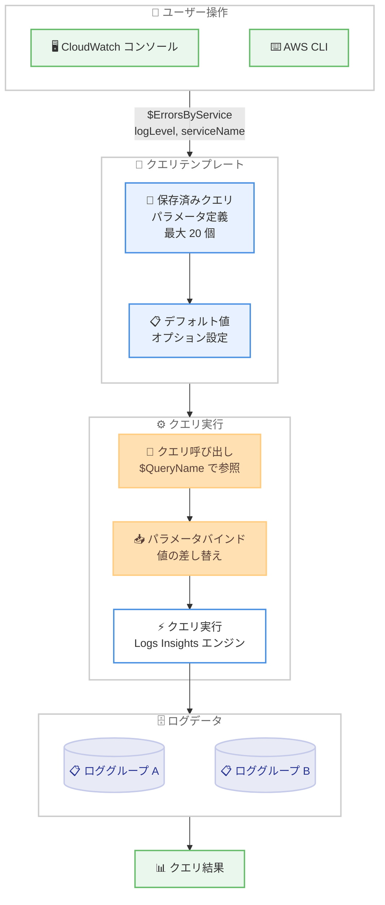

# Amazon CloudWatch Logs Insights - 保存済みクエリのパラメータサポート

**リリース日**: 2026 年 4 月 13 日
**サービス**: Amazon CloudWatch Logs
**機能**: CloudWatch Logs Insights 保存済みクエリのパラメータサポート

📊 [このアップデートのインフォグラフィックを見る](https://takech9203.github.io/aws-news-summary/20260413-cloudwatch-logs-insights-query-params.html)

## 概要

Amazon CloudWatch Logs Insights の保存済みクエリがパラメータをサポートするようになりました。このアップデートにより、プレースホルダーを含む再利用可能なクエリテンプレートを作成し、実行時に値を渡すことが可能になります。ログレベル、サービス名、時間間隔などの特定の値のみが異なるほぼ同一のクエリを複数管理する必要がなくなり、運用効率が大幅に向上します。

1 つのクエリに最大 20 個のパラメータを定義でき、各パラメータにはオプションでデフォルト値を設定できます。クエリの実行時には、クエリ名の前に `$` を付けてパラメータ値を渡す構文を使用します。例えば `$ErrorsByService(logLevel="ERROR", serviceName="OrderEntry")` のように呼び出すことで、共通のクエリテンプレートを異なる条件で繰り返し実行できます。

**アップデート前の課題**

- ログレベルやサービス名が異なるだけのほぼ同一のクエリを複数コピーして管理する必要があり、保存済みクエリの数が増大していた
- クエリの修正が必要な場合、すべてのコピーを個別に更新する必要があり、メンテナンスコストが高かった
- チーム間でクエリを共有する際、各メンバーが環境に合わせてクエリを手動で書き換える必要があった

**アップデート後の改善**

- パラメータ付きの単一テンプレートで複数の条件に対応でき、保存済みクエリの管理が大幅に簡素化された
- テンプレートの修正が 1 箇所で済むようになり、クエリのメンテナンスコストが削減された
- パラメータを変更するだけで異なる条件のクエリを実行でき、チーム間での再利用性が向上した

## アーキテクチャ図



CloudWatch Logs Insights のパラメータ付き保存済みクエリのワークフローを示しています。ユーザーが `$` プレフィックス付きのクエリ名とパラメータ値を指定すると、テンプレートからパラメータがバインドされ、Logs Insights エンジンでクエリが実行されます。

## サービスアップデートの詳細

### 主要機能

1. **パラメータ付き保存済みクエリ**
   - 保存済みクエリにプレースホルダーとしてパラメータを定義可能
   - 1 つのクエリあたり最大 20 個のパラメータをサポート
   - ログレベル、サービス名、時間間隔など任意の値をパラメータ化できる

2. **デフォルト値のサポート**
   - 各パラメータにオプションでデフォルト値を設定可能
   - デフォルト値が設定されたパラメータは、呼び出し時に省略可能
   - よく使う値をデフォルトに設定し、必要な場合のみ上書きする運用が可能

3. **$ プレフィックスによるクエリ呼び出し構文**
   - クエリ名の前に `$` を付けて実行する直感的な構文を採用
   - `$QueryName(param1="value1", param2="value2")` の形式で呼び出し
   - 関数呼び出しに似た構文で、開発者にとって馴染みやすい

## 技術仕様

### パラメータ仕様

| 項目 | 詳細 |
|------|------|
| 最大パラメータ数 | 1 クエリあたり 20 個 |
| デフォルト値 | 各パラメータにオプションで設定可能 |
| 呼び出し構文 | `$QueryName(param1="value1", param2="value2")` |
| パラメータ型 | 文字列値として渡される |
| 対応インターフェース | CloudWatch コンソール、AWS CLI、API |

### クエリテンプレートの構文例

```
# パラメータ付き保存済みクエリの定義例
# クエリ名: ErrorsByService
# パラメータ: logLevel (デフォルト: "ERROR"), serviceName (デフォルトなし)

fields @timestamp, @message, @logStream
| filter @message like /(?i){logLevel}/
| filter @logStream like /(?i){serviceName}/
| sort @timestamp desc
| limit 100
```

### API 変更履歴

今回のアップデートに直接対応する CloudWatch Logs の API 変更は、直近 7 日間の API 変更フィードでは確認されていません。

なお、関連する最近の CloudWatch サービスの API 変更として以下があります。

| 日付 | サービス | 変更内容 |
|------|----------|----------|
| 2026/04/10 | [CloudWatch Observability Admin Service](https://awsapichanges.com/archive/changes/974e23-observabilityadmin.html) | 8 updated api methods - マルチリージョンテレメトリ評価とテレメトリ有効化ルールのサポート追加 |

### 必要な IAM 権限

```json
{
  "Version": "2012-10-17",
  "Statement": [
    {
      "Effect": "Allow",
      "Action": [
        "logs:PutQueryDefinition",
        "logs:DescribeQueryDefinitions",
        "logs:DeleteQueryDefinition",
        "logs:StartQuery",
        "logs:GetQueryResults"
      ],
      "Resource": "*"
    }
  ]
}
```

上記は、パラメータ付き保存済みクエリの作成・管理・実行に必要な IAM 権限の例です。`logs:PutQueryDefinition` でクエリの作成・更新、`logs:StartQuery` で実行を許可しています。

## 設定方法

### 前提条件

1. AWS アカウントで CloudWatch Logs Insights が利用可能であること
2. 保存済みクエリの作成・実行に必要な IAM 権限が付与されていること
3. 対象のロググループにログデータが存在すること

### 手順

#### ステップ 1: パラメータ付き保存済みクエリの作成

```bash
# パラメータ付き保存済みクエリを作成
aws logs put-query-definition \
  --name "ErrorsByService" \
  --log-group-names "/aws/lambda/my-service" "/aws/ecs/my-cluster" \
  --query-string 'fields @timestamp, @message, @logStream
| filter @message like /(?i){logLevel}/
| filter @logStream like /(?i){serviceName}/
| sort @timestamp desc
| limit 100'
```

`{logLevel}` と `{serviceName}` がパラメータとして定義されます。クエリ実行時にこれらのプレースホルダーに値が渡されます。

#### ステップ 2: パラメータ付きクエリの実行

CloudWatch コンソールのクエリエディタで、以下のように `$` プレフィックスを使用してクエリを呼び出します。

```
$ErrorsByService(logLevel="ERROR", serviceName="OrderEntry")
```

上記のコマンドは、保存済みクエリ `ErrorsByService` を `logLevel` に "ERROR"、`serviceName` に "OrderEntry" を渡して実行します。

#### ステップ 3: 異なるパラメータでの再実行

```
# WARN レベルのログを別のサービスで検索
$ErrorsByService(logLevel="WARN", serviceName="PaymentService")

# デフォルト値がある場合はパラメータを省略可能
$ErrorsByService(serviceName="UserAuth")
```

同じテンプレートを異なるパラメータ値で繰り返し実行できます。デフォルト値が設定されたパラメータは省略可能です。

## メリット

### ビジネス面

- **運用効率の向上**: 類似クエリの重複管理が不要になり、運用チームの作業時間を大幅に削減できる
- **ナレッジの標準化**: パラメータ付きテンプレートをチーム内で共有することで、クエリの品質と一貫性を組織全体で維持できる
- **障害対応の迅速化**: パラメータを変更するだけで異なるサービスやログレベルの調査が可能になり、インシデント対応のスピードが向上する

### 技術面

- **クエリの再利用性向上**: 1 つのテンプレートで複数の条件をカバーでき、保存済みクエリの管理数を大幅に削減できる
- **メンテナンスコストの削減**: クエリロジックの修正が 1 箇所で完了し、すべての利用者に即座に反映される
- **ヒューマンエラーの防止**: パラメータ化により、クエリのコピー・編集時に発生しやすい構文ミスを回避できる

## デメリット・制約事項

### 制限事項

- 1 つのクエリあたりのパラメータ数は最大 20 個に制限されている
- パラメータ値は文字列として渡されるため、複雑なデータ型の直接的な指定には対応していない
- 既存の保存済みクエリをパラメータ付きに変換するには、クエリの再定義が必要

### 考慮すべき点

- パラメータ名の命名規則をチーム内で統一し、可読性と再利用性を維持することが推奨される
- デフォルト値の設定は任意であるが、頻繁に使用する値をデフォルトに設定することで、日常的な利用の効率が向上する
- パラメータ付きクエリの実行時に渡すパラメータ値は、クエリの結果に直接影響するため、値の妥当性をユーザー側で確認する必要がある

## ユースケース

### ユースケース 1: DevOps チームによるマルチサービス障害調査

**シナリオ**: マイクロサービスアーキテクチャを運用する DevOps チームが、複数のサービスにまたがる障害調査を効率的に実施したい。サービスごとに個別のクエリを作成する代わりに、パラメータ付きテンプレートで統一的な調査を行う。

**実装例**:
```
# 保存済みクエリテンプレート: ServiceHealthCheck
fields @timestamp, @message, @logStream
| filter @message like /(?i){logLevel}/
| filter @logStream like /(?i){serviceName}/
| stats count(*) as errorCount by bin(30m)
| sort errorCount desc

# 実行例: 各サービスの ERROR を順番に確認
$ServiceHealthCheck(logLevel="ERROR", serviceName="OrderService")
$ServiceHealthCheck(logLevel="ERROR", serviceName="PaymentService")
$ServiceHealthCheck(logLevel="ERROR", serviceName="InventoryService")
```

**効果**: 1 つのテンプレートで全サービスの障害調査が可能になり、調査時間を短縮できる。クエリの構文が統一されるため、結果の比較も容易になる。

### ユースケース 2: セキュリティチームによるログレベル別分析

**シナリオ**: セキュリティチームが、異なるログレベルやイベントタイプごとにログを分析する必要がある。パラメータ付きクエリにより、分析条件を柔軟に切り替えながら調査を進める。

**実装例**:
```
# 保存済みクエリテンプレート: SecurityEventAnalysis
fields @timestamp, @message, sourceIPAddress, eventName
| filter @message like /(?i){eventType}/
| filter sourceIPAddress like "{ipRange}"
| sort @timestamp desc
| limit {resultLimit}

# 実行例: 不正アクセスの疑いがある IP 帯域を調査
$SecurityEventAnalysis(eventType="UnauthorizedAccess", ipRange="192.168", resultLimit="500")
$SecurityEventAnalysis(eventType="AccessDenied", ipRange="10.0", resultLimit="200")
```

**効果**: イベントタイプや IP レンジの条件を変更するだけで多角的な分析が可能になり、セキュリティインシデントの早期発見と対応が効率化される。

### ユースケース 3: 開発チームによる環境別パフォーマンス分析

**シナリオ**: 開発チームが本番環境、ステージング環境、開発環境のパフォーマンスログを比較分析したい。環境ごとに異なるロググループを持つが、分析クエリのロジックは共通である。

**実装例**:
```
# 保存済みクエリテンプレート: LatencyAnalysis
fields @timestamp, @message, @duration
| filter @message like /(?i){endpoint}/
| filter @duration > {thresholdMs}
| stats avg(@duration) as avgLatency, max(@duration) as maxLatency,
        count(*) as requestCount by bin(5m)
| sort avgLatency desc

# 実行例: 各環境の API レイテンシーを比較
$LatencyAnalysis(endpoint="/api/orders", thresholdMs="1000")
$LatencyAnalysis(endpoint="/api/payments", thresholdMs="500")
```

**効果**: 同一のクエリテンプレートで環境間のパフォーマンス比較が容易になり、環境差異に起因する問題の特定が迅速化される。

## 料金

パラメータ付き保存済みクエリ機能自体には追加料金は発生しません。CloudWatch Logs Insights の標準的な料金体系が適用されます。

### 料金例

| 項目 | 月額料金 (概算) |
|--------|------------------|
| パラメータ付きクエリの作成・管理 | 追加料金なし |
| クエリ実行 | スキャンされたデータ 1GB あたり $0.0050 (us-east-1) |
| ログの取り込み | 1GB あたり $0.50 (us-east-1) |
| ログのストレージ | 1GB あたり $0.03/月 (us-east-1) |

最新の料金情報は [Amazon CloudWatch 料金ページ](https://aws.amazon.com/cloudwatch/pricing/) を確認してください。料金はリージョンによって異なります。

## 利用可能リージョン

すべての商用 AWS リージョンで利用可能です。GovCloud および中国リージョンでの対応状況については、各リージョンの CloudWatch Logs Insights のドキュメントを確認してください。

## 関連サービス・機能

- **Amazon CloudWatch Logs Insights**: 本機能のベースとなるインタラクティブなログ分析サービス。クエリ言語を使用してログデータの検索・分析が可能
- **Amazon CloudWatch Logs**: ログデータの収集・保存を担うサービス。Logs Insights のクエリ対象となるロググループを管理する
- **Amazon CloudWatch Dashboards**: パラメータ付きクエリの結果をダッシュボードに組み込むことで、動的な監視画面を構築可能
- **AWS CLI / SDK**: プログラムからパラメータ付きクエリの作成・実行を自動化でき、CI/CD パイプラインやスクリプトとの統合が可能

## 参考リンク

- 📊 [インフォグラフィック](https://takech9203.github.io/aws-news-summary/20260413-cloudwatch-logs-insights-query-params.html)
- [公式発表 (What's New)](https://aws.amazon.com/about-aws/whats-new/2026/03/cloudwatch-logs-insights-query-params/)
- [CloudWatch Logs Insights ドキュメント](https://docs.aws.amazon.com/AmazonCloudWatch/latest/logs/AnalyzingLogData.html)
- [CloudWatch Logs Insights クエリ構文](https://docs.aws.amazon.com/AmazonCloudWatch/latest/logs/CWL_QuerySyntax.html)
- [Amazon CloudWatch 料金ページ](https://aws.amazon.com/cloudwatch/pricing/)

## まとめ

Amazon CloudWatch Logs Insights の保存済みクエリにパラメータサポートが追加されたことにより、クエリの再利用性と管理効率が大幅に向上しました。最大 20 個のパラメータとデフォルト値のサポート、直感的な `$QueryName()` 構文により、DevOps チームやセキュリティチームが複数のサービスや条件にまたがるログ分析を効率的に実施できるようになります。マイクロサービスアーキテクチャやマルチ環境を運用する組織では、この機能を活用してクエリの標準化と運用効率化を推進することを推奨します。
