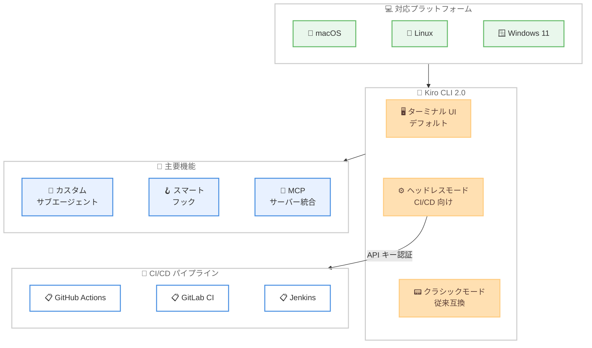

# Kiro CLI 2.0 - Windows サポート、ヘッドレスモード、ターミナル UI

**リリース日**: 2026 年 4 月 13 日
**サービス**: Kiro
**機能**: Kiro CLI 2.0 -- Windows サポート、ヘッドレスモード、ターミナル UI の正式化

📊 [このアップデートのインフォグラフィックを見る](https://takech9203.github.io/aws-news-summary/20260413-kiro-changelog-2026-04-13.html)

## 概要

Kiro CLI 2.0 がリリースされ、プラットフォームサポートの拡大、CI/CD 自動化のためのヘッドレスモードの導入、ターミナル UI のデフォルト化という 3 つの主要なアップデートが実施されました。これにより、Kiro CLI は macOS と Linux に加えて Windows 11 でもネイティブに動作するようになり、全主要 OS でのエージェンティックコーディング体験が統一されました。

ヘッドレスモードの追加により、Kiro CLI をプログラム的に実行して CI/CD パイプラインに組み込むことが可能になりました。API キー認証を使用して、対話的な入力なしにプロンプトを非対話的に実行できます。これにより、コードレビュー、テスト生成、デプロイ前チェックなどのタスクを自動化パイプラインに統合できます。

さらに、以前は実験的機能であったターミナル UI がデフォルトエクスペリエンスに昇格し、サブエージェント、フック、MCP 設定に関する新しい機能も追加されました。

**アップデート前の課題**

- Kiro CLI は macOS と Linux のみで動作し、Windows ユーザーは利用できなかった
- CI/CD パイプラインでの自動化には対話的な操作が必要であり、プログラム的な実行ができなかった
- ターミナル UI は実験的機能として `--tui` フラグを明示的に指定する必要があった

**アップデート後の改善**

- Windows 11 でのネイティブサポートにより、全主要プラットフォームで統一されたエージェンティックコーディング体験を提供
- ヘッドレスモードにより、API キー認証を使用した CI/CD パイプラインでの非対話的なプログラム実行が可能に
- ターミナル UI がデフォルトエクスペリエンスとなり、`--tui` フラグの指定が不要に
- サブエージェント、フック、MCP 設定の機能が強化

## アーキテクチャ図



Kiro CLI 2.0 が macOS、Linux、Windows 11 の 3 つのプラットフォームで動作し、ターミナル UI、ヘッドレスモード、クラシックモードの 3 つの実行モードを提供する構成を示しています。ヘッドレスモードは API キー認証を通じて CI/CD パイプラインと統合されます。

## サービスアップデートの詳細

### 主要機能

1. **Windows 11 ネイティブサポート**
   - Kiro CLI が Windows 11 上でネイティブに動作
   - ターミナル UI、ヘッドレスモード、カスタムエージェント、MCP サーバー統合のすべての機能を利用可能
   - PowerShell からのインストールに対応
   - バックグラウンドでの自動アップデートにより最新バージョンを維持

2. **ヘッドレスモード**
   - Kiro CLI を CI/CD パイプラインでプログラム的に実行可能
   - API キー認証により、対話的な入力なしに非対話的にプロンプトを実行
   - コードレビュー、テスト生成、コード品質チェックなどのタスクを自動化
   - GitHub Actions、GitLab CI、Jenkins などの主要な CI/CD ツールと統合可能

3. **ターミナル UI のデフォルト化**
   - 実験的機能であったターミナル UI がデフォルトエクスペリエンスに昇格
   - `--tui` フラグの指定が不要に
   - 従来のターミナル体験を使用したい場合は `--classic` フラグで選択可能
   - リッチなインターフェースにより、ファイル変更のプレビューやコンテキストの可視化が向上

4. **サブエージェント、フック、MCP 設定の強化**
   - カスタムサブエージェントの新機能が追加
   - スマートフックによるワークフロー自動化の改善
   - MCP サーバー設定の拡張により、外部ツールやデータソースとの接続がより柔軟に

## 技術仕様

### プラットフォーム対応状況

| プラットフォーム | インストール方法 | 備考 |
|------|------|------|
| macOS | `curl -fsSL https://cli.kiro.dev/install \| bash` | Bash 経由でインストール |
| Linux | `curl -fsSL https://cli.kiro.dev/install \| bash` | Bash 経由でインストール |
| Windows 11 | `irm 'https://cli.kiro.dev/install.ps1' \| iex` | PowerShell 経由でインストール |

### 実行モード

| モード | コマンド | 用途 |
|------|------|------|
| ターミナル UI | `kiro-cli` | デフォルト。リッチな対話型インターフェース |
| ヘッドレス | API キー認証による非対話実行 | CI/CD パイプライン向け |
| クラシック | `kiro-cli --classic` | 従来のターミナル体験 |

### コア機能一覧

| 機能 | 説明 | ドキュメント |
|------|------|------|
| Interactive Chat | ターミナルでの自然言語会話 | [Chat](https://kiro.dev/docs/cli/chat) |
| Custom Agents | 目的別の特化エージェント | [Custom Agents](https://kiro.dev/docs/cli/custom-agents) |
| MCP Integration | 外部ツール・データソース接続 | [MCP](https://kiro.dev/docs/cli/mcp) |
| Smart Hooks | 自動ワークフロー | [Hooks](https://kiro.dev/docs/cli/hooks) |
| Agent Steering | ベストプラクティス適用 | [Steering](https://kiro.dev/docs/cli/steering) |
| Auto Complete | コンテキスト認識型補完 | [Autocomplete](https://kiro.dev/docs/cli/autocomplete) |
| Headless Automation | CI/CD 非対話実行 | [Headless](https://kiro.dev/docs/cli/headless) |

## 設定方法

### 前提条件

1. macOS、Linux、または Windows 11 環境
2. インターネット接続
3. ヘッドレスモードを使用する場合は API キーが必要

### 手順

#### ステップ 1: Kiro CLI のインストール

**macOS / Linux の場合:**

```bash
curl -fsSL https://cli.kiro.dev/install | bash
```

Bash を使用して Kiro CLI のインストールスクリプトをダウンロードし、実行します。

**Windows 11 の場合:**

```powershell
irm 'https://cli.kiro.dev/install.ps1' | iex
```

PowerShell を使用して Kiro CLI のインストールスクリプトをダウンロードし、実行します。バックグラウンドの自動アップデートにより、常に最新バージョンが維持されます。

#### ステップ 2: Kiro CLI の起動

```bash
cd my-project
kiro-cli
```

プロジェクトディレクトリに移動し、`kiro-cli` を実行します。バージョン 2.0 からはターミナル UI がデフォルトで起動します。

#### ステップ 3: ヘッドレスモードの利用

CI/CD パイプラインでヘッドレスモードを使用するには、API キー認証を設定した上で非対話的にプロンプトを実行します。詳細な設定方法は [Headless ドキュメント](https://kiro.dev/docs/cli/headless)を参照してください。

## メリット

### ビジネス面

- **クロスプラットフォーム対応による開発チームの統一**: Windows ユーザーを含む全チームメンバーが同一のエージェンティックコーディングツールを使用可能になり、チーム全体の開発プロセスが統一される
- **CI/CD パイプラインの高度化**: ヘッドレスモードにより、コードレビューやテスト生成を自動化パイプラインに組み込み、品質管理を効率化
- **開発生産性の向上**: ターミナル UI のデフォルト化により、リッチなインターフェースを通じたより効率的な開発体験を全ユーザーに提供

### 技術面

- **Windows ネイティブ対応**: WSL やコンテナを経由せず、Windows 11 上で直接動作するため、セットアップの手間とパフォーマンスオーバーヘッドを削減
- **自動化の柔軟性**: ヘッドレスモードの API キー認証により、GitHub Actions、GitLab CI、Jenkins など主要な CI/CD プラットフォームとの統合が容易
- **後方互換性の確保**: `--classic` フラグにより従来のターミナル体験を維持しつつ、デフォルトを新しい UI に移行

## デメリット・制約事項

### 制限事項

- Windows サポートは Windows 11 に限定されており、Windows 10 以前のバージョンについては確認が必要
- ヘッドレスモードは API キー認証が必要であり、認証情報の安全な管理が求められる
- ターミナル UI がデフォルトになったことで、リソース制約のある環境ではクラシックモードへの切り替えが必要になる場合がある

### 考慮すべき点

- CI/CD パイプラインにヘッドレスモードを導入する際は、API キーのシークレット管理や実行時間、コストへの影響を事前に評価する必要がある
- チーム全体で Kiro CLI 2.0 へのアップグレードを計画し、ターミナル UI のデフォルト化に伴うワークフローの変更を周知することが推奨される

## ユースケース

### ユースケース 1: CI/CD パイプラインでの自動コードレビュー

**シナリオ**: 開発チームが GitHub Actions を使用しており、プルリクエスト作成時に自動でコードレビューを実行したい。

**実装例**:
```yaml
# .github/workflows/kiro-review.yml
name: Kiro Code Review
on:
  pull_request:
    types: [opened, synchronize]

jobs:
  review:
    runs-on: ubuntu-latest
    steps:
      - uses: actions/checkout@v4
      - name: Install Kiro CLI
        run: curl -fsSL https://cli.kiro.dev/install | bash
      - name: Run Code Review
        env:
          KIRO_API_KEY: ${{ secrets.KIRO_API_KEY }}
        run: |
          kiro-cli --headless --prompt "Review the changes in this PR for security issues, performance problems, and code quality"
```

**効果**: プルリクエストごとに自動的にコードレビューが実行され、セキュリティ問題やパフォーマンスの懸念を早期に検出できる。

### ユースケース 2: Windows チームのクロスプラットフォーム開発

**シナリオ**: 開発チームの一部が Windows 環境を使用しており、macOS/Linux チームと同一のエージェンティックコーディングツールを使用したい。

**実装例**:
```powershell
# Windows 11 での Kiro CLI インストール
irm 'https://cli.kiro.dev/install.ps1' | iex

# プロジェクトディレクトリへ移動して起動
cd C:\Projects\my-app
kiro-cli
```

**効果**: Windows ユーザーが macOS/Linux ユーザーと同一の Kiro CLI 体験を利用でき、チーム全体で統一された開発プロセスが実現する。

### ユースケース 3: カスタムエージェントとヘッドレスモードの組み合わせ

**シナリオ**: セキュリティチームが定期的なコンプライアンスチェックをスケジュール実行し、レポートを自動生成したい。

**実装例**:
```bash
# カスタムエージェントを使用したヘッドレス実行
kiro-cli --headless --agent security-audit --prompt "Run a comprehensive security audit on the current codebase and generate a compliance report"
```

**効果**: カスタムエージェントの専門知識とヘッドレスモードの自動化を組み合わせることで、定期的なセキュリティ監査を人手を介さずに実行できる。

## 料金

Kiro CLI は現在、無料で利用可能です。最新の料金情報については [Kiro Pricing ページ](https://kiro.dev/pricing/)を参照してください。ヘッドレスモードでの利用やエンタープライズ向けの料金体系については、Kiro の公式サイトで確認してください。

## 利用可能リージョン

グローバル -- Kiro CLI はグローバルに利用可能です。macOS、Linux、Windows 11 の全プラットフォームで同一の機能を提供します。

## 関連サービス・機能

- **Kiro IDE**: AWS が提供する AI 搭載の統合開発環境。Kiro CLI はそのコマンドライン版として、ターミナルから同等の AI 機能を利用可能
- **Kiro カスタムエージェント**: 目的別に特化した AI アシスタントを定義し、ツール権限やリソースを細かく制御する機能
- **Kiro スマートフック**: ワークフローをインテリジェントに自動化する pre/post コマンドフック
- **MCP Integration**: Model Context Protocol を通じて外部ツールやデータソースを接続する機能
- **Kiro Agent Steering**: チームのベストプラクティスや好みに基づいてエージェントの動作をガイドする機能

## 参考リンク

- 📊 [インフォグラフィック](https://takech9203.github.io/aws-news-summary/20260413-kiro-changelog-2026-04-13.html)
- [Kiro CLI 2.0: a new look and feel, headless CI/CD pipelines, and Windows support](https://kiro.dev/blog/kiro-cli-2/) -- Kiro Blog
- [Run Kiro CLI programmatically: introducing headless mode](https://kiro.dev/blog/headless-mode/) -- Kiro Blog
- [Kiro Changelog](https://kiro.dev/changelog/)
- [Kiro CLI ドキュメント](https://kiro.dev/docs/cli/)
- [Kiro CLI ヘッドレスモード ドキュメント](https://kiro.dev/docs/cli/headless)
- [Kiro Pricing](https://kiro.dev/pricing/)

## まとめ

Kiro CLI 2.0 は、Windows サポートの追加、CI/CD 自動化のためのヘッドレスモード、ターミナル UI のデフォルト化という 3 つの大きなアップデートを通じて、Kiro CLI の利用範囲と実用性を大幅に拡張しました。特にヘッドレスモードは、開発ワークフローの自動化を推進するチームにとって重要な機能です。Windows ユーザーの方はネイティブサポートを活用してすぐに利用を開始でき、CI/CD パイプラインの改善を検討しているチームはヘッドレスモードの導入を検討してみてください。
