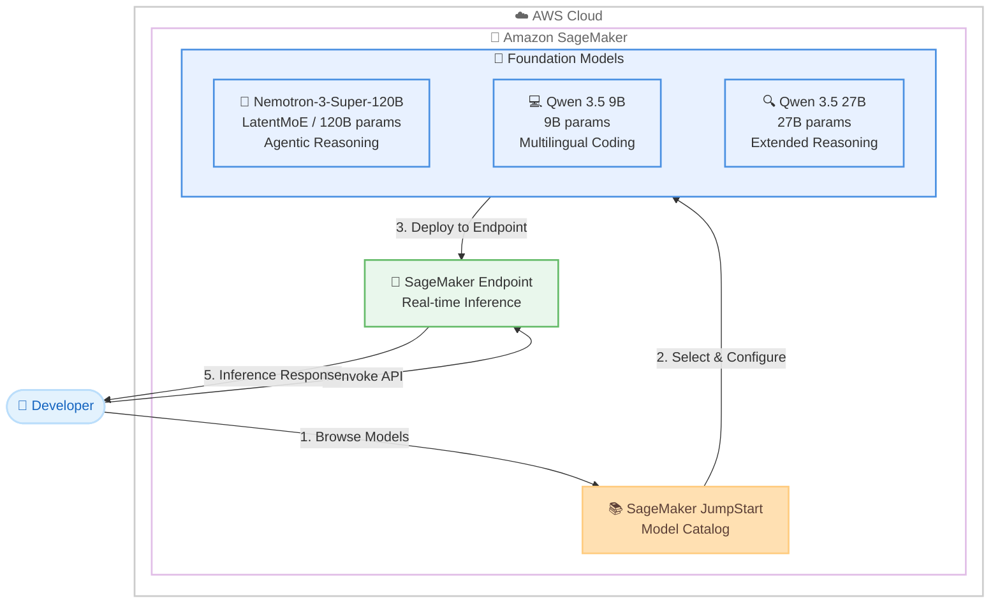

# Amazon SageMaker JumpStart - NVIDIA Nemotron-3-Super-120B、Qwen3.5-9B、Qwen3.5-27B モデル追加

**リリース日**: 2026 年 4 月 13 日
**サービス**: Amazon SageMaker JumpStart
**機能**: NVIDIA Nemotron-3-Super-120B、Qwen3.5-9B、Qwen3.5-27B モデルの提供開始

## 概要

AWS は、Amazon SageMaker JumpStart に NVIDIA の Nemotron-3-Super-120B、Qwen3.5-9B、Qwen3.5-27B の 3 つの新しい基盤モデルを追加しました。これらのモデルは、エージェンティック推論、多言語コーディング、高度な指示追従といった特化した機能を提供し、エンタープライズ AI アプリケーションの構築を加速します。

Nemotron-3-Super-120B は、NVIDIA が開発した 1,200 億パラメータの大規模言語モデルで、Mamba-2 と Mixture-of-Experts (MoE) レイヤーを組み合わせたハイブリッド Latent Mixture-of-Experts (LatentMoE) アーキテクチャを採用しています。この革新的なアーキテクチャにより、協調エージェントや大量ワークロードの処理に最適化されています。Qwen 3.5 9B は多言語コーディング、指示追従、長期計画に優れたコンパクトなモデルで、Qwen 3.5 27B はより深いコンテキスト理解、拡張された推論能力、強化された空間認識と複雑なシナリオ理解を提供します。

SageMaker JumpStart を使用することで、これらのモデルを数回のクリックまたは Python SDK を使用してデプロイし、エンタープライズ AI ソリューションを迅速に構築できます。

**アップデート前の課題**

- エージェンティック推論に最適化された大規模言語モデルの選択肢が限られており、協調エージェントの構築が困難でした
- Mamba-2 と MoE のハイブリッドアーキテクチャを活用した高効率な推論を SageMaker 上で直接デプロイする手段が限られていました
- 多言語コーディングと長期計画を高精度で行えるコンパクトなモデルのマネージドデプロイメントが制約されていました

**アップデート後の改善**

- Nemotron-3-Super-120B により、LatentMoE アーキテクチャを活用した高効率なエージェンティック推論が SageMaker 上で可能になりました
- Qwen 3.5 9B により、多言語コーディングと指示追従に特化した軽量モデルをコスト効率よくデプロイできるようになりました
- Qwen 3.5 27B により、深いコンテキスト理解と拡張された推論能力を持つ中規模モデルで複雑なタスクに対応できるようになりました

## アーキテクチャ図



この図は、開発者が SageMaker JumpStart のモデルカタログから 3 つの新しい基盤モデルを選択し、SageMaker エンドポイントとしてデプロイして推論を実行するワークフローを示しています。

## サービスアップデートの詳細

### 主要機能

1. **NVIDIA Nemotron-3-Super-120B - エージェンティック推論**
   - Mamba-2 と Mixture-of-Experts (MoE) レイヤーを組み合わせたハイブリッド Latent Mixture-of-Experts (LatentMoE) アーキテクチャを採用
   - 協調エージェントの構築に最適化され、マルチエージェントシステムでの効率的な推論を実現
   - 大量ワークロードの処理に対応し、エンタープライズレベルのスループットを提供
   - 1,200 億パラメータの大規模モデルでありながら、MoE アーキテクチャにより効率的な推論が可能

2. **Qwen 3.5 9B - 多言語コーディングと指示追従**
   - 多言語コーディングに優れた性能を発揮し、幅広いプログラミング言語に対応
   - 高精度な指示追従能力により、複雑なタスク指示を正確に実行
   - 長期計画 (Long-horizon Planning) に対応し、複数ステップのワークフローを計画・実行
   - 9B パラメータのコンパクトなサイズにより、コスト効率の良いデプロイメントが可能

3. **Qwen 3.5 27B - 拡張推論と深いコンテキスト理解**
   - 深いコンテキスト理解により、長文のドキュメントや複雑な入力を正確に解釈
   - 拡張された推論能力で、多段階の論理的推論や分析タスクに対応
   - 強化された空間認識と複雑なシナリオ理解により、幅広い応用が可能
   - 9B モデルと 120B モデルの中間に位置し、性能とコストのバランスに優れたオプション

## 技術仕様

### モデル比較

| 項目 | Nemotron-3-Super-120B | Qwen 3.5 9B | Qwen 3.5 27B |
|------|----------------------|-------------|--------------|
| 開発元 | NVIDIA | Alibaba Cloud | Alibaba Cloud |
| パラメータ数 | 1,200 億 | 90 億 | 270 億 |
| アーキテクチャ | ハイブリッド LatentMoE<br/>Mamba-2 + MoE | Transformer | Transformer |
| 主要な強み | エージェンティック推論、大量ワークロード | 多言語コーディング、指示追従、長期計画 | 深いコンテキスト理解、拡張推論、空間認識 |
| 最適なユースケース | 協調エージェント、マルチエージェントシステム | コード生成、タスク自動化、多言語対応 | 複雑な分析、長文理解、高度な推論タスク |
| モデルサイズ | 大規模 | コンパクト | 中規模 |

### デプロイメント方法

SageMaker JumpStart では、以下の 2 つの方法でモデルをデプロイできます。

1. **SageMaker コンソール**: JumpStart モデルカタログから数回のクリックでデプロイ
2. **SageMaker Python SDK**: プログラマティックにモデルをデプロイ

### API 変更履歴

| 日付 | サービス | 変更内容 |
|------|----------|----------|
| 2026/04/10 | [Amazon SageMaker Service](https://awsapichanges.com/archive/changes/974e23-api.sagemaker.html) | 1 new 4 updated api methods - StartClusterHealthCheck API の追加と CreateCluster、UpdateCluster、DescribeCluster、BatchAddClusterNodes API の更新 |

## 設定方法

### 前提条件

1. AWS アカウントと適切な IAM 権限
2. Amazon SageMaker へのアクセス権限
3. モデルをホストするための SageMaker エンドポイントの作成権限
4. GPU インスタンス (ml.g5 系列または ml.p4d 系列) のサービスクォータ

### 手順

#### ステップ 1: SageMaker コンソールから JumpStart にアクセス

AWS マネジメントコンソールから Amazon SageMaker サービスを開き、左側のナビゲーションメニューから「JumpStart」を選択します。

#### ステップ 2: モデルを検索して選択

JumpStart モデルカタログで以下のいずれかのモデルを検索します。

- NVIDIA Nemotron-3-Super-120B
- Qwen3.5-9B
- Qwen3.5-27B

#### ステップ 3: コンソールからデプロイ

選択したモデルの詳細ページで「Deploy」ボタンをクリックし、エンドポイント設定を行います。モデルサイズに応じた適切なインスタンスタイプを選択し、デプロイを開始します。

#### ステップ 4: Python SDK を使用したデプロイ

```python
from sagemaker.jumpstart.model import JumpStartModel

# Nemotron-3-Super-120B をデプロイする例
model = JumpStartModel(model_id="nvidia-nemotron-3-super-120b")
predictor = model.deploy()

# 推論を実行
response = predictor.predict({
    "inputs": "Analyze the following data and provide recommendations...",
    "parameters": {
        "max_new_tokens": 1024,
        "temperature": 0.7
    }
})
```

このコードは、JumpStartModel クラスを使用して Nemotron-3-Super-120B モデルを SageMaker エンドポイントとしてデプロイし、推論リクエストを送信します。model_id は SageMaker JumpStart のドキュメントまたはコンソールから正確な値を確認してください。

#### ステップ 5: Qwen 3.5 モデルのデプロイ

```python
from sagemaker.jumpstart.model import JumpStartModel

# Qwen 3.5 9B をデプロイする例
model_9b = JumpStartModel(model_id="qwen3-5-9b")
predictor_9b = model_9b.deploy()

# Qwen 3.5 27B をデプロイする例
model_27b = JumpStartModel(model_id="qwen3-5-27b")
predictor_27b = model_27b.deploy()

# コーディングタスクの例
response = predictor_9b.predict({
    "inputs": "Write a Python function that implements binary search on a sorted list.",
    "parameters": {
        "max_new_tokens": 512,
        "temperature": 0.3
    }
})
```

このコードは、Qwen 3.5 の 9B および 27B モデルをそれぞれデプロイし、コーディングタスクの推論を実行します。

## メリット

### ビジネス面

- **エージェンティック AI の実現**: Nemotron-3-Super-120B の LatentMoE アーキテクチャにより、協調エージェントを活用した高度な業務自動化が可能
- **コスト最適化の選択肢**: 9B、27B、120B の 3 つのモデルサイズにより、ユースケースの要件に応じたコスト最適なモデルを選択可能
- **開発期間の短縮**: SageMaker JumpStart のワンクリックデプロイにより、モデルの評価からプロダクション環境への移行までの期間を大幅に短縮

### 技術面

- **革新的なアーキテクチャ**: Nemotron-3-Super-120B の Mamba-2 + MoE ハイブリッドアーキテクチャにより、従来の Transformer モデルと比較して効率的な推論が可能
- **多言語対応**: Qwen 3.5 シリーズの多言語コーディング能力により、日本語を含む多言語環境でのコード生成やタスク処理が可能
- **スケーラブルなデプロイメント**: SageMaker のマネージド推論エンドポイントにより、自動スケーリングと高可用性を実現

## デメリット・制約事項

### 制限事項

- Nemotron-3-Super-120B は 1,200 億パラメータの大規模モデルであるため、デプロイに大規模な GPU インスタンス (ml.p4d.24xlarge 等) が必要となり、コストが高くなる可能性があります
- モデルごとに異なるインスタンスタイプの推奨があり、適切なインスタンスタイプの選択とサービスクォータの確認が必要です
- 一部のリージョンでは GPU インスタンスの可用性が制限される場合があります

### 考慮すべき点

- 各モデルのライセンスと使用条件を確認し、エンドユーザーライセンス契約に同意する必要があります
- 推論コストはインスタンスタイプとエンドポイントの稼働時間に依存するため、未使用時のエンドポイント削除やスケーリングポリシーの設定を検討してください
- Nemotron-3-Super-120B の LatentMoE アーキテクチャは従来の Transformer と異なるため、プロンプトエンジニアリングの最適化が必要になる場合があります

## ユースケース

### ユースケース 1: マルチエージェント協調システム

**シナリオ**: カスタマーサービス部門が、複数の AI エージェントが協調して顧客の問い合わせを処理するシステムを構築したい場合

**実装例**:
```python
from sagemaker.jumpstart.model import JumpStartModel

# Nemotron-3-Super-120B をデプロイ
model = JumpStartModel(model_id="nvidia-nemotron-3-super-120b")
predictor = model.deploy()

# エージェンティック推論の実行
response = predictor.predict({
    "inputs": (
        "You are a routing agent. Analyze the customer query and determine "
        "which specialist agent should handle it: billing, technical, or general.\n\n"
        "Customer query: My invoice shows a charge I don't recognize and "
        "my service has been intermittently dropping."
    ),
    "parameters": {
        "max_new_tokens": 512,
        "temperature": 0.2
    }
})
```

**効果**: Nemotron-3-Super-120B のエージェンティック推論能力により、複雑な顧客問い合わせを適切なエージェントにルーティングし、解決までの時間を短縮できます。

### ユースケース 2: 多言語コード生成と自動化

**シナリオ**: ソフトウェア開発チームが多言語でのコード生成やリファクタリングを自動化し、開発生産性を向上させたい場合

**実装例**:
```python
from sagemaker.jumpstart.model import JumpStartModel

# Qwen 3.5 9B をデプロイ
model = JumpStartModel(model_id="qwen3-5-9b")
predictor = model.deploy()

# 多言語コード生成
response = predictor.predict({
    "inputs": (
        "Convert the following Python function to TypeScript, "
        "maintaining type safety and error handling:\n\n"
        "def process_data(items: list[dict]) -> dict:\n"
        "    result = {}\n"
        "    for item in items:\n"
        "        key = item.get('id', 'unknown')\n"
        "        result[key] = item.get('value', 0)\n"
        "    return result"
    ),
    "parameters": {
        "max_new_tokens": 1024,
        "temperature": 0.3
    }
})
```

**効果**: Qwen 3.5 9B の多言語コーディング能力により、プログラミング言語間のコード変換やリファクタリングを自動化し、開発効率を向上させることができます。

### ユースケース 3: 複雑なドキュメント分析と推論

**シナリオ**: 法務部門が長文の契約書や規制文書を分析し、リスク評価や重要条項の抽出を行いたい場合

**実装例**:
```python
from sagemaker.jumpstart.model import JumpStartModel

# Qwen 3.5 27B をデプロイ
model = JumpStartModel(model_id="qwen3-5-27b")
predictor = model.deploy()

# 複雑なドキュメント分析
response = predictor.predict({
    "inputs": (
        "Analyze the following contract excerpt and identify:\n"
        "1. Key obligations for each party\n"
        "2. Potential risk factors\n"
        "3. Ambiguous clauses that need clarification\n\n"
        "[Contract text here...]"
    ),
    "parameters": {
        "max_new_tokens": 2048,
        "temperature": 0.4
    }
})
```

**効果**: Qwen 3.5 27B の深いコンテキスト理解と拡張推論能力により、長文ドキュメントの包括的な分析を実現し、法務レビューの効率と精度を向上させることができます。

## 料金

SageMaker JumpStart のモデル料金は、モデルをホストする SageMaker エンドポイントのインスタンスタイプと稼働時間に基づいて課金されます。モデル自体の追加料金は発生しません。

### 料金例

| モデル | 推奨インスタンスタイプ | 月額料金 (概算・30 日稼働) |
|------|---------------------|--------------------------|
| Qwen 3.5 9B | ml.g5.2xlarge | 約 $1,100 USD |
| Qwen 3.5 27B | ml.g5.12xlarge | 約 $4,200 USD |
| Nemotron-3-Super-120B | ml.p4d.24xlarge | 約 $24,000 USD |

注: 実際の料金はリージョン、インスタンスタイプ、使用状況により異なります。最新の料金情報は [Amazon SageMaker 料金ページ](https://aws.amazon.com/sagemaker/pricing/) をご確認ください。推奨インスタンスタイプは SageMaker JumpStart のモデル詳細ページで確認できます。

## 利用可能リージョン

SageMaker JumpStart は複数の AWS リージョンで利用可能です。各モデルの利用可能リージョンの詳細については、SageMaker JumpStart コンソールまたは [Amazon SageMaker のリージョン別サービス一覧](https://aws.amazon.com/about-aws/global-infrastructure/regional-product-services/) をご確認ください。

## 関連サービス・機能

- **Amazon SageMaker Studio**: JumpStart モデルのブラウズ、評価、デプロイのための統合開発環境
- **Amazon SageMaker Endpoints**: モデルの推論を実行するためのマネージドリアルタイムエンドポイント
- **Amazon SageMaker Python SDK**: プログラマティックにモデルをデプロイおよび管理するための SDK
- **Amazon Bedrock**: フルマネージドな基盤モデルサービスとして、別の選択肢を提供

## 参考リンク

- [公式発表 (What's New)](https://aws.amazon.com/about-aws/whats-new/2026/04/nemotron3super-120b-qwen3.5-9b-qwen3.5-27b-on-sagemaker-jumpstart/)
- [Amazon SageMaker JumpStart ドキュメント](https://docs.aws.amazon.com/sagemaker/latest/dg/studio-jumpstart.html)
- [SageMaker Python SDK での基盤モデル使用方法](https://docs.aws.amazon.com/sagemaker/latest/dg/jumpstart-foundation-models-use-python-sdk.html)
- [Amazon SageMaker 料金](https://aws.amazon.com/sagemaker/pricing/)

## まとめ

Amazon SageMaker JumpStart への NVIDIA Nemotron-3-Super-120B、Qwen 3.5 9B、Qwen 3.5 27B の追加により、エージェンティック推論、多言語コーディング、高度な推論といった特化した能力を持つ最新の基盤モデルを AWS インフラストラクチャ上で簡単にデプロイできるようになりました。特に Nemotron-3-Super-120B の革新的な LatentMoE アーキテクチャは、協調エージェントやマルチエージェントシステムの構築に新たな可能性を提供します。3 つのモデルサイズの選択肢により、ユースケースの要件とコストのバランスに応じた最適なモデルを選択し、エンタープライズ AI ソリューションの構築を今すぐ開始してください。
