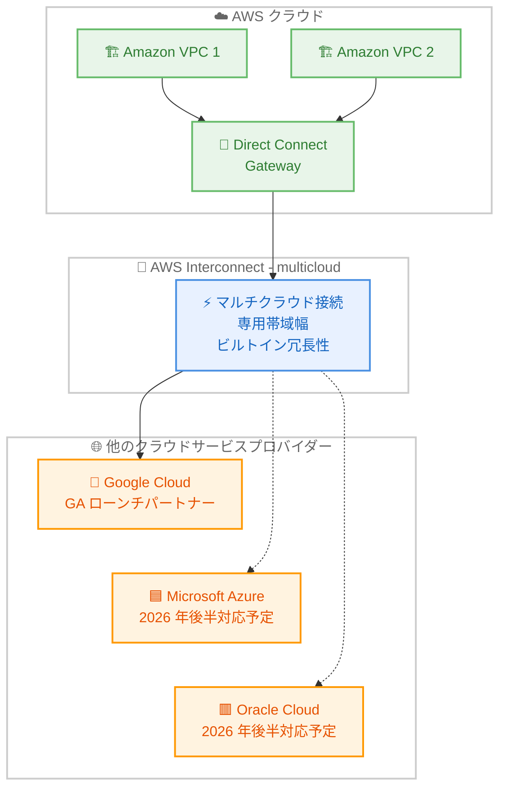

# AWS Interconnect - multicloud 一般提供開始

**リリース日**: 2026 年 4 月 14 日
**サービス**: AWS Interconnect
**機能**: AWS Interconnect - multicloud (マルチクラウド間プライベート接続サービス)

[このアップデートのインフォグラフィックを見る](https://takech9203.github.io/aws-news-summary/20260414-aws-announces-ga-AWS-interconnect-multicloud.html)

## 概要

AWS は AWS Interconnect - multicloud の一般提供 (GA) を発表しました。これは、AWS と他のクラウドサービスプロバイダー (CSP) 間でシンプルかつ高速なプライベート接続を提供する、業界初の専用マルチクラウド接続プロダクトです。GA リリースの最初のローンチパートナーとして Google Cloud が対応しており、Microsoft Azure と Oracle Cloud Infrastructure (OCI) は 2026 年後半に対応予定です。

企業がマルチクラウド戦略を採用しながらクラウド移行を加速するなかで、従来の「DIY」型マルチクラウドアプローチでは、グローバルなマルチレイヤーネットワークの管理が複雑化していました。AWS Interconnect - multicloud は、クラウド間の接続方法を根本的に変革する初の専用プロダクトです。Amazon VPC と他のクラウド環境の間に、専用帯域幅とビルトインの冗長性を備えたプライベートで安全な高速ネットワーク接続を迅速に確立できます。

料金体系は、選択した帯域幅と他の CSP への接続の地理的範囲に基づくシンプルな単一料金構造を採用しています。さらに、2026 年 5 月からはリージョンごとに 1 つの 500Mbps ローカルインターコネクトを無料で利用できます。現在 5 つの AWS リージョンで提供されており、AWS マネジメントコンソール、CLI、API を使用して設定できます。CSP 側は GitHub 上で公開されたオープン API パッケージを通じて統合が可能です。

**アップデート前の課題**

- マルチクラウド環境間の接続には「DIY」アプローチが必要で、複数のネットワークプロバイダーとの契約や複雑なルーティング設定を手動で管理する必要があった
- グローバルなマルチレイヤーネットワークのスケーリングが複雑で、可視性や一貫性の確保が困難だった
- クラウド間のデータ転送にはパブリックインターネットや第三者のネットワークプロバイダーを経由する必要があり、レイテンシーやセキュリティのリスクがあった
- 帯域幅の管理や冗長性の確保に複数のコンポーネントを組み合わせる必要があり、運用負荷が高かった

**アップデート後の改善**

- AWS コンソールから数クリックで他の CSP への専用プライベート接続を確立可能になった
- 専用帯域幅とビルトインの冗長性を備えた高速接続により、マルチクラウド間通信の信頼性とパフォーマンスが向上
- シンプルな単一料金構造により、コスト管理の複雑さが解消された
- 2026 年 5 月からリージョンごとに 500Mbps の無料枠が利用可能となり、小規模なマルチクラウド接続を無償で開始できる

## アーキテクチャ図



AWS VPC から Direct Connect Gateway を経由し、AWS Interconnect - multicloud を通じて他の CSP に接続するアーキテクチャを示しています。実線は GA 時点で利用可能な Google Cloud への接続、点線は 2026 年後半に対応予定の Azure と OCI への接続を表しています。

## サービスアップデートの詳細

### 主要機能

1. **マルチクラウドプライベート接続**
   - Amazon VPC と他の CSP のクラウド環境間に専用のプライベート高速ネットワーク接続を確立
   - パブリックインターネットを経由しないセキュアな通信
   - 専用帯域幅の確保により、安定したスループットを実現

2. **ビルトイン冗長性**
   - 接続に冗長性が組み込まれており、高可用性を標準で提供
   - 個別の冗長構成の設計や管理が不要
   - サービスレベルの信頼性を確保

3. **シンプルな単一料金構造**
   - 帯域幅と地理的範囲に基づくわかりやすい料金体系
   - 従来のマルチクラウド接続で発生していた複数プロバイダーへの支払い管理が不要
   - 2026 年 5 月からリージョンごとに 1 つの 500Mbps ローカルインターコネクトを無料で利用可能

4. **マルチ CSP パートナーエコシステム**
   - GA ローンチパートナーとして Google Cloud が対応
   - Microsoft Azure は 2026 年後半に対応予定
   - Oracle Cloud Infrastructure (OCI) は 2026 年後半に対応予定
   - GitHub 上のオープン API パッケージにより、CSP が容易に統合可能

5. **マルチリージョン対応**
   - 5 つの AWS リージョンで利用可能
   - 地理的範囲に応じた柔軟な接続オプション
   - ローカル接続からグローバル接続まで対応

## 技術仕様

### 接続仕様

| 項目 | 詳細 |
|------|------|
| サービス名 | AWS Interconnect - multicloud |
| 接続タイプ | プライベート高速接続 |
| 冗長性 | ビルトイン |
| 接続先 | Direct Connect Gateway |
| GA ローンチパートナー | Google Cloud |
| 2026 年後半対応予定 | Microsoft Azure、Oracle Cloud Infrastructure |
| 利用可能リージョン | 5 つの AWS リージョン |
| 無料枠 | リージョンごとに 500Mbps x 1 本 (2026 年 5 月開始) |
| 操作方法 | AWS マネジメントコンソール、CLI、API |
| CSP 統合 | GitHub 上のオープン API パッケージ |

### API 変更履歴

| 日付 | サービス | 変更内容 |
|------|----------|----------|
| 2026/04/13 | [Interconnect](https://awsapichanges.com/archive/changes/9b76a6-interconnect.html) | 13 new api methods - 初回リリース。マネージドプライベート接続サービスの全 API を追加 |

AWS Interconnect - multicloud は、同時にリリースされた AWS Interconnect - last mile と共通の API を使用します。13 の新規 API メソッドが追加され、接続の作成、管理、監視を行えます。

### 新規 API メソッド一覧

| メソッド名 | 説明 |
|-----------|------|
| CreateConnection | マルチクラウド接続を新規作成 |
| DeleteConnection | 既存の接続を削除 |
| GetConnection | 接続の詳細情報を取得 |
| UpdateConnection | 接続の帯域幅や説明を更新 |
| ListConnections | 接続の一覧を取得。状態やプロバイダーでフィルタリング可能 |
| AcceptConnectionProposal | CSP 側からの接続提案を承認 |
| DescribeConnectionProposal | アクティベーションキーによる接続提案の詳細を取得 |
| GetEnvironment | マルチクラウド環境の詳細を取得。利用可能な帯域幅を確認可能 |
| ListEnvironments | 利用可能なマルチクラウド環境の一覧を取得 |
| ListAttachPoints | Direct Connect Gateway などのアタッチポイント一覧を取得 |
| TagResource | リソースにタグを追加 |
| UntagResource | リソースからタグを削除 |
| ListTagsForResource | リソースのタグ一覧を取得 |

### 接続の状態遷移

| 状態 | 説明 |
|------|------|
| requested | 接続がリクエストされた初期状態 |
| pending | CSP 側でのプロビジョニング中 |
| available | 接続が利用可能 |
| updating | 帯域幅変更などの更新処理中 |
| down | 接続がダウン |
| deleting | 削除処理中 |
| deleted | 削除完了 |
| failed | 接続の確立に失敗 |

### CreateConnection API の例

```python
import boto3

client = boto3.client('interconnect')

# Google Cloud への接続を作成
response = client.create_connection(
    description='AWS to Google Cloud - Production',
    bandwidth='1Gbps',
    attachPoint={
        'directConnectGateway': 'dxgw-xxxxxxxx',
        'arn': 'arn:aws:directconnect::123456789012:dx-gateway/dxgw-xxxxxxxx'
    },
    environmentId='env-gcp-us-east1',
    remoteAccount={
        'identifier': 'gcp-project-id@example.com'
    },
    tags={
        'Environment': 'Production',
        'CostCenter': 'IT-MultiCloud',
        'CSP': 'GoogleCloud'
    }
)

connection = response['connection']
print(f"Connection ID: {connection['id']}")
print(f"State: {connection['state']}")
print(f"Activation Key: {connection['activationKey']}")
```

## 設定方法

### 前提条件

1. AWS アカウントが有効であること
2. Direct Connect Gateway が作成済みであること
3. 接続先の CSP アカウント (Google Cloud プロジェクト ID など) を取得済みであること
4. 適切な IAM 権限が設定されていること

### 手順

#### ステップ 1: Direct Connect Gateway の準備

```bash
# Direct Connect Gateway の作成 (未作成の場合)
aws directconnect create-direct-connect-gateway \
  --direct-connect-gateway-name "multicloud-dxgw" \
  --amazon-side-asn 64512
```

AWS Interconnect - multicloud の接続先となる Direct Connect Gateway を作成します。既存の Direct Connect Gateway を使用することも可能です。

#### ステップ 2: 利用可能なマルチクラウド環境の確認

```bash
# Google Cloud への接続環境を一覧表示
aws interconnect list-environments \
  --provider '{"cloudServiceProvider": "GoogleCloud"}'
```

Google Cloud が提供する利用可能な環境とロケーションの一覧を確認します。各環境で利用可能な帯域幅や状態 (available / limited / unavailable) も確認できます。

#### ステップ 3: マルチクラウド接続の作成

```bash
# Google Cloud への接続を作成
aws interconnect create-connection \
  --description "AWS to GCP Production" \
  --bandwidth "1Gbps" \
  --attach-point '{"directConnectGateway": "dxgw-xxxxxxxx"}' \
  --environment-id "env-gcp-us-east1" \
  --remote-account '{"identifier": "gcp-project-id@example.com"}' \
  --tags '{"Environment": "Production"}'
```

指定した環境と帯域幅で、Google Cloud への接続を作成します。接続作成後、アクティベーションキーが生成されます。

#### ステップ 4: CSP 側での接続承認

```bash
# アクティベーションキーを取得
aws interconnect get-connection \
  --identifier "conn-xxxxxxxx"
```

AWS が生成したアクティベーションキーを取得し、Google Cloud 側のコンソールまたは API で接続を承認します。CSP 側のアクティベーションページ URL は GetEnvironment API の `activationPageUrl` から取得できます。

#### ステップ 5: 接続状態の確認

```bash
# 接続状態を確認
aws interconnect list-connections \
  --state available \
  --provider '{"cloudServiceProvider": "GoogleCloud"}'
```

接続が `available` 状態になっていることを確認します。ビルトイン冗長性は自動的に構成されます。

## メリット

### ビジネス面

- **マルチクラウド戦略の加速**: 専用のプライベート接続により、AWS と他の CSP 間でのワークロード分散やデータ連携を迅速に実現。マルチクラウド戦略の実行を加速
- **コスト管理の簡素化**: シンプルな単一料金構造により、従来のマルチプロバイダー管理に伴う請求管理の複雑さを解消。帯域幅と地理的範囲に基づく明確なコスト予測が可能
- **無料枠による導入ハードルの低減**: 2026 年 5 月からリージョンごとに 500Mbps の無料枠が提供され、小規模なマルチクラウド接続を無償で開始可能

### 技術面

- **セキュアなプライベート接続**: パブリックインターネットを経由しない専用接続により、データ転送のセキュリティとプライバシーを確保
- **ビルトイン冗長性**: 冗長性が標準で組み込まれており、個別の冗長構成の設計が不要。高可用性をすぐに利用可能
- **API ファーストの統合**: 13 の新規 API メソッドにより、Infrastructure as Code やカスタム自動化との統合が容易。GitHub 上のオープン API パッケージで CSP 側との統合も標準化

## デメリット・制約事項

### 制限事項

- GA 時点のローンチパートナーは Google Cloud のみであり、Microsoft Azure と OCI の対応は 2026 年後半まで待つ必要がある
- 利用可能なリージョンは 5 つの AWS リージョンに限定されており、すべてのリージョンで利用できるわけではない
- 無料枠の 500Mbps ローカルインターコネクトの提供は 2026 年 5 月開始であり、GA 直後は利用できない

### 考慮すべき点

- 既存の DIY マルチクラウド接続構成からの移行計画を事前に策定し、切り替え時のダウンタイムやルーティング変更の影響を評価することを推奨
- CSP 側の接続承認プロセスや設定手順は CSP ごとに異なるため、接続先の CSP のドキュメントも併せて確認が必要
- 帯域幅の選択と地理的範囲は料金に直結するため、ワークロードのトラフィックパターンを分析した上で適切なプランを選択することが重要

## ユースケース

### ユースケース 1: マルチクラウドデータ分析基盤

**シナリオ**: 企業が AWS 上にデータレイクを構築し、Google Cloud の BigQuery で分析を行うマルチクラウドアーキテクチャを採用している。大量のデータを安全かつ高速に転送する必要がある。

**実装例**:
```python
import boto3

client = boto3.client('interconnect')

# Google Cloud BigQuery 環境への接続
response = client.create_connection(
    description='DataLake to BigQuery - Analytics Pipeline',
    bandwidth='10Gbps',
    attachPoint={
        'directConnectGateway': 'dxgw-analytics'
    },
    environmentId='env-gcp-us-central1',
    remoteAccount={
        'identifier': 'analytics-project@example.com'
    },
    tags={
        'UseCase': 'DataAnalytics',
        'DataClassification': 'Confidential'
    }
)
```

**効果**: パブリックインターネットを経由しないプライベート接続により、大規模データの転送時間を短縮しつつ、データのセキュリティを確保。専用帯域幅により安定したスループットでバッチ処理やリアルタイムデータパイプラインを運用可能。

### ユースケース 2: ディザスタリカバリのマルチクラウド構成

**シナリオ**: ミッションクリティカルなアプリケーションを AWS で稼働させている企業が、CSP 障害時のディザスタリカバリ先として Google Cloud を使用したい。レプリケーションデータをリアルタイムで転送する必要がある。

**実装例**:
```bash
# DR 用の接続を作成
aws interconnect create-connection \
  --description "DR Replication - AWS to GCP" \
  --bandwidth "5Gbps" \
  --attach-point '{"directConnectGateway": "dxgw-dr"}' \
  --environment-id "env-gcp-asia-northeast1" \
  --remote-account '{"identifier": "dr-project@example.com"}' \
  --tags '{"Purpose": "DisasterRecovery", "RPO": "15min"}'
```

**効果**: ビルトイン冗長性を備えた専用接続により、DR レプリケーションの信頼性を確保。プライベート接続による低レイテンシーでリアルタイムに近いデータ同期が可能となり、RPO の短縮を実現。

### ユースケース 3: 無料枠を活用したマルチクラウド評価

**シナリオ**: マルチクラウド戦略の検討段階にある企業が、AWS と Google Cloud 間の接続性を評価したい。初期コストを抑えながらプロトタイプ環境でテストを行いたい。

**実装例**:
```bash
# 無料枠の 500Mbps 接続を作成 (2026 年 5 月以降)
aws interconnect create-connection \
  --description "MultiCloud POC - Free Tier" \
  --bandwidth "500Mbps" \
  --attach-point '{"directConnectGateway": "dxgw-poc"}' \
  --environment-id "env-gcp-us-east1" \
  --remote-account '{"identifier": "poc-project@example.com"}' \
  --tags '{"Purpose": "POC", "Phase": "Evaluation"}'

# 接続の帯域幅を後からアップグレード可能
aws interconnect update-connection \
  --identifier "conn-xxxxxxxx" \
  --bandwidth "1Gbps"
```

**効果**: リージョンごとに 1 つの 500Mbps 無料インターコネクトを活用し、初期コストゼロでマルチクラウド接続を評価可能。評価完了後は帯域幅を動的にアップグレードして本番環境に移行できる。

## 料金

AWS Interconnect - multicloud は、選択した帯域幅と他の CSP への接続の地理的範囲に基づくシンプルな単一料金構造を採用しています。

### 料金の構成要素

| 項目 | 説明 |
|------|------|
| 帯域幅ベースの料金 | 選択した帯域幅に応じた月額料金 |
| 地理的範囲ベースの料金 | ローカル / リージョナル / グローバルなど接続範囲に応じた課金 |
| 無料枠 | リージョンごとに 500Mbps x 1 本が無料 (2026 年 5 月開始) |

詳細な料金については、AWS Interconnect の料金ページまたは AWS 営業担当にお問い合わせください。

## 利用可能リージョン

GA 時点で 5 つの AWS リージョンで利用可能です。対象リージョンの詳細および今後のリージョン拡大については、AWS の公式ドキュメントを参照してください。

## 関連サービス・機能

- **AWS Interconnect - last mile**: 2026 年 4 月 13 日に同時 GA。Lumen をパートナーとしたブランチオフィスやデータセンターからの AWS へのラストマイル接続サービス。multicloud と共通の API 基盤を使用
- **AWS Direct Connect**: Interconnect - multicloud の接続先として Direct Connect Gateway を使用。既存の Direct Connect インフラストラクチャとの統合が可能
- **Amazon VPC**: Interconnect - multicloud を通じた接続は、Direct Connect Gateway 経由で VPC に到達し、マルチクラウド環境間のプライベートネットワーク通信を実現
- **AWS Transit Gateway**: 複数の VPC を集約する場合、Transit Gateway と組み合わせてハブアンドスポーク型のマルチクラウドネットワークトポロジを構築可能
- **AWS CloudFormation / Terraform**: 新規 API メソッドにより、Infrastructure as Code でのマルチクラウド接続管理が可能

## 参考リンク

- [インフォグラフィック](https://takech9203.github.io/aws-news-summary/20260414-aws-announces-ga-AWS-interconnect-multicloud.html)
- [公式発表 (What's New)](https://aws.amazon.com/about-aws/whats-new/2026/04/aws-announces-ga-AWS-interconnect-multicloud/)
- [AWS Interconnect API Changes](https://awsapichanges.com/archive/changes/9b76a6-interconnect.html)
- [AWS Direct Connect ドキュメント](https://docs.aws.amazon.com/directconnect/latest/UserGuide/)
- [AWS Interconnect - last mile レポート](./2026-04-13-aws-announces-ga-AWS-interconnect-last-mile.md)

## まとめ

AWS Interconnect - multicloud は、AWS と他のクラウドサービスプロバイダー間にプライベートで高速なネットワーク接続を提供する業界初の専用プロダクトです。GA ローンチパートナーとして Google Cloud が対応しており、Azure と OCI も 2026 年後半に対応予定です。専用帯域幅、ビルトイン冗長性、シンプルな単一料金構造により、マルチクラウド接続の複雑さを大幅に解消します。2026 年 5 月からはリージョンごとに 500Mbps の無料枠も提供されるため、マルチクラウド戦略を検討中の企業は、まず無料枠を活用して接続性を評価し、段階的に本番環境への導入を進めることを推奨します。
