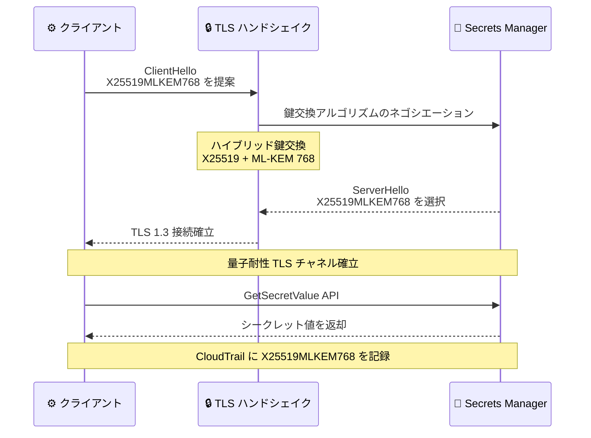

# AWS Secrets Manager - ハイブリッドポスト量子 TLS のサポート

**リリース日**: 2026 年 4 月 14 日
**サービス**: AWS Secrets Manager
**機能**: ハイブリッドポスト量子鍵交換 (ML-KEM) による TLS 接続の保護

[このアップデートのインフォグラフィックを見る](https://takech9203.github.io/aws-news-summary/20260414-aws-secrets-manager-post-quantum-tls.html)

## 概要

AWS Secrets Manager がハイブリッドポスト量子鍵交換をサポートしました。ML-KEM (Module-Lattice-based Key-Encapsulation Mechanism) を使用して TLS 接続を保護し、シークレットの取得や管理時の通信を量子コンピュータの脅威から守ります。

この保護機能は、Secrets Manager Agent (バージョン 2.0.0 以降)、AWS Lambda Extension (バージョン 19 以降)、Secrets Manager CSI Driver (バージョン 2.0.0 以降) では自動的に有効化されます。SDK ベースのクライアントでは、Rust、Go、Node.js、Kotlin、Python (OpenSSL 3.5 以降)、Java v2 の各 AWS SDK でハイブリッドポスト量子鍵交換が利用可能です。Java v2 を除き、最新バージョンのクライアントを使用している場合はコード変更、設定変更、移行作業は不要です。

ハイブリッドポスト量子鍵交換が有効であることは、CloudTrail ログで鍵交換アルゴリズムとして "X25519MLKEM768" が記録されていることで確認できます。

**アップデート前の課題**

- Secrets Manager への TLS 接続は従来の鍵交換アルゴリズムのみを使用しており、将来の量子コンピュータによる Harvest Now, Decrypt Later 攻撃のリスクがあった
- シークレット (データベース認証情報、API キー、暗号化キーなど) は長期的な機密性が求められるが、量子耐性のある TLS 接続手段がなかった
- ポスト量子暗号への移行にはクライアント側の大幅なコード変更が必要と想定されていた

**アップデート後の改善**

- ML-KEM によるハイブリッドポスト量子鍵交換が TLS 接続に追加され、量子コンピュータの脅威からシークレットの転送データを保護可能になった
- 主要なクライアント (Agent、Lambda Extension、CSI Driver) では自動有効化され、コード変更が不要
- CloudTrail ログを通じてポスト量子鍵交換の使用状況を監査可能になった

## アーキテクチャ図



クライアントと Secrets Manager 間のハイブリッドポスト量子 TLS ハンドシェイクのフローを示しています。X25519 (従来の楕円曲線 Diffie-Hellman) と ML-KEM 768 (ポスト量子鍵カプセル化) を組み合わせたハイブリッド鍵交換により、従来型暗号と量子耐性暗号の両方の安全性を確保します。

## サービスアップデートの詳細

### 主要機能

1. **ハイブリッドポスト量子鍵交換**
   - X25519 と ML-KEM 768 を組み合わせたハイブリッド方式を採用
   - 従来の楕円曲線暗号の安全性を維持しつつ、量子耐性を追加
   - TLS 1.3 プロトコルの鍵交換フェーズで動作

2. **自動有効化される対応クライアント**
   - Secrets Manager Agent バージョン 2.0.0 以降: ローカルキャッシュ付きのシークレット取得エージェント
   - AWS Lambda Extension バージョン 19 以降: Lambda 関数からのシークレット取得を最適化
   - Secrets Manager CSI Driver バージョン 2.0.0 以降: Kubernetes ワークロードへのシークレット提供

3. **CloudTrail による監査**
   - CloudTrail ログに TLS 鍵交換アルゴリズムが記録される
   - "X25519MLKEM768" の記録でポスト量子鍵交換の使用を確認可能
   - セキュリティ監査やコンプライアンスレポートに活用可能

## 技術仕様

### ML-KEM アルゴリズムの概要

| 項目 | 詳細 |
|------|------|
| 標準規格 | FIPS 203 Module-Lattice-based Key-Encapsulation Mechanism |
| アルゴリズム名 | ML-KEM (旧称: CRYSTALS-Kyber) |
| パラメータセット | ML-KEM 768 (NIST セキュリティレベル 3) |
| 暗号基盤 | 格子暗号 (Lattice-based cryptography) |
| ハイブリッド方式 | X25519 + ML-KEM 768 |
| TLS 鍵交換名 | X25519MLKEM768 |
| 量子耐性 | 量子コンピュータによる Shor のアルゴリズム攻撃に耐性あり |

### 対応クライアントバージョン

| クライアント | 必要バージョン | ポスト量子 TLS | コード変更 |
|-------------|---------------|---------------|-----------|
| Secrets Manager Agent | 2.0.0 以降 | 自動有効化 | 不要 |
| AWS Lambda Extension | 19 以降 | 自動有効化 | 不要 |
| Secrets Manager CSI Driver | 2.0.0 以降 | 自動有効化 | 不要 |
| AWS SDK for Rust | 最新版 | 利用可能 | 不要 |
| AWS SDK for Go | 最新版 | 利用可能 | 不要 |
| AWS SDK for Node.js | 最新版 | 利用可能 | 不要 |
| AWS SDK for Kotlin | 最新版 | 利用可能 | 不要 |
| AWS SDK for Python | 最新版 (OpenSSL 3.5 以降必須) | 利用可能 | 不要 |
| AWS SDK for Java v2 | 最新版 | 利用可能 | 設定変更が必要 |

### API 変更履歴

今回のアップデートに関連する API の変更は確認されていません。既存の Secrets Manager API (GetSecretValue、CreateSecret、UpdateSecret など) の TLS 接続層で鍵交換アルゴリズムが拡張されたサービス側の変更です。

### CloudTrail ログでの確認

```json
{
    "eventVersion": "1.09",
    "eventSource": "secretsmanager.amazonaws.com",
    "eventName": "GetSecretValue",
    "tlsDetails": {
        "tlsVersion": "TLSv1.3",
        "cipherSuite": "TLS_AES_256_GCM_SHA384",
        "clientProvidedHostHeader": "secretsmanager.ap-northeast-1.amazonaws.com"
    },
    "additionalEventData": {
        "keyExchangeAlgorithm": "X25519MLKEM768"
    }
}
```

## 設定方法

### 前提条件

1. 対応クライアントの最新バージョンがインストール済みであること
2. Python SDK を使用する場合は OpenSSL 3.5 以降がインストール済みであること
3. CloudTrail が有効化されていること (監査目的)

### 手順

#### ステップ 1: クライアントバージョンの確認と更新

```bash
# Secrets Manager Agent のバージョン確認
aws-secrets-manager-agent --version

# Lambda Extension の最新バージョンを確認
aws lambda get-layer-version-by-arn \
  --arn "arn:aws:lambda:ap-northeast-1:123456789012:layer:AWS-Parameters-and-Secrets-Lambda-Extension:19"
```

使用しているクライアントのバージョンが要件を満たしているか確認します。バージョンが古い場合は、最新版にアップデートします。

#### ステップ 2: ポスト量子 TLS の動作確認

```bash
# CloudTrail ログでポスト量子鍵交換の使用を確認
aws cloudtrail lookup-events \
  --lookup-attributes AttributeKey=EventSource,AttributeValue=secretsmanager.amazonaws.com \
  --max-results 10 \
  --query 'Events[].{Event:CloudTrailEvent}' \
  --output json | jq '.[].Event | fromjson | select(.additionalEventData.keyExchangeAlgorithm == "X25519MLKEM768")'
```

CloudTrail ログを検索し、鍵交換アルゴリズムが X25519MLKEM768 であるイベントをフィルタリングして、ポスト量子 TLS が正しく使用されているか確認します。

#### ステップ 3: Java v2 SDK での有効化

```java
// Java v2 SDK ではポスト量子 TLS を明示的に設定する必要がある
SecretsManagerClient client = SecretsManagerClient.builder()
    .httpClient(AwsCrtHttpClient.builder()
        .postQuantumTlsEnabled(true)
        .build())
    .region(Region.AP_NORTHEAST_1)
    .build();
```

Java v2 SDK では、AWS CRT HTTP クライアントを使用し、ポスト量子 TLS を明示的に有効化する設定が必要です。

## メリット

### ビジネス面

- **将来の量子脅威への先行対策**: Harvest Now, Decrypt Later 攻撃からシークレットを保護し、データベース認証情報や API キーの長期的な機密性を確保
- **コンプライアンス対応**: NIST 標準 (FIPS 203) に準拠した量子耐性暗号を使用しており、政府機関や規制産業のポスト量子暗号移行要件に対応
- **ゼロ運用コストでの導入**: 主要クライアントでは自動有効化されるため、追加の運用コストや移行プロジェクトが不要

### 技術面

- **ハイブリッド方式による安全性**: 従来の X25519 と ML-KEM 768 を組み合わせることで、どちらか一方のアルゴリズムに脆弱性が発見されても安全性が維持される
- **シームレスな統合**: 既存のアプリケーションコードを変更せずにポスト量子保護を追加可能 (Java v2 を除く)
- **監査可能性**: CloudTrail ログでポスト量子鍵交換の使用状況を追跡でき、組織全体の暗号移行進捗を可視化

## デメリット・制約事項

### 制限事項

- Java v2 SDK ではコード変更が必要であり、AWS CRT HTTP クライアントの明示的な設定が求められる
- Python SDK は OpenSSL 3.5 以降が必要であり、古い OS 環境では OpenSSL のアップグレードが先に必要になる場合がある
- 対応していない古いバージョンの SDK やクライアントでは、従来の鍵交換アルゴリズムが引き続き使用される

### 考慮すべき点

- ハイブリッドポスト量子鍵交換では、TLS ハンドシェイク時のデータサイズが従来より増加するため、極めてレイテンシーに敏感なアプリケーションではパフォーマンステストを推奨
- ポスト量子 TLS は転送中データの保護であり、保存データの暗号化には AWS KMS のポスト量子対応が別途必要
- 組織内のネットワーク機器 (ファイアウォール、プロキシ) が TLS 1.3 のポスト量子鍵交換をサポートしていることを確認する必要がある

## ユースケース

### ユースケース 1: 金融機関のシークレット保護

**シナリオ**: 金融機関がデータベース認証情報や API キーを Secrets Manager で管理しており、将来の量子コンピュータによる Harvest Now, Decrypt Later 攻撃からこれらの高感度シークレットを保護する必要がある。

**実装例**:
```bash
# Lambda Extension の最新バージョンを使用してシークレットを取得
# ポスト量子 TLS は自動的に有効化される
aws lambda update-function-configuration \
  --function-name financial-secret-consumer \
  --layers "arn:aws:lambda:ap-northeast-1:123456789012:layer:AWS-Parameters-and-Secrets-Lambda-Extension:19"
```

**効果**: Lambda 関数からのシークレット取得が自動的にポスト量子 TLS で保護され、金融規制のポスト量子暗号要件に対応できる。

### ユースケース 2: Kubernetes ワークロードのシークレット管理

**シナリオ**: Amazon EKS で稼働するマイクロサービスが Secrets Manager CSI Driver を使用してシークレットを取得しており、コンテナ環境全体でポスト量子保護を適用したい。

**実装例**:
```yaml
# SecretProviderClass の定義
apiVersion: secrets-store.csi.x-k8s.io/v1
kind: SecretProviderClass
metadata:
  name: aws-secrets
spec:
  provider: aws
  parameters:
    objects: |
      - objectName: "prod/db-credentials"
        objectType: "secretsmanager"
```

**効果**: CSI Driver バージョン 2.0.0 以降を使用することで、Kubernetes ワークロードから Secrets Manager へのすべての通信がハイブリッドポスト量子 TLS で自動的に保護される。

### ユースケース 3: サーバーレスアプリケーションでの自動保護

**シナリオ**: サーバーレスアーキテクチャで多数の Lambda 関数が Secrets Manager からシークレットを取得しており、コードを一切変更せずにポスト量子保護を導入したい。

**実装例**:
```bash
# Lambda Extension を最新バージョンに更新するだけで自動有効化
aws lambda update-function-configuration \
  --function-name my-api-handler \
  --layers "arn:aws:lambda:ap-northeast-1:123456789012:layer:AWS-Parameters-and-Secrets-Lambda-Extension:19"

# CloudTrail で確認
aws cloudtrail lookup-events \
  --lookup-attributes AttributeKey=EventName,AttributeValue=GetSecretValue \
  --max-results 5
```

**効果**: Lambda Extension のバージョンを更新するだけで、全 Lambda 関数のシークレット取得が自動的にポスト量子 TLS で保護される。コード変更や設定変更は一切不要。

## 料金

ハイブリッドポスト量子 TLS の使用に追加料金は発生しません。Secrets Manager の既存の料金体系がそのまま適用されます。

### 料金例

| 項目 | 料金 |
|------|------|
| シークレット 1 件あたり | $0.40/月 |
| API コール 10,000 回あたり | $0.05 |
| ポスト量子 TLS | 追加料金なし |

## 利用可能リージョン

Secrets Manager が利用可能なすべての AWS リージョンでハイブリッドポスト量子 TLS を利用できます。

## 関連サービス・機能

- **AWS Key Management Service (KMS)**: KMS も既にポスト量子 TLS をサポートしており、Secrets Manager と組み合わせて包括的なポスト量子セキュリティを実現可能
- **IAM Roles Anywhere**: 2026 年 3 月に ML-DSA ポスト量子デジタル署名をサポートしており、AWS 全体のポスト量子暗号移行の一環
- **AWS CloudTrail**: ポスト量子鍵交換の使用状況を監査ログとして記録し、コンプライアンスレポートに活用
- **Amazon EKS**: Secrets Manager CSI Driver を通じて Kubernetes ワークロードにポスト量子保護のシークレットアクセスを提供
- **AWS Lambda**: Lambda Extension を通じてサーバーレス環境でのポスト量子保護シークレット取得を自動化

## 参考リンク

- [インフォグラフィック](https://takech9203.github.io/aws-news-summary/20260414-aws-secrets-manager-post-quantum-tls.html)
- [公式発表 (What's New)](https://aws.amazon.com/about-aws/whats-new/2026/04/aws-secrets-manager-post-quantum-tls/)
- [AWS Secrets Manager ドキュメント](https://docs.aws.amazon.com/secretsmanager/latest/userguide/)
- [AWS Post-Quantum Cryptography](https://aws.amazon.com/security/post-quantum-cryptography/)
- [Secrets Manager 料金ページ](https://aws.amazon.com/secrets-manager/pricing/)

## まとめ

AWS Secrets Manager がハイブリッドポスト量子鍵交換 (X25519MLKEM768) をサポートし、シークレットの取得や管理時の TLS 接続を量子コンピュータの脅威から保護できるようになりました。Secrets Manager Agent、Lambda Extension、CSI Driver の最新バージョンでは自動的に有効化されるため、多くのユーザーはコード変更や設定変更なしにポスト量子保護の恩恵を受けられます。CloudTrail ログで鍵交換アルゴリズムを確認し、組織全体のポスト量子暗号移行の進捗を把握することを推奨します。
