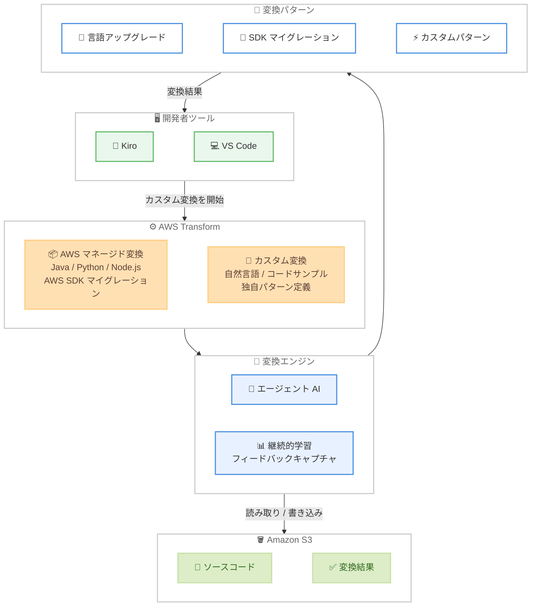

# AWS Transform - Kiro および VS Code での利用開始

**リリース日**: 2026 年 4 月 14 日
**サービス**: AWS Transform
**機能**: Kiro および VS Code からの AWS Transform カスタム変換の利用

📊 [このアップデートのインフォグラフィックを見る](https://takech9203.github.io/aws-news-summary/20260414-aws-transform-kiro-vscode.html)

## 概要

AWS Transform が Kiro および VS Code の 2 つの開発者ツールから利用可能になりました。AWS Transform は、エンタープライズの変革タイムラインを年単位から月単位に短縮するために設計されたエージェント型のマイグレーション・モダナイゼーションファクトリーです。大規模なインフラストラクチャマイグレーションから継続的な技術的負債の削減まで、幅広い変換タスクを処理します。

今回のローンチにより、開発者は普段使い慣れた IDE から直接 AWS Transform のカスタム変換を開始できるようになりました。AWS Transform カスタム変換は、技術的負債を大規模に解消するための機能であり、Java、Python、Node.js のバージョンアップグレードや AWS SDK マイグレーションなどの一般的なパターン向けの AWS マネージド変換を選択するか、独自のカスタム変換を定義して実行できます。

これまで AWS マネジメントコンソールや CLI からのみ利用可能だった AWS Transform のカスタム変換機能が、開発者のワークフローにシームレスに統合されたことで、コード変換の開始から結果の確認までを IDE 内で完結できるようになりました。

**アップデート前の課題**

- AWS Transform カスタム変換を利用するには AWS マネジメントコンソールや CLI を経由する必要があり、開発者の日常的なワークフローとの間にコンテキストスイッチが発生していた
- IDE で作業中のコードに対して変換を実行する場合、ソースコードを S3 にアップロードし、別のインターフェースで変換を開始するなどの手動ステップが必要だった
- 変換結果の確認やフィードバックの提供も IDE の外で行う必要があり、開発効率が低下していた

**アップデート後の改善**

- Kiro および VS Code から直接 AWS Transform カスタム変換を開始できるようになり、コンテキストスイッチが不要になった
- 開発者が普段使い慣れた環境から変換ワークフローにアクセスでき、技術的負債の解消をより迅速に行えるようになった
- IDE 内で変換の定義、実行、結果の確認を一貫して行えるため、開発ワークフローが効率化された

## アーキテクチャ図



Kiro および VS Code から AWS Transform のカスタム変換を開始し、エージェント AI による変換エンジンがソースコードを処理して変換結果を IDE に返すワークフローを示しています。

## サービスアップデートの詳細

### 主要機能

1. **Kiro からの AWS Transform カスタム変換**
   - Kiro IDE 内から直接 AWS Transform カスタム変換を起動可能
   - Kiro の AI エージェント機能と連携し、変換の定義から実行までをシームレスに実施
   - 変換結果の確認とコードへの適用を Kiro 内で完結

2. **VS Code からの AWS Transform カスタム変換**
   - VS Code 拡張機能を通じて AWS Transform カスタム変換にアクセス
   - 既存の VS Code ワークフローを中断することなく、コード変換を実行可能
   - 幅広い開発者コミュニティが利用できる環境を提供

3. **AWS マネージド変換**
   - Java バージョンアップグレード (例: Java 11 から Java 21)
   - Python バージョンアップグレード (例: Python 3.8 から Python 3.12)
   - Node.js バージョンアップグレード
   - AWS SDK マイグレーション (例: AWS SDK for Java v1 から v2)
   - AWS が管理・最適化する変換パターンをすぐに利用可能

4. **カスタム変換の定義**
   - 自然言語、ドキュメント、コードサンプルを使用して独自の変換パターンを定義
   - 組織固有のコーディング規約やアーキテクチャパターンに合わせたカスタマイズが可能
   - 継続的学習により、実行ごとに変換品質が向上

## 技術仕様

### 対応 IDE

| IDE | 説明 |
|-----|------|
| Kiro | AWS が提供する AI 搭載 IDE。AWS Transform との深い統合を提供 |
| VS Code | Microsoft が提供する広く普及した IDE。拡張機能を通じて利用可能 |

### 対応する AWS マネージド変換パターン

| 変換パターン | 説明 |
|--------------|------|
| Java バージョンアップグレード | Java 8/11 から Java 17/21 への移行 |
| Python バージョンアップグレード | Python 3.8 から Python 3.12 への移行 |
| Node.js バージョンアップグレード | Node.js の旧バージョンから最新 LTS への移行 |
| AWS SDK マイグレーション | AWS SDK v1 から v2 への移行 |

### カスタム変換の定義方法

| 方法 | 説明 |
|------|------|
| 自然言語 | 変換の目的と手順を自然言語で記述 |
| ドキュメント | 変換ルールをドキュメント形式で提供 |
| コードサンプル | 変換前後のコード例を提供して変換パターンを学習 |

## 設定方法

### 前提条件

1. AWS アカウントと適切な IAM 権限
2. Kiro または VS Code がインストールされていること
3. AWS Transform サービスが利用可能なリージョンのリソースへのアクセス権限

### 手順

#### ステップ 1: Kiro での利用開始

Kiro を使用する場合は、最新バージョンの Kiro をインストールまたはアップデートします。

```bash
# Kiro の最新バージョンを確認
kiro --version
```

Kiro の最新バージョンでは AWS Transform カスタム変換機能が組み込まれています。

#### ステップ 2: VS Code での利用開始

VS Code を使用する場合は、AWS Transform 拡張機能をインストールします。

1. VS Code を開く
2. 拡張機能マーケットプレースで「AWS Transform」を検索
3. 拡張機能をインストール
4. AWS 認証情報を設定

VS Code の拡張機能マーケットプレースから AWS Transform 拡張機能をインストールし、AWS 認証情報を設定することで利用を開始できます。

#### ステップ 3: AWS マネージド変換の実行

IDE 内から AWS Transform のカスタム変換パネルを開き、利用可能な AWS マネージド変換を選択して実行します。

```bash
# 例: AWS CLI を使用した変換の実行
aws transform start-transformation \
  --transformation-id "java-version-upgrade" \
  --source-location "s3://my-bucket/source/" \
  --target-location "s3://my-bucket/output/"
```

AWS マネージド変換を選択し、ソースコードの場所と出力先を指定して変換を開始します。IDE からはこの操作を GUI で実行できます。

#### ステップ 4: カスタム変換の定義と実行

独自の変換パターンを定義する場合は、自然言語やコードサンプルを使用して変換ルールを作成します。

```bash
# 例: カスタム変換定義の作成
aws transform create-custom-transformation \
  --name "my-custom-transform" \
  --description "Migrate deprecated API calls to new API" \
  --definition-file "file://transform-definition.json"
```

カスタム変換定義を作成し、変換の名前、説明、定義ファイルを指定します。定義ファイルには自然言語やコードサンプルを含めることができます。

## メリット

### ビジネス面

- **開発者の生産性向上**: IDE から直接変換を実行できるため、コンテキストスイッチが減少し、技術的負債の解消速度が向上
- **変革タイムラインの短縮**: エンタープライズの変革プロジェクトを年単位から月単位に圧縮し、ビジネスアジリティを向上
- **大規模な技術的負債の解消**: AWS マネージド変換により、一般的なアップグレードパターンを組織全体で一貫して適用可能

### 技術面

- **シームレスな IDE 統合**: Kiro と VS Code の 2 つの主要 IDE から利用でき、開発者の既存ワークフローに自然に組み込まれる
- **エージェント AI による高品質な変換**: AI エージェントが大規模なコードベース全体で一貫性のある変換を実行
- **継続的学習**: すべての変換実行からフィードバックを自動キャプチャし、変換品質が継続的に向上
- **柔軟な変換定義**: AWS マネージド変換とカスタム変換の両方をサポートし、多様なユースケースに対応

## デメリット・制約事項

### 制限事項

- 利用可能なリージョンが限られている (米国東部 バージニア北部、ヨーロッパ フランクフルト)
- AWS マネージド変換は Java、Python、Node.js のバージョンアップグレードと AWS SDK マイグレーションが中心であり、すべての言語やフレームワークに対応しているわけではない
- 大規模なコードベースの変換には処理時間がかかる場合がある

### 考慮すべき点

- カスタム変換の品質は、提供する定義の精度と詳細さに依存する
- 変換結果は必ず人間によるレビューを行い、意図しない変更がないか確認する必要がある
- IDE からの利用には適切な AWS 認証情報の設定が前提となる

## ユースケース

### ユースケース 1: Java アプリケーションのバージョンアップグレード

**シナリオ**: エンタープライズ開発チームが、数百のマイクロサービスで構成される Java 11 アプリケーションを Java 21 にアップグレードする必要がある。各開発者が担当するサービスを IDE から直接変換したい。

**実装例**:
```
1. VS Code で対象のマイクロサービスプロジェクトを開く
2. AWS Transform パネルから "Java Version Upgrade" マネージド変換を選択
3. ソースバージョン: Java 11、ターゲットバージョン: Java 21 を指定
4. 変換を実行し、結果をレビュー
```

**効果**: 各開発者が担当サービスを IDE 内で直接変換でき、アップグレードプロジェクト全体の完了速度が大幅に向上する。

### ユースケース 2: AWS SDK v1 から v2 への大規模マイグレーション

**シナリオ**: 組織全体で AWS SDK for Java v1 を使用しているが、v1 のサポート終了に伴い v2 への移行が必要。Kiro を使用してマイグレーションを効率化したい。

**実装例**:
```
1. Kiro で対象プロジェクトを開く
2. AWS Transform カスタム変換から "AWS SDK Migration" を選択
3. SDK for Java v1 から v2 への変換を指定
4. 変換結果を確認し、テストを実行
```

**効果**: SDK のマイグレーションが自動化され、手動での API 呼び出しの書き換え作業が不要になる。大規模なコードベースでも一貫した品質で移行が完了する。

### ユースケース 3: 組織固有のコーディング規約への準拠

**シナリオ**: 新しいコーディング規約やアーキテクチャパターンを組織全体に適用したい。カスタム変換を定義して、既存コードベースを規約に準拠させる。

**実装例**:
```
1. 自然言語とコードサンプルを使用してカスタム変換を定義
   - 変換前: 古いログライブラリの使用
   - 変換後: 新しい構造化ログフレームワークへの移行
2. IDE からカスタム変換を実行
3. 変換結果をレビューし、フィードバックを提供
4. 継続的学習により次回の変換品質が向上
```

**効果**: 組織固有の規約変更を自動化し、手動でのリファクタリング工数を大幅に削減できる。

## 料金

AWS Transform の料金は、変換の実行時間とリソース使用量に基づいて課金されます。IDE からの利用に追加料金はかかりません。詳細な料金については [AWS Transform 料金ページ](https://aws.amazon.com/transform/pricing/) を参照してください。

## 利用可能リージョン

AWS Transform は以下のリージョンで利用可能です。

- 米国東部 (バージニア北部)
- ヨーロッパ (フランクフルト)

Kiro および VS Code からの利用は、上記リージョンの AWS Transform サービスに接続して行います。

## 関連サービス・機能

- **AWS Transform custom**: カスタム変換定義を作成し、組織固有のコード変換パターンを自動化するサービス
- **Kiro**: AWS が提供する AI 搭載の統合開発環境。AWS Transform との深い統合を提供し、開発ワークフロー内でのコード変換を実現
- **VS Code**: Microsoft が提供する広く普及した IDE。AWS Transform 拡張機能を通じて変換機能にアクセス可能
- **Amazon S3**: 変換前のソースコードと変換後のコードの保存に使用
- **AWS PrivateLink**: VPC から AWS Transform へのプライベート接続を提供し、セキュアなアクセスを実現

## 参考リンク

- 📊 [インフォグラフィック](https://takech9203.github.io/aws-news-summary/20260414-aws-transform-kiro-vscode.html)
- [公式発表 (What's New)](https://aws.amazon.com/about-aws/whats-new/2026/04/aws-transform-kiro-vscode/)
- [AWS Transform custom ドキュメント](https://docs.aws.amazon.com/transform/latest/userguide/custom.html)
- [AWS Transform 製品ページ](https://aws.amazon.com/transform/)

## まとめ

AWS Transform が Kiro および VS Code から利用可能になったことで、開発者は普段使い慣れた IDE から直接カスタム変換を実行できるようになりました。Java、Python、Node.js のバージョンアップグレードや AWS SDK マイグレーションなどの AWS マネージド変換を即座に活用できるほか、組織固有のカスタム変換も定義可能です。大規模な技術的負債の解消やエンタープライズ変革プロジェクトの加速を目指すチームは、IDE から AWS Transform カスタム変換を試してみてください。
