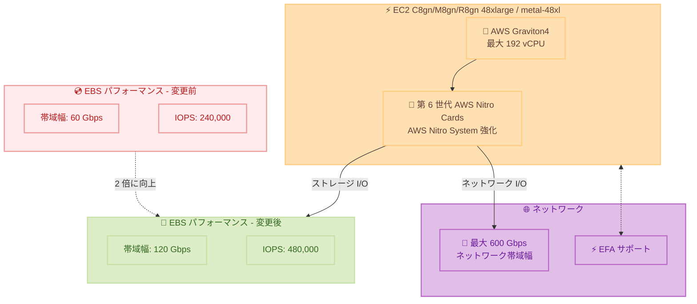

# Amazon EC2 - C8gn/M8gn/R8gn インスタンスの EBS 最適化パフォーマンスが 2 倍に向上

**リリース日**: 2026 年 4 月 14 日
**サービス**: Amazon EC2、Amazon EBS
**機能**: C8gn、M8gn、R8gn インスタンス (48xlarge/metal-48xl) の EBS パフォーマンス強化

📊 [このアップデートのインフォグラフィックを見る](https://takech9203.github.io/aws-news-summary/20260414-ec2-c8gn-m8gn-r8gn-ebs.html)

## 概要

AWS は、Amazon EC2 C8gn、M8gn、R8gn インスタンスの 48xlarge および metal-48xl サイズにおける Amazon EBS 最適化パフォーマンスの倍増を発表した。これらのインスタンスは AWS Graviton4 プロセッサと最新の第 6 世代 AWS Nitro Cards を搭載したネットワーク最適化インスタンスであり、今回の AWS Nitro System の機能強化により、EBS 帯域幅が 60 Gbps から 120 Gbps に、IOPS が 240,000 から 480,000 に倍増した。

この改善は追加コストなしで提供され、本日以降に起動されるすべての新規インスタンスに自動的に適用される。既存の実行中のインスタンスについては、インスタンスを停止して再起動することで、この性能向上を有効化できる。

ネットワーク最適化インスタンスでストレージ集約型のワークロードを実行しているユーザーにとって、追加投資なしで EBS パフォーマンスが 2 倍になることは大きなメリットとなる。

**アップデート前の課題**

- C8gn、M8gn、R8gn の 48xlarge および metal-48xl サイズの EBS 帯域幅は 60 Gbps が上限だった
- EBS IOPS は 240,000 が最大で、高 IOPS を必要とするワークロードではボトルネックとなる場合があった
- ネットワーク帯域幅 (最大 600 Gbps) に対して EBS 帯域幅が相対的に低く、ストレージ I/O がワークロードの制約要因になるケースがあった

**アップデート後の改善**

- EBS 帯域幅が 120 Gbps に倍増し、大容量データの読み書き速度が大幅に向上
- EBS IOPS が 480,000 に倍増し、データベースやトランザクション処理の性能が改善
- 追加コストなしで提供され、既存インスタンスも停止・起動のみで有効化可能
- AWS Nitro System の機能強化により、ハードウェア変更なしでソフトウェアレベルでの性能向上を実現

## アーキテクチャ図



この図は、AWS Nitro System の強化による EBS パフォーマンスの変更前後の比較と、インスタンスのネットワーク・ストレージ I/O の関係を示している。

## サービスアップデートの詳細

### 主要機能

1. **EBS 帯域幅の倍増**
   - 48xlarge および metal-48xl サイズで EBS 帯域幅が 60 Gbps から 120 Gbps に向上
   - 大容量データの読み書きにおけるスループットが 2 倍に
   - io2 Block Express や gp3 ボリュームなど高性能 EBS ボリュームとの組み合わせで最大限の効果を発揮

2. **EBS IOPS の倍増**
   - 最大 IOPS が 240,000 から 480,000 に向上
   - ランダム I/O パターンのワークロードで大幅な性能改善
   - データベースやトランザクション処理のレイテンシー削減に貢献

3. **AWS Nitro System の強化による実現**
   - 最新の AWS Nitro System の機能強化により、ソフトウェアレベルでの性能向上を実現
   - 第 6 世代 AWS Nitro Cards と組み合わせた最適化
   - ハードウェア交換不要で、既存インスタンスにも適用可能

4. **追加コストなしの透過的な適用**
   - 新規インスタンスには自動的に適用
   - 既存インスタンスは停止・起動のみで有効化
   - インスタンス料金の変更なし

## 技術仕様

### EBS パフォーマンス比較 (48xlarge / metal-48xl)

| 項目 | 変更前 | 変更後 | 倍率 |
|------|--------|--------|------|
| EBS 帯域幅 | 60 Gbps | 120 Gbps | 2 倍 |
| EBS IOPS | 240,000 | 480,000 | 2 倍 |

### 対象インスタンスタイプ

| インスタンスファミリー | 用途 | 対象サイズ | vCPU | メモリ (GiB) | ネットワーク帯域幅 |
|----------------------|------|-----------|------|-------------|------------------|
| C8gn | コンピューティング最適化 + ネットワーク最適化 | 48xlarge、metal-48xl | 192 | 384 | 最大 600 Gbps |
| M8gn | 汎用 + ネットワーク最適化 | 48xlarge、metal-48xl | 192 | 768 | 最大 600 Gbps |
| R8gn | メモリ最適化 + ネットワーク最適化 | 48xlarge、metal-48xl | 192 | 1,536 | 最大 600 Gbps |

### インスタンス共通仕様

| 項目 | 詳細 |
|------|------|
| プロセッサ | AWS Graviton4 |
| Nitro Card | 第 6 世代 AWS Nitro Cards |
| 最大ネットワーク帯域幅 | 600 Gbps |
| EBS 帯域幅 (強化後) | 120 Gbps |
| EBS IOPS (強化後) | 480,000 |
| EFA サポート | 16xlarge 以上のサイズで利用可能 |

### API 変更履歴

| 日付 | サービス | 変更内容 |
|------|----------|----------|
| 2026/04/10 | [EC2 Image Builder](https://awsapichanges.com/archive/changes/974e23-imagebuilder.html) | 4 updated api methods - イメージパイプラインへのタグ自動付与機能 |

*注: 本アップデートは EBS パフォーマンスの Nitro System レベルでの強化であり、EC2 API の直接的な変更は伴わない。

## 設定方法

### 前提条件

1. C8gn、M8gn、または R8gn の 48xlarge もしくは metal-48xl サイズのインスタンスであること
2. 対象リージョンで利用していること
3. 適切な IAM 権限を持っていること

### 手順

#### ステップ 1: 新規インスタンスの起動 (自動適用)

```bash
# C8gn.48xlarge インスタンスを起動 (強化された EBS パフォーマンスが自動適用)
aws ec2 run-instances \
  --image-id ami-xxxxxxxxx \
  --instance-type c8gn.48xlarge \
  --key-name my-key-pair \
  --subnet-id subnet-xxxxxxxxx \
  --security-group-ids sg-xxxxxxxxx
```

本日以降に起動される新規インスタンスには、120 Gbps の EBS 帯域幅と 480,000 IOPS が自動的に適用される。

#### ステップ 2: 既存インスタンスへの適用 (停止・起動)

```bash
# 既存インスタンスを停止
aws ec2 stop-instances \
  --instance-ids i-xxxxxxxxxxxxxxxxx

# インスタンスの停止を待機
aws ec2 wait instance-stopped \
  --instance-ids i-xxxxxxxxxxxxxxxxx

# インスタンスを起動 (強化された EBS パフォーマンスが有効化)
aws ec2 start-instances \
  --instance-ids i-xxxxxxxxxxxxxxxxx
```

既存の実行中のインスタンスは、停止して再起動することで、強化された EBS パフォーマンスが有効になる。なお、再起動 (reboot) ではなく、停止 (stop) してから起動 (start) する必要がある点に注意が必要である。

#### ステップ 3: EBS パフォーマンスの確認

```bash
# インスタンスの EBS 最適化情報を確認
aws ec2 describe-instance-types \
  --instance-types c8gn.48xlarge \
  --query "InstanceTypes[0].EbsInfo" \
  --output json
```

このコマンドにより、インスタンスタイプの EBS パフォーマンス仕様を確認できる。

## メリット

### ビジネス面

- **コスト効率の向上**: 追加コストなしで EBS パフォーマンスが 2 倍に向上し、同一インスタンスでより多くのストレージワークロードを処理可能
- **投資保護**: 既存インスタンスの停止・起動のみで性能向上を享受でき、インフラの再構築が不要
- **TCO の削減**: 同じパフォーマンス要件に対して、より少ないインスタンス数で対応できる可能性がある

### 技術面

- **ストレージボトルネックの解消**: 120 Gbps の EBS 帯域幅により、ネットワーク帯域幅 (600 Gbps) とのバランスが改善
- **IOPS 性能の大幅向上**: 480,000 IOPS により、高トランザクションデータベースの性能が改善
- **Nitro System による透過的な最適化**: ハードウェア変更なしでソフトウェアレベルの改善を実現

## デメリット・制約事項

### 制限事項

- 対象は 48xlarge および metal-48xl サイズのみ。それ以外のサイズでは EBS パフォーマンスの変更はない
- 既存の実行中のインスタンスは停止・起動が必要であり、再起動 (reboot) では有効化されない
- 停止・起動時にはインスタンスのパブリック IPv4 アドレスが変更される可能性がある (Elastic IP を使用していない場合)

### 考慮すべき点

- 120 Gbps の EBS 帯域幅を最大限に活用するには、io2 Block Express などの高性能 EBS ボリュームタイプが必要
- 複数の EBS ボリュームをアタッチしてストライピングすることで、集約帯域幅を最大化できる
- 既存インスタンスの停止・起動に伴うダウンタイムを考慮し、メンテナンスウィンドウでの作業を推奨

## ユースケース

### ユースケース 1: 高性能データベースワークロード

**シナリオ**: R8gn.48xlarge インスタンス上で大規模な PostgreSQL データベースを運用しており、高い IOPS とスループットが求められる。

**実装例**:
```bash
# R8gn.48xlarge で高性能データベース環境を構築
aws ec2 run-instances \
  --instance-type r8gn.48xlarge \
  --image-id ami-xxxxxxxxx \
  --key-name db-key \
  --block-device-mappings '[{
    "DeviceName": "/dev/sdf",
    "Ebs": {
      "VolumeType": "io2",
      "VolumeSize": 2000,
      "Iops": 64000,
      "DeleteOnTermination": true
    }
  }]'
```

**効果**: 480,000 IOPS と 120 Gbps の帯域幅により、データベースの読み書き性能が大幅に向上し、トランザクション処理のレイテンシーが削減される。1,536 GiB のメモリと合わせて、大規模なインメモリデータベース運用に最適である。

### ユースケース 2: 高性能並列ファイルシステム

**シナリオ**: M8gn.48xlarge インスタンス上で Amazon FSx for Lustre などの高性能並列ファイルシステムを運用し、大規模データ処理パイプラインを構築している。

**実装例**:
```bash
# M8gn.metal-48xl でベアメタル環境を起動
aws ec2 run-instances \
  --instance-type m8gn.metal-48xl \
  --image-id ami-xxxxxxxxx \
  --network-interfaces InterfaceType=efa,SubnetId=subnet-xxx,Groups=sg-xxx \
  --placement GroupName=hpc-placement-group
```

**効果**: 120 Gbps の EBS 帯域幅と 600 Gbps のネットワーク帯域幅を組み合わせることで、高性能ファイルシステムのスループットが向上し、データ処理パイプラインの所要時間が短縮される。

### ユースケース 3: データアナリティクスとストリーミング処理

**シナリオ**: C8gn.48xlarge インスタンスで大規模なリアルタイムデータ分析基盤を運用し、高スループットのデータ取り込みと処理を行っている。

**実装例**:
```bash
# C8gn.48xlarge で分析ノードを起動
aws ec2 run-instances \
  --instance-type c8gn.48xlarge \
  --image-id ami-xxxxxxxxx \
  --count 4 \
  --tag-specifications 'ResourceType=instance,Tags=[{Key=Name,Value=analytics-node}]' \
  --network-interfaces InterfaceType=efa,SubnetId=subnet-xxx,Groups=sg-xxx
```

**効果**: 倍増した EBS 帯域幅により、ストレージからのデータ読み出し速度が向上し、600 Gbps のネットワーク帯域幅と合わせて、ノード間のデータ転送とストレージ I/O の両方で高いスループットを実現できる。

## 料金

今回の EBS パフォーマンス強化は追加コストなしで提供される。C8gn、M8gn、R8gn インスタンスの料金に変更はない。

インスタンスの料金は、オンデマンド、Savings Plans、スポットインスタンスなどの購入オプションとリージョンによって異なる。

詳細な料金については、[Amazon EC2 料金ページ](https://aws.amazon.com/ec2/pricing/) を参照のこと。

## 利用可能リージョン

C8gn、M8gn、R8gn インスタンスが提供されているすべてのリージョンで、この EBS パフォーマンス強化が利用可能である。主なリージョンは以下の通り。

- US East (N. Virginia、Ohio)
- US West (Oregon、N. California)
- Europe (Frankfurt、Stockholm、Ireland、London)
- Asia Pacific (Singapore、Sydney、Mumbai、Tokyo)

*注: 各インスタンスタイプの利用可能リージョンの最新情報は、[AWS リージョン別サービス一覧](https://aws.amazon.com/about-aws/global-infrastructure/regional-product-services/) を参照のこと。

## 関連サービス・機能

- **Amazon EBS**: 高性能ブロックストレージ。io2 Block Express ボリュームとの組み合わせで最大限のパフォーマンスを発揮
- **AWS Nitro System**: EC2 インスタンスの基盤技術。今回のパフォーマンス強化を実現した中核コンポーネント
- **AWS Graviton4**: 最新世代の ARM ベースプロセッサ。Graviton3 比で最大 30% の計算性能向上
- **Elastic Fabric Adapter (EFA)**: HPC やクラスターワークロード向けの低レイテンシーネットワーキング

## 参考リンク

- 📊 [インフォグラフィック](https://takech9203.github.io/aws-news-summary/20260414-ec2-c8gn-m8gn-r8gn-ebs.html)
- [公式発表 (What's New)](https://aws.amazon.com/about-aws/whats-new/2026/04/ec2-c8gn-m8gn-r8gn-ebs/)
- [Amazon EC2 インスタンスタイプ](https://aws.amazon.com/ec2/instance-types/)
- [Amazon EBS ボリュームタイプ](https://aws.amazon.com/ebs/volume-types/)
- [AWS Nitro System](https://aws.amazon.com/ec2/nitro/)
- [AWS Graviton プロセッサ](https://aws.amazon.com/ec2/graviton/)
- [EC2 料金ページ](https://aws.amazon.com/ec2/pricing/)

## まとめ

Amazon EC2 C8gn、M8gn、R8gn インスタンスの 48xlarge および metal-48xl サイズにおける EBS パフォーマンスが、AWS Nitro System の強化により 2 倍に向上した。EBS 帯域幅が 120 Gbps、IOPS が 480,000 に倍増し、追加コストなしで利用できる。既存インスタンスは停止・起動のみで有効化可能であるため、対象インスタンスを利用中のユーザーは、メンテナンスウィンドウを活用して速やかにこの性能向上を適用することを推奨する。
