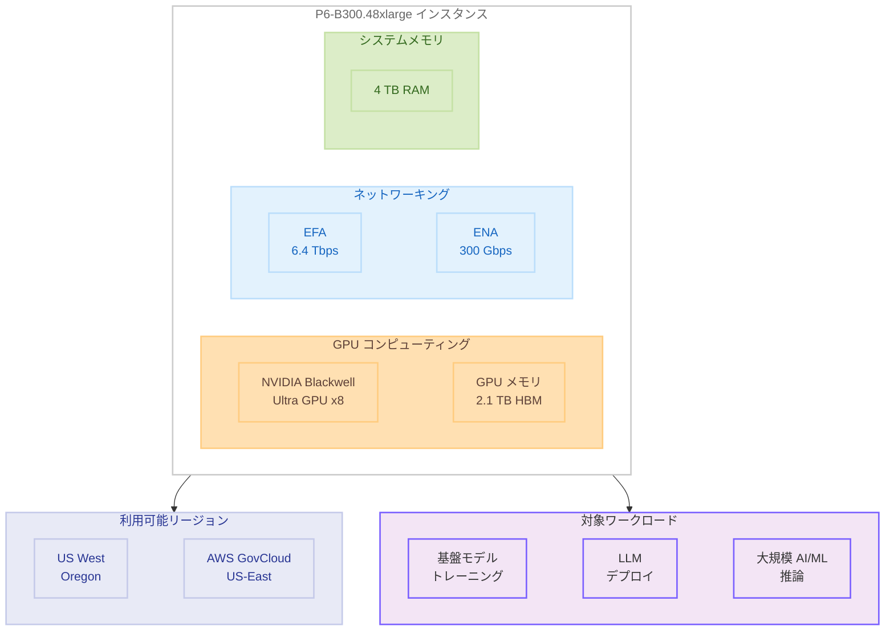

# Amazon EC2 P6-B300 インスタンス - AWS GovCloud (US-East) リージョンでの提供開始

**リリース日**: 2026 年 4 月 14 日
**サービス**: Amazon EC2
**機能**: P6-B300 インスタンスの GovCloud リージョン拡大

## 概要

Amazon EC2 P6-B300 インスタンスが AWS GovCloud (US-East) リージョンで利用可能になりました。P6-B300 インスタンスは、8 基の NVIDIA Blackwell Ultra GPU を搭載し、2.1 TB の高帯域幅 GPU メモリ、6.4 Tbps の EFA ネットワーキング、300 Gbps の専用 ENA スループット、4 TB のシステムメモリを提供します。

P6-B300 インスタンスは、P6-B200 インスタンスと比較して 2 倍のネットワーク帯域幅、1.5 倍の GPU メモリサイズ、1.5 倍の GPU TFLOPS (FP4、スパーシティなし) を実現します。これにより、数兆パラメータ規模の基盤モデル (FM) や大規模言語モデル (LLM) のトレーニングとデプロイに適しており、高度なテクニックを活用した AI ワークロードにおいて、より速いトレーニング時間とより多くのトークンスループットを実現します。

GovCloud リージョンでの提供開始により、米国政府機関や規制対象のワークロードを扱う組織が、最新世代の GPU コンピューティングリソースを活用して AI/ML ワークロードを実行できるようになります。

**アップデート前の課題**

- P6-B300 インスタンスは US West (Oregon) リージョンでのみ利用可能であり、GovCloud 環境で最新世代の GPU インスタンスを利用できなかった
- GovCloud 環境で大規模な基盤モデルのトレーニングやデプロイを行う際、前世代のインスタンスタイプに制限されていた
- 政府機関や規制対象ワークロードにおいて、最高性能の GPU コンピューティングリソースへのアクセスが限られていた

**アップデート後の改善**

- AWS GovCloud (US-East) リージョンで P6-B300 インスタンスが利用可能になり、規制対象ワークロードで最新の GPU コンピューティングを活用できるようになった
- GovCloud 環境で数兆パラメータ規模の基盤モデルのトレーニングとデプロイが可能になった
- P6-B200 と比較して大幅に向上したネットワーク帯域幅と GPU メモリにより、AI ワークロードのパフォーマンスが改善された

## アーキテクチャ図



P6-B300 インスタンスのアーキテクチャ構成を示しています。8 基の NVIDIA Blackwell Ultra GPU、2.1 TB の GPU メモリ、6.4 Tbps の EFA ネットワーキング、300 Gbps の ENA スループット、4 TB のシステムメモリを搭載し、US West (Oregon) と AWS GovCloud (US-East) の 2 リージョンで利用可能です。

## サービスアップデートの詳細

### 主要機能

1. **NVIDIA Blackwell Ultra GPU**
   - 8 基の NVIDIA Blackwell Ultra GPU を搭載
   - FP4 (スパーシティなし) で P6-B200 比 1.5 倍の GPU TFLOPS を提供
   - 数兆パラメータ規模のモデルのトレーニングとデプロイに最適化

2. **大容量 GPU メモリ**
   - 2.1 TB の高帯域幅 GPU メモリ (HBM)
   - P6-B200 と比較して 1.5 倍の GPU メモリサイズ
   - 大規模モデルのメモリ内保持が可能

3. **高速ネットワーキング**
   - 6.4 Tbps の Elastic Fabric Adapter (EFA) ネットワーキング
   - 300 Gbps の専用 Elastic Network Adapter (ENA) スループット
   - P6-B200 と比較して 2 倍のネットワーク帯域幅

4. **大容量システムメモリ**
   - 4 TB のシステムメモリ
   - データの前処理やモデルのロードに十分な容量

## 技術仕様

### インスタンス仕様

| 項目 | P6-B300 | P6-B200 (参考) |
|------|---------|----------------|
| GPU | NVIDIA Blackwell Ultra x8 | NVIDIA Blackwell x8 |
| GPU メモリ | 2.1 TB HBM | 1.4 TB HBM |
| EFA ネットワーク帯域幅 | 6.4 Tbps | 3.2 Tbps |
| ENA スループット | 300 Gbps | 150 Gbps |
| システムメモリ | 4 TB | - |
| インスタンスサイズ | p6-b300.48xlarge | p6-b200.48xlarge |

### P6-B200 との性能比較

| 項目 | 向上率 |
|------|--------|
| ネットワーク帯域幅 | 2 倍 |
| GPU メモリサイズ | 1.5 倍 |
| GPU TFLOPS (FP4、スパーシティなし) | 1.5 倍 |

### API 変更履歴

直近 7 日間において、P6-B300 インスタンスに直接関連する EC2 API の変更は確認されていません。EC2 Image Builder に関する API 変更 (imageTags プロパティの追加) は確認されましたが、P6-B300 インスタンスとは直接関係ありません。

### インスタンスの起動

```bash
aws ec2 run-instances \
  --instance-type p6-b300.48xlarge \
  --image-id ami-xxxxxxxx \
  --region us-gov-east-1 \
  --key-name my-key-pair \
  --subnet-id subnet-xxxxxxxx \
  --security-group-ids sg-xxxxxxxx
```

## 設定方法

### 前提条件

1. AWS GovCloud (US-East) リージョンへのアクセス権限を持つ AWS アカウント
2. P6-B300 インスタンスのサービスクォータが承認済みであること
3. EFA を使用する場合は、EFA 対応の AMI とセキュリティグループの設定が必要
4. 適切な VPC とサブネットの構成

### 手順

#### ステップ 1: サービスクォータの確認と申請

```bash
aws service-quotas get-service-quota \
  --service-code ec2 \
  --quota-code L-417A185B \
  --region us-gov-east-1
```

P6-B300 インスタンスの vCPU クォータが十分であることを確認します。不足している場合は、クォータの引き上げをリクエストしてください。

#### ステップ 2: EFA 対応セキュリティグループの作成

```bash
aws ec2 create-security-group \
  --group-name p6-b300-efa-sg \
  --description "Security group for P6-B300 with EFA" \
  --vpc-id vpc-xxxxxxxx \
  --region us-gov-east-1

aws ec2 authorize-security-group-ingress \
  --group-id sg-xxxxxxxx \
  --protocol -1 \
  --source-group sg-xxxxxxxx \
  --region us-gov-east-1
```

EFA を使用するためにセキュリティグループを作成し、同じセキュリティグループ内のインスタンス間での全トラフィックを許可します。

#### ステップ 3: インスタンスの起動

```bash
aws ec2 run-instances \
  --instance-type p6-b300.48xlarge \
  --image-id ami-xxxxxxxx \
  --key-name my-key-pair \
  --network-interfaces "DeviceIndex=0,SubnetId=subnet-xxxxxxxx,Groups=sg-xxxxxxxx,InterfaceType=efa" \
  --region us-gov-east-1
```

EFA ネットワークインターフェースを指定してインスタンスを起動します。AMI は NVIDIA ドライバーと EFA ドライバーがプリインストールされた Deep Learning AMI の使用を推奨します。

## メリット

### ビジネス面

- **GovCloud コンプライアンス**: FedRAMP、ITAR、CJIS などの規制要件に準拠しつつ、最新の GPU コンピューティングリソースを活用可能
- **AI イノベーションの加速**: 政府機関や防衛関連組織が最先端の AI/ML ワークロードを規制対象環境内で実行可能
- **トレーニング時間の短縮**: P6-B200 比で大幅に向上したスペックにより、大規模モデルのトレーニング時間を短縮し、Time-to-Market を改善

### 技術面

- **大規模モデル対応**: 2.1 TB の GPU メモリにより、数兆パラメータ規模のモデルをメモリ内に保持してトレーニングおよび推論が可能
- **高速データ転送**: 6.4 Tbps の EFA ネットワーキングにより、マルチノードトレーニングにおけるノード間通信のボトルネックを解消
- **高スループット推論**: 300 Gbps の専用 ENA スループットにより、大量の推論リクエストを低レイテンシーで処理可能

## デメリット・制約事項

### 制限事項

- インスタンスサイズは p6-b300.48xlarge のみで、より小さなサイズは提供されていない
- 利用可能リージョンは US West (Oregon) と AWS GovCloud (US-East) の 2 リージョンに限定
- GPU インスタンスのサービスクォータの引き上げが必要になる場合がある

### 考慮すべき点

- P6-B300 は最大級のインスタンスタイプであるため、コストが高額になる可能性がある
- NVIDIA Blackwell Ultra GPU のドライバーとソフトウェアスタックの互換性を事前に確認する必要がある
- EFA を最大限に活用するには、適切なネットワーク構成とセキュリティグループの設定が不可欠

## ユースケース

### ユースケース 1: 政府機関向け大規模言語モデルのトレーニング

**シナリオ**: 米国政府機関が機密データを使用して独自の大規模言語モデルをトレーニングする必要がある。データの所在地と処理環境は GovCloud 内に限定される必要がある。

**実装例**:
```bash
# P6-B300 クラスターでの分散トレーニング起動
aws ec2 run-instances \
  --instance-type p6-b300.48xlarge \
  --count 4 \
  --image-id ami-deep-learning-govcloud \
  --placement "GroupName=p6-training-cluster" \
  --network-interfaces "DeviceIndex=0,SubnetId=subnet-xxx,Groups=sg-xxx,InterfaceType=efa" \
  --region us-gov-east-1
```

**効果**: GovCloud 環境内で FedRAMP High に準拠しながら、最新の GPU コンピューティングリソースで数兆パラメータ規模のモデルトレーニングが可能になる。

### ユースケース 2: 防衛関連 AI 推論ワークロード

**シナリオ**: 防衛関連組織が ITAR 対象の AI モデルを使用して、リアルタイムの推論処理を実行する必要がある。

**効果**: 2.1 TB の GPU メモリと 300 Gbps の ENA スループットにより、大規模な基盤モデルを低レイテンシーでデプロイし、機密性の高い環境でリアルタイム推論を実行できる。

### ユースケース 3: 規制対象の科学計算ワークロード

**シナリオ**: 政府系研究機関が大規模なシミュレーションや科学計算を GPU アクセラレーションで実行し、成果物を GovCloud 内で管理する必要がある。

**効果**: 6.4 Tbps の EFA ネットワーキングにより、マルチノードでの大規模並列計算が効率的に実行でき、研究開発サイクルを短縮できる。

## 料金

P6-B300 インスタンスは、オンデマンドインスタンス、Reserved Instances、Savings Plans として購入できます。GovCloud リージョンの料金は、商用リージョンと異なる場合があります。

詳細な料金については、[Amazon EC2 料金ページ](https://aws.amazon.com/ec2/pricing/) および [AWS GovCloud 料金ページ](https://aws.amazon.com/govcloud-us/pricing/) を参照してください。

## 利用可能リージョン

P6-B300 インスタンス (p6-b300.48xlarge) は、以下の AWS リージョンで利用可能です。

- US West (Oregon)
- AWS GovCloud (US-East)

## 関連サービス・機能

- **NVIDIA Blackwell Ultra GPU**: 最新世代の NVIDIA GPU アーキテクチャで、AI/ML ワークロードに最適化された高性能コンピューティングを提供
- **Elastic Fabric Adapter (EFA)**: HPC および ML アプリケーション向けの高スループット、低レイテンシーのネットワークインターフェース
- **Amazon EC2 P6-B200 インスタンス**: P6-B300 の前世代にあたる NVIDIA Blackwell GPU 搭載インスタンス
- **AWS GovCloud (US)**: 米国政府の規制要件に準拠した隔離された AWS リージョン
- **Amazon SageMaker**: ML モデルの構築、トレーニング、デプロイを支援するフルマネージドサービス

## 参考リンク

- [公式発表 (What's New)](https://aws.amazon.com/about-aws/whats-new/2026/04/ec2-p6-b300-govcloud-us-east/)
- [Amazon EC2 P6 インスタンス](https://aws.amazon.com/ec2/instance-types/p6/)
- [Amazon EC2 料金](https://aws.amazon.com/ec2/pricing/)
- [AWS GovCloud (US)](https://aws.amazon.com/govcloud-us/)
- [Elastic Fabric Adapter](https://aws.amazon.com/hpc/efa/)

## まとめ

Amazon EC2 P6-B300 インスタンスの AWS GovCloud (US-East) リージョンでの提供開始により、政府機関や規制対象のワークロードを扱う組織が最新世代の NVIDIA Blackwell Ultra GPU を活用した大規模 AI/ML ワークロードを実行できるようになりました。P6-B200 と比較して 2 倍のネットワーク帯域幅、1.5 倍の GPU メモリ、1.5 倍の GPU TFLOPS を実現しており、GovCloud 環境で数兆パラメータ規模の基盤モデルのトレーニングやデプロイを検討している場合は、P6-B300 インスタンスの採用を推奨します。
