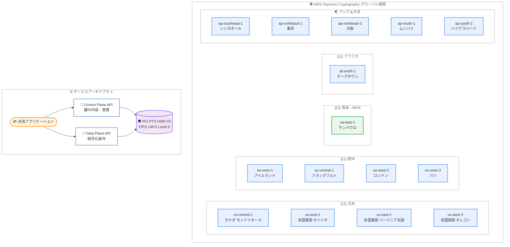

# AWS Payment Cryptography - 南米 (サンパウロ) リージョンでの提供開始

**リリース日**: 2026 年 4 月 15 日
**サービス**: AWS Payment Cryptography
**機能**: 南米 (サンパウロ) リージョン sa-east-1 での利用可能化

[このアップデートのインフォグラフィックを見る](https://takech9203.github.io/aws-news-summary/20260415-aws-payment-cryptography-south.html)

## 概要

AWS Payment Cryptography が南米 (サンパウロ) リージョンで利用可能になりました。これにより、南米でレイテンシーに敏感な決済アプリケーションを運用する顧客は、クロスリージョン接続に依存することなく、同一リージョン内で決済暗号処理を実行できるようになります。

AWS Payment Cryptography は、クラウドホスト型の決済アプリケーション向けに、決済固有の暗号化操作と鍵管理を簡素化するフルマネージドサービスです。専用のペイメント HSM インスタンスを調達する必要がなく、PCI PIN および PCI P2PE 準拠として評価されたサービスを利用できます。エラスティックに自動スケーリングし、高可用性と耐障害性を提供します。

今回の拡張により、AWS Payment Cryptography は合計 15 リージョン (北米 4、欧州 4、南米 1、アフリカ 1、アジア太平洋 5) で利用可能となり、グローバルな決済処理基盤としてのカバレッジが強化されました。

**アップデート前の課題**

- 南米で決済アプリケーションを運用する顧客は、他リージョン (例: 米国東部) の AWS Payment Cryptography にクロスリージョンで接続する必要があり、レイテンシーが増加していた
- 決済処理ではミリ秒単位の応答時間が求められるため、リージョン間の物理的距離がパフォーマンスのボトルネックになる場合があった
- データ主権やコンプライアンス要件により、南米リージョン内でのデータ処理を求める顧客のニーズに対応できなかった

**アップデート後の改善**

- 南米 (サンパウロ) リージョン内で決済暗号処理が完結するため、低レイテンシーでの決済トランザクション処理が可能になった
- クロスリージョン依存が不要になり、可用性とレジリエンスが向上した
- ブラジルを含む南米市場のデータ主権要件 (LGPD など) への対応が容易になった

## アーキテクチャ図



AWS Payment Cryptography のグローバルリージョン展開と基本的なサービスアーキテクチャを示しています。緑色のノードが今回新たに追加された南米 (サンパウロ) リージョンです。

## サービスアップデートの詳細

### 主要機能

1. **南米 (サンパウロ) リージョンでのフルサービス提供**
   - Control Plane API と Data Plane API の両方が sa-east-1 で利用可能
   - 既存リージョンと同等の機能セットを提供
   - PCI PIN および PCI P2PE 準拠として評価済み

2. **低レイテンシーの決済暗号処理**
   - 南米に物理的に近いリージョンでの処理により、決済トランザクションのレイテンシーを削減
   - PIN 検証、CVV 生成、MAC 署名などのリアルタイム処理がリージョン内で完結
   - クロスリージョン通信に起因するレイテンシーの変動を排除

3. **グローバルカバレッジの拡充**
   - 合計 15 リージョンでの提供により、主要な決済市場をカバー
   - 南米市場 (特にブラジル) で決済インフラをクラウドに移行する企業を支援
   - マルチリージョン構成による冗長性と災害復旧オプションの強化

## 技術仕様

### AWS Payment Cryptography の概要

| 項目 | 詳細 |
|------|------|
| サービスタイプ | フルマネージド決済暗号サービス |
| HSM 認証 | PCI PTS HSM V3、FIPS 140-2 Level 3 |
| コンプライアンス | PCI PIN、PCI P2PE、PCI DSS 準拠 |
| 対応鍵タイプ | TDES、AES、RSA (対称鍵・非対称鍵) |
| API | Control Plane API (鍵管理)、Data Plane API (暗号操作) |
| スケーリング | フルエラスティック (自動スケーリング) |
| 鍵交換プロトコル | TR-31 (対称鍵)、TR-34 (非対称鍵による対称鍵配布) |

### 利用可能リージョン一覧

| 地域 | リージョン名 | リージョンコード |
|------|------------|----------------|
| 北米 | カナダ (モントリオール) | ca-central-1 |
| 北米 | 米国東部 (オハイオ) | us-east-2 |
| 北米 | 米国東部 (バージニア北部) | us-east-1 |
| 北米 | 米国西部 (オレゴン) | us-west-2 |
| 欧州 | アイルランド | eu-west-1 |
| 欧州 | フランクフルト | eu-central-1 |
| 欧州 | ロンドン | eu-west-2 |
| 欧州 | パリ | eu-west-3 |
| 南米 | サンパウロ (NEW) | sa-east-1 |
| アフリカ | ケープタウン | af-south-1 |
| アジア太平洋 | シンガポール | ap-southeast-1 |
| アジア太平洋 | 東京 | ap-northeast-1 |
| アジア太平洋 | 大阪 | ap-northeast-3 |
| アジア太平洋 | ムンバイ | ap-south-1 |
| アジア太平洋 | ハイデラバード | ap-south-2 |

### API 変更履歴

今回のアップデートに関連する API の変更は確認されていません。リージョン拡張のため、既存の API がそのまま新リージョンで利用可能になります。

### 主要な暗号化操作

```bash
# 鍵の作成 (サンパウロリージョンで実行)
aws payment-cryptography create-key \
  --region sa-east-1 \
  --key-attributes KeyAlgorithm=AES_256,KeyUsage=TR31_P0_PIN_ENCRYPTION_KEY,KeyClass=SYMMETRIC_KEY \
  --exportable

# PIN の検証 (Data Plane API)
aws payment-cryptography-data verify-pin-data \
  --region sa-east-1 \
  --verification-key-identifier "arn:aws:payment-cryptography:sa-east-1:123456789012:key/example-key-id" \
  --encryption-key-identifier "arn:aws:payment-cryptography:sa-east-1:123456789012:key/example-enc-key-id" \
  --primary-account-number "171234567890123" \
  --pin-block-format ISO_FORMAT_0 \
  --encrypted-pin-block "AC17DC148B032A23" \
  --verification-attributes '{"VisaPin":{"PinVerificationKeyIndex":1,"VerificationValue":"5507"}}'
```

## 設定方法

### 前提条件

1. AWS アカウントでサンパウロリージョン (sa-east-1) が有効化されていること
2. AWS CLI v2 または対応 SDK がインストール済みであること
3. IAM ポリシーで payment-cryptography サービスへのアクセスが許可されていること

### 手順

#### ステップ 1: リージョンの確認とエンドポイント設定

```bash
# サンパウロリージョンのエンドポイントを使用して接続確認
aws payment-cryptography list-keys \
  --region sa-east-1 \
  --max-results 5
```

サンパウロリージョンの AWS Payment Cryptography エンドポイントに接続し、サービスが利用可能であることを確認します。

#### ステップ 2: 暗号鍵の作成

```bash
# PIN 暗号化用の AES 鍵を作成
aws payment-cryptography create-key \
  --region sa-east-1 \
  --key-attributes KeyAlgorithm=AES_256,KeyUsage=TR31_P0_PIN_ENCRYPTION_KEY,KeyClass=SYMMETRIC_KEY \
  --exportable

# CVV 生成用の鍵を作成
aws payment-cryptography create-key \
  --region sa-east-1 \
  --key-attributes KeyAlgorithm=TDES_3KEY,KeyUsage=TR31_C0_CARD_VERIFICATION_KEY,KeyClass=SYMMETRIC_KEY
```

サンパウロリージョンで決済処理に必要な暗号鍵を作成します。用途に応じて適切な鍵アルゴリズムと使用目的を指定します。

#### ステップ 3: 既存リージョンからの鍵のインポート

```bash
# 他リージョンの鍵をエクスポート (例: 米国東部バージニア北部)
aws payment-cryptography export-key \
  --region us-east-1 \
  --key-material '{"Tr31KeyBlock":{"WrappingKeyIdentifier":"arn:aws:payment-cryptography:us-east-1:123456789012:key/wrapping-key-id"}}' \
  --export-key-identifier "arn:aws:payment-cryptography:us-east-1:123456789012:key/source-key-id"

# サンパウロリージョンにインポート
aws payment-cryptography import-key \
  --region sa-east-1 \
  --key-material '{"Tr31KeyBlock":{"WrappingKeyIdentifier":"arn:aws:payment-cryptography:sa-east-1:123456789012:key/wrapping-key-id","WrappedKeyBlock":"<exported-key-block>"}}'
```

TR-31 プロトコルを使用して、既存リージョンの暗号鍵をサンパウロリージョンに安全にインポートします。鍵の移行時にクリアテキストが露出することはありません。

## メリット

### ビジネス面

- **南米市場での競争力強化**: ブラジルをはじめとする南米市場で低レイテンシーの決済処理を実現し、エンドユーザーの決済体験を向上
- **データ主権への対応**: ブラジルの LGPD (Lei Geral de Protecao de Dados) やその他の南米各国のデータ保護規制に対し、リージョン内でのデータ処理で対応可能
- **運用コストの削減**: 専用のオンプレミスペイメント HSM の調達・運用が不要となり、南米拠点でのインフラコストを削減

### 技術面

- **レイテンシーの大幅削減**: 南米から米国東部への往復レイテンシー (約 100-150ms) が、リージョン内処理 (数 ms) に短縮
- **高可用性アーキテクチャ**: マルチリージョン構成のオプションとして南米リージョンを追加でき、災害復旧戦略が強化
- **シームレスな移行**: 既存の API とコードをそのまま使用し、リージョンパラメータの変更のみで移行可能

## デメリット・制約事項

### 制限事項

- AWS Payment Cryptography の鍵はリージョン固有のリソースであり、自動的なクロスリージョンレプリケーションは提供されない
- サンパウロリージョンは他のリージョンと比較して一部のインスタンスタイプや関連サービスの提供が限定される場合がある
- リージョン間の鍵移行には TR-31 または TR-34 プロトコルによる手動エクスポート・インポートが必要

### 考慮すべき点

- 既存の他リージョンで稼働中のワークロードを移行する場合、鍵のエクスポート・インポート手順とアプリケーションのエンドポイント変更が必要
- マルチリージョン構成を採用する場合、鍵の同期管理とトランザクションルーティングの設計が必要
- サンパウロリージョンの料金は他のリージョンと異なる場合があるため、料金ページで確認が必要

## ユースケース

### ユースケース 1: ブラジルの決済処理会社のクラウド移行

**シナリオ**: ブラジルの決済処理会社が、オンプレミスのペイメント HSM から AWS Payment Cryptography へ移行し、南米市場向けの決済処理を低レイテンシーで提供したい。

**実装例**:
```bash
# サンパウロリージョンで PIN 暗号化鍵を作成
aws payment-cryptography create-key \
  --region sa-east-1 \
  --key-attributes KeyAlgorithm=AES_256,KeyUsage=TR31_P0_PIN_ENCRYPTION_KEY,KeyClass=SYMMETRIC_KEY

# PIN 変換 (PIN Translation) を実行
aws payment-cryptography-data translate-pin-data \
  --region sa-east-1 \
  --incoming-key-identifier "arn:aws:payment-cryptography:sa-east-1:123456789012:key/incoming-key" \
  --outgoing-key-identifier "arn:aws:payment-cryptography:sa-east-1:123456789012:key/outgoing-key" \
  --encrypted-pin-block "AC17DC148B032A23" \
  --incoming-translation-attributes '{"IsoFormat0":{"PrimaryAccountNumber":"171234567890123"}}' \
  --outgoing-translation-attributes '{"IsoFormat0":{"PrimaryAccountNumber":"171234567890123"}}'
```

**効果**: オンプレミス HSM の運用負荷を排除し、PCI PIN 準拠のクラウドネイティブな決済処理基盤をサンパウロリージョンで構築できる。

### ユースケース 2: グローバル EC プラットフォームの南米展開

**シナリオ**: グローバルに展開する EC プラットフォームが、南米の顧客向けにカード決済処理のレイテンシーを改善したい。現在は米国東部リージョンで全世界の決済処理を行っている。

**実装例**:
```bash
# サンパウロリージョンで CVV 検証用の鍵を作成
aws payment-cryptography create-key \
  --region sa-east-1 \
  --key-attributes KeyAlgorithm=TDES_3KEY,KeyUsage=TR31_C0_CARD_VERIFICATION_KEY,KeyClass=SYMMETRIC_KEY

# CVV2 の検証
aws payment-cryptography-data verify-card-validation-data \
  --region sa-east-1 \
  --key-identifier "arn:aws:payment-cryptography:sa-east-1:123456789012:key/cvv-key-id" \
  --primary-account-number "171234567890123" \
  --verification-attributes '{"CardVerificationValue2":{"CardExpiryDate":"0428"}}' \
  --validation-data "123"
```

**効果**: 南米の顧客からの決済リクエストをサンパウロリージョンで処理することで、カード検証のレスポンスタイムを大幅に短縮し、決済成功率の向上とカート離脱率の低減を実現。

### ユースケース 3: マルチリージョン決済基盤の構築

**シナリオ**: 国際的な決済ネットワーク事業者が、グローバルなフェイルオーバーと低レイテンシー処理を両立するマルチリージョン決済基盤を構築したい。

**実装例**:
```bash
# 各リージョンで同等の鍵を準備
# 1. 米国東部で鍵をエクスポート
aws payment-cryptography export-key \
  --region us-east-1 \
  --key-material '{"Tr31KeyBlock":{"WrappingKeyIdentifier":"arn:aws:payment-cryptography:us-east-1:123456789012:key/kek-id"}}' \
  --export-key-identifier "arn:aws:payment-cryptography:us-east-1:123456789012:key/master-key"

# 2. サンパウロにインポート
aws payment-cryptography import-key \
  --region sa-east-1 \
  --key-material '{"Tr31KeyBlock":{"WrappingKeyIdentifier":"arn:aws:payment-cryptography:sa-east-1:123456789012:key/kek-id","WrappedKeyBlock":"<key-block>"}}'

# 3. Route 53 のレイテンシーベースルーティングで最寄りリージョンへ振り分け
aws route53 change-resource-record-sets \
  --hosted-zone-id Z1234567890 \
  --change-batch '{
    "Changes": [{
      "Action": "CREATE",
      "ResourceRecordSet": {
        "Name": "payment-api.example.com",
        "Type": "A",
        "SetIdentifier": "sa-east-1",
        "Region": "sa-east-1",
        "AliasTarget": {
          "HostedZoneId": "Z1234567890",
          "DNSName": "payment-api-sa.example.com",
          "EvaluateTargetHealth": true
        }
      }
    }]
  }'
```

**効果**: Route 53 のレイテンシーベースルーティングと組み合わせることで、南米の顧客は自動的にサンパウロリージョンに接続され、他リージョンの障害時にはフェイルオーバーが可能な高可用性決済基盤を実現。

## 料金

AWS Payment Cryptography の料金は、鍵の保管と暗号化操作 (API コール) に基づきます。

### 料金例

| 項目 | 料金 (概算) |
|------|------------|
| アクティブな鍵 1 件あたり | $1.00/月 |
| 暗号化操作 (API コール) 10,000 回あたり | $1.70 |
| 鍵のインポート/エクスポート | 暗号化操作として課金 |

※ 料金はリージョンによって異なる場合があります。最新の料金は公式料金ページを確認してください。

## 利用可能リージョン

今回のアップデートにより、AWS Payment Cryptography は以下の 15 リージョンで利用可能です。

- **北米**: カナダ (モントリオール)、米国東部 (オハイオ)、米国東部 (バージニア北部)、米国西部 (オレゴン)
- **欧州**: アイルランド、フランクフルト、ロンドン、パリ
- **南米**: サンパウロ (NEW)
- **アフリカ**: ケープタウン
- **アジア太平洋**: シンガポール、東京、大阪、ムンバイ、ハイデラバード

## 関連サービス・機能

- **AWS Key Management Service (KMS)**: 汎用的な暗号鍵管理サービス。AWS Payment Cryptography は決済固有の暗号操作に特化しており、KMS とは用途が異なる
- **AWS CloudHSM**: 汎用 HSM をクラウドで提供するサービス。Payment Cryptography はペイメント HSM の機能をフルマネージドで提供する上位サービス
- **Amazon Route 53**: レイテンシーベースルーティングにより、最寄りの Payment Cryptography リージョンへトラフィックを自動振り分け可能
- **AWS CloudTrail**: Payment Cryptography の API コールを監査ログとして記録し、PCI DSS のモニタリング要件に対応
- **AWS IAM**: Payment Cryptography の鍵と暗号操作に対するきめ細かいアクセス制御を提供

## 参考リンク

- [インフォグラフィック](https://takech9203.github.io/aws-news-summary/20260415-aws-payment-cryptography-south.html)
- [公式発表 (What's New)](https://aws.amazon.com/about-aws/whats-new/2026/04/aws-payment-cryptography-south/)
- [AWS Payment Cryptography ドキュメント](https://docs.aws.amazon.com/payment-cryptography/latest/userguide/)
- [AWS Payment Cryptography サービスページ](https://aws.amazon.com/payment-cryptography/)
- [料金ページ](https://aws.amazon.com/payment-cryptography/pricing/)

## まとめ

AWS Payment Cryptography が南米 (サンパウロ) リージョンで利用可能になり、南米で決済アプリケーションを運用する顧客はクロスリージョン接続に依存することなく、低レイテンシーで PCI 準拠の暗号化操作を実行できるようになりました。ブラジルをはじめとする南米市場で決済処理を行う企業は、オンプレミス HSM からの移行やクラウドネイティブな決済基盤の構築を検討することを推奨します。既存リージョンで運用中のワークロードの移行には、TR-31/TR-34 による鍵のインポート手順を事前に検証してください。
