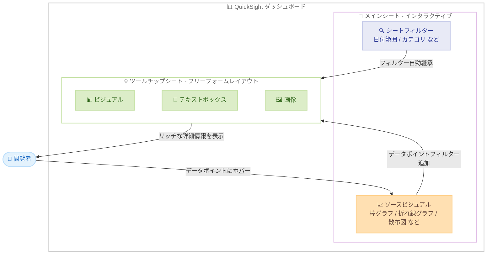

# Amazon QuickSight - シートツールチップによるリッチなコンテキストデータ探索

**リリース日**: 2026 年 4 月 15 日
**サービス**: Amazon QuickSight (Amazon Quick)
**機能**: シートツールチップ (Sheet Tooltips)

📊 [このアップデートのインフォグラフィックを見る](https://takech9203.github.io/aws-news-summary/20260415-quick-sheet-tooltips.html)

## 概要

Amazon Quick の QuickSight にシートツールチップ機能が追加された。この機能により、ダッシュボードの閲覧者がデータポイントにマウスをホバーした際に、リッチでコンテキストに応じた詳細情報をポップアップ表示できるようになる。従来のシンプルなテキストベースのツールチップとは異なり、ビジュアル、テキストボックス、画像などを含む専用のツールチップシートを作成し、自由なレイアウトで配置できる。

シートツールチップは、ソースビジュアルのすべてのフィルターを自動的に継承し、ホバーされた特定のデータポイントに対する追加フィルターを適用する。これにより、閲覧者は分析フローを中断することなく、即座に焦点を絞った詳細な内訳情報を取得できる。

この機能はインタラクティブシートでのみ利用可能であり、QuickSight がサポートされているすべての Amazon Quick リージョンで提供されている。ダッシュボード作成者が直感的なデータ探索体験を構築するための強力なツールとなる。

**アップデート前の課題**

- データポイントの詳細情報を確認するために、別のシートへの手動ナビゲーションが必要だった
- ツールチップはシンプルなテキスト表示のみで、ビジュアルや画像を含むリッチなコンテンツを表示できなかった
- 1 つのダッシュボードで詳細なデータ探索を行うには、複数のシートやドリルダウン設定が必要だった
- 閲覧者が分析フローを維持したまま、コンテキストに応じた詳細情報にアクセスする手段が限られていた

**アップデート後の改善**

- ビジュアル、テキストボックス、画像を含む専用のツールチップシートを自由なレイアウトで作成可能に
- データポイントへのホバーだけで、コンテキストに応じた詳細情報が即座に表示される
- ソースビジュアルのフィルターが自動継承され、特定のデータポイントに対する追加フィルターも自動適用
- 複数シートへの手動ナビゲーションが不要になり、分析フローの中断を最小化

## アーキテクチャ図



この図は、QuickSight のシートツールチップ機能のアーキテクチャを示している。閲覧者がソースビジュアルのデータポイントにホバーすると、シートフィルターが自動継承され、データポイント固有のフィルターが追加された状態で、ツールチップシートのリッチなコンテンツが表示される。

## サービスアップデートの詳細

### 主要機能

1. **専用ツールチップシートの作成**
   - ダッシュボード作成者がツールチップ専用のシートを作成可能
   - フリーフォームレイアウトでビジュアル、テキストボックス、画像を自由に配置
   - 通常のシートと同様のデザインツールを使用してツールチップのコンテンツを構成

2. **自動フィルター継承とデータポイントフィルタリング**
   - ソースビジュアルに適用されているすべてのシートフィルターをツールチップシートが自動的に継承
   - ホバーされた特定のデータポイントに対する追加フィルターが自動適用
   - フィルター設定の手動構成が不要で、常にコンテキストに応じた情報を表示

3. **分析フローを中断しないデータ探索**
   - データポイントにマウスをホバーするだけで詳細情報が即座に表示
   - 別のシートへの手動ナビゲーションやドリルダウン操作が不要
   - 閲覧者の分析思考を妨げることなく、深い洞察を提供

4. **リッチコンテンツの表示**
   - ビジュアル (グラフ、チャート) をツールチップ内に配置可能
   - テキストボックスによる説明文やコンテキスト情報の追加
   - 画像の埋め込みによる視覚的な補足情報の提供

## 技術仕様

### シートツールチップの仕様

| 項目 | 詳細 |
|------|------|
| 対応シートタイプ | インタラクティブシートのみ |
| ツールチップシートレイアウト | フリーフォームレイアウト |
| 配置可能なコンテンツ | ビジュアル、テキストボックス、画像 |
| フィルター継承 | ソースビジュアルのフィルターを自動継承 |
| データポイントフィルター | ホバーしたデータポイントに基づく追加フィルターを自動適用 |
| トリガーアクション | データポイントへのマウスホバー |

### 対応ビジュアルタイプ

| ビジュアルタイプ | シートツールチップ対応 |
|-----------------|---------------------|
| 棒グラフ | 対応 |
| 折れ線グラフ | 対応 |
| 散布図 | 対応 |
| 円グラフ | 対応 |
| テーブル | 対応 |
| その他のインタラクティブビジュアル | 対応 |

### API 変更履歴

直近 7 日間で QuickSight に関連する API 変更は検出されなかった。本機能は QuickSight のコンソール上での機能拡張であり、既存の API フレームワーク内で提供されている可能性がある。

*注: 最新の API 変更は [AWS API Changes](https://awsapichanges.com/) で確認可能。

### IAM 権限

シートツールチップの作成・管理には、既存の QuickSight ダッシュボード作成者権限が必要である。

```json
{
    "Version": "2012-10-17",
    "Statement": [
        {
            "Effect": "Allow",
            "Action": [
                "quicksight:CreateDashboard",
                "quicksight:UpdateDashboard",
                "quicksight:CreateAnalysis",
                "quicksight:UpdateAnalysis"
            ],
            "Resource": "arn:aws:quicksight:*:*:dashboard/*"
        }
    ]
}
```

## 設定方法

### 前提条件

1. Amazon QuickSight の Enterprise Edition または Standard Edition のアカウントがあること
2. ダッシュボード作成者 (Author) 権限を持っていること
3. インタラクティブシートを含む分析またはダッシュボードが存在すること

### 手順

#### ステップ 1: ツールチップシートの作成

QuickSight の分析画面で、新しいシートを追加し、ツールチップシートとして設定する。

1. 分析を開き、シートタブの「+」ボタンをクリック
2. 新しいシートを追加し、レイアウトとして「フリーフォーム」を選択
3. このシートをツールチップシートとして指定

#### ステップ 2: ツールチップシートのコンテンツ配置

ツールチップシートにビジュアル、テキストボックス、画像などのコンテンツを配置する。

1. ツールチップシートにビジュアルを追加 (例: KPI、ミニチャート、詳細テーブルなど)
2. テキストボックスでコンテキスト情報や説明文を追加
3. 必要に応じて画像を配置
4. フリーフォームレイアウトでコンテンツの位置とサイズを調整

#### ステップ 3: ソースビジュアルへのツールチップシートの割り当て

メインシートのソースビジュアルに対して、作成したツールチップシートを割り当てる。

1. メインシートに移動し、ツールチップを適用するビジュアルを選択
2. ビジュアルの設定からツールチップオプションを開く
3. 作成したツールチップシートを選択して割り当て
4. プレビューでホバー時の表示を確認

## メリット

### ビジネス面

- **データドリブンな意思決定の加速**: ホバーするだけで詳細なコンテキスト情報が得られるため、分析から意思決定までの時間を短縮
- **ダッシュボード利用率の向上**: 直感的な操作で深い洞察が得られるため、ダッシュボードの利用頻度と満足度が向上
- **トレーニングコストの削減**: 複雑なナビゲーションや操作が不要になり、新規ユーザーのオンボーディングが容易に

### 技術面

- **ダッシュボード設計の簡素化**: 複数のシートやドリルダウン設定を作成する代わりに、ツールチップシートで詳細情報を提供可能
- **自動フィルター継承**: 手動でのフィルター連携設定が不要で、常にコンテキストに応じた正確な情報を表示
- **フリーフォームレイアウト**: ツールチップのデザインを柔軟にカスタマイズ可能で、ブランドガイドラインに沿った表示を実現

## デメリット・制約事項

### 制限事項

- インタラクティブシートでのみ利用可能。ページ分割レポートシートでは使用できない
- ツールチップシートのコンテンツ量が多い場合、表示パフォーマンスに影響する可能性がある
- ツールチップはマウスホバーで表示されるため、タッチデバイスでの操作性が限定的である

### 考慮すべき点

- ツールチップシートに多数のビジュアルを配置すると、データのクエリ回数が増加し、ダッシュボード全体のパフォーマンスに影響する可能性がある
- ツールチップシートのデザインは、コンパクトかつ情報密度の高い設計が推奨される
- 既存のカスタムツールチップ設定との互換性を確認する必要がある

## ユースケース

### ユースケース 1: 営業ダッシュボードでの顧客詳細表示

**シナリオ**: 営業チームが地域別売上の棒グラフを閲覧しており、特定の地域にホバーした際に、その地域のトップ顧客、製品別内訳、前年比較を即座に確認したい。

**実装例**:
```
ツールチップシート構成:
- KPI ビジュアル: 地域別売上合計、前年比成長率
- 棒グラフ: 製品カテゴリ別売上内訳
- テーブル: トップ 5 顧客リスト
- テキストボックス: 地域の営業担当者情報
```

**効果**: 営業チームは地域ごとの詳細な売上情報を、メインダッシュボードから離れることなく瞬時に把握でき、迅速な意思決定が可能になる。

### ユースケース 2: 在庫管理ダッシュボードでの製品詳細

**シナリオ**: 在庫管理者がカテゴリ別在庫レベルのヒートマップを閲覧しており、特定のカテゴリにホバーした際に、在庫回転率、発注リードタイム、アラート情報を確認したい。

**実装例**:
```
ツールチップシート構成:
- 折れ線グラフ: 過去 30 日間の在庫推移
- KPI ビジュアル: 在庫回転率、発注リードタイム
- テーブル: 在庫不足アラート対象製品リスト
- 画像: 製品カテゴリのアイコン
```

**効果**: 在庫管理者は各カテゴリの在庫状況を詳細に把握し、在庫切れリスクのある製品を迅速に特定できる。

### ユースケース 3: IT オペレーションダッシュボードでのサービス正常性詳細

**シナリオ**: IT 運用チームがサービス正常性の概要マップを閲覧しており、特定のサービスにホバーした際に、レイテンシーの推移、エラー率、直近のインシデント情報を確認したい。

**実装例**:
```
ツールチップシート構成:
- 折れ線グラフ: 過去 1 時間のレイテンシー推移
- KPI ビジュアル: 平均レスポンスタイム、エラー率
- テーブル: 直近のインシデント / アラート一覧
- テキストボックス: サービスオーナーと連絡先
```

**効果**: IT 運用チームはサービスの正常性を一目で把握し、問題が発生しているサービスの詳細を即座に確認して迅速な対応が可能になる。

## 料金

シートツールチップ機能は、Amazon QuickSight の既存の料金プランに含まれており、追加料金は発生しない。

QuickSight の料金体系は以下の通りである。

### 料金例

| プラン | 月額料金 (概算) |
|--------|----------------|
| Standard Edition (Author) | $9/ユーザー/月 (年間契約) |
| Enterprise Edition (Author) | $18/ユーザー/月 (年間契約) |
| Reader (セッションベース) | $0.30/セッション (最大 $5/Reader/月) |

*注: 最新の料金情報は [Amazon QuickSight 料金ページ](https://aws.amazon.com/quicksight/pricing/) を参照のこと。

## 利用可能リージョン

シートツールチップ機能は、Amazon Quick で QuickSight がサポートされているすべてのリージョンで利用可能である。主なリージョンは以下の通り。

- US East (N. Virginia、Ohio)
- US West (Oregon)
- Europe (Frankfurt、Ireland、London)
- Asia Pacific (Singapore、Sydney、Mumbai、Tokyo、Seoul)
- Canada (Central)
- South America (Sao Paulo)

*注: 各リージョンでの QuickSight の利用可能状況の最新情報は、[AWS リージョン別サービス一覧](https://aws.amazon.com/about-aws/global-infrastructure/regional-product-services/) を参照のこと。

## 関連サービス・機能

- **Amazon QuickSight Q**: 自然言語による質問でデータを探索する機能。シートツールチップと組み合わせることで、より直感的なデータ分析体験を提供
- **QuickSight パラメータとフィルター**: シートツールチップのフィルター継承の基盤となる機能。パラメータを活用した動的なダッシュボード構築と連携
- **QuickSight ダッシュボード共有**: ツールチップシートを含むダッシュボードを組織内で共有し、一貫したデータ探索体験を提供
- **Amazon QuickSight Paginated Reports**: ページ分割レポート機能。シートツールチップはインタラクティブシートのみ対応だが、レポート用途にはこちらを活用

## 参考リンク

- 📊 [インフォグラフィック](https://takech9203.github.io/aws-news-summary/20260415-quick-sheet-tooltips.html)
- [公式発表 (What's New)](https://aws.amazon.com/about-aws/whats-new/2026/04/quick-sheet-tooltips/)
- [Amazon QuickSight ドキュメント](https://docs.aws.amazon.com/quicksight/latest/user/welcome.html)
- [Amazon QuickSight 料金ページ](https://aws.amazon.com/quicksight/pricing/)

## まとめ

Amazon QuickSight にシートツールチップ機能が追加され、ダッシュボードの閲覧者がデータポイントにホバーするだけで、ビジュアル、テキスト、画像を含むリッチな詳細情報を即座に確認できるようになった。ソースビジュアルのフィルターが自動継承されるため、常にコンテキストに応じた正確な情報が表示される。ダッシュボード作成者は、複数のシートや複雑なドリルダウン設定を構築する代わりに、ツールチップシートを活用することで、より直感的で効率的なデータ探索体験を提供することを推奨する。
