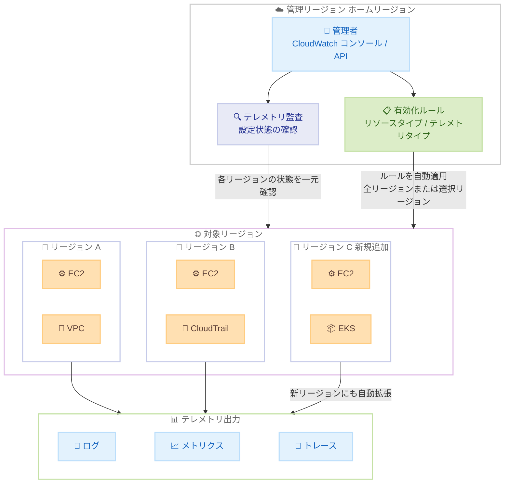

# Amazon CloudWatch - クロスリージョンテレメトリ監査と有効化ルール

**リリース日**: 2026 年 4 月 16 日
**サービス**: Amazon CloudWatch
**機能**: クロスリージョンテレメトリ監査と有効化ルール (Cross-Region Telemetry Auditing and Enablement Rules)

📊 [このアップデートのインフォグラフィックを見る](https://takech9203.github.io/aws-news-summary/20260416-amazon-cloudwatch-cross-region-enablement-rules.html)

## 概要

Amazon CloudWatch に、複数の AWS リージョンにまたがるテレメトリ設定の監査と有効化を単一リージョンから一元管理できる機能が追加された。Amazon EC2、Amazon VPC、AWS CloudTrail などの AWS サービスからのテレメトリ (ログ、メトリクス、トレース) を、複数リージョンに対して一括で有効化・監査できるようになる。

従来、各リージョンのテレメトリ設定を個別に確認・有効化する必要があったが、今回のアップデートにより、アカウント単位または AWS Organizations 全体で、サポートされているすべてのリージョンに対してテレメトリ監査機能を一度に有効化できる。さらに、有効化ルール (Enablement Rules) を作成することで、選択したリージョンまたはすべてのリージョンにテレメトリ設定を自動適用できる。

この機能はすべての AWS 商用リージョンで利用可能であり、マルチリージョン環境でのオブザーバビリティ管理を大幅に効率化する。特に、新しいリージョンが追加された際にルールが自動的に拡張される「全リージョン」設定は、運用負荷の軽減に大きく貢献する。

**アップデート前の課題**

- テレメトリ設定を各リージョンで個別に確認・有効化する必要があり、マルチリージョン環境での管理が煩雑だった
- 新しい AWS リージョンが追加された際に、テレメトリ設定を手動で追加適用する必要があった
- 組織全体でのテレメトリ設定の一貫性を確保するために、各リージョンでの個別操作が必要だった
- テレメトリ設定の監査を行う際に、リージョンごとに状態を確認する必要があり、全体像の把握が困難だった

**アップデート後の改善**

- 単一リージョンから複数リージョンのテレメトリ設定を一元的に監査・有効化できるようになった
- 有効化ルールにより、テレメトリ設定が選択したリージョンまたは全リージョンに自動適用される
- 「全リージョン」設定のルールは、新しいリージョンが利用可能になった際に自動拡張される
- AWS Organizations との統合により、組織全体でのテレメトリポリシーの一括適用が可能になった

## アーキテクチャ図



この図は、クロスリージョンテレメトリ監査と有効化ルールのアーキテクチャを示している。管理者はホームリージョンから有効化ルールを作成し、複数リージョンのテレメトリ設定を一元管理する。全リージョン設定のルールは、新しいリージョンが追加された際にも自動的に拡張される。

## サービスアップデートの詳細

### 主要機能

1. **クロスリージョンテレメトリ監査**
   - 単一のホームリージョンから、サポートされているすべてのリージョンのテレメトリ設定状態を一元的に確認可能
   - アカウント単位または AWS Organizations 全体での監査をサポート
   - 各リージョンのテレメトリ有効化状態、ルール適用状態、エラー情報をまとめて取得
   - `GetTelemetryEvaluationStatus` API で各リージョンのステータスを一括確認

2. **テレメトリ有効化ルール**
   - リソースタイプ、テレメトリタイプ、対象リージョンを指定してルールを作成
   - ルールは選択したリージョンまたは全リージョンに適用可能
   - `AllRegions` フラグを有効にすると、新しいリージョンが利用可能になった際にルールが自動拡張
   - 送信先設定 (DestinationConfiguration) でログの保持期間やフォーマットをカスタマイズ可能

3. **AWS Organizations 統合**
   - 組織全体に対するテレメトリルールの一括作成・適用
   - `CreateTelemetryRuleForOrganization` API で組織レベルのルールを管理
   - 組織内のすべてのアカウントに対してテレメトリポリシーを統一的に適用

4. **幅広いリソースタイプのサポート**
   - EC2 インスタンス、VPC、Lambda 関数、CloudTrail、EKS クラスター、WAFv2 WebACL、ELB、Route 53 Resolver、Bedrock AgentCore、Security Hub、CloudFront ディストリビューションなど多数のリソースタイプに対応
   - テレメトリタイプはログ、メトリクス、トレースの 3 種類をサポート

## 技術仕様

### サポート対象リソースタイプ

| リソースタイプ | テレメトリ対象 |
|------|------|
| AWS::EC2::Instance | EC2 インスタンスのログ、メトリクス、トレース |
| AWS::EC2::VPC | VPC フローログ |
| AWS::Lambda::Function | Lambda 関数のログ、メトリクス、トレース |
| AWS::CloudTrail | CloudTrail の証跡ログ |
| AWS::EKS::Cluster | EKS クラスターの監査ログ、コントローラーマネージャーログなど |
| AWS::WAFv2::WebACL | WAF ログ |
| AWS::ElasticLoadBalancingV2::LoadBalancer | ALB/NLB アクセスログ |
| AWS::Route53Resolver::ResolverEndpoint | Route 53 Resolver クエリログ |
| AWS::BedrockAgentCore::Runtime | Bedrock AgentCore ランタイムログ |
| AWS::SecurityHub::Hub | Security Hub セキュリティ検出ログ |
| AWS::CloudFront::Distribution | CloudFront ディストリビューションログ |

### テレメトリソースタイプ

| ソースタイプ | 説明 |
|------|------|
| VPC_FLOW_LOGS | VPC フローログ |
| ROUTE53_RESOLVER_QUERY_LOGS | Route 53 Resolver クエリログ |
| EKS_AUDIT_LOGS | EKS 監査ログ |
| EKS_AUTHENTICATOR_LOGS | EKS 認証ログ |
| EKS_CONTROLLER_MANAGER_LOGS | EKS コントローラーマネージャーログ |
| EKS_SCHEDULER_LOGS | EKS スケジューラーログ |
| EKS_API_LOGS | EKS API サーバーログ |

### API 変更履歴

| 日付 | サービス | 変更内容 |
|------|----------|----------|
| 2026/04/10 | [CloudWatch Observability Admin Service](https://awsapichanges.com/archive/changes/974e23-observabilityadmin.html) | 8 updated api methods - マルチリージョンテレメトリ評価とテレメトリ有効化ルールのサポート追加 |

### 主要 API メソッド

| メソッド | 用途 |
|------|------|
| CreateTelemetryRule | アカウント単位のテレメトリ有効化ルールを作成 |
| CreateTelemetryRuleForOrganization | 組織全体のテレメトリ有効化ルールを作成 |
| GetTelemetryEvaluationStatus | アカウントのテレメトリ監査ステータスを取得 |
| GetTelemetryEvaluationStatusForOrganization | 組織全体のテレメトリ監査ステータスを取得 |
| GetTelemetryRule | 特定のテレメトリルールの詳細を取得 |
| GetTelemetryRuleForOrganization | 組織レベルのテレメトリルール詳細を取得 |
| UpdateTelemetryRule | アカウント単位のテレメトリルールを更新 |
| UpdateTelemetryRuleForOrganization | 組織全体のテレメトリルールを更新 |

### テレメトリルールの設定例

```python
import boto3

client = boto3.client('observabilityadmin')

# 全リージョンに VPC フローログの有効化ルールを作成
response = client.create_telemetry_rule(
    RuleName='vpc-flow-logs-all-regions',
    Rule={
        'ResourceType': 'AWS::EC2::VPC',
        'TelemetryType': 'Logs',
        'TelemetrySourceTypes': ['VPC_FLOW_LOGS'],
        'DestinationConfiguration': {
            'DestinationType': 'cloud-watch-logs',
            'DestinationPattern': '/aws/vpc/flowlogs',
            'RetentionInDays': 90,
            'VPCFlowLogParameters': {
                'TrafficType': 'ALL',
                'MaxAggregationInterval': 60
            }
        },
        'AllRegions': True
    },
    Tags={
        'Environment': 'production',
        'ManagedBy': 'observability-team'
    }
)

print(f"Rule ARN: {response['RuleArn']}")
```

## 設定方法

### 前提条件

1. AWS アカウントまたは AWS Organizations の管理アカウントへのアクセス権限
2. CloudWatch Observability Admin Service に対する適切な IAM 権限
3. 対象リソースが存在するリージョンでのテレメトリサービスの利用可能性

### 手順

#### ステップ 1: テレメトリ監査の有効化

```bash
# アカウント単位でテレメトリ監査を開始
aws observabilityadmin start-telemetry-evaluation
```

このコマンドは、アカウントのテレメトリ監査機能をサポートされているすべてのリージョンで有効化する。監査が開始されると、各リージョンのテレメトリ設定状態を確認できるようになる。

#### ステップ 2: テレメトリ監査ステータスの確認

```bash
# テレメトリ監査のステータスを確認
aws observabilityadmin get-telemetry-evaluation-status
```

このコマンドは、テレメトリ監査の全体的なステータスと各リージョンの個別ステータスを返す。ステータスは NOT_STARTED、STARTING、RUNNING、STOPPING、STOPPED、FAILED_START、FAILED_STOP のいずれかとなる。

#### ステップ 3: テレメトリ有効化ルールの作成

```bash
# 特定リージョンに対する EC2 メトリクスの有効化ルールを作成
aws observabilityadmin create-telemetry-rule \
    --rule-name "ec2-metrics-apac" \
    --rule '{
        "ResourceType": "AWS::EC2::Instance",
        "TelemetryType": "Metrics",
        "Regions": ["ap-northeast-1", "ap-southeast-1", "ap-southeast-2"],
        "AllRegions": false
    }'
```

このコマンドは、指定したアジア太平洋リージョンの EC2 インスタンスに対してメトリクス収集を有効化するルールを作成する。`AllRegions` を `true` に設定すると、すべてのサポートされているリージョンに適用され、新しいリージョンが追加された際にも自動的に拡張される。

#### ステップ 4: 組織全体へのルール適用

```bash
# 組織全体に CloudTrail ログの有効化ルールを作成
aws observabilityadmin create-telemetry-rule-for-organization \
    --rule-name "cloudtrail-logs-org-wide" \
    --rule '{
        "ResourceType": "AWS::CloudTrail",
        "TelemetryType": "Logs",
        "DestinationConfiguration": {
            "DestinationType": "cloud-watch-logs",
            "DestinationPattern": "/aws/cloudtrail",
            "RetentionInDays": 365
        },
        "AllRegions": true
    }'
```

このコマンドは、AWS Organizations 管理アカウントから実行し、組織内のすべてのアカウントとすべてのリージョンに対して CloudTrail ログの有効化ルールを適用する。

## メリット

### ビジネス面

- **運用コストの削減**: 各リージョンでの個別設定作業が不要になり、マルチリージョン環境のオブザーバビリティ管理にかかる運用工数を大幅に削減
- **コンプライアンス遵守の効率化**: 組織全体でテレメトリポリシーを統一的に適用することで、監査要件やコンプライアンス基準への準拠を効率的に維持
- **新リージョン展開の迅速化**: 全リージョン設定のルールにより、新しいリージョンへのワークロード展開時にテレメトリ設定の追加作業が不要

### 技術面

- **一元管理**: 単一のホームリージョンから全リージョンのテレメトリ設定を一元的に監査・制御
- **自動拡張**: `AllRegions` フラグにより、新しいリージョンが利用可能になった際にルールが自動的に拡張
- **API による自動化**: 8 つの API メソッドにより、テレメトリルールの作成・取得・更新をプログラマティックに管理可能
- **Organizations 統合**: 組織全体への一括ポリシー適用により、大規模環境でのガバナンスを強化

## デメリット・制約事項

### 制限事項

- テレメトリルールの送信先タイプは現時点で `cloud-watch-logs` のみがサポートされている
- 有効化ルールはサポートされている AWS 商用リージョンのみが対象であり、GovCloud や中国リージョンは含まれない
- ルールの適用は非同期で行われるため、全リージョンへの反映には時間がかかる場合がある

### 考慮すべき点

- 全リージョン設定を有効にすると、意図しないリージョンでもテレメトリが有効化される可能性があるため、コストへの影響を事前に見積もることが重要
- Organizations レベルのルールは管理アカウントからのみ作成可能であり、適切な権限管理が必要
- 各リージョンでのテレメトリ有効化に伴うログストレージコストの増加を考慮する必要がある

## ユースケース

### ユースケース 1: マルチリージョンワークロードの統一オブザーバビリティ

**シナリオ**: グローバルに展開された Web アプリケーションが複数リージョンで EC2 インスタンスと VPC を使用しており、すべてのリージョンでメトリクスとログを一貫して収集する必要がある。

**実装例**:
```bash
# 全リージョンの EC2 インスタンスメトリクスを有効化
aws observabilityadmin create-telemetry-rule \
    --rule-name "ec2-metrics-global" \
    --rule '{
        "ResourceType": "AWS::EC2::Instance",
        "TelemetryType": "Metrics",
        "AllRegions": true
    }'

# 全リージョンの VPC フローログを有効化
aws observabilityadmin create-telemetry-rule \
    --rule-name "vpc-flowlogs-global" \
    --rule '{
        "ResourceType": "AWS::EC2::VPC",
        "TelemetryType": "Logs",
        "TelemetrySourceTypes": ["VPC_FLOW_LOGS"],
        "DestinationConfiguration": {
            "DestinationType": "cloud-watch-logs",
            "DestinationPattern": "/aws/vpc/flowlogs",
            "RetentionInDays": 30
        },
        "AllRegions": true
    }'
```

**効果**: 新しいリージョンへの展開時にテレメトリ設定を手動で追加する必要がなくなり、常にすべてのリージョンで一貫したオブザーバビリティが確保される。

### ユースケース 2: 組織全体のセキュリティ監査ログの一元化

**シナリオ**: セキュリティチームが AWS Organizations 配下の全アカウント・全リージョンで CloudTrail ログと Security Hub の検出ログを確実に有効化し、コンプライアンス監査に対応したい。

**実装例**:
```bash
# 組織全体で CloudTrail ログを有効化
aws observabilityadmin create-telemetry-rule-for-organization \
    --rule-name "org-cloudtrail-compliance" \
    --rule '{
        "ResourceType": "AWS::CloudTrail",
        "TelemetryType": "Logs",
        "DestinationConfiguration": {
            "DestinationType": "cloud-watch-logs",
            "DestinationPattern": "/aws/cloudtrail/org",
            "RetentionInDays": 365
        },
        "AllRegions": true
    }'

# 組織全体で Security Hub の検出ログを有効化
aws observabilityadmin create-telemetry-rule-for-organization \
    --rule-name "org-securityhub-findings" \
    --rule '{
        "ResourceType": "AWS::SecurityHub::Hub",
        "TelemetryType": "Logs",
        "DestinationConfiguration": {
            "DestinationType": "cloud-watch-logs",
            "DestinationPattern": "/aws/securityhub/findings",
            "RetentionInDays": 365
        },
        "AllRegions": true
    }'
```

**効果**: 組織内のすべてのアカウントとリージョンで監査ログが確実に有効化され、新しいアカウントやリージョンが追加された際も自動的にポリシーが適用される。

### ユースケース 3: EKS クラスターのマルチリージョン監視

**シナリオ**: 複数リージョンに展開された EKS クラスターの監査ログ、API サーバーログ、コントローラーマネージャーログを一元的に有効化し、Kubernetes 運用チームに一貫した可視性を提供したい。

**実装例**:
```bash
# APAC リージョンの EKS 監査ログを有効化
aws observabilityadmin create-telemetry-rule \
    --rule-name "eks-audit-logs-apac" \
    --rule '{
        "ResourceType": "AWS::EKS::Cluster",
        "TelemetryType": "Logs",
        "TelemetrySourceTypes": [
            "EKS_AUDIT_LOGS",
            "EKS_API_LOGS",
            "EKS_CONTROLLER_MANAGER_LOGS"
        ],
        "DestinationConfiguration": {
            "DestinationType": "cloud-watch-logs",
            "DestinationPattern": "/aws/eks/cluster-logs",
            "RetentionInDays": 90
        },
        "Regions": [
            "ap-northeast-1",
            "ap-southeast-1",
            "ap-southeast-2"
        ],
        "AllRegions": false
    }'
```

**効果**: 対象リージョンの EKS クラスターに対して一貫したログ設定が適用され、リージョンごとの個別設定が不要になる。

## 料金

CloudWatch クロスリージョンテレメトリ監査と有効化ルール機能自体には追加料金は発生しない。ただし、有効化されたテレメトリに基づく以下の料金が適用される。

### 料金例

| 使用量 | 月額料金 (概算) |
|--------|------------------|
| CloudWatch Logs の取り込み | $0.50/GB (リージョンにより異なる) |
| CloudWatch Logs の保存 | $0.03/GB/月 |
| CloudWatch メトリクス (カスタム) | $0.30/メトリクス/月 (最初の 10,000 メトリクス) |
| VPC フローログ (CloudWatch Logs) | $0.50/GB |

全リージョンでテレメトリを有効化する場合、リージョン数に比例してログストレージとメトリクスのコストが増加するため、事前に `RetentionInDays` やテレメトリ対象の範囲を適切に設計することが重要である。

## 利用可能リージョン

すべての AWS 商用リージョンで利用可能。

## 関連サービス・機能

- **Amazon CloudWatch Observability Admin**: テレメトリ監査と有効化ルールの管理基盤となるサービス
- **AWS Organizations**: 組織全体へのテレメトリポリシーの一括適用を実現する統合機能
- **Amazon CloudWatch Logs**: テレメトリデータの送信先として使用されるログストレージサービス
- **AWS CloudTrail**: テレメトリ有効化ルールの対象サービスの 1 つであり、API アクティビティの記録を管理
- **Amazon VPC Flow Logs**: VPC ネットワークトラフィックのテレメトリとして、有効化ルールで一元管理可能
- **Amazon EKS**: Kubernetes クラスターの各種ログをテレメトリ有効化ルールで一括管理

## 参考リンク

- 📊 [インフォグラフィック](https://takech9203.github.io/aws-news-summary/20260416-amazon-cloudwatch-cross-region-enablement-rules.html)
- [公式発表 (What's New)](https://aws.amazon.com/about-aws/whats-new/2026/04/amazon-cloudwatch-cross-region-enablement-rules/)
- [CloudWatch Observability Admin API リファレンス](https://docs.aws.amazon.com/cloudwatch/latest/APIReference/Welcome.html)
- [Amazon CloudWatch 料金ページ](https://aws.amazon.com/cloudwatch/pricing/)
- [AWS API Changes - CloudWatch Observability Admin Service](https://awsapichanges.com/archive/changes/974e23-observabilityadmin.html)

## まとめ

Amazon CloudWatch のクロスリージョンテレメトリ監査と有効化ルール機能は、マルチリージョン環境でのオブザーバビリティ管理を根本的に効率化するアップデートである。特に、全リージョン設定による自動拡張と AWS Organizations 統合は、大規模環境のガバナンス強化に直結する。マルチリージョンでワークロードを運用している組織は、この機能を活用してテレメトリポリシーの一元管理を検討することを推奨する。
