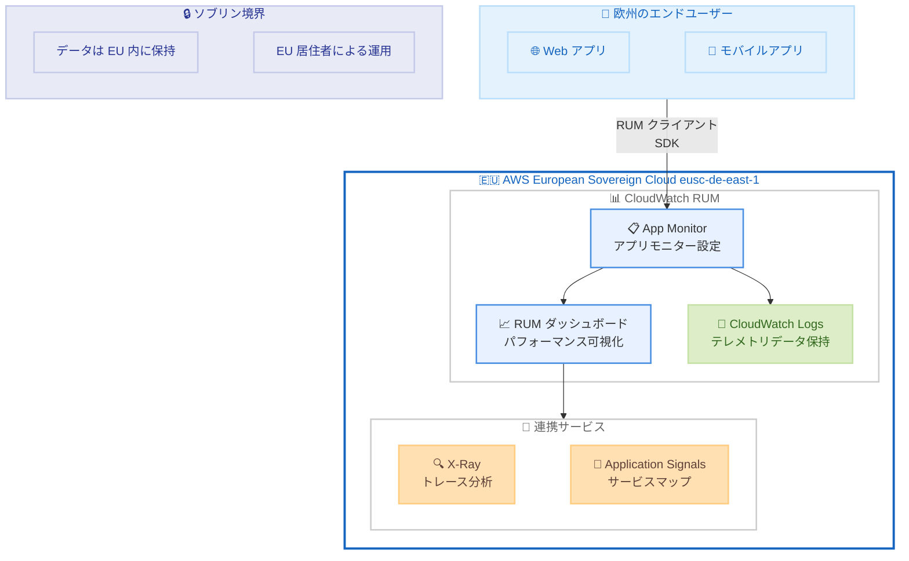

# Amazon CloudWatch RUM - AWS European Sovereign Cloud での提供開始

**リリース日**: 2026 年 4 月 16 日
**サービス**: Amazon CloudWatch
**機能**: CloudWatch RUM (Real User Monitoring) の AWS European Sovereign Cloud 対応

📊 [このアップデートのインフォグラフィックを見る](https://takech9203.github.io/aws-news-summary/20260416-amazon-cloudwatch-rum-european-sovereign-cloud.html)

## 概要

Amazon CloudWatch RUM (Real User Monitoring) が AWS European Sovereign Cloud で利用可能になりました。欧州のデータレジデンシーおよび主権要件に準拠する必要がある組織は、ソブリン境界の外にデータを送信することなく、Web アプリケーションのパフォーマンスをリアルタイムで監視できるようになります。

CloudWatch RUM は、実際のユーザーセッションからクライアントサイドのデータを収集・可視化するサービスです。ページロード時間、JavaScript エラー、HTTP エラー、クラッシュ率、ネットワークレイテンシーなどのリアルタイムメトリクスを提供し、パフォーマンスのボトルネックを事前に特定して解決することを支援します。今回のアップデートにより、EU Sovereign (eusc-de-east-1) リージョンで利用可能になりました。

**アップデート前の課題**

- AWS European Sovereign Cloud で CloudWatch RUM を利用できず、EU 外のリージョンでリアルユーザーモニタリングを実施する必要があった
- ソブリン境界外へのユーザーデータ送信が、欧州のデータ主権規制への準拠を困難にしていた
- EU 内でのデータ完結が求められる公共セクターや規制対象業種の組織が、リアルユーザーモニタリングを導入しにくかった

**アップデート後の改善**

- EU Sovereign (eusc-de-east-1) リージョンで CloudWatch RUM が利用可能になり、ソブリン境界内でのリアルユーザーモニタリングが実現した
- ユーザーデータが欧州のソブリン境界を越えることなく、Web アプリケーションのパフォーマンス監視を実施できるようになった
- 公共セクターや規制対象業種の組織が、データ主権要件を満たしながらエンドユーザーエクスペリエンスを監視できるようになった

## アーキテクチャ図



CloudWatch RUM が EU ソブリン境界内でエンドユーザーのパフォーマンスデータを収集・分析するアーキテクチャを示しています。すべてのデータは eusc-de-east-1 リージョン内に保持されます。

## サービスアップデートの詳細

### 主要機能

1. **リアルユーザーモニタリング**
   - 実際のユーザーセッションからクライアントサイドのパフォーマンスデータを収集
   - ページロード時間、JavaScript エラー、HTTP エラー、クラッシュ率、ネットワークレイテンシーをリアルタイムで計測
   - デバイスタイプ、OS、ブラウザ、地理的位置ごとのパフォーマンス分析が可能

2. **Web アプリケーション対応**
   - RUM Web クライアント (JavaScript スニペット) によるデータ収集
   - ページビュー、JavaScript エラー、HTTP エラーなどを RUM イベントとして収集
   - データプラグインの柔軟な設定が可能

3. **モバイルアプリケーション対応**
   - AWS Distro for OpenTelemetry (ADOT) Android SDK および iOS SDK によるデータ収集
   - スクリーン読み込み時間、アプリ起動時間、ネットワークエラー、クラッシュ率を監視
   - Android の ANR (Application Not Responding) や iOS の App Hangs も検出

4. **ソブリン境界内でのデータ保持**
   - テレメトリデータは EU Sovereign リージョン内に 30 日間保持
   - CloudWatch Logs への送信により長期保存が可能
   - ソブリン境界外へのデータ転送は発生しない

## 技術仕様

### CloudWatch RUM の主要仕様

| 項目 | 詳細 |
|------|------|
| 対応リージョン | EU Sovereign (eusc-de-east-1) |
| データ保持期間 | 30 日間 (デフォルト) |
| 長期保存 | CloudWatch Logs へのテレメトリ送信で延長可能 |
| サンプリング | ユーザーセッションの収集割合を設定可能 |
| Web クライアント | オープンソースの RUM Web クライアント |
| モバイル SDK | ADOT Android SDK / ADOT iOS SDK |
| 連携サービス | X-Ray、Application Signals、CloudWatch Logs、Amazon Cognito |

### AWS European Sovereign Cloud の特徴

| 項目 | 詳細 |
|------|------|
| リージョン名 | EU Sovereign (eusc-de-east-1) |
| 所在地 | ドイツ |
| データレジデンシー | すべてのデータが EU 内に保持 |
| 運用者 | EU 居住者の AWS スタッフが運用 |
| 対象顧客 | 欧州のデータ主権要件に準拠する必要がある組織 |

### IAM ポリシー例

```json
{
    "Version": "2012-10-17",
    "Statement": [
        {
            "Effect": "Allow",
            "Action": [
                "rum:CreateAppMonitor",
                "rum:GetAppMonitor",
                "rum:ListAppMonitors",
                "rum:UpdateAppMonitor",
                "rum:DeleteAppMonitor",
                "rum:GetAppMonitorData",
                "rum:PutRumEvents",
                "rum:BatchCreateRumMetricDefinitions"
            ],
            "Resource": "arn:aws-eusc:rum:eusc-de-east-1:*:appmonitor/*"
        }
    ]
}
```

## 設定方法

### 前提条件

1. AWS European Sovereign Cloud のアカウント
2. eusc-de-east-1 リージョンへのアクセス権
3. CloudWatch RUM の IAM 権限

### 手順

#### ステップ 1: App Monitor の作成

```bash
aws rum create-app-monitor \
    --name "my-sovereign-app" \
    --domain "app.example.eu" \
    --region eusc-de-east-1 \
    --app-monitor-configuration '{
        "sessionSampleRate": 0.1,
        "telemetries": ["errors", "performance", "http"],
        "allowCookies": true
    }'
```

eusc-de-east-1 リージョンで App Monitor を作成し、10% のユーザーセッションからエラー、パフォーマンス、HTTP メトリクスを収集する設定です。

#### ステップ 2: Web アプリケーションへの RUM クライアント埋め込み

```html
<script>
    (function(n,i,v,r,s,c,x,z){
        x=window.AwsRumClient={q:[],n:n,i:i,v:v,r:r,c:c};
        window[n]=function(c,p){x.q.push({c:c,p:p});};
        z=document.createElement('script');
        z.async=true;z.src=s;
        document.head.insertBefore(z,document.head.getElementsByTagName('script')[0]);
    })('cwr','APP_MONITOR_ID','1.0.0','eusc-de-east-1',
       'https://client.rum.eusc-de-east-1.amazonaws.com/1.x/cwr.js',
       {sessionSampleRate:0.1,identityPoolId:'eusc-de-east-1:EXAMPLE'});
</script>
```

App Monitor 作成時に生成されるコードスニペットを Web アプリケーションの HTML に埋め込みます。`APP_MONITOR_ID` と `identityPoolId` は実際の値に置き換えてください。

#### ステップ 3: データの確認

```bash
aws rum get-app-monitor-data \
    --name "my-sovereign-app" \
    --region eusc-de-east-1 \
    --time-range '{
        "After": 1713225600,
        "Before": 1713312000
    }'
```

指定した時間範囲のモニタリングデータを取得します。収集されたデータは CloudWatch RUM のダッシュボードでも可視化できます。

## メリット

### ビジネス面

- **データ主権コンプライアンス**: 欧州のデータレジデンシー要件 (GDPR、国家レベルのデータ主権法) を満たしながらリアルユーザーモニタリングを実施可能
- **公共セクターへの対応**: 政府機関や規制対象業種の組織が、ソブリン要件を満たしたアプリケーション監視基盤を構築可能
- **エンドユーザー体験の向上**: パフォーマンスのボトルネックを事前に特定し、ユーザー満足度とビジネス指標を改善

### 技術面

- **リアルタイム可視化**: ページロード時間、エラー率、ネットワークレイテンシーをリアルタイムで監視
- **Application Signals 連携**: X-Ray アクティブトレーシングとの統合により、フロントエンドからバックエンドまでの一貫した可観測性を実現
- **柔軟なサンプリング制御**: ユーザーセッションの収集割合を設定し、コストとデータ品質のバランスを最適化

## デメリット・制約事項

### 制限事項

- EU Sovereign リージョン (eusc-de-east-1) のみで利用可能であり、他のソブリンリージョンへの展開は未定
- RUM テレメトリデータのデフォルト保持期間は 30 日間で、長期保存には CloudWatch Logs への転送が必要
- AWS European Sovereign Cloud のアカウントが必要であり、通常の AWS アカウントとは別に管理が必要

### 考慮すべき点

- ソブリンリージョンの料金体系は標準リージョンと異なる可能性があるため、コスト見積りの際に確認が必要
- Amazon Cognito Identity Pool が eusc-de-east-1 で利用可能であることを確認の上、認証設定を行う必要がある
- 既存の CloudWatch RUM 設定をソブリンリージョンに移行する場合、App Monitor を新規に作成し直す必要がある

## ユースケース

### ユースケース 1: EU 公共セクターの市民向け Web ポータル監視

**シナリオ**: EU 加盟国の政府機関が運営する市民向け電子行政サービスポータルにおいて、データ主権要件を遵守しながらリアルユーザーエクスペリエンスを監視する。

**実装例**:
```bash
aws rum create-app-monitor \
    --name "gov-portal-rum" \
    --domain "services.gov.example.eu" \
    --region eusc-de-east-1 \
    --app-monitor-configuration '{
        "sessionSampleRate": 0.5,
        "telemetries": ["errors", "performance", "http"],
        "allowCookies": false
    }'
```

**効果**: 市民の個人データが EU ソブリン境界内に保持されたまま、ポータルのパフォーマンス問題を特定し、行政サービスの品質向上を実現。

### ユースケース 2: 欧州金融機関の顧客向けアプリケーション監視

**シナリオ**: DORA (Digital Operational Resilience Act) などの EU 金融規制に準拠しながら、オンラインバンキングアプリケーションのフロントエンドパフォーマンスを監視する。

**実装例**:
```bash
aws rum create-app-monitor \
    --name "banking-app-rum" \
    --domain "banking.example.eu" \
    --region eusc-de-east-1 \
    --app-monitor-configuration '{
        "sessionSampleRate": 0.2,
        "telemetries": ["errors", "performance", "http"],
        "enableXRay": true,
        "allowCookies": true
    }'
```

**効果**: X-Ray トレーシングとの統合により、フロントエンドのレイテンシー問題からバックエンド API の応答遅延まで一貫して追跡し、金融規制のオペレーショナルレジリエンス要件に対応。

### ユースケース 3: 医療機関の患者向けポータル監視

**シナリオ**: EU 内の医療機関が、患者データの EU 域内保持要件を満たしながら、電子カルテポータルや予約システムのユーザーエクスペリエンスを監視する。

**実装例**:
```bash
aws rum create-app-monitor \
    --name "health-portal-rum" \
    --domain "patient.hospital.example.eu" \
    --region eusc-de-east-1 \
    --app-monitor-configuration '{
        "sessionSampleRate": 0.1,
        "telemetries": ["errors", "performance"],
        "allowCookies": false
    }'
```

**効果**: 患者の健康データや個人情報がソブリン境界内に保持されたまま、ポータルのパフォーマンス監視を実施し、医療サービスのデジタル体験を向上。

## 料金

CloudWatch RUM の料金は、収集される RUM イベント数に基づいて課金されます。

### 料金例

| 使用量 | 月額料金 (概算) |
|--------|------------------|
| 100,000 RUM Web イベント | RUM Web イベント単価 x 100,000 |
| 1,000,000 RUM Web イベント | RUM Web イベント単価 x 1,000,000 |

- **無料トライアル**: アカウントごとに初回 100 万 Web RUM イベントが無料
- **Web RUM イベント**: ページビュー、JavaScript エラー、HTTP エラーなどの各データ項目が 1 イベントとして計上
- **モバイル RUM**: OpenTelemetry スパンおよびイベントのデータ取り込み量 (GB 単位) で課金
- **追加料金**: CloudWatch Logs、Amazon Cognito、AWS X-Ray の利用に応じて追加料金が発生する場合あり

最新の料金情報は [Amazon CloudWatch 料金ページ](https://aws.amazon.com/cloudwatch/pricing/) を参照してください。ソブリンリージョンでは標準リージョンと異なる料金が適用される可能性があります。

## 利用可能リージョン

CloudWatch RUM は以下のリージョンで利用可能です (2026 年 4 月時点)。

| カテゴリ | リージョン |
|----------|------------|
| 北米 | US East (N. Virginia)、US East (Ohio)、US West (N. California)、US West (Oregon)、Canada (Central)、Canada West (Calgary)、Mexico (Central) |
| 欧州 | Europe (Frankfurt)、Europe (Ireland)、Europe (London)、Europe (Milan)、Europe (Paris)、Europe (Spain)、Europe (Stockholm)、Europe (Zurich)、**AWS European Sovereign Cloud (Germany)** |
| アジアパシフィック | Asia Pacific (Tokyo)、Asia Pacific (Osaka)、Asia Pacific (Seoul)、Asia Pacific (Singapore)、Asia Pacific (Sydney)、Asia Pacific (Mumbai)、Asia Pacific (Hyderabad)、Asia Pacific (Melbourne)、Asia Pacific (Jakarta)、Asia Pacific (Malaysia)、Asia Pacific (Thailand)、Asia Pacific (Hong Kong) |
| 中東・アフリカ | Middle East (Bahrain)、Middle East (UAE)、Africa (Cape Town)、Israel (Tel Aviv) |
| 南米 | South America (Sao Paulo) |
| ガバメント | AWS GovCloud (US-East)、AWS GovCloud (US-West) |

**今回追加**: AWS European Sovereign Cloud (Germany) - eusc-de-east-1

## 関連サービス・機能

- **Amazon CloudWatch Application Signals**: RUM クライアントのパフォーマンスデータを Application Signals のサービスマップに統合し、フロントエンドからバックエンドまでの可視性を提供
- **AWS X-Ray**: RUM で収集したフロントエンドトレースとバックエンドトレースを結合し、エンドツーエンドのリクエスト分析を実現
- **Amazon CloudWatch Synthetics**: RUM (リアルユーザー) と Synthetics (合成モニタリング) を組み合わせることで、包括的なアプリケーション監視を構築
- **Amazon Cognito**: RUM クライアントの認証に使用され、ソブリンリージョンでの匿名認証をサポート
- **AWS European Sovereign Cloud**: EU のデータ主権要件に対応した独立したクラウドインフラストラクチャ

## 参考リンク

- 📊 [インフォグラフィック](https://takech9203.github.io/aws-news-summary/20260416-amazon-cloudwatch-rum-european-sovereign-cloud.html)
- [公式発表 (What's New)](https://aws.amazon.com/about-aws/whats-new/2026/03/amazon-cloudwatch-rum-european-sovereign-cloud/)
- [CloudWatch RUM ドキュメント](https://docs.aws.amazon.com/AmazonCloudWatch/latest/monitoring/CloudWatch-RUM.html)
- [CloudWatch 料金ページ](https://aws.amazon.com/cloudwatch/pricing/)
- [AWS European Sovereign Cloud](https://aws.eu/)
- [CloudWatch RUM Web クライアント (GitHub)](https://github.com/aws-observability/aws-rum-web)

## まとめ

Amazon CloudWatch RUM の AWS European Sovereign Cloud (eusc-de-east-1) での提供開始により、欧州のデータ主権要件に準拠しながらリアルユーザーモニタリングを実施できるようになりました。政府機関、金融機関、医療機関など、厳格なデータレジデンシー要件を持つ組織にとって、ソブリン境界内でのアプリケーションパフォーマンス監視が可能になる重要なアップデートです。EU 内でソブリン要件を満たすアプリケーションを運用している場合は、CloudWatch RUM の導入を検討してください。
