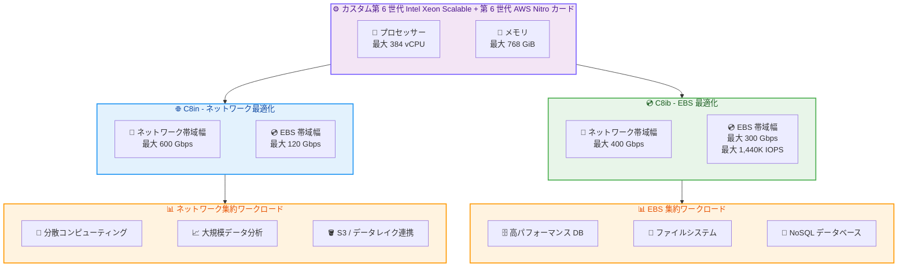

# Amazon EC2 - C8in および C8ib インスタンスの一般提供開始

**リリース日**: 2026 年 04 月 16 日
**サービス**: Amazon EC2
**機能**: C8in / C8ib コンピューティング最適化インスタンス

## 概要

AWS は Amazon EC2 C8in および C8ib インスタンスの一般提供開始 (GA) を発表しました。これらのインスタンスは、AWS 専用のカスタム第 6 世代 Intel Xeon Scalable プロセッサーと第 6 世代 AWS Nitro カードを搭載し、前世代の C6in インスタンスと比較して最大 43% のパフォーマンス向上を実現します。

C8in と C8ib は、それぞれ異なる I/O 特性に最適化された 2 つのバリアントです。C8in は最大 600 Gbps のネットワーク帯域幅を提供し、拡張ネットワーキング対応 EC2 インスタンスの中で最高のネットワーク帯域幅を実現します。一方、C8ib は最大 300 Gbps の EBS 帯域幅と最大 1,440K IOPS を提供し、非アクセラレーテッドコンピューティングインスタンスの中で最高の EBS パフォーマンスを実現します。両インスタンスとも最大 384 vCPU までスケールアップが可能です。

**アップデート前の課題**

- ネットワーク集約的なワークロードでは、C6in インスタンスの帯域幅では大規模な分散コンピューティングやデータ分析に制限があった
- EBS 集約的なワークロードでは、高パフォーマンスな商用データベースやファイルシステムに必要な IOPS とスループットが不足していた
- ネットワーク最適化と EBS 最適化を同時に必要とするワークロードでは、適切なインスタンスタイプの選択が困難だった

**アップデート後の改善**

- C8in インスタンスにより 600 Gbps のネットワーク帯域幅が利用可能になり、大規模な分散コンピューティングとデータ分析が高速化された
- C8ib インスタンスにより 300 Gbps の EBS 帯域幅と 1,440K IOPS が利用可能になり、高パフォーマンスデータベースとファイルシステムの性能が大幅に向上した
- C6in と比較して最大 43% のパフォーマンス向上により、コスト効率が改善された
- C8in は東京リージョンを含む 4 リージョンで利用可能になり、アジアパシフィック地域のワークロードに対応できるようになった

## アーキテクチャ図



この図は C8in と C8ib の 2 つのバリアントの違いを示しています。同じプロセッサー基盤を共有しながら、C8in はネットワーク帯域幅に、C8ib は EBS 帯域幅にそれぞれ最適化されており、異なるワークロードに対応します。

## サービスアップデートの詳細

### 主要機能

1. **C8in インスタンス - ネットワーク最適化**
   - 最大 600 Gbps のネットワーク帯域幅 (拡張ネットワーキング対応 EC2 インスタンスの中で最高)
   - EBS 帯域幅は最大 120 Gbps
   - 分散コンピューティング、大規模データ分析、S3 やデータレイクからのデータ取り込みに最適
   - 大量のノード間通信を伴う HPC やクラスター型ワークロードに最適

2. **C8ib インスタンス - EBS 最適化**
   - 最大 300 Gbps の EBS 帯域幅 (非アクセラレーテッドコンピューティングインスタンスの中で最高)
   - 最大 1,440K IOPS をサポート
   - インスタンスあたり最大 128 EBS ボリュームをサポート
   - 高パフォーマンスな商用データベース、ファイルシステム、NoSQL データベースに最適

3. **共通の性能向上**
   - カスタム第 6 世代 Intel Xeon Scalable プロセッサー (AWS 専用)
   - 第 6 世代 AWS Nitro カードによるセキュリティとパフォーマンスの最適化
   - C6in と比較して最大 43% のパフォーマンス向上
   - 最大 384 vCPU、768 GiB メモリまでスケールアップ可能

## 技術仕様

### C8in インスタンスサイズ

| インスタンスサイズ | vCPU | メモリ (GiB) | ネットワーク帯域幅 (Gbps) | EBS 帯域幅 (Gbps) |
|-------------------|------|-------------|--------------------------|-------------------|
| c8in.large | 2 | 4 | 最大 25 | 最大 10 |
| c8in.xlarge | 4 | 8 | 最大 30 | 最大 10 |
| c8in.2xlarge | 8 | 16 | 最大 40 | 最大 10 |
| c8in.4xlarge | 16 | 32 | 最大 50 | 最大 10 |
| c8in.8xlarge | 32 | 64 | 50 | 10 |
| c8in.12xlarge | 48 | 96 | 75 | 15 |
| c8in.16xlarge | 64 | 128 | 100 | 25 |
| c8in.24xlarge | 96 | 192 | 150 | 30 |
| c8in.32xlarge | 128 | 256 | 200 | 40 |
| c8in.48xlarge | 192 | 384 | 300 | 60 |
| c8in.96xlarge | 384 | 768 | 600 | 120 |
| c8in.metal-48xl | 192 | 384 | 300 | 60 |
| c8in.metal-96xl | 384 | 768 | 600 | 120 |

### C8ib インスタンスサイズ

| インスタンスサイズ | vCPU | メモリ (GiB) | ネットワーク帯域幅 (Gbps) | EBS 帯域幅 (Gbps) |
|-------------------|------|-------------|--------------------------|-------------------|
| c8ib.large | 2 | 4 | 最大 16.666 | 最大 25 |
| c8ib.xlarge | 4 | 8 | 最大 20 | 最大 25 |
| c8ib.2xlarge | 8 | 16 | 最大 26.666 | 最大 25 |
| c8ib.4xlarge | 16 | 32 | 最大 33.333 | 最大 25 |
| c8ib.8xlarge | 32 | 64 | 33.333 | 25 |
| c8ib.12xlarge | 48 | 96 | 50 | 37.5 |
| c8ib.16xlarge | 64 | 128 | 66.666 | 50 |
| c8ib.24xlarge | 96 | 192 | 100 | 75 |
| c8ib.32xlarge | 128 | 256 | 133.333 | 100 |
| c8ib.48xlarge | 192 | 384 | 200 | 150 |
| c8ib.96xlarge | 384 | 768 | 400 | 300 |
| c8ib.metal-48xl | 192 | 384 | 200 | 150 |
| c8ib.metal-96xl | 384 | 768 | 400 | 300 |

### C8in と C8ib の比較

| 項目 | C8in | C8ib |
|------|------|------|
| 最適化対象 | ネットワーク帯域幅 | EBS 帯域幅 |
| 最大ネットワーク帯域幅 | 600 Gbps | 400 Gbps |
| 最大 EBS 帯域幅 | 120 Gbps | 300 Gbps |
| 最大 IOPS | - | 1,440K |
| 最大 EBS ボリューム数 | - | 128 |
| 最大 vCPU | 384 | 384 |
| 最大メモリ | 768 GiB | 768 GiB |
| 主なユースケース | 分散コンピューティング、データ分析 | 高パフォーマンス DB、ファイルシステム |
| 東京リージョン | 利用可能 | 未提供 |

## 設定方法

### 前提条件

1. AWS アカウントと適切な IAM 権限
2. 対象リージョンへのアクセス (C8in: us-east-1, us-west-2, ap-northeast-1, eu-south-2 / C8ib: us-east-1, us-west-2)
3. 必要な VPC およびサブネット設定

### 手順

#### ステップ 1: C8in インスタンスを起動

```bash
# AWS CLI を使用して C8in インスタンスを起動
aws ec2 run-instances \
  --image-id ami-xxxxxxxxxxxxxxxxx \
  --instance-type c8in.24xlarge \
  --region ap-northeast-1 \
  --subnet-id subnet-xxxxxxxxxxxxxxxxx \
  --security-group-ids sg-xxxxxxxxxxxxxxxxx \
  --key-name my-key-pair
```

このコマンドは、東京リージョン (ap-northeast-1) で c8in.24xlarge インスタンスを起動します。150 Gbps のネットワーク帯域幅を備え、ネットワーク集約的なワークロードに適しています。

#### ステップ 2: C8ib インスタンスを起動

```bash
# AWS CLI を使用して C8ib インスタンスを起動
aws ec2 run-instances \
  --image-id ami-xxxxxxxxxxxxxxxxx \
  --instance-type c8ib.48xlarge \
  --region us-east-1 \
  --subnet-id subnet-xxxxxxxxxxxxxxxxx \
  --security-group-ids sg-xxxxxxxxxxxxxxxxx \
  --key-name my-key-pair
```

このコマンドは、米国東部 (バージニア北部) リージョンで c8ib.48xlarge インスタンスを起動します。150 Gbps の EBS 帯域幅を備え、EBS 集約的なデータベースワークロードに適しています。

#### ステップ 3: 利用可能なインスタンスタイプを確認

```bash
# C8in インスタンスタイプの一覧を確認
aws ec2 describe-instance-types \
  --filters "Name=instance-type,Values=c8in.*" \
  --region ap-northeast-1 \
  --query "InstanceTypes[].{Type:InstanceType,vCPU:VCpuInfo.DefaultVCpus,Memory:MemoryInfo.SizeInMiB,Network:NetworkInfo.NetworkPerformance}" \
  --output table

# C8ib インスタンスタイプの一覧を確認
aws ec2 describe-instance-types \
  --filters "Name=instance-type,Values=c8ib.*" \
  --region us-east-1 \
  --query "InstanceTypes[].{Type:InstanceType,vCPU:VCpuInfo.DefaultVCpus,Memory:MemoryInfo.SizeInMiB,EBS:EbsInfo.EbsOptimizedInfo.MaximumBandwidthInMbps}" \
  --output table
```

これらのコマンドにより、各リージョンで利用可能な C8in および C8ib インスタンスタイプの詳細を確認できます。

## メリット

### ビジネス面

- **ネットワークコストの削減**: C8in の 600 Gbps ネットワーク帯域幅により、少ないインスタンス数で大規模なデータ転送を処理でき、インフラストラクチャコストを削減
- **データベース性能の向上**: C8ib の 300 Gbps EBS 帯域幅と 1,440K IOPS により、商用データベースの応答時間を短縮し、ビジネスクリティカルなアプリケーションの SLA を達成しやすくなる
- **東京リージョンでの利用**: C8in が東京リージョンで利用可能なため、日本国内のお客様はネットワーク集約的ワークロードを低レイテンシーで実行可能

### 技術面

- **EC2 最高のネットワーク帯域幅**: C8in の 600 Gbps は、拡張ネットワーキング対応 EC2 インスタンスの中で最高のネットワーク帯域幅を実現
- **非アクセラレーテッドインスタンス最高の EBS 性能**: C8ib の 300 Gbps EBS 帯域幅と 1,440K IOPS は、非アクセラレーテッドコンピューティングインスタンスの中で最高
- **大幅なパフォーマンス向上**: C6in と比較して最大 43% のパフォーマンス向上により、同じワークロードをより少ないリソースで処理可能
- **第 6 世代 Nitro カード**: 最新の AWS Nitro System によるハードウェアレベルのセキュリティとパフォーマンス最適化

## デメリット・制約事項

### 制限事項

- C8ib インスタンスは現時点で米国東部 (バージニア北部) と米国西部 (オレゴン) の 2 リージョンのみで利用可能であり、東京リージョンでは未提供
- C8in インスタンスは 4 リージョンのみの提供であり、一部のリージョンでは利用できない
- 新しいインスタンスタイプであるため、すべての AMI やソフトウェアが最適化されていない場合がある

### 考慮すべき点

- C8in と C8ib はそれぞれ異なる I/O パターンに最適化されているため、ワークロードの特性に応じて適切なバリアントを選択する必要がある
- ネットワークと EBS の両方で高いパフォーマンスが必要な場合、単一のインスタンスタイプでは両方の要件を最大限に満たすことが難しいため、アーキテクチャの分離を検討する
- C6in や C6id からの移行時には、アプリケーションの互換性テストとパフォーマンスベンチマークを実施することを推奨

## ユースケース

### ユースケース 1: 大規模分散データ分析

**シナリオ**: データレイクから大量のデータを取り込み、複数ノードで分散処理を行う大規模データ分析基盤

**実装例**:
```bash
# C8in.48xlarge で分散分析ノードを起動
aws ec2 run-instances \
  --image-id ami-xxxxxxxxxxxxxxxxx \
  --instance-type c8in.48xlarge \
  --count 10 \
  --region ap-northeast-1 \
  --placement "GroupName=analytics-cluster" \
  --network-interfaces "DeviceIndex=0,SubnetId=subnet-xxx,Groups=[sg-xxx]"
```

**効果**: 300 Gbps のネットワーク帯域幅により、ノード間のデータシャッフルと S3 からのデータ取り込みが高速化され、バッチ分析の処理時間を大幅に短縮

### ユースケース 2: 高パフォーマンス商用データベース

**シナリオ**: Oracle Database や SQL Server など、高い IOPS と EBS スループットを要求する商用データベースの運用

**実装例**:
```bash
# C8ib.96xlarge で高パフォーマンス DB サーバーを起動
aws ec2 run-instances \
  --image-id ami-xxxxxxxxxxxxxxxxx \
  --instance-type c8ib.96xlarge \
  --region us-east-1 \
  --block-device-mappings '[
    {"DeviceName":"/dev/sdf","Ebs":{"VolumeSize":1000,"VolumeType":"io2","Iops":64000}},
    {"DeviceName":"/dev/sdg","Ebs":{"VolumeSize":2000,"VolumeType":"io2","Iops":64000}}
  ]'
```

**効果**: 300 Gbps の EBS 帯域幅と 1,440K IOPS により、データベースのクエリ応答時間とバッチ処理スループットが大幅に改善

### ユースケース 3: 高パフォーマンスファイルシステム

**シナリオ**: Amazon FSx for Lustre や Amazon FSx for NetApp ONTAP を使用した高パフォーマンスファイルシステムのバックエンド

**実装例**:
```bash
# C8ib.48xlarge でファイルシステムクライアントを起動
aws ec2 run-instances \
  --image-id ami-xxxxxxxxxxxxxxxxx \
  --instance-type c8ib.48xlarge \
  --region us-east-1 \
  --subnet-id subnet-xxxxxxxxxxxxxxxxx \
  --security-group-ids sg-xxxxxxxxxxxxxxxxx
```

**効果**: 150 Gbps の EBS 帯域幅により、ファイルシステムへの読み書きスループットが向上し、メディア処理や科学計算ワークロードのパフォーマンスが改善

## 料金

C8in および C8ib インスタンスの料金は、選択したインスタンスタイプ、リージョン、購入オプションによって異なります。Savings Plans、オンデマンド、およびスポットインスタンスの 3 つの購入オプションが利用可能です。詳細な料金については、[Amazon EC2 料金ページ](https://aws.amazon.com/ec2/pricing/)をご確認ください。

### 購入オプション

| 購入オプション | 特徴 |
|--------------|------|
| オンデマンド | 使用した分だけ支払い。初期費用やコミットメント不要 |
| Savings Plans | 1 年または 3 年のコミットメントで大幅な割引 |
| スポットインスタンス | 未使用の EC2 容量を大幅な割引で利用。中断耐性のあるワークロード向け |

## 利用可能リージョン

### C8in インスタンス

- 米国東部 (バージニア北部) - us-east-1
- 米国西部 (オレゴン) - us-west-2
- アジアパシフィック (東京) - ap-northeast-1
- 欧州 (スペイン) - eu-south-2

### C8ib インスタンス

- 米国東部 (バージニア北部) - us-east-1
- 米国西部 (オレゴン) - us-west-2

**注**: C8in インスタンスは東京リージョンで利用可能ですが、C8ib インスタンスは現時点で東京リージョンでは提供されていません。今後のリージョン拡大については、AWS の公式発表をご確認ください。

## 関連サービス・機能

- **Amazon EC2 C8i / C8i-flex**: 同じ第 6 世代 Intel Xeon プロセッサーを搭載した汎用コンピューティング最適化インスタンス。ネットワークや EBS の特別な最適化が不要な場合に適している
- **Amazon EBS**: C8ib インスタンスと組み合わせることで、最大 300 Gbps の EBS 帯域幅と 1,440K IOPS を活用した高パフォーマンスストレージを実現
- **Elastic Fabric Adapter (EFA)**: C8in インスタンスの高帯域幅ネットワークと組み合わせ、HPC やマシンラーニングの分散ワークロードでの低レイテンシー通信を実現
- **AWS Nitro System**: 第 6 世代 Nitro カードにより、ハードウェアレベルのセキュリティ分離とパフォーマンス最適化を提供

## 参考リンク

- [公式発表 (What's New)](https://aws.amazon.com/about-aws/whats-new/2026/04/amazon-ec2-c8in-c8ib-instances-ga/)
- [Amazon EC2 C8i インスタンスページ](https://aws.amazon.com/ec2/instance-types/c8i/)
- [Amazon EC2 料金ページ](https://aws.amazon.com/ec2/pricing/)
- [Amazon EC2 ドキュメント](https://docs.aws.amazon.com/ec2/)

## まとめ

Amazon EC2 C8in および C8ib インスタンスの一般提供開始により、ネットワーク集約的なワークロードと EBS 集約的なワークロードに対して、それぞれ最適化された高パフォーマンスなコンピューティングオプションが利用可能になりました。特に C8in の 600 Gbps ネットワーク帯域幅は EC2 インスタンスの中で最高であり、大規模分散コンピューティングやデータ分析に大きな価値をもたらします。C8in は東京リージョンで利用可能なため、日本国内のお客様はネットワーク集約的なワークロードを低レイテンシーで実行することを検討してください。EBS 集約的なデータベースワークロードには C8ib を、ネットワーク集約的なワークロードには C8in を選択することで、最適なパフォーマンスとコスト効率を実現できます。
