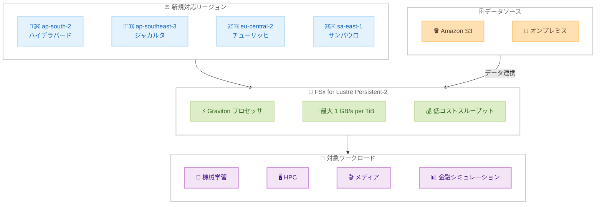

# Amazon FSx for Lustre - Persistent-2 ファイルシステムが 4 つの追加リージョンで利用可能に

**リリース日**: 2026 年 4 月 16 日
**サービス**: Amazon FSx for Lustre
**機能**: Persistent-2 ファイルシステムの 4 リージョン追加

📊 [このアップデートのインフォグラフィックを見る](https://takech9203.github.io/aws-news-summary/20260416-amazon-fsx-lustre-persistent-2-aws.html)

## 概要

Amazon FSx for Lustre の Persistent-2 ファイルシステムが、新たに 4 つの AWS リージョンで利用可能になりました。追加されたリージョンは、アジアパシフィック (ハイデラバード、ジャカルタ)、欧州 (チューリッヒ)、南米 (サンパウロ) です。

Persistent-2 ファイルシステムは AWS Graviton プロセッサを基盤に構築されており、前世代の FSx for Lustre ファイルシステムと比較して、1 テラバイトあたり最大 1 GB/s のスループットを提供し、スループットあたりのコストも低減されています。機械学習 (ML)、ハイパフォーマンスコンピューティング (HPC)、メディア・エンターテインメント、金融シミュレーションなどのワークロードを加速しながら、ストレージコストを削減できます。

今回のリージョン拡大により、これらの地域の顧客は Graviton ベースの高性能ファイルストレージをローカルで利用できるようになり、レイテンシーの改善とデータレジデンシー要件への対応が可能になります。

**アップデート前の課題**

- アジアパシフィック (ハイデラバード、ジャカルタ)、欧州 (チューリッヒ)、南米 (サンパウロ) では Persistent-2 ファイルシステムが利用できなかった
- これらの地域のワークロードでは、他のリージョンを使用する必要があり、レイテンシーが増加していた
- 前世代の Persistent-1 では 1 テラバイトあたりのスループットが低く、高性能ワークロードでのコスト効率が十分ではなかった

**アップデート後の改善**

- 4 つの追加リージョンで Persistent-2 ファイルシステムを直接作成可能になった
- Graviton プロセッサベースにより、1 テラバイトあたり最大 1 GB/s のスループットを実現
- 前世代と比較してスループットあたりのコストが低減され、ストレージコストの最適化が可能になった

## アーキテクチャ図



Persistent-2 ファイルシステムの新規対応リージョンと、Graviton プロセッサによる高スループット・低コストの特性、および主要なワークロードとデータソースの関係を示しています。

## サービスアップデートの詳細

### 主要機能

1. **Graviton プロセッサベースのアーキテクチャ**
   - AWS Graviton プロセッサ上に構築された次世代のファイルシステム
   - 前世代と比較してコストパフォーマンスが向上
   - エネルギー効率の高い Arm ベースプロセッサにより、持続可能性にも貢献

2. **高スループットパフォーマンス**
   - 1 テラバイトあたり最大 1 GB/s のスループットを提供
   - 前世代の Persistent-1 と比較して、テラバイトあたりのスループットが向上
   - 大規模データセットを扱う ML や HPC ワークロードに最適

3. **4 リージョンへの拡大**
   - アジアパシフィック (ハイデラバード): ap-south-2
   - アジアパシフィック (ジャカルタ): ap-southeast-3
   - 欧州 (チューリッヒ): eu-central-2
   - 南米 (サンパウロ): sa-east-1

## 技術仕様

### Persistent-2 と Persistent-1 の比較

| 項目 | Persistent-2 | Persistent-1 |
|------|-------------|-------------|
| プロセッサ | AWS Graviton | 前世代プロセッサ |
| 最大スループット/TiB | 最大 1,000 MB/s | 最大 1,000 MB/s |
| スループットオプション | 125、250、500、1,000 MB/s/TiB | 50、100、200 MB/s/TiB |
| スループットコスト | 低コスト | 標準 |
| データ圧縮 | サポート | サポート |
| S3 連携 | サポート | サポート |
| 暗号化 | 保存時・転送時 | 保存時・転送時 |

### FSx for Lustre Persistent-2 の主要仕様

| 項目 | 詳細 |
|------|------|
| プロトコル | POSIX 準拠のファイルシステムインターフェース |
| ストレージタイプ | SSD |
| 最小ストレージ容量 | 1.2 TiB |
| スループットオプション | 125、250、500、1,000 MB/s/TiB |
| 高可用性 | マルチ AZ 対応不可 (Single-AZ) |
| データ圧縮 | LZ4 圧縮サポート |
| S3 連携 | データリポジトリ関連付けによる自動インポート・エクスポート |

### API 変更履歴

直近 30 日間で FSx に関連する API 変更は確認されていません。

## 設定方法

### 前提条件

1. AWS アカウントと対象リージョンへのアクセス権限
2. VPC とサブネットの構成
3. 適切なセキュリティグループの設定 (Lustre ポート 988、1018-1023 の許可)

### 手順

#### ステップ 1: Persistent-2 ファイルシステムの作成

```bash
aws fsx create-file-system \
  --file-system-type LUSTRE \
  --storage-capacity 1200 \
  --storage-type SSD \
  --subnet-ids subnet-xxxxxxxxxxxxxxxxx \
  --lustre-configuration '{
    "DeploymentType": "PERSISTENT_2",
    "PerUnitStorageThroughput": 250,
    "DataCompressionType": "LZ4"
  }' \
  --region ap-south-2
```

ハイデラバードリージョン (ap-south-2) に 1.2 TiB の SSD ストレージ、250 MB/s/TiB のスループット、LZ4 圧縮を有効にした Persistent-2 ファイルシステムを作成します。

#### ステップ 2: ファイルシステムのマウント

```bash
# ファイルシステムのマウント名を取得
aws fsx describe-file-systems \
  --file-system-ids fs-xxxxxxxxxxxxxxxxx \
  --region ap-south-2 \
  --query 'FileSystems[0].LustreConfiguration.MountName' \
  --output text

# Lustre クライアントのインストール (Amazon Linux 2023)
sudo dnf install -y lustre-client

# ファイルシステムのマウント
sudo mkdir -p /mnt/fsx
sudo mount -t lustre \
  fs-xxxxxxxxxxxxxxxxx.fsx.ap-south-2.amazonaws.com@tcp:/<mount_name> \
  /mnt/fsx
```

Lustre クライアントをインストールし、作成したファイルシステムを EC2 インスタンスにマウントします。マウント名はファイルシステムの説明から取得します。

#### ステップ 3: S3 データリポジトリの関連付け

```bash
aws fsx create-data-repository-association \
  --file-system-id fs-xxxxxxxxxxxxxxxxx \
  --file-system-path /data \
  --data-repository-path s3://my-training-data-bucket \
  --s3 '{
    "AutoImportPolicy": {"Events": ["NEW", "CHANGED", "DELETED"]},
    "AutoExportPolicy": {"Events": ["NEW", "CHANGED", "DELETED"]}
  }' \
  --region ap-south-2
```

S3 バケットとファイルシステムを関連付け、自動インポート・エクスポートを設定します。ML トレーニングデータなどを S3 と自動同期できます。

## メリット

### ビジネス面

- **ストレージコスト削減**: Graviton ベースの Persistent-2 は前世代と比較してスループットあたりのコストが低く、同等のパフォーマンスをより低コストで実現
- **データレジデンシー対応**: ハイデラバード、ジャカルタ、チューリッヒ、サンパウロの各リージョンにデータを保持でき、各地域のデータ主権要件に対応
- **グローバル展開の加速**: 新興市場やデータ規制の厳しい地域で高性能ファイルストレージを利用可能になり、ビジネス展開を加速

### 技術面

- **高スループット**: 1 TiB あたり最大 1 GB/s のスループットにより、大規模データセットの処理を高速化
- **S3 シームレス連携**: S3 との自動データ同期により、データレイクとの統合が容易
- **Graviton の性能優位性**: Arm ベースの Graviton プロセッサにより、電力効率とコストパフォーマンスが向上

## デメリット・制約事項

### 制限事項

- Persistent-2 は Single-AZ デプロイのみ対応。マルチ AZ による自動フェイルオーバーは提供されない
- 最小ストレージ容量は 1.2 TiB であり、小規模なワークロードには過剰な場合がある
- Lustre クライアントのインストールが必要であり、NFS のような汎用的なプロトコルではアクセスできない

### 考慮すべき点

- 新規追加リージョンの料金は他のリージョンと異なる場合があるため、事前に料金ページで確認が必要
- Lustre クライアントは Linux のみ対応であり、Windows や macOS からの直接アクセスは不可
- 前世代の Persistent-1 からの移行にはデータの再作成またはバックアップ・リストアが必要

## ユースケース

### ユースケース 1: インドにおける ML トレーニングパイプライン

**シナリオ**: ハイデラバードに開発拠点を持つ AI 企業が、大規模な言語モデルのトレーニングデータを高速に処理する必要がある。

**実装例**:
```bash
# 高スループットの Persistent-2 ファイルシステムを作成
aws fsx create-file-system \
  --file-system-type LUSTRE \
  --storage-capacity 4800 \
  --storage-type SSD \
  --subnet-ids subnet-xxxxxxxxxxxxxxxxx \
  --lustre-configuration '{
    "DeploymentType": "PERSISTENT_2",
    "PerUnitStorageThroughput": 1000,
    "DataCompressionType": "LZ4"
  }' \
  --region ap-south-2
```

**効果**: 1 TiB あたり 1,000 MB/s のスループットにより、4.8 TiB のストレージで合計約 4.8 GB/s のスループットを実現。GPU インスタンスからのデータ読み込みボトルネックを解消し、トレーニング時間を短縮。

### ユースケース 2: 南米での金融リスクシミュレーション

**シナリオ**: サンパウロの金融機関が、モンテカルロシミュレーションなどの大規模な計算を実行し、中間結果を高速ストレージに書き込む。

**実装例**:
```bash
aws fsx create-file-system \
  --file-system-type LUSTRE \
  --storage-capacity 2400 \
  --storage-type SSD \
  --subnet-ids subnet-xxxxxxxxxxxxxxxxx \
  --lustre-configuration '{
    "DeploymentType": "PERSISTENT_2",
    "PerUnitStorageThroughput": 500
  }' \
  --region sa-east-1
```

**効果**: 低レイテンシーかつ高スループットのストレージにより、シミュレーション結果の書き込みと読み込みを高速化。ブラジル国内のデータレジデンシー要件も満たしつつ、計算パイプライン全体の処理時間を改善。

### ユースケース 3: 欧州でのメディアレンダリング

**シナリオ**: チューリッヒを拠点とする映像制作スタジオが、VFX レンダリングジョブを EC2 スポットインスタンスで実行し、レンダリングフレームを共有ストレージに出力する。

**実装例**:
```bash
# Persistent-2 ファイルシステムを作成し S3 と連携
aws fsx create-file-system \
  --file-system-type LUSTRE \
  --storage-capacity 2400 \
  --storage-type SSD \
  --subnet-ids subnet-xxxxxxxxxxxxxxxxx \
  --lustre-configuration '{
    "DeploymentType": "PERSISTENT_2",
    "PerUnitStorageThroughput": 250,
    "DataCompressionType": "LZ4"
  }' \
  --region eu-central-2

# 完成フレームを S3 に自動エクスポート
aws fsx create-data-repository-association \
  --file-system-id fs-xxxxxxxxxxxxxxxxx \
  --file-system-path /renders \
  --data-repository-path s3://studio-renders-eu \
  --s3 '{
    "AutoExportPolicy": {"Events": ["NEW", "CHANGED"]}
  }' \
  --region eu-central-2
```

**効果**: 複数のレンダリングノードが同一のファイルシステムに高速で書き込みでき、完成したフレームは自動的に S3 にエクスポート。LZ4 圧縮によりストレージコストも削減。

## 料金

Amazon FSx for Lustre Persistent-2 の料金は、ストレージ容量とスループットに基づいて課金されます。Persistent-2 は前世代と比較してスループットあたりのコストが低くなっています。

### 料金例

| 項目 | 月額料金 (概算) |
|------|-----------------|
| SSD ストレージ 1.2 TiB (125 MB/s/TiB) | リージョンにより異なる |
| SSD ストレージ 1.2 TiB (250 MB/s/TiB) | リージョンにより異なる |
| SSD ストレージ 1.2 TiB (500 MB/s/TiB) | リージョンにより異なる |
| SSD ストレージ 1.2 TiB (1,000 MB/s/TiB) | リージョンにより異なる |
| バックアップストレージ 1 TiB | リージョンにより異なる |

各リージョンの最新の料金情報は [Amazon FSx for Lustre 料金ページ](https://aws.amazon.com/fsx/lustre/pricing/) で確認してください。

## 利用可能リージョン

今回の 4 リージョン追加により、Amazon FSx for Lustre Persistent-2 は以下のリージョンで利用可能です。

**今回追加されたリージョン:**
- アジアパシフィック (ハイデラバード): ap-south-2
- アジアパシフィック (ジャカルタ): ap-southeast-3
- 欧州 (チューリッヒ): eu-central-2
- 南米 (サンパウロ): sa-east-1

**既存の対応リージョン (主要なもの):**
- 米国東部 (バージニア北部、オハイオ)
- 米国西部 (オレゴン、北カリフォルニア)
- アジアパシフィック (東京、大阪、シンガポール、シドニー、ソウル、ムンバイ、香港)
- 欧州 (アイルランド、フランクフルト、ロンドン、ストックホルム、パリ)
- カナダ (中部)

最新のリージョン情報は [AWS リージョン表](https://aws.amazon.com/about-aws/global-infrastructure/regional-product-services/) を参照してください。

## 関連サービス・機能

- **Amazon S3**: FSx for Lustre のデータリポジトリとして連携し、データの自動インポート・エクスポートが可能
- **Amazon EC2**: Lustre ファイルシステムのクライアントとして、GPU インスタンスや HPC インスタンスと組み合わせて使用
- **AWS Batch**: HPC ワークロードのジョブスケジューリングと FSx for Lustre の組み合わせにより、大規模バッチ処理を効率化
- **Amazon SageMaker**: ML トレーニングジョブの高速データアクセスレイヤーとして FSx for Lustre を活用
- **AWS ParallelCluster**: HPC クラスターの構築と FSx for Lustre の統合により、科学技術計算環境を迅速に展開

## 参考リンク

- 📊 [インフォグラフィック](https://takech9203.github.io/aws-news-summary/20260416-amazon-fsx-lustre-persistent-2-aws.html)
- [公式発表 (What's New)](https://aws.amazon.com/about-aws/whats-new/2026/04/amazon-fsx-lustre-persistent-2-aws/)
- [Amazon FSx for Lustre ドキュメント](https://docs.aws.amazon.com/fsx/latest/LustreGuide/what-is.html)
- [Amazon FSx for Lustre 料金ページ](https://aws.amazon.com/fsx/lustre/pricing/)
- [Amazon FSx for Lustre 製品ページ](https://aws.amazon.com/fsx/lustre/)

## まとめ

Amazon FSx for Lustre Persistent-2 ファイルシステムが 4 つの追加リージョン (ハイデラバード、ジャカルタ、チューリッヒ、サンパウロ) で利用可能になりました。Graviton プロセッサベースの Persistent-2 は、1 TiB あたり最大 1 GB/s のスループットを前世代より低コストで提供し、ML、HPC、メディア処理、金融シミュレーションなどの高性能ワークロードに最適です。これらのリージョンで高性能ファイルストレージを必要とするワークロードがある場合は、Persistent-2 への移行を検討することを推奨します。
