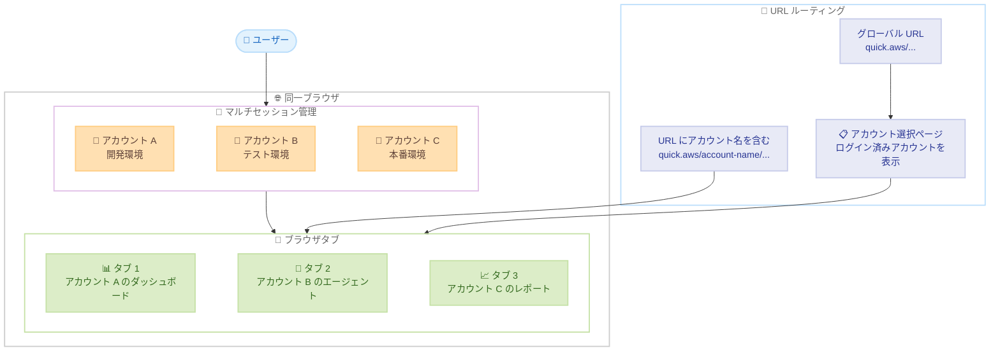

# Amazon Quick - マルチアカウントサインイン

**リリース日**: 2026 年 4 月 16 日
**サービス**: Amazon Quick
**機能**: マルチアカウントサインイン (Multi-Account Sign-In)

📊 [このアップデートのインフォグラフィックを見る](https://takech9203.github.io/aws-news-summary/20260416-amazon-quick-multi-account-sign-in.html)

## 概要

Amazon Quick にマルチセッションサポートが追加され、同一ブラウザ内で最大 5 つの Amazon Quick アカウントに同時にサインインできるようになった。これにより、開発、テスト、本番などの異なる環境用に複数のアカウントを使用しているユーザーが、ブラウザを切り替えることなく効率的にリソースを管理できる。

本機能では、すべての URL に Amazon Quick アカウント名が含まれるようになり、エージェント、スペース、フロー、リサーチレポート、ダッシュボードなどのアセットを開く際に、正しいアカウントに容易にアクセスできる。アカウント名を含まないグローバル URL にアクセスした場合は、ログイン済みのアカウントが事前入力されたアカウント入力ページが表示され、目的のアカウントを選択できる。

この機能は、Amazon Quick がサポートされているすべてのリージョンで利用可能である。複数アカウントを日常的に運用する組織にとって、業務効率を大幅に向上させるアップデートとなる。

**アップデート前の課題**

- 複数の Amazon Quick アカウントにアクセスするには、異なるブラウザやシークレットウィンドウを使用する必要があった
- アカウント間の切り替えにはサインアウトとサインインの繰り返しが必要で、作業が中断されていた
- URL からどのアカウントのリソースにアクセスしているか判別が困難だった
- 開発、テスト、本番環境のリソースを比較するために、複数のブラウザウィンドウを並行して操作する必要があった

**アップデート後の改善**

- 同一ブラウザ内で最大 5 つの Amazon Quick アカウントに同時サインイン可能に
- URL にアカウント名が含まれるようになり、アクセス先のアカウントを即座に識別可能
- 右上メニューから別アカウントへの追加サインインがワンクリックで可能に
- 個別のブラウザタブでのセッションログアウト、または全セッション一括ログアウトに対応

## アーキテクチャ図



この図は、Amazon Quick のマルチアカウントサインイン機能のアーキテクチャを示している。同一ブラウザ内で複数のセッションが管理され、各タブが異なるアカウントのリソースにアクセスする仕組みと、URL ルーティングによるアカウント識別の流れを表している。

## サービスアップデートの詳細

### 主要機能

1. **マルチセッションサポート**
   - 同一ブラウザ内で最大 5 つの Amazon Quick アカウントに同時サインイン
   - 各アカウントのセッションは独立して管理される
   - ブラウザのタブごとに異なるアカウントのリソースにアクセス可能

2. **URL ベースのアカウント識別**
   - すべての URL に Amazon Quick アカウント名が含まれる
   - エージェント、スペース、フロー、リサーチレポート、ダッシュボードなどのアセット URL が対象
   - URL を共有する際に、どのアカウントのリソースかを明確に識別可能

3. **アカウント選択ページ**
   - アカウント名を含まないグローバル URL にアクセスした場合に表示
   - ログイン済みアカウントが事前入力 (プリポピュレート) される
   - 目的のアカウントをワンクリックで選択可能

4. **柔軟なセッション管理**
   - 右上メニューから別アカウントへの追加サインインが可能
   - 特定のブラウザタブの現在のセッションのみをログアウト可能
   - 全セッションの一括ログアウトも対応

## 技術仕様

### セッション管理の仕様

| 項目 | 詳細 |
|------|------|
| 同時サインイン可能アカウント数 | 最大 5 アカウント |
| セッション管理単位 | ブラウザタブ単位 |
| URL 形式 | アカウント名を含む一意の URL |
| ログアウト方式 | 個別タブセッション / 全セッション一括 |
| 対象アセット | エージェント、スペース、フロー、リサーチレポート、ダッシュボードなど |

### API 変更履歴

本アップデートに関連する API 変更は確認されなかった。

## 設定方法

### 前提条件

1. Amazon Quick アカウントが複数作成済みであること
2. 各アカウントへのサインイン認証情報を保持していること
3. サポートされている Web ブラウザを使用していること

### 手順

#### ステップ 1: 最初のアカウントにサインイン

Amazon Quick のサインインページにアクセスし、最初のアカウントの認証情報を使用してサインインする。

#### ステップ 2: 追加アカウントにサインイン

```
1. Amazon Quick 画面の右上メニューをクリック
2. 「別のアカウントにサインイン」オプションを選択
3. 追加するアカウントの認証情報を入力してサインイン
```

右上メニューから追加アカウントへのサインインを実行する。新しいブラウザタブが開き、追加アカウントのセッションが確立される。

#### ステップ 3: アカウント間の切り替え

URL にアカウント名が含まれるため、ブラウザのタブを切り替えるだけで異なるアカウントのリソースにアクセスできる。グローバル URL を使用する場合は、アカウント選択ページからログイン済みアカウントを選択する。

#### ステップ 4: セッションのログアウト

```
- 個別ログアウト: 特定のタブで右上メニューから「このセッションをログアウト」を選択
- 一括ログアウト: 右上メニューから「すべてのセッションをログアウト」を選択
```

セッションのログアウトは、個別タブ単位と全セッション一括の 2 つの方法から選択可能である。

## メリット

### ビジネス面

- **業務効率の向上**: ブラウザやウィンドウの切り替えが不要になり、複数環境間のリソース確認・比較作業の時間を大幅に削減
- **運用ミスの低減**: URL にアカウント名が含まれることで、誤ったアカウントでの操作リスクが軽減
- **トラブルシューティングの迅速化**: 開発、テスト、本番環境のリソース構成やインサイトを同一ブラウザ内で並行して比較可能

### 技術面

- **セッション分離**: 各アカウントのセッションが独立して管理され、セキュリティを維持
- **URL ベースのアカウント識別**: URL にアカウント名が含まれることで、ブックマークやリンク共有時のアカウント特定が容易
- **柔軟なセッション管理**: 個別セッションと全セッションのログアウトを使い分け可能

## デメリット・制約事項

### 制限事項

- 同時サインイン可能なアカウント数は最大 5 つに制限されている
- 同一ブラウザ内でのセッション管理のため、ブラウザのセッションストレージやクッキーに依存する
- シークレットモードやプライベートブラウジングでの挙動は、通常のブラウジングと異なる可能性がある

### 考慮すべき点

- 多数のタブを開いた場合のブラウザのメモリ使用量に注意が必要
- 組織のセキュリティポリシーにより、同一端末での複数アカウント同時アクセスが制限される場合がある
- 共有端末での使用時は、全セッションのログアウトを忘れないよう注意が必要

## ユースケース

### ユースケース 1: マルチ環境でのリソース比較

**シナリオ**: データエンジニアが開発環境と本番環境のダッシュボードを比較し、データパイプラインの設定差異をトラブルシューティングする場合。

**実装例**:
```
タブ 1: https://quick.aws/dev-account/dashboards/pipeline-metrics
タブ 2: https://quick.aws/prod-account/dashboards/pipeline-metrics
```

**効果**: 同一ブラウザ内で 2 つの環境のダッシュボードを並べて表示し、設定差異を即座に特定できる。

### ユースケース 2: 複数組織のレポート管理

**シナリオ**: コンサルタントが複数のクライアント組織の Amazon Quick アカウントにアクセスし、各クライアントのリサーチレポートやインサイトを確認する場合。

**実装例**:
```
タブ 1: https://quick.aws/client-a/research-reports/monthly
タブ 2: https://quick.aws/client-b/research-reports/monthly
タブ 3: https://quick.aws/client-c/research-reports/monthly
```

**効果**: 最大 5 つのクライアントアカウントに同時アクセスし、レポートの確認作業を効率化できる。

### ユースケース 3: AI エージェントの環境別テスト

**シナリオ**: AI エンジニアが開発環境で構築した Amazon Quick エージェントの動作をテスト環境と本番環境で検証する場合。

**実装例**:
```
タブ 1: https://quick.aws/dev-account/agents/sales-assistant
タブ 2: https://quick.aws/staging-account/agents/sales-assistant
タブ 3: https://quick.aws/prod-account/agents/sales-assistant
```

**効果**: 各環境のエージェントの応答を並行して比較し、環境間の動作差異を効率的に検証できる。

## 料金

マルチアカウントサインイン機能自体に追加料金は発生しない。各アカウントの利用料金は、既存の Amazon Quick の料金体系に基づいて個別に課金される。

詳細は [Amazon Quick の料金ページ](https://aws.amazon.com/quicksight/pricing/)を参照。

## 利用可能リージョン

Amazon Quick がサポートされているすべてのリージョンで利用可能。対応リージョンの詳細は [Amazon Quick のリージョン一覧](https://docs.aws.amazon.com/quicksight/latest/user/regions-qs.html)を参照。

## 関連サービス・機能

- **Amazon QuickSight**: Amazon Quick のビジネスインテリジェンス機能。ダッシュボード作成やデータ可視化を提供
- **AWS IAM Identity Center**: 複数の AWS アカウントへのシングルサインオンを管理。Amazon Quick のアカウント認証と連携
- **AWS Organizations**: 複数の AWS アカウントを一元管理。Amazon Quick のマルチアカウント構成の基盤

## 参考リンク

- 📊 [インフォグラフィック](https://takech9203.github.io/aws-news-summary/20260416-amazon-quick-multi-account-sign-in.html)
- [公式発表 (What's New)](https://aws.amazon.com/about-aws/whats-new/2026/04/amazon-quick-multi-account-sign-in/)
- [Amazon Quick サインインドキュメント](https://docs.aws.amazon.com/quicksuite/latest/userguide/signing-in.html)
- [Amazon Quick 対応リージョン](https://docs.aws.amazon.com/quicksight/latest/user/regions-qs.html)
- [料金ページ](https://aws.amazon.com/quicksight/pricing/)

## まとめ

Amazon Quick のマルチアカウントサインイン機能は、複数の環境やアカウントを日常的に運用する組織にとって、作業効率を大幅に改善する実用的なアップデートである。URL にアカウント名が含まれる仕組みにより、アカウントの誤認防止にも貢献する。複数アカウントを管理しているユーザーは、すぐにこの機能を活用し、ブラウザ切り替えの手間を削減することを推奨する。
