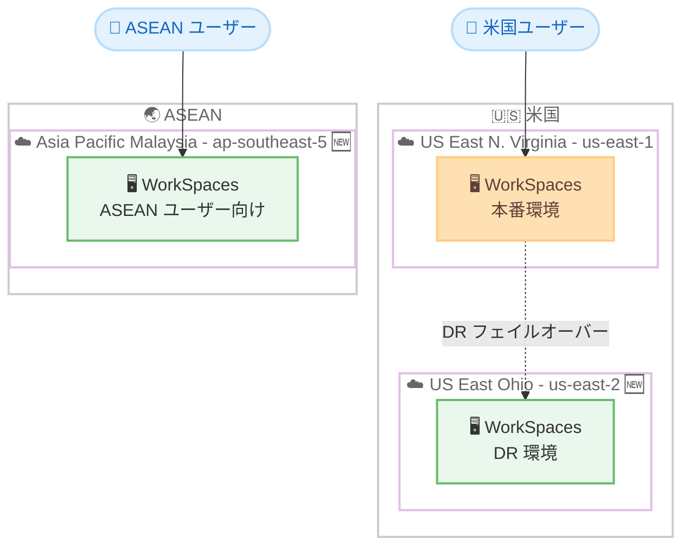

# Amazon WorkSpaces - US East (Ohio) および Asia Pacific (Malaysia) リージョン追加

**リリース日**: 2026 年 4 月 16 日
**サービス**: Amazon WorkSpaces Personal / Amazon WorkSpaces Core
**機能**: 2 つの追加 AWS リージョンでの提供開始

## 概要

Amazon WorkSpaces Personal および Amazon WorkSpaces Core が、US East (Ohio) リージョンと Asia Pacific (Malaysia) リージョンで利用可能になりました。これにより、これらのリージョンに近いユーザーに対して、より低レイテンシーかつ応答性の高い仮想デスクトップ体験を提供できるようになります。

US East (Ohio) リージョンの追加により、既存の US East (N. Virginia) リージョンと組み合わせたディザスタリカバリ (DR) 構成が可能になります。また、米国内のデータレジデンシー要件への対応選択肢が広がります。Asia Pacific (Malaysia) リージョンは、ASEAN 地域におけるデータ主権要件やローカルコンプライアンスへの対応を必要とする組織にとって重要な選択肢となります。

Amazon WorkSpaces Personal はどこからでもデスクトップにアクセスできるフルマネージドの仮想デスクトップサービスであり、Amazon WorkSpaces Core はサードパーティ VDI 管理ソリューションから API 経由でアクセス可能なクラウドベースのフルマネージド VDI です。

**アップデート前の課題**

- US East リージョンでは N. Virginia のみが利用可能であり、同一地域内での DR 構成を組むことができなかった
- マレーシアやその周辺の ASEAN 諸国のユーザーは、距離的に遠いリージョンから WorkSpaces を利用する必要があり、レイテンシーが高かった
- マレーシアのデータレジデンシー要件に対応するためには、国内にデータを保持する選択肢がなかった

**アップデート後の改善**

- US East (Ohio) と US East (N. Virginia) を組み合わせた DR 構成が可能になった
- Asia Pacific (Malaysia) リージョンにより、ASEAN 地域のユーザーに低レイテンシーの仮想デスクトップ体験を提供可能
- マレーシア国内でのデータレジデンシー要件やコンプライアンス要件に対応可能

## アーキテクチャ図



US East (Ohio) を DR サイトとして活用し、Asia Pacific (Malaysia) で ASEAN 地域のユーザーにサービスを提供する構成例を示しています。緑色のノードが今回新たに利用可能になったリージョンです。

## サービスアップデートの詳細

### 主要機能

1. **Amazon WorkSpaces Personal の新リージョン対応**
   - US East (Ohio) および Asia Pacific (Malaysia) で WorkSpaces Personal のプロビジョニングが可能
   - AWS マネジメントコンソールからリージョンを選択するだけで利用開始
   - 既存リージョンと同等の機能セットを提供

2. **Amazon WorkSpaces Core の新リージョン対応**
   - サードパーティ VDI 管理ソリューションから API 経由で新リージョンの WorkSpaces Core にアクセス可能
   - Citrix、VMware Horizon などのサードパーティソリューションとの連携をサポート
   - API ベースの自動化やオーケストレーションが新リージョンでも利用可能

3. **データレジデンシーとコンプライアンス対応**
   - US East (Ohio) ではローカルデータレジデンシーのコンプライアンス要件に対応
   - Asia Pacific (Malaysia) ではマレーシアのデータ保護法 (PDPA) への準拠を支援
   - 各リージョンでのデータ保持が可能

## 技術仕様

### 新規リージョン情報

| 項目 | US East (Ohio) | Asia Pacific (Malaysia) |
|------|---------------|------------------------|
| リージョンコード | us-east-2 | ap-southeast-5 |
| 対応サービス | WorkSpaces Personal, WorkSpaces Core | WorkSpaces Personal, WorkSpaces Core |
| 主なユースケース | DR 構成、米国内データレジデンシー | ASEAN 地域ユーザー、マレーシア国内データレジデンシー |
| エンドポイント | workspaces.us-east-2.amazonaws.com | workspaces.ap-southeast-5.amazonaws.com |

### API 変更履歴

過去 7 日間において、Amazon WorkSpaces に関連する API 変更は確認されていません。今回のアップデートは既存 API のリージョン拡張であり、API 自体の変更は伴いません。

## 設定方法

### 前提条件

1. 対象リージョンで有効化された AWS アカウント
2. WorkSpaces の管理権限を持つ IAM ロール
3. 対象リージョンに VPC およびサブネットが設定済みであること
4. Active Directory 環境 (AWS Managed Microsoft AD、AD Connector、または Simple AD)

### 手順

#### ステップ 1: リージョンの選択と VPC の準備

```bash
# US East (Ohio) リージョンで VPC を作成
aws ec2 create-vpc \
  --cidr-block 10.0.0.0/16 \
  --region us-east-2

# サブネットを作成
aws ec2 create-subnet \
  --vpc-id vpc-xxxxxxxx \
  --cidr-block 10.0.1.0/24 \
  --availability-zone us-east-2a \
  --region us-east-2
```

対象リージョンに WorkSpaces 用の VPC とサブネットを作成します。既存の VPC がある場合はこのステップは不要です。

#### ステップ 2: ディレクトリの作成

```bash
# AWS Managed Microsoft AD を作成
aws ds create-microsoft-ad \
  --name corp.example.com \
  --password "YourPassword" \
  --vpc-settings "VpcId=vpc-xxxxxxxx,SubnetIds=subnet-aaaa,subnet-bbbb" \
  --region us-east-2
```

WorkSpaces のユーザー認証に使用するディレクトリサービスを対象リージョンに作成します。

#### ステップ 3: ディレクトリの登録と WorkSpaces のプロビジョニング

```bash
# ディレクトリを WorkSpaces に登録
aws workspaces register-workspace-directory \
  --directory-id d-xxxxxxxxxx \
  --subnet-ids subnet-aaaa subnet-bbbb \
  --region us-east-2

# WorkSpaces を作成
aws workspaces create-workspaces \
  --workspaces "DirectoryId=d-xxxxxxxxxx,UserName=user01,BundleId=wsb-xxxxxxxx" \
  --region us-east-2
```

対象リージョンでディレクトリを登録し、ユーザー向けの WorkSpaces をプロビジョニングします。

## メリット

### ビジネス面

- **ASEAN 市場への展開強化**: マレーシアリージョンにより、東南アジアにおけるリモートワーク環境の提供が容易になり、地域のビジネス拡大を支援
- **DR 戦略の強化**: US East (Ohio) の追加により、米国内で地理的に分散した DR 構成が実現可能となり、事業継続性が向上
- **コンプライアンス対応の拡充**: 各リージョンのデータレジデンシー要件に対応可能となり、規制産業の顧客獲得に貢献

### 技術面

- **レイテンシーの改善**: ユーザーに近いリージョンから WorkSpaces を提供することで、応答速度が向上しユーザー体験が改善
- **マルチリージョン構成の選択肢拡大**: 既存リージョンとの組み合わせにより、可用性とパフォーマンスを最適化した構成が可能
- **API 互換性**: 既存の API やツールがそのまま利用可能であり、リージョンパラメータの変更のみで新リージョンに対応

## デメリット・制約事項

### 制限事項

- 新リージョンで利用可能なバンドルタイプは、今後段階的に拡充される可能性がある
- リージョン間での WorkSpaces の直接移行 (ライブマイグレーション) はサポートされていない
- Asia Pacific (Malaysia) リージョンでは、一部の AWS サービスとの連携がまだ制限される可能性がある

### 考慮すべき点

- 新リージョンへの展開時には、ネットワーク接続 (Direct Connect、VPN) の追加設定が必要
- DR 構成を実装する場合、ユーザープロファイルやデータの同期方法を別途設計する必要がある
- 各リージョンの料金体系を確認し、コスト最適化を検討すること

## ユースケース

### ユースケース 1: 米国内ディザスタリカバリ構成

**シナリオ**: 米国の金融機関が、規制要件として事業継続計画 (BCP) の一環で WorkSpaces の DR 構成を求められている。US East (N. Virginia) を本番サイトとし、US East (Ohio) を DR サイトとして構成する。

**実装例**:
```bash
# 本番環境: US East (N. Virginia)
aws workspaces create-workspaces \
  --workspaces "DirectoryId=d-prod123,UserName=user01,BundleId=wsb-xxxxxxxx" \
  --region us-east-1

# DR 環境: US East (Ohio)
aws workspaces create-workspaces \
  --workspaces "DirectoryId=d-dr456,UserName=user01,BundleId=wsb-xxxxxxxx" \
  --region us-east-2
```

**効果**: 米国東部の 2 つのリージョンを活用した地理的に分散された DR 構成により、リージョン障害時の事業継続性を確保

### ユースケース 2: ASEAN 地域のリモートワーク環境

**シナリオ**: 日系企業がマレーシア、シンガポール、インドネシアに拠点を持ち、ASEAN 地域の従業員にリモートデスクトップ環境を提供する必要がある。マレーシアのデータ保護法 (PDPA) に準拠したデータ管理が求められている。

**実装例**:
```bash
# Asia Pacific (Malaysia) リージョンで WorkSpaces を展開
aws workspaces create-workspaces \
  --workspaces "DirectoryId=d-asean789,UserName=employee01,BundleId=wsb-xxxxxxxx" \
  --region ap-southeast-5
```

**効果**: ASEAN 地域の従業員に低レイテンシーの仮想デスクトップ体験を提供しつつ、マレーシアのデータレジデンシー要件に準拠

### ユースケース 3: サードパーティ VDI 統合 (WorkSpaces Core)

**シナリオ**: 既に Citrix や VMware Horizon を VDI 管理ソリューションとして使用している企業が、新リージョンのインフラストラクチャを WorkSpaces Core で提供し、既存の管理ツールとシームレスに統合する。

**実装例**:
```bash
# WorkSpaces Core を API 経由で新リージョンにプロビジョニング
aws workspaces create-workspaces \
  --workspaces "DirectoryId=d-core012,UserName=vdi-user01,BundleId=wsb-core-xxxxxxxx" \
  --region us-east-2

# サードパーティ VDI ソリューションから API でストリーミング接続を管理
```

**効果**: 既存のサードパーティ VDI 投資を活かしながら、新リージョンでクラウドベースの VDI インフラを迅速に展開

## 料金

Amazon WorkSpaces の料金はリージョンおよびバンドルタイプにより異なります。月額料金または時間料金から選択できます。

### 料金例

| バンドルタイプ | 月額料金 (概算) | 時間料金 (概算) |
|--------------|----------------|----------------|
| Value (Linux) | $23/月 から | $7.25/月 + $0.22/時間 から |
| Standard (Windows) | $35/月 から | $9.75/月 + $0.36/時間 から |
| Performance (Windows) | $48/月 から | $11.25/月 + $0.52/時間 から |
| Power (Windows) | $78/月 から | $13.00/月 + $0.91/時間 から |

新リージョンの正確な料金は [Amazon WorkSpaces 料金ページ](https://aws.amazon.com/workspaces/pricing/) を参照してください。リージョンにより料金が異なる場合があります。

## 利用可能リージョン

今回の追加により、Amazon WorkSpaces は以下のリージョンで利用可能です。

| リージョン | リージョンコード |
|-----------|----------------|
| US East (N. Virginia) | us-east-1 |
| US East (Ohio) 🆕 | us-east-2 |
| US West (Oregon) | us-west-2 |
| Canada (Central) | ca-central-1 |
| Europe (Ireland) | eu-west-1 |
| Europe (London) | eu-west-2 |
| Europe (Frankfurt) | eu-central-1 |
| Asia Pacific (Tokyo) | ap-northeast-1 |
| Asia Pacific (Seoul) | ap-northeast-2 |
| Asia Pacific (Mumbai) | ap-south-1 |
| Asia Pacific (Singapore) | ap-southeast-1 |
| Asia Pacific (Sydney) | ap-southeast-2 |
| Asia Pacific (Malaysia) 🆕 | ap-southeast-5 |
| South America (Sao Paulo) | sa-east-1 |
| Africa (Cape Town) | af-south-1 |
| Israel (Tel Aviv) | il-central-1 |
| AWS GovCloud (US-West) | us-gov-west-1 |

## 関連サービス・機能

- **AWS Directory Service**: WorkSpaces のユーザー認証基盤。新リージョンでも AWS Managed Microsoft AD、AD Connector、Simple AD を利用可能
- **Amazon WorkSpaces Secure Browser**: ウェブブラウザベースのセキュアなアクセスソリューション。WorkSpaces Personal と補完的に使用
- **AWS Direct Connect**: 新リージョンへのプライベートネットワーク接続を確立し、安定したパフォーマンスを実現
- **Amazon WorkSpaces Thin Client**: WorkSpaces への接続に特化した低コストのデバイス。新リージョンへの接続にも対応

## 参考リンク

- [公式発表 (What's New)](https://aws.amazon.com/about-aws/whats-new/2026/04/amazon-workspaces-available-two-new-regions/)
- [Amazon WorkSpaces ドキュメント](https://docs.aws.amazon.com/workspaces/)
- [Amazon WorkSpaces 料金](https://aws.amazon.com/workspaces/pricing/)
- [Amazon WorkSpaces 製品ページ](https://aws.amazon.com/workspaces/)

## まとめ

Amazon WorkSpaces Personal および WorkSpaces Core が US East (Ohio) と Asia Pacific (Malaysia) の 2 リージョンに拡大されたことにより、米国内での DR 構成および ASEAN 地域でのデータレジデンシー対応が可能になりました。特にマレーシアリージョンの追加は、東南アジア市場でのクラウド VDI 展開を検討する組織にとって重要な選択肢です。既存のユーザーは、DR 戦略の見直しや ASEAN 地域の従業員向け環境の最適化を検討することを推奨します。
