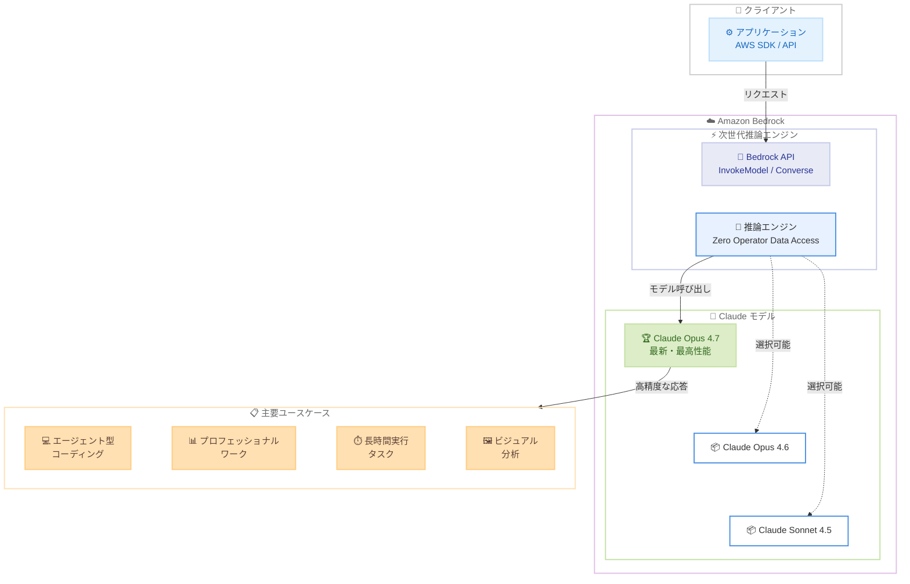

# Amazon Bedrock - Claude Opus 4.7 モデルの提供開始

**リリース日**: 2026 年 4 月 16 日
**サービス**: Amazon Bedrock
**機能**: Claude Opus 4.7 (Anthropic 最新 Opus モデル)

📊 [このアップデートのインフォグラフィックを見る](https://takech9203.github.io/aws-news-summary/20260416-claude-opus-4.7-amazon-bedrock.html)

## 概要

Amazon Bedrock で Anthropic の最新かつ最も高性能な Opus モデルである Claude Opus 4.7 が利用可能になった。Claude Opus 4.7 は前世代の Claude Opus 4.6 からのアップグレードであり、エージェント型コーディング、プロフェッショナルワーク、長時間実行タスクの各領域で大幅な性能向上を実現している。

Claude Opus 4.7 は、曖昧な状況でもより適切に対処し、問題解決においてより徹底的に取り組み、指示への追従精度が向上している。コーディング面では長時間の自律的作業、システムエンジニアリング、複雑なコード推論が強化された。ナレッジワークではスライドやドキュメント作成、財務分析、データ可視化などの専門的タスクが改善されている。さらに、高解像度画像サポートによるビジュアル機能の強化も含まれる。

Amazon Bedrock の次世代推論エンジンを通じて提供され、オペレーターによるデータアクセスはゼロ (zero operator data access) という高いセキュリティ基準を維持している。特定の AWS リージョンで利用可能である。

**アップデート前の課題**

- Claude Opus 4.6 では長時間のエージェント型タスクで推論やメモリ維持に課題があった
- 複雑なコードベースに対するシステムエンジニアリングや長期的なコード推論に限界があった
- 曖昧な指示や不完全な情報を含むタスクで、期待通りの結果を得られないことがあった
- ドキュメント作成や財務分析などのプロフェッショナルワークにおいて、より高い精度が求められていた

**アップデート後の改善**

- 長時間実行タスクにおいて、推論能力とメモリ維持が向上し、長期間にわたってタスクを正確に遂行可能になった
- エージェント型コーディングで自律性が向上し、複雑なシステムエンジニアリングタスクをより正確に処理できるようになった
- 曖昧な状況での判断力が向上し、指示への追従精度が改善された
- プロフェッショナルワーク (スライド作成、財務分析、データ可視化) の品質が大幅に向上した
- 高解像度画像サポートにより、ビジュアルコンテンツの分析・処理能力が強化された

## アーキテクチャ図



この図は、Amazon Bedrock の次世代推論エンジンを通じて Claude Opus 4.7 が提供されるアーキテクチャを示している。クライアントアプリケーションは Bedrock API を通じてモデルにアクセスし、エージェント型コーディングやプロフェッショナルワークなどの多様なユースケースに活用できる。

## サービスアップデートの詳細

### 主要機能

1. **エージェント型コーディングの強化**
   - 長時間にわたる自律的なコーディング作業が可能になり、大規模なコードベースに対するシステムエンジニアリングタスクを効率的に処理
   - 複雑なコード推論能力の向上により、設計パターンの理解やリファクタリング提案の精度が改善
   - 曖昧な要件からの実装においても、より適切な判断と実装を実現

2. **プロフェッショナルワークの向上**
   - スライドやドキュメントの作成支援において、構成力や表現力が向上
   - 財務分析タスクにおける数値処理と解釈の精度が改善
   - データ可視化の提案や実装がより実用的かつ適切に

3. **長時間実行タスクの安定性**
   - 長期的なタスク実行中の推論能力が向上し、コンテキストを維持しながら正確にタスクを遂行
   - メモリ機能の改善により、長時間の対話やマルチステップタスクでの情報保持力が強化
   - タスクの軌道修正能力が向上し、長時間のワークフローでも一貫した品質を維持

4. **ビジュアル機能の強化**
   - 高解像度画像のサポートにより、画像内のテキスト認識や図表の分析精度が向上
   - マルチモーダルタスク (画像とテキストの組み合わせ) のパフォーマンスが改善
   - 技術的なダイアグラムやチャートの理解・解釈能力が強化

5. **セキュリティとプライバシー**
   - Amazon Bedrock の次世代推論エンジンによるゼロオペレーターデータアクセスを維持
   - 入力データおよび出力データにオペレーターがアクセスすることのない、高いプライバシー保護を実現

## 技術仕様

### モデル情報

| 項目 | 詳細 |
|------|------|
| モデルプロバイダー | Anthropic |
| モデル名 | Claude Opus 4.7 |
| 前世代モデル | Claude Opus 4.6 |
| 推論エンジン | Amazon Bedrock 次世代推論エンジン |
| データアクセスポリシー | Zero Operator Data Access |
| サポート機能 | テキスト生成、マルチモーダル (画像入力)、エージェント型タスク |

### API 変更履歴

直近 7 日間で Claude Opus 4.7 に直接関連する Bedrock API の変更は確認されていない。既存の Bedrock InvokeModel API および Converse API を通じて新モデルにアクセスする形式のため、API レベルでの変更は不要である。

参考として、直近の Bedrock 関連 API 変更を以下に記載する。

| 日付 | サービス | 変更内容 |
|------|----------|----------|
| 2026/04/03 | [Amazon Bedrock](https://awsapichanges.com/archive/changes/da2768-bedrock.html) | 3 new 2 updated api methods - Guardrails enforcement configuration API でシステムプロンプト、ユーザー/アシスタントメッセージの選択的ガード制御をサポート |
| 2026/04/03 | [Agents for Amazon Bedrock](https://awsapichanges.com/archive/changes/da2768-bedrock-agent.html) | 10 updated api methods - Guardrails enforcement configuration およびリソースポリシー API の SDK サポート |
| 2026/04/01 | [Amazon Bedrock](https://awsapichanges.com/archive/changes/56a6ef-bedrock.html) | 2 updated api methods - バッチ推論ジョブの進捗モニタリングのサポート追加 |

### アクセス方法

```python
import boto3
import json

# Bedrock Runtime クライアントの作成
bedrock_runtime = boto3.client('bedrock-runtime', region_name='us-east-1')

# Converse API を使用した Claude Opus 4.7 の呼び出し
response = bedrock_runtime.converse(
    modelId='anthropic.claude-opus-4-7-20260416-v1:0',
    messages=[
        {
            'role': 'user',
            'content': [
                {
                    'text': 'このコードベースのアーキテクチャを分析し、改善点を提案してください。'
                }
            ]
        }
    ],
    inferenceConfig={
        'maxTokens': 4096,
        'temperature': 0.7
    }
)

print(json.dumps(response['output']['message']['content'], indent=2, ensure_ascii=False))
```

## 設定方法

### 前提条件

1. AWS アカウントと Amazon Bedrock へのアクセス権限
2. Claude Opus 4.7 が利用可能なリージョンの使用
3. Amazon Bedrock コンソールでの Claude Opus 4.7 モデルアクセスの有効化
4. 適切な IAM ポリシー (`bedrock:InvokeModel` 権限) の設定

### 手順

#### ステップ 1: モデルアクセスの有効化

Amazon Bedrock コンソールにログインし、「モデルアクセス」ページで Anthropic Claude Opus 4.7 のアクセスをリクエストする。

1. AWS マネジメントコンソールで Amazon Bedrock を開く
2. 左側ナビゲーションから「モデルアクセス」を選択
3. Anthropic セクションで Claude Opus 4.7 を見つけ、「アクセスをリクエスト」をクリック
4. 利用規約に同意してアクセスを有効化

#### ステップ 2: IAM ポリシーの設定

```json
{
    "Version": "2012-10-17",
    "Statement": [
        {
            "Effect": "Allow",
            "Action": [
                "bedrock:InvokeModel",
                "bedrock:InvokeModelWithResponseStream"
            ],
            "Resource": "arn:aws:bedrock:*::foundation-model/anthropic.claude-opus-4-7-*"
        }
    ]
}
```

この IAM ポリシーは、Claude Opus 4.7 モデルに対する同期・ストリーミング呼び出しの権限を付与する。

#### ステップ 3: API 呼び出しの実行

```bash
# AWS CLI を使用した Claude Opus 4.7 の呼び出し
aws bedrock-runtime converse \
    --model-id "anthropic.claude-opus-4-7-20260416-v1:0" \
    --messages '[{"role":"user","content":[{"text":"Amazon Bedrock の概要を説明してください。"}]}]' \
    --inference-config '{"maxTokens":1024}' \
    --region us-east-1
```

このコマンドは、Claude Opus 4.7 モデルに対して Converse API を使用してテキスト生成リクエストを送信する。

#### ステップ 4: クロスリージョン推論の利用 (オプション)

```python
import boto3

bedrock_runtime = boto3.client('bedrock-runtime', region_name='us-east-1')

# クロスリージョン推論プロファイルを使用
response = bedrock_runtime.converse(
    modelId='us.anthropic.claude-opus-4-7-20260416-v1:0',
    messages=[
        {
            'role': 'user',
            'content': [{'text': '分析レポートを作成してください。'}]
        }
    ],
    inferenceConfig={
        'maxTokens': 4096
    }
)
```

クロスリージョン推論プロファイル (`us.` プレフィックス) を使用すると、リクエストが自動的に最適なリージョンにルーティングされ、可用性とスループットが向上する。

## メリット

### ビジネス面

- **開発生産性の向上**: エージェント型コーディング能力の強化により、ソフトウェア開発チームの生産性が向上し、複雑なシステムの設計・実装サイクルを短縮
- **ナレッジワークの効率化**: ドキュメント作成、財務分析、データ可視化の品質向上により、プロフェッショナルサービスにおける成果物の品質と生産速度を改善
- **長時間タスクの信頼性**: 長期間にわたるタスクの安定性向上により、複雑なワークフローの自動化や大規模なデータ処理において信頼性の高い結果を実現

### 技術面

- **推論精度の向上**: 曖昧な指示や複雑な要件に対する理解力が向上し、より正確で実用的な応答を生成
- **マルチモーダル機能の強化**: 高解像度画像サポートにより、技術ドキュメント内の図表や UI スクリーンショットの分析精度が向上
- **ゼロオペレーターデータアクセス**: 次世代推論エンジンにより、データがオペレーターに一切アクセスされないセキュリティモデルを維持
- **既存 API との互換性**: InvokeModel および Converse API を通じたアクセスのため、既存のアプリケーションコードからモデル ID の変更のみで移行可能

## デメリット・制約事項

### 制限事項

- 特定の AWS リージョンでのみ利用可能であり、すべてのリージョンでは提供されていない
- Opus モデルは Sonnet や Haiku と比較して推論コストが高く、大量のリクエストを処理する場合はコスト管理が重要
- 高性能モデルのため、レスポンスレイテンシーが Sonnet や Haiku モデルと比較して長くなる場合がある

### 考慮すべき点

- Claude Opus 4.6 からの移行にあたり、プロンプトの動作に微妙な違いが発生する可能性があるため、本番環境への適用前にテストを推奨
- 長時間実行タスクでの改善が報告されているが、ユースケースに応じたベンチマーク検証が望ましい
- コストパフォーマンスの観点から、すべてのタスクに Opus を使用するのではなく、タスクの複雑さに応じて Sonnet や Haiku との使い分けを検討すべき

## ユースケース

### ユースケース 1: 大規模コードベースのリファクタリング

**シナリオ**: 数万行規模のレガシーコードベースを分析し、アーキテクチャの問題点の特定、リファクタリング計画の策定、実装までを AI エージェントに委任したい。

**実装例**:
```python
import boto3

bedrock_runtime = boto3.client('bedrock-runtime')

response = bedrock_runtime.converse(
    modelId='anthropic.claude-opus-4-7-20260416-v1:0',
    messages=[
        {
            'role': 'user',
            'content': [
                {
                    'text': '''以下のコードベースを分析し、リファクタリング計画を作成してください。
                    優先度の高い改善点、依存関係の整理、テスト戦略を含めてください。
                    
                    [コードベースの情報]'''
                }
            ]
        }
    ],
    inferenceConfig={
        'maxTokens': 8192,
        'temperature': 0.3
    }
)
```

**効果**: 長時間の自律的コーディング能力と複雑なコード推論の改善により、大規模なリファクタリングプロジェクトを効率的に支援し、開発チームの作業負荷を軽減する。

### ユースケース 2: 財務データ分析とレポート生成

**シナリオ**: 四半期ごとの財務データを分析し、トレンド分析、異常検知、経営層向けのレポートとデータ可視化を自動生成したい。

**実装例**:
```python
import boto3
import base64

bedrock_runtime = boto3.client('bedrock-runtime')

# 財務データのスプレッドシート画像を含むマルチモーダルリクエスト
with open('financial_report.png', 'rb') as f:
    image_data = base64.b64encode(f.read()).decode('utf-8')

response = bedrock_runtime.converse(
    modelId='anthropic.claude-opus-4-7-20260416-v1:0',
    messages=[
        {
            'role': 'user',
            'content': [
                {
                    'image': {
                        'format': 'png',
                        'source': {'bytes': base64.b64decode(image_data)}
                    }
                },
                {
                    'text': 'この財務データを分析し、主要 KPI のトレンド、異常値、経営層向けのサマリーを作成してください。'
                }
            ]
        }
    ],
    inferenceConfig={
        'maxTokens': 4096
    }
)
```

**効果**: プロフェッショナルワークとビジュアル分析の改善により、財務チームの分析作業を加速し、高品質なレポートの迅速な作成を支援する。

### ユースケース 3: マルチステップの技術ドキュメント作成

**シナリオ**: 新しいマイクロサービスアーキテクチャの設計ドキュメント、API 仕様書、運用手順書を一貫した品質で作成する長時間のドキュメント作成タスクを実施したい。

**実装例**:
```python
import boto3

bedrock_runtime = boto3.client('bedrock-runtime')

# 長時間のマルチターン対話でドキュメントを段階的に作成
conversation = []
sections = [
    'アーキテクチャ概要と設計方針',
    'API エンドポイント仕様の詳細',
    'デプロイメント手順と運用ガイド',
    'トラブルシューティングガイド'
]

for section in sections:
    conversation.append({
        'role': 'user',
        'content': [{'text': f'{section} のセクションを作成してください。'}]
    })
    
    response = bedrock_runtime.converse(
        modelId='anthropic.claude-opus-4-7-20260416-v1:0',
        messages=conversation,
        inferenceConfig={
            'maxTokens': 8192,
            'temperature': 0.5
        }
    )
    
    assistant_message = response['output']['message']
    conversation.append(assistant_message)
```

**効果**: 長時間実行タスクでの推論とメモリ維持能力の向上により、ドキュメント全体を通じた一貫性のある高品質な技術文書を作成できる。

## 料金

Amazon Bedrock での Claude Opus 4.7 の料金は、入力トークンと出力トークンの従量課金制である。Opus モデルは Anthropic の最高性能モデルであるため、Sonnet や Haiku と比較して高い料金設定となっている。

### 料金例

| 項目 | 料金 (概算) |
|--------|------------------|
| 入力トークン (オンデマンド) | Opus クラスの料金が適用 (Sonnet の数倍程度) |
| 出力トークン (オンデマンド) | Opus クラスの料金が適用 (Sonnet の数倍程度) |
| クロスリージョン推論 | オンデマンド料金と同等 |
| バッチ推論 | オンデマンド料金の 50% 割引 (対応している場合) |

正確な料金は [Amazon Bedrock 料金ページ](https://aws.amazon.com/bedrock/pricing/) を参照のこと。タスクの複雑さに応じて Opus / Sonnet / Haiku を使い分けることでコスト最適化を実現できる。

## 利用可能リージョン

特定の AWS リージョンで利用可能。クロスリージョン推論プロファイルを使用することで、リクエストを自動的に最適なリージョンにルーティングすることも可能である。最新のリージョン対応状況は [Amazon Bedrock のドキュメント](https://docs.aws.amazon.com/bedrock/latest/userguide/models-regions.html) を参照のこと。

## 関連サービス・機能

- **Amazon Bedrock Agents**: Claude Opus 4.7 をバックエンドモデルとして使用し、マルチステップのエージェントワークフローを構築
- **Amazon Bedrock Guardrails**: Claude Opus 4.7 の出力に対してセーフガードを適用し、コンテンツフィルタリングやトピック制限を実装
- **Amazon Bedrock Knowledge Bases**: RAG アーキテクチャで Claude Opus 4.7 を使用し、社内ドキュメントに基づく高精度な応答を生成
- **Amazon Bedrock バッチ推論**: 大量のリクエストを非同期で処理し、コストを最適化
- **Amazon Bedrock クロスリージョン推論**: 複数リージョンにまたがる推論プロファイルで可用性とスループットを向上

## 参考リンク

- 📊 [インフォグラフィック](https://takech9203.github.io/aws-news-summary/20260416-claude-opus-4.7-amazon-bedrock.html)
- [公式発表 (What's New)](https://aws.amazon.com/about-aws/whats-new/2026/04/claude-opus-4.7-amazon-bedrock/)
- [Amazon Bedrock ユーザーガイド - サポートされているモデル](https://docs.aws.amazon.com/bedrock/latest/userguide/models-supported.html)
- [Amazon Bedrock 料金ページ](https://aws.amazon.com/bedrock/pricing/)
- [Anthropic Claude モデル ドキュメント](https://docs.anthropic.com/en/docs/about-claude/models)

## まとめ

Claude Opus 4.7 の Amazon Bedrock での提供開始は、エージェント型コーディング、プロフェッショナルワーク、長時間実行タスクにおける AI 活用を大きく前進させるアップデートである。特にソフトウェア開発チームや技術文書作成を行う組織にとって、生産性向上の大きな機会となる。Claude Opus 4.6 を使用している場合は、まずテスト環境で Opus 4.7 の性能を評価し、段階的な移行を検討することを推奨する。
