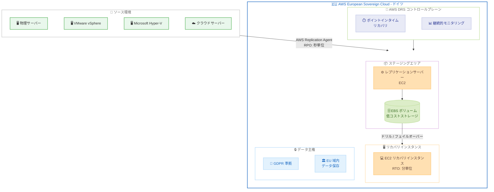

# AWS Elastic Disaster Recovery - AWS European Sovereign Cloud での提供開始

**リリース日**: 2026 年 4 月 16 日
**サービス**: AWS Elastic Disaster Recovery (AWS DRS)
**機能**: AWS European Sovereign Cloud でのディザスタリカバリ

📊 [このアップデートのインフォグラフィックを見る](https://takech9203.github.io/aws-news-summary/20260416-drs-thf.html)

## 概要

AWS Elastic Disaster Recovery (AWS DRS) が AWS European Sovereign Cloud で利用可能になった。データ主権要件を持つ組織が、AWS 上でミッションクリティカルなワークロードのディザスタリカバリを実現できるようになる。AWS European Sovereign Cloud はドイツに所在するリージョンであり、EU 域内でのデータ保存と処理を保証する独立したクラウドインフラストラクチャである。

AWS DRS は、手頃なストレージコスト、最小限のコンピューティングリソース、およびポイントインタイムリカバリを活用して、オンプレミスおよびクラウドベースのアプリケーションの高速かつ信頼性の高いリカバリを提供する。Recovery Point Objective (RPO) は秒単位、Recovery Time Objective (RTO) は通常分単位で測定され、物理インフラストラクチャ、VMware vSphere、Microsoft Hyper-V、およびクラウドインフラストラクチャからのリカバリに対応している。

このアップデートにより、欧州のデータ主権規制に準拠しながら、エンタープライズグレードのディザスタリカバリ機能を活用できるようになる。特に GDPR やその他の EU データ保護規制への準拠が求められる金融、医療、公共セクターの組織にとって重要なアップデートである。

**アップデート前の課題**

- データ主権要件を持つ欧州の組織が、AWS DRS を使用しながら EU 域内でデータを完全に保持することが困難であった
- AWS European Sovereign Cloud でディザスタリカバリサービスが提供されていなかったため、代替ソリューションの構築が必要であった
- GDPR やその他の EU データ保護規制に準拠したディザスタリカバリ環境を AWS 上で構成する際に、データの越境転送に関する懸念があった
- ミッションクリティカルなワークロードのデータ主権要件とディザスタリカバリ要件を同時に満たす選択肢が限られていた

**アップデート後の改善**

- AWS European Sovereign Cloud (ドイツ) で AWS DRS が利用可能になり、EU 域内でのデータ保存を保証しながらディザスタリカバリを構成可能に
- データ主権要件を満たしながら、秒単位の RPO と分単位の RTO を実現するエンタープライズグレードのディザスタリカバリが利用可能に
- 物理インフラストラクチャ、VMware vSphere、Microsoft Hyper-V、およびクラウドインフラストラクチャからの主権クラウドへのリカバリが可能に
- EU のデータ保護規制に準拠したディザスタリカバリの構成が簡素化された

## アーキテクチャ図



この図は、ソース環境から AWS European Sovereign Cloud へのディザスタリカバリフローを示している。AWS Replication Agent がソースサーバーからデータを継続的にレプリケーションし、EU 域内のデータ主権要件を満たしながら、秒単位の RPO と分単位の RTO でリカバリを実現する。

## サービスアップデートの詳細

### 主要機能

1. **AWS European Sovereign Cloud でのディザスタリカバリ**
   - ドイツに所在する AWS European Sovereign Cloud リージョンで AWS DRS が利用可能
   - EU 域内でのデータ保存と処理を保証する独立したクラウドインフラストラクチャ上でディザスタリカバリを構成可能
   - AWS のスタッフは EU 居住者のみがアクセスし、EU 域外へのデータ転送は行われない

2. **高速かつ信頼性の高いリカバリ**
   - RPO は秒単位で測定され、データ損失を最小限に抑制
   - RTO は通常分単位で、迅速なサービス復旧を実現
   - ポイントインタイムリカバリにより、任意の時点の状態にリカバリ可能

3. **多様なソース環境からのリカバリ**
   - 物理インフラストラクチャからのリカバリに対応
   - VMware vSphere 環境からのリカバリに対応
   - Microsoft Hyper-V 環境からのリカバリに対応
   - 他のクラウドインフラストラクチャからのリカバリに対応

4. **コスト効率の高いレプリケーション**
   - 低コストの EBS ストレージを使用した継続的なデータレプリケーション
   - レプリケーション中はフルスペックのリカバリインスタンスが不要で、最小限のコンピューティングリソースのみ使用
   - ドリルやフェイルオーバー実行時のみリカバリインスタンスが起動

## 技術仕様

### AWS DRS の仕様

| 項目 | 詳細 |
|------|------|
| RPO | 秒単位 (継続的なブロックレベルレプリケーション) |
| RTO | 通常分単位 |
| リカバリ方式 | ポイントインタイムリカバリ |
| レプリケーション | AWS Replication Agent によるブロックレベルレプリケーション |
| ソース OS | Windows Server、各種 Linux ディストリビューション |
| 対応ソース環境 | 物理サーバー、VMware vSphere、Microsoft Hyper-V、クラウドインフラストラクチャ |
| リカバリ先 | AWS European Sovereign Cloud (ドイツ) |

### AWS European Sovereign Cloud の特徴

| 項目 | 詳細 |
|------|------|
| 所在地 | ドイツ |
| データ保存 | EU 域内に限定 |
| 運用スタッフ | EU 居住者のみ |
| コンプライアンス | GDPR、EU データ保護規制に対応 |
| 独立性 | 標準 AWS リージョンから分離された独立インフラストラクチャ |

### API 変更履歴

直近 7 日間で AWS DRS に関連する API 変更は検出されなかった。本アップデートは既存の AWS DRS サービスの新リージョンへの展開であり、API の変更を伴わない可能性がある。

*注: 最新の API 変更は [AWS API Changes](https://awsapichanges.com/) で確認可能。

### IAM ポリシー

AWS DRS を AWS European Sovereign Cloud で使用するための IAM ポリシーの例を以下に示す。

```json
{
    "Version": "2012-10-17",
    "Statement": [
        {
            "Effect": "Allow",
            "Action": [
                "drs:*"
            ],
            "Resource": "*"
        },
        {
            "Effect": "Allow",
            "Action": [
                "ec2:DescribeInstances",
                "ec2:DescribeVolumes",
                "ec2:DescribeSecurityGroups",
                "ec2:DescribeSubnets",
                "ec2:CreateVolume",
                "ec2:CreateSecurityGroup",
                "ec2:RunInstances",
                "ec2:TerminateInstances"
            ],
            "Resource": "*"
        }
    ]
}
```

## 設定方法

### 前提条件

1. AWS European Sovereign Cloud のアカウントを保有していること
2. ソースサーバーにネットワーク接続 (HTTPS: ポート 443、レプリケーション: ポート 1500) が確保されていること
3. ソースサーバーに AWS Replication Agent をインストールするための管理者権限があること
4. リカバリ先となる VPC とサブネットが AWS European Sovereign Cloud に構成されていること

### 手順

#### ステップ 1: AWS DRS の初期設定

AWS European Sovereign Cloud のマネジメントコンソールで AWS DRS を有効化し、レプリケーション設定のデフォルトテンプレートを構成する。

1. AWS European Sovereign Cloud コンソールにログイン
2. AWS Elastic Disaster Recovery サービスに移動
3. 「Set up replication」を選択し、レプリケーションのデフォルトテンプレートを構成
4. ステージングエリアのサブネット、レプリケーションサーバーのインスタンスタイプ、EBS ボリュームタイプを指定

#### ステップ 2: ソースサーバーへの AWS Replication Agent のインストール

ソースサーバーに AWS Replication Agent をインストールし、AWS European Sovereign Cloud へのレプリケーションを開始する。

```bash
# Linux ソースサーバーの場合
wget -O ./aws-replication-installer-init https://aws-elastic-disaster-recovery-<region>.s3.<region>.amazonaws.com/latest/linux/aws-replication-installer-init
chmod +x aws-replication-installer-init
sudo ./aws-replication-installer-init --region <sovereign-cloud-region> --no-prompt
```

上記のコマンドは、AWS Replication Agent のインストーラーをダウンロードし、指定した AWS European Sovereign Cloud リージョンへのレプリケーションを自動的に開始する。

#### ステップ 3: リカバリ設定の構成

AWS DRS コンソールでリカバリインスタンスの起動設定を構成する。

1. AWS DRS コンソールで「Source servers」を選択
2. レプリケーションが開始されたソースサーバーを選択
3. 「Launch settings」タブで、リカバリインスタンスのインスタンスタイプ、サブネット、セキュリティグループを設定
4. 「EC2 launch template」でリカバリインスタンスの詳細設定を構成

#### ステップ 4: ディザスタリカバリドリルの実行

設定が完了したら、ディザスタリカバリドリルを実行してリカバリプロセスを検証する。

1. AWS DRS コンソールで対象のソースサーバーを選択
2. 「Initiate recovery job」から「Initiate drill」を選択
3. リカバリポイント (ポイントインタイム) を選択
4. ドリルが完了したら、リカバリインスタンスの動作を確認
5. 検証後、ドリルインスタンスを終了

## メリット

### ビジネス面

- **データ主権要件への準拠**: EU 域内でのデータ保存が保証されるため、GDPR やその他の欧州データ保護規制に準拠したディザスタリカバリが実現可能
- **ビジネス継続性の確保**: ミッションクリティカルなワークロードを秒単位の RPO と分単位の RTO で保護し、ダウンタイムとデータ損失を最小化
- **規制対応コストの削減**: 独自のデータ主権対応ディザスタリカバリ環境を構築する代わりに、マネージドサービスを活用してコンプライアンスコストを削減

### 技術面

- **継続的ブロックレベルレプリケーション**: エージェントベースの非同期レプリケーションにより、ソースサーバーのパフォーマンスへの影響を最小限に抑えながらリアルタイムに近いデータ保護を実現
- **多様なソース環境のサポート**: 物理サーバー、VMware vSphere、Microsoft Hyper-V、クラウドインフラストラクチャなど、異なる環境からの統一的なディザスタリカバリを提供
- **コスト最適化されたアーキテクチャ**: レプリケーション中は低コストストレージと最小限のコンピューティングのみを使用し、フェイルオーバー時のみフルスペックのリカバリインスタンスを起動

## デメリット・制約事項

### 制限事項

- AWS European Sovereign Cloud (ドイツ) のみで利用可能であり、他の主権クラウドリージョンへの展開は未定
- 標準 AWS リージョンと AWS European Sovereign Cloud 間での直接的なクロスリージョンレプリケーションはサポートされない
- AWS European Sovereign Cloud で利用可能な EC2 インスタンスタイプが標準リージョンと比較して限定的である可能性がある

### 考慮すべき点

- AWS European Sovereign Cloud のアカウントは標準 AWS アカウントとは別に取得する必要がある
- 既存の標準 AWS リージョンで構成された DRS 環境を AWS European Sovereign Cloud に直接移行することはできない
- レプリケーションのネットワーク帯域幅とレイテンシーを事前に評価し、ソース環境から AWS European Sovereign Cloud への接続品質を確認する必要がある
- AWS European Sovereign Cloud で利用可能なサービスは標準リージョンと比較して限定的であるため、リカバリ後のワークロード運用に必要なサービスが利用可能であることを確認する必要がある

## ユースケース

### ユースケース 1: 欧州金融機関のディザスタリカバリ

**シナリオ**: EU 域内に本拠地を置く金融機関が、GDPR および欧州銀行監督機構 (EBA) のガイドラインに準拠しながら、コアバンキングシステムのディザスタリカバリを構成する必要がある。

**実装例**:
```
ソース環境: オンプレミスデータセンター (フランクフルト)
  - コアバンキングアプリケーションサーバー (Linux)
  - データベースサーバー (Windows Server)
リカバリ先: AWS European Sovereign Cloud (ドイツ)
  - AWS DRS による継続的レプリケーション
  - RPO: 秒単位、RTO: 分単位
  - 四半期ごとのディザスタリカバリドリル実施
```

**効果**: データが EU 域内に完全に保持され、規制要件を満たしながら、コアバンキングシステムの迅速なリカバリが保証される。

### ユースケース 2: 公共セクターの重要インフラストラクチャ保護

**シナリオ**: EU 加盟国の政府機関が、市民サービスを提供する重要システムのディザスタリカバリを、データ主権要件に準拠した環境で構成する必要がある。

**実装例**:
```
ソース環境: 政府データセンター (VMware vSphere 環境)
  - 市民ポータルアプリケーション
  - 行政手続き処理システム
  - 個人情報データベース
リカバリ先: AWS European Sovereign Cloud (ドイツ)
  - VMware vSphere から直接レプリケーション
  - ポイントインタイムリカバリの有効化
  - 月次ドリルによるリカバリ検証
```

**効果**: 市民データが EU 域内の主権クラウドに保護され、障害発生時にも分単位でサービスが復旧し、市民サービスの継続性が確保される。

### ユースケース 3: ヘルスケア組織の患者データ保護

**シナリオ**: 欧州の医療機関が、患者データを含むヘルスケアシステムのディザスタリカバリを、GDPR および医療データ保護規制に準拠した形で構成する必要がある。

**実装例**:
```
ソース環境: 病院データセンター (Microsoft Hyper-V 環境)
  - 電子カルテシステム (EHR)
  - 医療画像管理システム (PACS)
  - 病院情報システム (HIS)
リカバリ先: AWS European Sovereign Cloud (ドイツ)
  - Hyper-V 環境から直接レプリケーション
  - 全サーバーの継続的レプリケーション
  - 週次ドリルによるリカバリプロセスの検証
```

**効果**: 患者データの主権が確保されながら、医療システムの迅速なリカバリが可能となり、医療サービスの中断を最小限に抑制できる。

## 料金

AWS DRS の料金は、レプリケーション対象のソースサーバー数に基づいて課金される。ドリルやリカバリの際に使用される EC2 インスタンスと EBS ボリュームの費用が別途発生する。

### 料金例

| 項目 | 月額料金 (概算) |
|------|----------------|
| ソースサーバーあたりのレプリケーション | $0.028/時間 (約 $20/月) |
| ステージング EBS ストレージ (gp3) | $0.08/GB/月 |
| リカバリインスタンス (ドリル / フェイルオーバー時のみ) | EC2 標準料金に準拠 |

*注: AWS European Sovereign Cloud での料金は標準リージョンと異なる場合がある。最新の料金情報は [AWS Elastic Disaster Recovery 料金ページ](https://aws.amazon.com/disaster-recovery/pricing/) を参照のこと。

## 利用可能リージョン

本アップデートは以下のリージョンで利用可能である。

- AWS European Sovereign Cloud (ドイツ)

AWS DRS は、上記の主権クラウドリージョンに加え、多数の標準 AWS リージョンでも利用可能である。完全なリージョンリストは [AWS リージョン別サービス一覧](https://aws.amazon.com/about-aws/global-infrastructure/regional-product-services/) を参照のこと。

## 関連サービス・機能

- **AWS European Sovereign Cloud**: EU のデータ主権要件に対応するために設計された独立したクラウドインフラストラクチャ。AWS DRS のリカバリ先として使用
- **Amazon EC2**: AWS DRS のレプリケーションサーバーおよびリカバリインスタンスの基盤となるコンピューティングサービス
- **Amazon EBS**: ソースサーバーのレプリケートデータを保存するストレージサービス。低コストのボリュームタイプでレプリケーションコストを最適化
- **AWS CloudTrail**: AWS DRS の API コールを記録し、ディザスタリカバリ操作の監査証跡を提供
- **AWS Network Firewall**: AWS European Sovereign Cloud で利用可能なネットワークセキュリティサービス。リカバリ環境のネットワーク保護に使用

## 参考リンク

- 📊 [インフォグラフィック](https://takech9203.github.io/aws-news-summary/20260416-drs-thf.html)
- [公式発表 (What's New)](https://aws.amazon.com/about-aws/whats-new/2026/04/drs-thf/)
- [AWS Elastic Disaster Recovery ドキュメント](https://docs.aws.amazon.com/drs/latest/userguide/what-is-drs.html)
- [AWS Elastic Disaster Recovery 料金ページ](https://aws.amazon.com/disaster-recovery/pricing/)
- [AWS European Sovereign Cloud](https://aws.amazon.com/sovereign-cloud/)

## まとめ

AWS Elastic Disaster Recovery が AWS European Sovereign Cloud (ドイツ) で利用可能になり、データ主権要件を持つ欧州の組織がミッションクリティカルなワークロードを秒単位の RPO と分単位の RTO で保護できるようになった。物理サーバー、VMware vSphere、Microsoft Hyper-V、クラウドインフラストラクチャからのリカバリに対応しており、多様なソース環境を持つ組織に適している。GDPR やその他の EU データ保護規制への準拠が求められる金融、医療、公共セクターの組織は、AWS DRS を活用したディザスタリカバリ計画の策定を推奨する。
