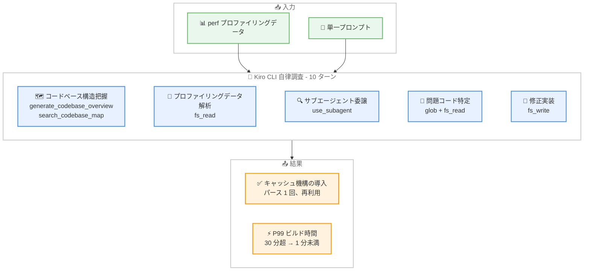

# Kiro CLI - 33 秒で根本原因を特定: ビルド時間 4 年分を削減した事例

**リリース日**: 2026 年 4 月 16 日
**サービス**: Kiro
**カテゴリ**: ケーススタディ / ユーザー事例

📊 [このアップデートのインフォグラフィックを見る](https://takech9203.github.io/aws-news-summary/20260416-kiro-root-cause-in-33s.html)

## 概要

Kiro CLI を使用してレガシーコードベースのパフォーマンスボトルネックをわずか 33 秒で調査・特定・修正し、月間約 4 年分のコンピュート時間を削減した事例が公開されました。この記事は Cameron Conradt 氏と Sameer Bansal 氏によるブログ投稿で、Kiro CLI のエージェント型デバッグ能力を実際の大規模問題に適用した実践的なケーススタディです。

対象となったのは、381 個の内部設定ビルドパッケージで、月間 55 万回ビルドされていました。P99 ビルド時間が 25 分を超え、時には 30 分以上に達していた状況を、Kiro CLI が自律的に調査し、ビルド時間を 1 分未満に短縮する修正を実装しました。

**アップデート前の課題**

- P99 ビルド時間が 25-30 分以上に達し、開発者の生産性を大幅に低下させていた
- レガシーコードベースでのパフォーマンスプロファイリングデータの手動解析に数日を要していた
- 設定パーサーが各関数呼び出しごとに再初期化され、同じ設定ファイルを毎回ディスクから読み直していた

**アップデート後の改善**

- Kiro CLI が 33 秒で根本原因を特定し、修正コードの 80-90% を自律的に実装
- P99 ビルド時間が 30 分超から 1 分未満に短縮
- 月間約 4 年分のコンピュート時間を削減

## アーキテクチャ図



Kiro CLI がプロファイリングデータと単一プロンプトを入力として受け取り、10 ターンの自律調査を経て修正を実装するまでの全体フローを示しています。

## 事例の詳細

### 問題の背景

チームが管理する内部設定ビルドパッケージ群で、P99 ビルド時間が 25 分を超え、場合によっては 30 分以上に達していました。381 パッケージが月間 55 万回ビルドされる環境では、この遅延は個人の不便さを超え、インフラコストの問題となっていました。

従来のアプローチ (プロファイリングデータの手動読解、不慣れなコードベースとの照合、仮説の構築、修正の実装) では数日を要する見込みでした。

### Kiro CLI を選択した理由

この問題は単純なコード生成タスクではなく、複雑で自由度の高い調査でした。複数ファイルにまたがる推論、プロファイリング出力の解釈、ランタイム動作とソースコードの関連付けが必要でした。コード生成に特化したツールではなく、汎用エージェントとしての Kiro CLI が適していました。

### 主要機能

1. **コードインテリジェンスツール**
   - `generate_codebase_overview` でリポジトリ構造の高レベルマップを構築
   - `search_codebase_map` で主要なディレクトリとパッケージを特定
   - 不慣れなコードベースを迅速に理解するための偵察機能

2. **ファイルシステムツール**
   - `fs_read` でプロファイリングデータの読み取りとソースコード検査
   - `fs_write` で修正コードの実装
   - `glob` でビルドツールパッケージ内の全ファイル検索

3. **サブエージェント委譲**
   - `use_subagent` で専門的なコード分析タスクを分離して実行
   - メインコンテキストを汚染せずに集中的な分析を実行
   - 並列処理によるコードベース分析の効率化

## 技術仕様

### 調査プロセスの詳細

| ステップ | ツール | 実行内容 |
|----------|--------|----------|
| 1-2 | `generate_codebase_overview`, `search_codebase_map` | コードベース構造の把握 |
| 3 | `fs_read` (Directory モード) | ターゲットディレクトリの内容確認 |
| 4 | `fs_read` (Line モード) | プロファイリングレポートの読解 |
| 5-6 | `use_subagent` | コード分析サブエージェントへの委譲 |
| 7-9 | `glob`, `fs_read` | 問題コードの特定 |
| 10 | `fs_write` (`str_replace`) | キャッシュ機構の実装 |

### 根本原因

プロファイリングデータは明確な問題を示していました。

```
95.21%  ld-linux-aarch6  libc-2.26.so   __libc_start_main
  |
  |--86.19%--main
  |           |
  |            --85.71%--perl_run
  |                       |
  |                        --85.68%--Perl_runops_standard
  |                                   |
  |                                   |--79.45%--Perl_pp_entersub
  |                                   |           |
  |                                   |            --79.41%--ConfigParser_ParseFile
```

CPU 時間の 79.41% が設定パーサーのコア関数に費やされていました。設定パーサーが各関数呼び出しごとに再初期化され、同じ設定ファイルを毎回ディスクから再解析していたことが原因でした。

### 実装された修正

Kiro CLI が実装した修正は以下の 3 点です。

- パーサーインスタンスを格納するキャッシュハッシュの追加
- 新しいインスタンス生成前にキャッシュを確認するヘルパー関数の作成
- 既存の全関数をキャッシュ経由のパーサー利用にリファクタリング

## メリット

### ビジネス面

- **大幅な時間削減**: 月間約 4 年分のコンピュート時間を削減し、インフラコストを大幅に低減
- **開発者生産性の向上**: ビルド待ち時間が 30 分超から 1 分未満になり、開発サイクルが劇的に改善
- **スケール効果**: 381 パッケージ x 月間 55 万回ビルドという大規模環境で効果が顕著

### 技術面

- **調査時間の短縮**: 数日かかる手動調査が 33 秒に短縮
- **自律的な問題解決**: 単一プロンプトから修正実装まで人間の介入なしで完了
- **高い実装精度**: 修正コードの 80-90% を Kiro CLI が直接実装

## デメリット・制約事項

### 制限事項

- Kiro CLI の出力は人間によるレビューと検証が依然として必要
- プロファイリングデータの事前準備 (perf データの構造化フォーマットへの変換) が成果に大きく影響する
- 複雑な最適化問題すべてにこの手法が適用できるわけではない

### 考慮すべき点

- AI エージェントが提案する修正は、正確性と安全性について必ずエンジニアの判断を経てデプロイすべき
- 入力データの品質が調査結果の品質に直結するため、プロファイリングデータの適切な準備が重要
- 汎用エージェントは調査型タスクに適しているが、単純なコード生成にはコード生成特化ツールの方が効率的な場合もある

## ユースケース

### ユースケース 1: レガシーシステムのパフォーマンスボトルネック調査

**シナリオ**: 大規模なレガシーコードベースでビルド時間やランタイムパフォーマンスが劣化しており、手動での原因特定が困難

**実装例**:
```bash
# perf でプロファイリングデータを取得
perf record -g ./build_tool --config ./config.cfg
perf report --stdio > perf_report.txt

# Kiro CLI で分析を依頼
kiro "Analyze the perf data in this directory and give recommendations on optimizations."
```

**効果**: 不慣れなコードベースでも Kiro CLI が自律的にコード構造を把握し、プロファイリングデータとソースコードを照合して根本原因を特定

### ユースケース 2: CI/CD パイプラインの最適化

**シナリオ**: CI/CD パイプラインの実行時間が長期化し、多数のプロジェクトに影響

**実装例**:
```bash
# パイプライン実行時間のプロファイルを収集
kiro "Analyze the CI pipeline logs and identify the slowest stages. Suggest optimizations for the build configuration."
```

**効果**: パイプライン全体のボトルネックを特定し、設定レベルの最適化を提案・実装

### ユースケース 3: 大規模モノレポでの横断的な非効率検出

**シナリオ**: モノレポ内の複数パッケージで類似のパフォーマンス問題が存在する可能性

**実装例**:
```bash
# サブエージェントを活用した横断分析
kiro "Search across all packages in this monorepo for similar parser re-initialization patterns and suggest caching improvements."
```

**効果**: サブエージェント委譲により、メインコンテキストを汚染せずに複数パッケージの並列分析を実行

## 得られた教訓

ブログ記事で共有された主要な教訓は以下の通りです。

1. **調査タスクには汎用エージェントを使用する**: 「なぜ遅いのか?」のような自由度の高い問題には、ファイル、ツール、データ形式を横断して推論できる汎用エージェントが適している
2. **エージェントを信頼しつつ出力を検証する**: Kiro CLI は修正の大部分を自律的に実装したが、デプロイ前にビルドと結果の検証を行うことが重要
3. **ROI はスケールで増大する**: 個々のビルドの遅延は個人的な不便だが、月間数十万回のビルドに掛け算すると、インフラコスト問題になる

## 料金

Kiro の料金については [Kiro 料金ページ](https://kiro.dev/pricing/) を参照してください。

## 利用可能リージョン

グローバル

## 関連サービス・機能

- **Kiro CLI ヘッドレスモード**: プログラム的に Kiro CLI を実行するモード。CI/CD パイプラインへの統合に適している
- **Kiro サブエージェント**: 専門的なタスクを委譲できるサブエージェント機能。コンテキスト管理の効率化に貢献
- **Kiro Powers**: MCP サーバーとルールを組み合わせた拡張機能。外部ツールとの統合を可能にする

## 参考リンク

- 📊 [インフォグラフィック](https://takech9203.github.io/aws-news-summary/20260416-kiro-root-cause-in-33s.html)
- [公式ブログ: Root cause in 33 seconds](https://kiro.dev/blog/root-cause-in-33s/)
- [Kiro CLI ドキュメント](https://kiro.dev/cli/)
- [Kiro ドキュメント](https://kiro.dev/docs/)
- [Kiro 料金ページ](https://kiro.dev/pricing/)

## まとめ

この事例は、Kiro CLI のエージェント型デバッグ能力が実際の大規模パフォーマンス問題に対してどれほど効果的かを示す強力な実証です。33 秒での根本原因特定と修正実装、そして月間 4 年分のコンピュート時間削減という成果は、AI 支援開発ツールがもたらすスケーラブルな効率化の可能性を示しています。レガシーコードベースのパフォーマンス問題や、不慣れなコードベースでの調査タスクがある場合は、Kiro CLI のエージェント型アプローチの活用を検討してください。
