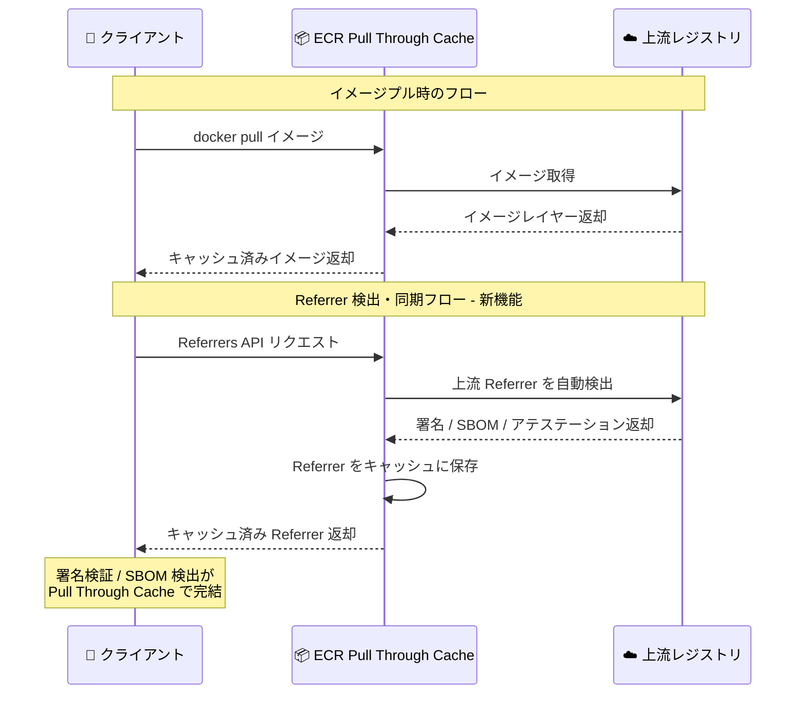

# Amazon ECR - Pull Through Cache における Referrer 自動検出・同期サポート

**リリース日**: 2026 年 4 月 17 日
**サービス**: Amazon Elastic Container Registry (ECR)
**機能**: Pull Through Cache の OCI Referrer Discovery and Sync

📊 [このアップデートのインフォグラフィックを見る](https://takech9203.github.io/aws-news-summary/20260417-amazon-ecr-pull-through-cache-referrers.html)

## 概要

Amazon Elastic Container Registry (Amazon ECR) の Pull Through Cache 機能が、OCI Referrer (参照アーティファクト) の自動検出と同期をサポートした。OCI Referrer とは、イメージ署名、SBOM (Software Bill of Materials)、アテステーション (attestation) など、コンテナイメージに関連付けられたメタデータアーティファクトのことである。今回のアップデートにより、Pull Through Cache リポジトリに対して Referrers API をリクエストすると、ECR が自動的に上流レジストリから関連する Referrer アーティファクトを取得してプライベートリポジトリにキャッシュするようになった。

これまで Pull Through Cache を使用している場合、上流レジストリに存在する Referrer (署名や SBOM など) は自動的に同期されず、手動で個別にリストおよびフェッチする必要があった。この制約により、イメージ署名の検証や SBOM の検出といったサプライチェーンセキュリティのワークフローを Pull Through Cache 経由で完結させることが困難だった。今回のアップデートにより、クライアント側の回避策を必要とせず、エンドツーエンドのイメージ署名検証、SBOM ディスカバリー、アテステーション取得のワークフローが Pull Through Cache リポジトリ上でシームレスに動作するようになった。

この機能は、Amazon ECR Pull Through Cache がサポートされているすべての AWS リージョンで利用可能である。

**アップデート前の課題**

- Pull Through Cache リポジトリに対して Referrers API をリクエストしても、上流レジストリの Referrer が返されなかった
- イメージ署名 (cosign 署名など) を Pull Through Cache 経由で検証するには、手動で上流から署名アーティファクトを取得する必要があった
- SBOM やアテステーションの検出を Pull Through Cache リポジトリ上で行うことができず、クライアント側で上流レジストリに直接アクセスする回避策が必要だった
- サプライチェーンセキュリティのワークフローを Pull Through Cache と統合することが複雑で、運用負荷が高かった

**アップデート後の改善**

- Pull Through Cache リポジトリに対する Referrers API リクエスト時に、ECR が自動的に上流レジストリから Referrer アーティファクトを検出・同期するようになった
- イメージ署名検証がクライアント側の回避策なしで Pull Through Cache 経由で動作するようになった
- SBOM ディスカバリーとアテステーション取得が Pull Through Cache リポジトリ上でシームレスに利用可能になった
- サプライチェーンセキュリティのツールチェーンを Pull Through Cache リポジトリに対して直接使用できるようになった

## アーキテクチャ図



この図は、Pull Through Cache リポジトリに対する Referrers API リクエスト時に、ECR が自動的に上流レジストリから Referrer アーティファクトを検出・同期し、クライアントに返却するフローを示している。

## サービスアップデートの詳細

### 主要機能

1. **OCI Referrer の自動検出**
   - Pull Through Cache リポジトリに対して Referrers API が呼び出された際、ECR が自動的に上流レジストリの Referrer を検出
   - OCI Distribution Spec に準拠した Referrers API をサポート

2. **Referrer アーティファクトの自動同期**
   - 検出された Referrer アーティファクト (署名、SBOM、アテステーション) をプライベートリポジトリに自動的にキャッシュ
   - 以降のリクエストではキャッシュされたアーティファクトを返却

3. **エンドツーエンドの署名検証サポート**
   - cosign などの署名検証ツールが Pull Through Cache リポジトリに対して直接動作
   - クライアント側での上流レジストリへの追加アクセスが不要

4. **SBOM ディスカバリーとアテステーション取得**
   - SBOM (Software Bill of Materials) の自動検出と取得
   - in-toto アテステーションなどの証明書アーティファクトの自動同期

## 技術仕様

### OCI Referrer の種類

| Referrer タイプ | 説明 | 代表的なツール |
|----------------|------|---------------|
| イメージ署名 | コンテナイメージの暗号署名 | cosign, Notation |
| SBOM | ソフトウェア部品表 | syft, trivy |
| アテステーション | ビルドや脆弱性スキャンの証明 | in-toto, SLSA |
| 脆弱性レポート | セキュリティスキャン結果 | trivy, grype |

### OCI Referrers API

| 項目 | 詳細 |
|------|------|
| API パス | `GET /v2/{name}/referrers/{digest}` |
| 仕様準拠 | OCI Distribution Specification v1.1 |
| フィルタリング | `artifactType` パラメータによるタイプフィルタリング |
| レスポンス形式 | OCI Image Index (application/vnd.oci.image.index.v1+json) |

### API 変更履歴

直近 14 日間で Amazon ECR に関連する API 変更は確認されなかった。

## 設定方法

### 前提条件

1. Amazon ECR プライベートレジストリが作成されていること
2. Pull Through Cache ルールが設定されていること (対象の上流レジストリに対して)
3. 適切な IAM 権限が付与されていること

### 手順

#### ステップ 1: Pull Through Cache ルールの確認

既存の Pull Through Cache ルールが設定されていることを確認する。

```bash
aws ecr describe-pull-through-cache-rules \
  --region us-east-1
```

このコマンドは、レジストリに設定されている Pull Through Cache ルールの一覧を表示する。上流レジストリ (Docker Hub、ECR Public、GitHub Container Registry など) に対するルールが存在することを確認する。

#### ステップ 2: Pull Through Cache 経由でイメージをプル

Pull Through Cache ルールに従ったリポジトリ URI を使用してイメージをプルする。

```bash
# 例: Docker Hub のイメージを Pull Through Cache 経由でプル
docker pull <account-id>.dkr.ecr.us-east-1.amazonaws.com/docker-hub/library/nginx:latest
```

このコマンドは、Pull Through Cache ルールに基づいて上流レジストリからイメージを取得し、ECR プライベートリポジトリにキャッシュする。

#### ステップ 3: Referrer の検出と検証

Pull Through Cache リポジトリに対して署名検証や SBOM 取得を実行する。Referrer は自動的に上流から同期される。

```bash
# cosign で Pull Through Cache リポジトリのイメージ署名を検証
cosign verify \
  <account-id>.dkr.ecr.us-east-1.amazonaws.com/docker-hub/library/nginx:latest \
  --certificate-identity=<identity> \
  --certificate-oidc-issuer=<issuer>

# ORAS CLI で Referrer を一覧表示
oras discover \
  <account-id>.dkr.ecr.us-east-1.amazonaws.com/docker-hub/library/nginx:latest
```

cosign コマンドはイメージ署名を検証し、oras discover コマンドはイメージに関連付けられた Referrer アーティファクトの一覧を表示する。いずれも Pull Through Cache が自動的に上流から Referrer を取得する。

## メリット

### ビジネス面

- **サプライチェーンセキュリティの強化**: イメージ署名検証と SBOM 検出が Pull Through Cache 経由で完結し、セキュリティコンプライアンスの維持が容易になる
- **運用コストの削減**: 手動での Referrer 取得作業が不要になり、セキュリティワークフローの自動化が実現する
- **コンプライアンス対応の簡素化**: SBOM やアテステーションの自動収集により、ソフトウェアサプライチェーンの透明性要件への対応が容易になる

### 技術面

- **シームレスな統合**: cosign、ORAS、Notation などの既存ツールが Pull Through Cache リポジトリに対して追加設定なしで動作する
- **キャッシュによるパフォーマンス向上**: 一度取得された Referrer はローカルにキャッシュされ、以降のリクエストで上流への通信が不要になる
- **クライアント側の複雑性の排除**: 上流レジストリへの直接アクセスや回避策のスクリプトが不要になり、アーキテクチャがシンプルになる

## デメリット・制約事項

### 制限事項

- Pull Through Cache ルールが事前に設定されている必要がある
- 上流レジストリが OCI Referrers API をサポートしている必要がある (OCI Distribution Spec v1.1 準拠)
- Referrer の同期はオンデマンド (Referrers API リクエスト時) であり、プロアクティブな事前同期ではない

### 考慮すべき点

- Referrer アーティファクトもストレージを消費するため、ECR のストレージ料金に影響する
- 初回の Referrer 取得時は上流レジストリへのアクセスが発生するため、レイテンシが増加する可能性がある
- Pull Through Cache のアップストリーム認証情報 (Secrets Manager に保存) が正しく設定されている必要がある

## ユースケース

### ユースケース 1: CI/CD パイプラインでのイメージ署名検証

**シナリオ**: 本番環境へのデプロイ前に、Pull Through Cache 経由で取得したコンテナイメージの署名を自動検証する。これまでは上流レジストリに直接アクセスして署名を確認する必要があったが、Pull Through Cache リポジトリに対して cosign verify を実行するだけで完結する。

**実装例**:
```bash
# CI/CD パイプラインでの署名検証ステップ
IMAGE="<account-id>.dkr.ecr.us-east-1.amazonaws.com/docker-hub/library/nginx:latest"

# Pull Through Cache から署名を自動取得して検証
cosign verify $IMAGE \
  --certificate-identity="https://github.com/myorg/myrepo/.github/workflows/release.yml@refs/heads/main" \
  --certificate-oidc-issuer="https://token.actions.githubusercontent.com"
```

**効果**: デプロイパイプラインの署名検証ステップが簡素化され、上流レジストリへの直接アクセスが不要になる。ネットワークポリシーで外部レジストリへのアクセスを制限している環境でも署名検証が可能になる。

### ユースケース 2: SBOM ベースの脆弱性管理

**シナリオ**: セキュリティチームが、Pull Through Cache 経由で使用しているサードパーティコンテナイメージの SBOM を自動的に収集し、脆弱性管理プラットフォームに連携する。

**実装例**:
```bash
# Pull Through Cache リポジトリから SBOM を取得
IMAGE="<account-id>.dkr.ecr.us-east-1.amazonaws.com/docker-hub/library/python:3.12"

# ORAS で SBOM Referrer を検出
oras discover $IMAGE --artifact-type "application/spdx+json"

# SBOM をダウンロードして脆弱性スキャンツールに入力
oras pull $IMAGE --include-subject --artifact-type "application/spdx+json" -o /tmp/sbom/
```

**効果**: サードパーティイメージの SBOM 収集が自動化され、ソフトウェアサプライチェーンの可視性が向上する。米国大統領令 14028 などの SBOM 要件への対応が容易になる。

### ユースケース 3: SLSA アテステーションによるビルド来歴の検証

**シナリオ**: プラットフォームチームが、Pull Through Cache で取得したベースイメージの SLSA (Supply chain Levels for Software Artifacts) アテステーションを検証し、信頼できるビルドプロセスで生成されたことを確認する。

**実装例**:
```bash
# Pull Through Cache リポジトリのアテステーションを検証
IMAGE="<account-id>.dkr.ecr.us-east-1.amazonaws.com/ghcr/myorg/base-image:v1"

# cosign でアテステーションを検証
cosign verify-attestation $IMAGE \
  --type slsaprovenance \
  --certificate-identity="https://github.com/myorg/base-image/.github/workflows/build.yml@refs/heads/main" \
  --certificate-oidc-issuer="https://token.actions.githubusercontent.com"
```

**効果**: ベースイメージのビルド来歴を自動検証でき、サプライチェーン攻撃のリスクを軽減する。Pull Through Cache を使用しながら SLSA レベルの要件を満たすことが可能になる。

## 料金

Pull Through Cache の Referrer 同期機能自体に追加料金は発生しない。ただし、以下の標準的な ECR 料金が適用される。

| 項目 | 料金 |
|------|------|
| ストレージ | $0.10/GB/月 |
| データ転送 (インターネットへ) | $0.09/GB (最初の 10TB まで) |
| プライベートリポジトリへのプッシュ | 無料 |
| プライベートリポジトリからのプル | 無料 (同一リージョン内) |

Referrer アーティファクト (署名、SBOM、アテステーション) もストレージを消費するため、キャッシュされるアーティファクトの量に応じてストレージ料金が発生する。一般的に、署名や SBOM のサイズは数 KB から数 MB 程度であり、イメージレイヤーと比較して影響は小さい。

## 利用可能リージョン

Amazon ECR Pull Through Cache がサポートされているすべての AWS リージョンで利用可能。主要なリージョンは以下の通り。

- 米国東部 (バージニア北部、オハイオ)
- 米国西部 (北カリフォルニア、オレゴン)
- 欧州 (フランクフルト、アイルランド、ロンドン、パリ、ストックホルム、ミラノ、スペイン、チューリッヒ)
- アジアパシフィック (東京、大阪、ソウル、シンガポール、シドニー、ムンバイ、ハイデラバード、ジャカルタ、メルボルン)
- カナダ (中部、西部)
- 南米 (サンパウロ)
- 中東 (バーレーン、UAE)
- アフリカ (ケープタウン)
- AWS GovCloud (US)

## 関連サービス・機能

- **Amazon ECR Pull Through Cache**: 上流レジストリのイメージを自動的にキャッシュする機能。今回のアップデートはこの機能の拡張
- **AWS Secrets Manager**: Pull Through Cache の上流レジストリ認証情報を安全に保管するために使用
- **Amazon Inspector**: ECR リポジトリ内のコンテナイメージの脆弱性スキャンを提供。SBOM の自動同期と組み合わせることで、より包括的なセキュリティ評価が可能
- **Amazon ECS / Amazon EKS**: Pull Through Cache リポジトリからコンテナイメージをプルしてワークロードを実行。署名検証済みのイメージのみをデプロイするポリシーと統合可能
- **AWS Signer**: コンテナイメージの署名サービス。Notation を使用した署名と検証のワークフローで活用

## 参考リンク

- 📊 [インフォグラフィック](https://takech9203.github.io/aws-news-summary/20260417-amazon-ecr-pull-through-cache-referrers.html)
- [公式発表 (What's New)](https://aws.amazon.com/about-aws/whats-new/2026/04/amazon-ecr-pull-through-cache-referrers/)
- [Amazon ECR Pull Through Cache ドキュメント](https://docs.aws.amazon.com/AmazonECR/latest/userguide/pull-through-cache.html)
- [Amazon ECR ユーザーガイド](https://docs.aws.amazon.com/AmazonECR/latest/userguide/)
- [Amazon ECR 料金ページ](https://aws.amazon.com/ecr/pricing/)

## まとめ

Amazon ECR Pull Through Cache における OCI Referrer の自動検出・同期サポートは、コンテナサプライチェーンセキュリティの運用を大幅に簡素化するアップデートである。イメージ署名検証、SBOM ディスカバリー、アテステーション取得のワークフローが Pull Through Cache リポジトリ上で完結するようになり、クライアント側の回避策が不要になった。Pull Through Cache を使用してサードパーティコンテナイメージを管理しているお客様は、既存のセキュリティツールチェーン (cosign、ORAS、Notation など) を Pull Through Cache リポジトリに対して直接活用し、サプライチェーンセキュリティの強化を推奨する。
