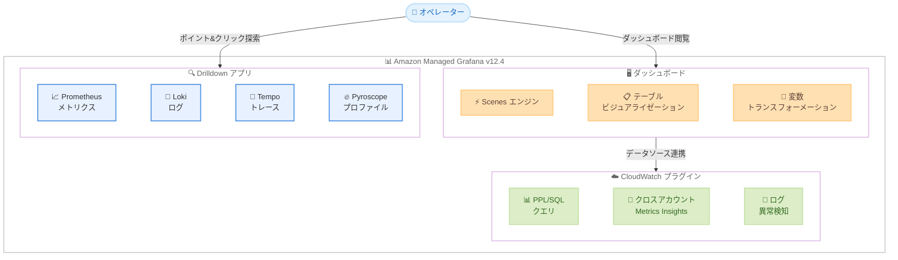

# Amazon Managed Grafana - Grafana 12.4 ワークスペース作成サポート

**リリース日**: 2026 年 4 月 17 日
**サービス**: Amazon Managed Grafana
**機能**: Grafana バージョン 12.4 ワークスペースの新規作成

📊 [このアップデートのインフォグラフィックを見る](https://takech9203.github.io/aws-news-summary/20260417-amazon-managed-grafana-v12-create.html)

## 概要

Amazon Managed Grafana が Grafana バージョン 12.4 でのワークスペース新規作成をサポートした。このリリースにはオープンソース Grafana 11.0 から 12.4 までの機能が含まれており、Drilldown アプリ、Scenes ベースのダッシュボード、トランスフォーメーションにおける変数サポート、ビジュアライゼーションの強化、新しい CloudWatch プラグイン機能など、多数のメジャーアップデートが含まれる。

今回のアップデートは Amazon Managed Grafana における大規模なバージョンアップであり、オブザーバビリティとダッシュボードの表現力・パフォーマンスが大幅に向上した。特に Drilldown アプリによるクエリ不要のメトリクス探索や、Scenes エンジンによるダッシュボードレンダリングの高速化は、運用チームの日常的なトラブルシューティングの効率を大きく改善する。

**アップデート前の課題**

- 以前のバージョンではダッシュボード探索にクエリの知識が必要だった
- ダッシュボードのレンダリングパフォーマンスに制約があった
- CloudWatch Logs のクエリ言語が LL に限定されていた
- テーブルビジュアライゼーションのカスタマイズ性が限定的だった

**アップデート後の改善**

- Drilldown アプリによりクエリ不要でポイント&クリックのメトリクス探索が可能になった
- Scenes ベースのレンダリングエンジンによりダッシュボードパフォーマンスが向上した
- CloudWatch Logs で PPL および SQL クエリが利用可能になった
- 再構築されたテーブルビジュアライゼーションで CSS セルスタイリングやインタラクティブな Actions ボタンが利用可能になった

## アーキテクチャ図



Grafana 12.4 の主要コンポーネント構成を示す。Drilldown アプリ、Scenes エンジン搭載ダッシュボード、強化された CloudWatch プラグインが連携して、高度なオブザーバビリティ機能を提供する。

## サービスアップデートの詳細

### 主要機能

1. **Queryless Drilldown アプリ**
   - Prometheus メトリクス、Loki ログ、Tempo トレース、Pyroscope プロファイルに対してポイント&クリックで探索が可能
   - クエリ言語の知識がなくてもデータの深堀りが可能
   - ダッシュボードからドリルダウンしてインシデントの根本原因を迅速に特定

2. **Scenes ベースダッシュボード**
   - 新しい Scenes レンダリングエンジンによるダッシュボードパフォーマンスの向上
   - より効率的なコンポーネントレンダリングにより、大規模ダッシュボードの表示速度が改善
   - ダッシュボードの操作性と応答性が向上

3. **トランスフォーメーションにおける変数サポート**
   - トランスフォーメーション設定でダッシュボード変数を使用可能
   - 動的なデータ加工パイプラインの構築が可能になった
   - 柔軟なデータフィルタリングと集計が実現

4. **CloudWatch プラグインの強化**
   - CloudWatch Logs で PPL (Piped Processing Language) および SQL クエリをサポート
   - クロスアカウント Metrics Insights によるマルチアカウント環境のメトリクス統合
   - ログ異常検知機能によるプロアクティブな問題検知

5. **テーブルビジュアライゼーションの刷新**
   - 再構築されたテーブルビジュアライゼーションによるパフォーマンス向上
   - CSS セルスタイリングによる柔軟な見た目のカスタマイズ
   - インタラクティブな Actions ボタンによるテーブル内からのアクション実行

## 技術仕様

### バージョン比較

| 項目 | 以前のバージョン | Grafana 12.4 |
|------|-----------------|--------------|
| レンダリングエンジン | レガシーエンジン | Scenes エンジン |
| メトリクス探索 | クエリベース | Drilldown アプリ |
| CloudWatch Logs クエリ | 基本クエリ | PPL/SQL サポート |
| テーブル表示 | 従来のテーブル | CSS スタイリング対応テーブル |
| クロスアカウントメトリクス | 限定的 | Metrics Insights 統合 |
| トランスフォーメーション | 静的設定 | 変数サポート |

### Drilldown アプリ対応データソース

| データソース | 対応するデータタイプ |
|-------------|-------------------|
| Prometheus | メトリクス |
| Loki | ログ |
| Tempo | 分散トレース |
| Pyroscope | 継続的プロファイリング |

### API 変更履歴

直近 30 日間で Amazon Managed Grafana に関連する API 変更は確認されなかった。

## 設定方法

### 前提条件

1. AWS アカウントを持っていること
2. Amazon Managed Grafana の利用権限があること
3. 適切な IAM ロールが設定されていること

### 手順

#### ステップ 1: Grafana 12.4 ワークスペースの作成

Amazon Managed Grafana コンソールにアクセスし、ワークスペースの作成画面で Grafana バージョン 12.4 を選択する。

```bash
# AWS CLI でワークスペースを作成する場合
aws grafana create-workspace \
  --workspace-name "my-grafana-workspace" \
  --account-access-type CURRENT_ACCOUNT \
  --authentication-providers AWS_SSO \
  --permission-type SERVICE_MANAGED \
  --grafana-version "12.4"
```

上記コマンドは Grafana 12.4 バージョンを指定して新しいワークスペースを作成する。`--grafana-version` パラメータで明示的にバージョンを指定する。

#### ステップ 2: データソースの設定

ワークスペース作成後、Grafana UI にアクセスしてデータソースを設定する。CloudWatch、Prometheus、Loki 等のデータソースを追加する。

#### ステップ 3: Drilldown アプリの有効化

Grafana UI の左メニューから Drilldown アプリにアクセスし、対象のデータソースに対してポイント&クリックの探索を開始する。

## メリット

### ビジネス面

- **運用効率の向上**: Drilldown アプリによりクエリスキルがなくてもメトリクス探索が可能になり、より多くのチームメンバーがトラブルシューティングに参加可能
- **MTTR の短縮**: ポイント&クリックでの根本原因分析により、インシデント対応時間を短縮
- **マルチアカウント管理の簡素化**: クロスアカウント Metrics Insights により、複数アカウントのメトリクスを一元的に可視化

### 技術面

- **ダッシュボードパフォーマンスの向上**: Scenes エンジンによる効率的なレンダリングで大規模ダッシュボードの応答速度が改善
- **クエリ言語の拡張**: CloudWatch Logs で PPL/SQL が利用可能になり、より柔軟なログ分析が実現
- **プロアクティブな異常検知**: ログ異常検知機能により、問題の早期発見が可能

## デメリット・制約事項

### 制限事項

- 新規ワークスペース作成のみ対応 (既存ワークスペースのバージョンアップは別途対応が必要)
- Drilldown アプリは Prometheus、Loki、Tempo、Pyroscope データソースに限定
- Scenes エンジンへの移行により、一部のレガシーダッシュボードで互換性の確認が必要な場合がある

### 考慮すべき点

- バージョン 11.x から 12.4 への移行時にはダッシュボードの動作検証を推奨
- 新しいクエリ言語 (PPL/SQL) の学習コストが発生する可能性がある
- プラグインの互換性確認が必要な場合がある

## ユースケース

### ユースケース 1: SRE チームのインシデント対応

**シナリオ**: SRE チームがサービス障害発生時に Drilldown アプリを使用して、Prometheus メトリクスから Loki ログ、Tempo トレースへとシームレスにドリルダウンし、根本原因を特定する。

**効果**: クエリを書く必要がなくなり、インシデント対応の MTTR を大幅に短縮できる。経験の浅いエンジニアもトラブルシューティングに参加しやすくなる。

### ユースケース 2: マルチアカウント環境のモニタリング

**シナリオ**: AWS Organizations で複数アカウントを運用する企業が、CloudWatch クロスアカウント Metrics Insights を使用して全アカウントのメトリクスを統合ダッシュボードで可視化する。

**効果**: アカウント間をまたいだメトリクスの比較や相関分析が容易になり、組織全体のリソース利用状況を一元管理できる。

### ユースケース 3: CloudWatch Logs の高度な分析

**シナリオ**: 開発チームが CloudWatch Logs に対して PPL および SQL クエリを使用し、アプリケーションログの集計やパターン分析を行う。ログ異常検知機能で通常と異なるログパターンを自動検出する。

**効果**: SQL に慣れているエンジニアが馴染みのある構文でログ分析を行えるようになり、異常検知によるプロアクティブな問題対応が可能になる。

## 料金

Amazon Managed Grafana の料金体系に変更はない。Grafana 12.4 ワークスペースも既存の料金体系が適用される。

| 項目 | 料金 |
|------|------|
| アクティブエディター/管理者 | $9/ユーザー/月 |
| アクティブビューアー | $5/ユーザー/月 |

追加で使用するデータソース (CloudWatch、Prometheus 等) の料金は別途発生する。

## 利用可能リージョン

Amazon Managed Grafana が一般提供されているすべてのリージョンで Grafana 12.4 ワークスペースの作成が可能。主要なリージョンは以下の通り。

- 米国東部 (バージニア北部、オハイオ)
- 米国西部 (オレゴン)
- 欧州 (フランクフルト、アイルランド、ロンドン、パリ、ストックホルム)
- アジアパシフィック (シンガポール、シドニー、東京、ソウル、ムンバイ)

## 関連サービス・機能

- **Amazon CloudWatch**: Grafana と連携する主要なモニタリングサービス。PPL/SQL クエリとクロスアカウント Metrics Insights の強化が含まれる
- **Amazon Managed Service for Prometheus**: Drilldown アプリで直接メトリクスを探索可能なデータソース
- **AWS X-Ray / Tempo**: 分散トレースの可視化と Drilldown アプリとの連携
- **AWS IAM Identity Center**: Grafana ワークスペースの認証に使用

## 参考リンク

- 📊 [インフォグラフィック](https://takech9203.github.io/aws-news-summary/20260417-amazon-managed-grafana-v12-create.html)
- [公式発表 (What's New)](https://aws.amazon.com/about-aws/whats-new/2026/04/amazon-managed-grafana-v12-create/)
- [Amazon Managed Grafana ユーザーガイド](https://docs.aws.amazon.com/grafana/latest/userguide/what-is-Amazon-Managed-Service-Grafana.html)
- [製品ページ](https://aws.amazon.com/grafana/)
- [料金ページ](https://aws.amazon.com/grafana/pricing/)

## まとめ

Amazon Managed Grafana の Grafana 12.4 サポートは、オブザーバビリティ機能の大幅な強化をもたらすメジャーアップデートである。Drilldown アプリによるクエリ不要の探索、Scenes エンジンによるパフォーマンス向上、CloudWatch プラグインの PPL/SQL 対応とクロスアカウント Metrics Insights は、運用チームの効率を大きく改善する。新規ワークスペース作成時に Grafana 12.4 を選択し、特に Drilldown アプリと CloudWatch の新機能を活用することを推奨する。
