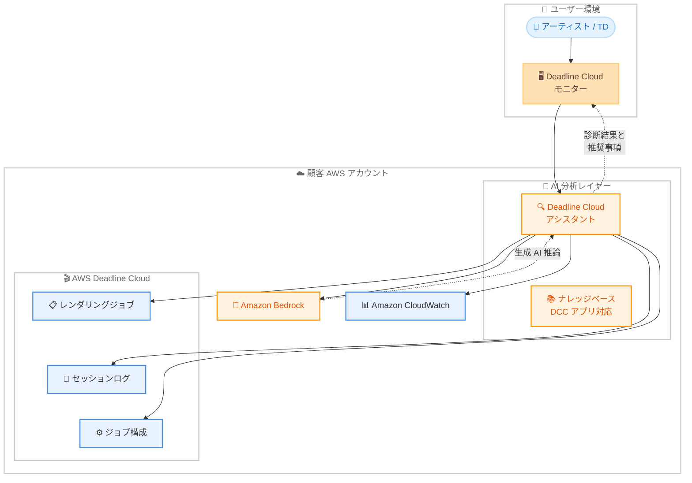

# AWS Deadline Cloud - AI 搭載トラブルシューティングアシスタント

**リリース日**: 2026 年 4 月 17 日
**サービス**: AWS Deadline Cloud
**機能**: AI-powered troubleshooting assistant for render jobs

📊 [このアップデートのインフォグラフィックを見る](https://takech9203.github.io/aws-news-summary/20260417-deadline-cloud-ai-troubleshooting.html)

## 概要

AWS Deadline Cloud に、レンダリングジョブの障害を迅速に診断・解決するための AI 搭載トラブルシューティングアシスタントが追加されました。このアシスタントは Deadline Cloud モニターに組み込まれており、Amazon Bedrock を活用した生成 AI によってジョブ構成、タスクステータス、セッションログ、CloudWatch データを分析し、インテリジェントな根本原因分析と実用的な推奨事項を提供します。

AWS Deadline Cloud は、映画、テレビ番組、CM、ゲーム、インダストリアルデザイン向けの CG 2D/3D グラフィックスおよびビジュアルエフェクトのレンダリング管理を簡素化するフルマネージドサービスです。今回のアシスタントは、Autodesk Maya、3ds Max、VRED、Blender、SideFX Houdini、Maxon Cinema 4D、Foundry Nuke、Adobe After Effects といった主要なデジタルコンテンツ制作 (DCC) アプリケーションに関する事前トレーニング済みのナレッジベースを備えています。

このアシスタントは顧客の AWS アカウント内で Amazon Bedrock を使用して実行されるため、すべてのデータと分析が顧客の管理下に保持される点が大きな特徴です。レンダーファームの運用において、専門的な技術スタッフに依存せずにジョブ障害の原因を特定できるようになり、特に小規模なスタジオにとって大きな価値を提供します。

**アップデート前の課題**

- レンダリングジョブの障害診断には、専門的な技術スタッフが手動でログを解析し、根本原因を特定する必要があり、時間がかかり、スケーラブルではなかった
- アセットの欠落、ソフトウェアエラー、構成の不一致、リソース制約などの問題が制作パイプラインを停滞させ、コンピューティングリソースを浪費していた
- 小規模なスタジオでは専門的なトラブルシューティングスタッフを確保することが困難で、障害解決に長時間を要していた

**アップデート後の改善**

- AI アシスタントが障害が発生したジョブを調査し、ログとメトリクスを分析して一般的な問題を検出し、業界のベストプラクティスに基づくトラブルシューティング推奨事項を自動的に提供
- 8 種類の主要 DCC アプリケーションに対応した事前トレーニング済みナレッジベースにより、アプリケーション固有の問題も診断可能
- Amazon Bedrock を顧客アカウント内で実行するため、データプライバシーとセキュリティを確保しながら AI 分析を利用可能

## アーキテクチャ図



Deadline Cloud モニターからアシスタントを呼び出すと、ジョブ構成、セッションログ、CloudWatch メトリクスを収集し、顧客アカウント内の Amazon Bedrock で AI 分析を実行して、根本原因と推奨事項をモニターに返します。

## サービスアップデートの詳細

### 主要機能

1. **AI 搭載のジョブ障害診断**
   - 失敗したレンダリングジョブを自動的に調査し、ログとメトリクスを分析
   - 一般的な問題パターン (アセット欠落、ソフトウェアエラー、構成の不一致、リソース制約) を検出
   - 業界のベストプラクティスに基づくトラブルシューティング推奨事項を提供

2. **幅広い DCC アプリケーション対応**
   - 事前トレーニング済みナレッジベースが以下の 8 種類の主要 DCC アプリケーションをカバー
   - Deadline Cloud 固有の問題やレンダーファームの一般的な問題にも対応
   - アプリケーション固有のエラーパターンや設定ミスを認識

3. **Amazon Bedrock 統合によるセキュアな AI 分析**
   - アシスタントは顧客の AWS アカウント内で Amazon Bedrock を使用して実行
   - すべてのデータと分析結果が顧客の管理下に保持される
   - ブラウザ上で動作し、Deadline Cloud モニターに統合された直感的な操作性

## 技術仕様

### 対応 DCC アプリケーション

| アプリケーション | ベンダー | 主な用途 |
|------|------|------|
| Maya | Autodesk | 3D モデリング、アニメーション、VFX |
| 3ds Max | Autodesk | 3D モデリング、レンダリング、ビジュアライゼーション |
| VRED | Autodesk | 3D ビジュアライゼーション、プロトタイピング |
| Blender | Blender Foundation | オープンソース 3D 制作 |
| Houdini | SideFX | プロシージャルアニメーション、VFX |
| Cinema 4D | Maxon | モーショングラフィックス、3D モデリング |
| Nuke | Foundry | コンポジティング、VFX |
| After Effects | Adobe | モーショングラフィックス、合成 |

### 分析対象データ

| データソース | 分析内容 |
|------|------|
| ジョブ構成 | テンプレート設定、パラメータ、ホスト要件の妥当性 |
| タスクステータス | 各タスクの実行状態と失敗パターン |
| セッションログ | レンダリングエンジンのエラーメッセージ、スタックトレース |
| CloudWatch データ | リソース使用率、メモリ、CPU メトリクス |

### API 変更履歴

| 日付 | サービス | 変更内容 |
|------|----------|----------|
| 2026/04/13 | [AWSDeadlineCloud](https://awsapichanges.com/archive/changes/9b76a6-deadline.html) | 2 new api methods - GetMonitorSettings および UpdateMonitorSettings API の追加。モニター設定のキーバリューペア管理を実現 |

### IAM ポリシー例

```json
{
    "Version": "2012-10-17",
    "Statement": [
        {
            "Effect": "Allow",
            "Action": [
                "deadline:GetJob",
                "deadline:GetSession",
                "deadline:ListSessionActions",
                "deadline:ListSessions",
                "deadline:ListSteps",
                "deadline:ListTasks"
            ],
            "Resource": "arn:aws:deadline:*:*:farm/*/queue/*/job/*"
        },
        {
            "Effect": "Allow",
            "Action": [
                "bedrock:InvokeModel"
            ],
            "Resource": "*"
        },
        {
            "Effect": "Allow",
            "Action": [
                "logs:GetLogEvents",
                "logs:FilterLogEvents"
            ],
            "Resource": "arn:aws:logs:*:*:log-group:/aws/deadline/*"
        }
    ]
}
```

## 設定方法

### 前提条件

1. AWS Deadline Cloud のレンダーファームとモニターが構成済みであること
2. Amazon Bedrock が利用可能なリージョンで Deadline Cloud を使用していること
3. Amazon Bedrock の基盤モデルへのアクセスが有効化されていること
4. Deadline Cloud モニターへのアクセス権限を持つ IAM ロールに、Bedrock および CloudWatch Logs の読み取り権限が付与されていること

### 手順

#### ステップ 1: Amazon Bedrock のモデルアクセスの有効化

```bash
# Amazon Bedrock コンソールでモデルアクセスをリクエスト
# AWS マネジメントコンソール > Amazon Bedrock > Model access から設定
aws bedrock list-foundation-models --query "modelSummaries[?providerName=='Anthropic'].[modelId,modelName]" --output table
```

Deadline Cloud アシスタントが使用する基盤モデルへのアクセスを確認します。Amazon Bedrock コンソールからモデルアクセスが有効になっていることを確認してください。

#### ステップ 2: Deadline Cloud モニターからアシスタントを使用

```bash
# Deadline Cloud モニターの URL を取得
aws deadline list-monitors --query "monitors[*].[displayName,url]" --output table
```

Deadline Cloud モニターにアクセスし、障害が発生したジョブを選択して、アシスタント機能を起動します。アシスタントはブラウザ上で動作し、選択したジョブのログやメトリクスを自動的に分析します。

#### ステップ 3: 診断結果の確認と対応

アシスタントが提供する診断結果と推奨事項を確認します。AI モデルによって生成された内容であるため、推奨事項に基づいて行動する前に必ず検証を行ってください。

## メリット

### ビジネス面

- **障害解決時間の大幅短縮**: 手動でのログ解析に比べ、AI による自動分析により障害の根本原因を迅速に特定でき、レンダリングパイプラインのダウンタイムを最小化
- **小規模スタジオへの恩恵**: 専門的なレンダーファーム管理スタッフを確保しにくい小規模スタジオでも、AI アシスタントにより高度なトラブルシューティングが可能
- **コンピューティングコストの削減**: 障害ジョブの早期検出と解決により、失敗したレンダリングジョブによるコンピューティングリソースの浪費を抑制

### 技術面

- **幅広い DCC アプリケーション対応**: 8 種類の主要 DCC アプリケーションに対応したナレッジベースにより、アプリケーション固有の問題を正確に診断
- **顧客アカウント内での AI 実行**: Amazon Bedrock を顧客アカウント内で実行するアーキテクチャにより、レンダリングデータやログが外部に送信されず、データ主権を確保
- **CloudWatch との統合**: ログとメトリクスの包括的な分析により、リソース制約やパフォーマンス問題など、ログだけでは判別しにくい問題も検出可能

## デメリット・制約事項

### 制限事項

- AI モデルによる生成結果であるため、不正確、不完全、または古い情報が含まれる可能性がある。推奨事項に基づいて行動する前に必ず検証が必要
- Amazon Bedrock が利用可能なリージョンでのみ動作するため、Bedrock 未対応のリージョンでは使用不可
- 事前トレーニング済みナレッジベースに含まれない DCC アプリケーション固有の問題については、診断精度が低下する可能性がある

### 考慮すべき点

- Amazon Bedrock の推論コストが別途発生するため、アシスタントの使用頻度に応じたコスト計画が必要
- AWS の責任ある AI ポリシーおよびサービス利用規約が適用される
- セキュリティ上、Amazon Bedrock へのアクセス権限を適切に管理し、必要最小限の IAM ポリシーを設定することが推奨される

## ユースケース

### ユースケース 1: VFX スタジオでのレンダリング障害の迅速な解決

**シナリオ**: 映画制作の VFX スタジオで、Maya を使用した数百フレームのレンダリングジョブが途中で失敗した。テクニカルディレクター (TD) がログを手動で確認する時間がなく、納期が迫っている。

**実装例**:
```
1. Deadline Cloud モニターで障害ジョブを選択
2. アシスタントを起動して自動分析を開始
3. アシスタントが「テクスチャファイルへのパスが見つからない」という根本原因を特定
4. ファイルパスの修正方法と、ジョブ再送信の手順を提示
```

**効果**: 通常数時間かかるログ分析を数分に短縮し、レンダリングパイプラインの停滞を最小化。納期への影響を回避できる。

### ユースケース 2: 小規模ゲームスタジオでのリソース制約問題の診断

**シナリオ**: インディーゲームスタジオが Blender でシネマティクスのレンダリングを行っているが、ジョブが頻繁にメモリ不足で失敗する。専門のインフラエンジニアがいないため、原因の特定が困難。

**実装例**:
```
1. Deadline Cloud モニターでメモリ不足エラーのジョブを選択
2. アシスタントが CloudWatch メトリクスを分析し、メモリ使用パターンを特定
3. フリートのインスタンスタイプ変更、またはレンダリング解像度の分割を推奨
4. ホスト要件の設定変更例を提示
```

**効果**: インフラの専門知識がなくても、AI アシスタントの推奨に基づいてフリート構成を最適化し、安定したレンダリングを実現。

### ユースケース 3: ポストプロダクション企業でのマルチアプリケーション環境のトラブルシューティング

**シナリオ**: ポストプロダクション企業が Nuke、After Effects、Houdini を組み合わせたコンポジティングパイプラインを運用。複数の DCC アプリケーション間の構成不一致によりジョブが失敗している。

**実装例**:
```
1. Deadline Cloud モニターで各アプリケーションの障害ジョブを選択
2. アシスタントが各アプリケーションのログを横断的に分析
3. Nuke の出力形式と After Effects の入力形式の不一致を検出
4. ファイル形式の統一と環境変数の設定修正を推奨
```

**効果**: 複数の DCC アプリケーションにまたがる複雑な構成問題を、ナレッジベースを活用して効率的に診断し、パイプライン全体の安定性を向上。

## 料金

Deadline Cloud アシスタント機能自体の追加料金はありませんが、Amazon Bedrock の推論コストが別途発生します。

### 料金例

| 項目 | 料金 (概算) |
|--------|------------------|
| Deadline Cloud アシスタント | 追加料金なし |
| Amazon Bedrock 推論 | 使用するモデルと推論回数に応じた従量課金 |
| CloudWatch Logs 読み取り | CloudWatch の標準料金が適用 |
| Deadline Cloud 基本料金 | ワーカーのコンピューティングリソースに基づく |

料金の詳細は [AWS Deadline Cloud 料金ページ](https://aws.amazon.com/deadline-cloud/pricing/) および [Amazon Bedrock 料金ページ](https://aws.amazon.com/bedrock/pricing/) を確認してください。

## 利用可能リージョン

AWS Deadline Cloud がサポートされているすべての AWS リージョンで利用可能です。ただし、アシスタント機能は Amazon Bedrock を使用するため、Bedrock が利用可能なリージョンでの使用が前提となります。具体的な対応リージョンについては [AWS Deadline Cloud のリージョン別サービス一覧](https://aws.amazon.com/about-aws/global-infrastructure/regional-product-services/) を確認してください。

## 関連サービス・機能

- **Amazon Bedrock**: Deadline Cloud アシスタントの AI 推論基盤。顧客アカウント内で生成 AI モデルを実行し、ジョブ障害の分析と推奨事項の生成を担う
- **Amazon CloudWatch**: レンダリングジョブのメトリクスとログを収集・保存。アシスタントがリソース使用率やパフォーマンスデータの分析に使用
- **AWS Deadline Cloud モニター**: アシスタントが統合されているウェブベースの管理インターフェース。ジョブの送信、進捗確認、障害診断を一元的に実行可能
- **AWS IAM Identity Center**: Deadline Cloud モニターへのユーザー認証を管理。アシスタント機能の利用にはモニターへのアクセス権限が必要

## 参考リンク

- 📊 [インフォグラフィック](https://takech9203.github.io/aws-news-summary/20260417-deadline-cloud-ai-troubleshooting.html)
- [公式発表 (What's New)](https://aws.amazon.com/about-aws/whats-new/2026/04/deadline-cloud-ai-troubleshooting/)
- [Deadline Cloud アシスタント ドキュメント](https://docs.aws.amazon.com/deadline-cloud/latest/userguide/deadline-cloud-assistant.html)
- [デモ動画 (YouTube)](https://youtu.be/zz10CeybNeQ)
- [AWS Deadline Cloud 料金ページ](https://aws.amazon.com/deadline-cloud/pricing/)
- [Amazon Bedrock 料金ページ](https://aws.amazon.com/bedrock/pricing/)

## まとめ

AWS Deadline Cloud の AI 搭載トラブルシューティングアシスタントは、Amazon Bedrock を活用してレンダリングジョブの障害を自動的に診断・解決する新機能です。Maya、Blender、Houdini、Nuke など 8 種類の主要 DCC アプリケーションに対応した事前トレーニング済みナレッジベースを備え、専門スタッフに依存せずに迅速な障害解決を実現します。レンダーファームを運用するスタジオは、Amazon Bedrock のモデルアクセスを有効化し、Deadline Cloud モニターからアシスタント機能を活用することで、レンダリングパイプラインの安定性と生産性を向上させることを推奨します。
