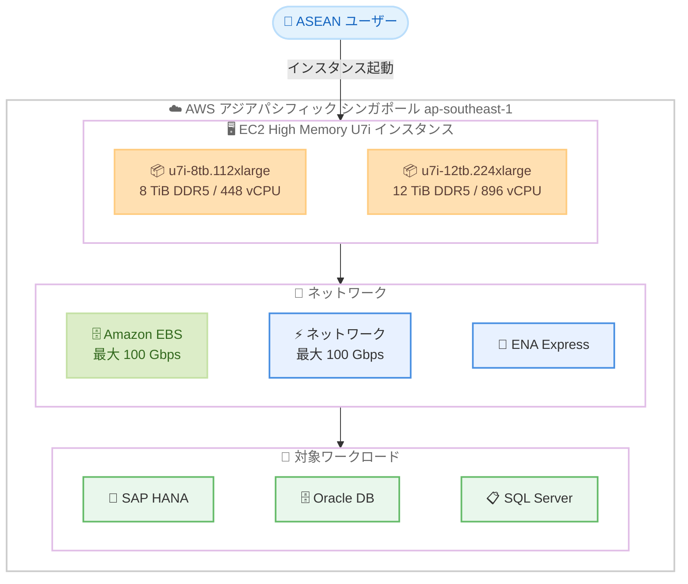

# Amazon EC2 High Memory U7i インスタンス - アジアパシフィック (シンガポール) リージョンで利用可能に

**リリース日**: 2026 年 4 月 17 日
**サービス**: Amazon EC2
**機能**: High Memory U7i インスタンスのアジアパシフィック (シンガポール) リージョン展開

📊 [このアップデートのインフォグラフィックを見る](https://takech9203.github.io/aws-news-summary/20260417-ec2-high-memory-u7i-asia-pacific.html)

## 概要

Amazon EC2 High Memory U7i インスタンスが、AWS アジアパシフィック (シンガポール) リージョン (ap-southeast-1) で利用可能になりました。U7i-8TB インスタンス (u7i-8tb.112xlarge) と U7i-12TB インスタンス (u7i-12tb.224xlarge) の 2 つのインスタンスタイプが提供され、大規模なインメモリデータベースワークロードに対応します。

U7i インスタンスは AWS 第 7 世代のインスタンスファミリーに属し、カスタム第 4 世代 Intel Xeon Scalable Processors (Sapphire Rapids) を搭載しています。最大 12 TiB の DDR5 メモリ、896 vCPU、100 Gbps の EBS 帯域幅とネットワーク帯域幅を提供し、SAP HANA、Oracle、SQL Server などのミッションクリティカルなインメモリデータベースに最適です。シンガポールリージョンは ASEAN 地域のハブとして、東南アジア全域のお客様にとって重要な拠点です。

**アップデート前の課題**

- アジアパシフィック (シンガポール) リージョンでは U7i High Memory インスタンスが利用できず、大容量メモリを必要とするワークロードを他のリージョンで実行する必要があった
- ASEAN 地域のデータレジデンシー要件を満たしながら、TiB 規模のメモリを持つインスタンスを利用できなかった
- シンガポールリージョンのユーザーは、大規模なインメモリデータベースに対して物理的に離れたリージョンを使用することによるレイテンシの問題を抱えていた

**アップデート後の改善**

- アジアパシフィック (シンガポール) リージョンで U7i-8TB および U7i-12TB インスタンスを直接起動できるようになった
- ASEAN 地域のデータレジデンシー要件を満たしながら、最大 12 TiB のメモリを活用したインメモリデータベースの運用が可能になった
- 東南アジアのユーザーに対するレイテンシが低減され、SAP HANA や Oracle などのパフォーマンスが向上する

## アーキテクチャ図



アジアパシフィック (シンガポール) リージョンで利用可能になった U7i High Memory インスタンスの構成を示しています。2 つのインスタンスタイプが 100 Gbps のネットワークおよび EBS 帯域幅を備え、SAP HANA、Oracle、SQL Server などのインメモリデータベースワークロードに対応します。

## サービスアップデートの詳細

### 主要機能

1. **U7i-8TB インスタンス (u7i-8tb.112xlarge)**
   - 8 TiB の DDR5 メモリを搭載
   - 448 vCPU を提供
   - 最大 100 Gbps の Amazon EBS 帯域幅をサポート
   - 最大 100 Gbps のネットワーク帯域幅をサポート

2. **U7i-12TB インスタンス (u7i-12tb.224xlarge)**
   - 12 TiB の DDR5 メモリを搭載
   - 896 vCPU を提供
   - 最大 100 Gbps の Amazon EBS 帯域幅をサポート
   - 最大 100 Gbps のネットワーク帯域幅をサポート

3. **プロセッサとメモリ**
   - カスタム第 4 世代 Intel Xeon Scalable Processors (Sapphire Rapids) を搭載
   - DDR5 メモリにより、DDR4 と比較して高いメモリ帯域幅を実現
   - AWS 第 7 世代インスタンスファミリーに属する

4. **ネットワーク機能**
   - 100 Gbps の EBS 帯域幅と 100 Gbps のネットワーク帯域幅を同時にサポート
   - ENA Express をサポートし、低レイテンシの通信が可能
   - 高速なデータローディングとバックアップに対応

## 技術仕様

### インスタンスタイプの比較

| 項目 | u7i-8tb.112xlarge | u7i-12tb.224xlarge |
|------|-------------------|---------------------|
| メモリ | 8 TiB DDR5 | 12 TiB DDR5 |
| vCPU | 448 | 896 |
| EBS 帯域幅 | 最大 100 Gbps | 最大 100 Gbps |
| ネットワーク帯域幅 | 最大 100 Gbps | 最大 100 Gbps |
| ENA Express | サポート | サポート |
| プロセッサ | Intel Xeon Sapphire Rapids | Intel Xeon Sapphire Rapids |

### インスタンスの起動

```bash
# U7i-8TB インスタンスをシンガポールリージョンで起動
aws ec2 run-instances \
  --region ap-southeast-1 \
  --instance-type u7i-8tb.112xlarge \
  --image-id ami-xxxxxxxxxxxxxxxxx \
  --key-name my-key-pair \
  --subnet-id subnet-xxxxxxxxxxxxxxxxx
```

## 設定方法

### 前提条件

1. AWS アカウントでアジアパシフィック (シンガポール) リージョン (ap-southeast-1) が利用可能である
2. U7i インスタンスタイプに対応するサービスクォータが確保されている
3. 適切な AMI (SAP HANA、Oracle、SQL Server 用) が利用可能である

### 手順

#### ステップ 1: サービスクォータの確認

```bash
# vCPU クォータの確認
aws service-quotas get-service-quota \
  --region ap-southeast-1 \
  --service-code ec2 \
  --quota-code L-43DA4232
```

U7i インスタンスは大量の vCPU を使用するため、Running On-Demand High Memory instances のクォータが十分であることを確認します。必要に応じてクォータ引き上げリクエストを行ってください。

#### ステップ 2: インスタンスの起動

```bash
# U7i-12TB インスタンスをシンガポールリージョンで起動
aws ec2 run-instances \
  --region ap-southeast-1 \
  --instance-type u7i-12tb.224xlarge \
  --image-id ami-xxxxxxxxxxxxxxxxx \
  --key-name my-key-pair \
  --subnet-id subnet-xxxxxxxxxxxxxxxxx \
  --block-device-mappings '[{"DeviceName":"/dev/sda1","Ebs":{"VolumeSize":500,"VolumeType":"gp3"}}]'
```

SAP HANA や Oracle などのワークロードに適した AMI を選択し、ストレージ構成を指定してインスタンスを起動します。

#### ステップ 3: インスタンスの確認

```bash
# 起動したインスタンスの状態を確認
aws ec2 describe-instances \
  --region ap-southeast-1 \
  --filters "Name=instance-type,Values=u7i-8tb.112xlarge,u7i-12tb.224xlarge" \
  --query 'Reservations[].Instances[].[InstanceId,InstanceType,State.Name]' \
  --output table
```

インスタンスが正常に起動し、running 状態になっていることを確認します。

## メリット

### ビジネス面

- **ASEAN 地域のデータレジデンシー対応**: シンガポール、マレーシア、インドネシア、タイ、ベトナムなどの ASEAN 各国のデータ規制要件を満たしながら、大規模インメモリデータベースを運用できる
- **低レイテンシアクセス**: 東南アジア全域のエンドユーザーに近い場所でワークロードを実行することで、アプリケーションの応答性が向上する
- **ビジネス継続性の強化**: アジアパシフィック地域内の複数リージョンにまたがるディザスタリカバリ戦略を構築できる

### 技術面

- **高メモリ帯域幅**: DDR5 メモリにより、大規模なインメモリデータベースの読み書き性能が向上する
- **高い I/O 性能**: 100 Gbps の EBS 帯域幅とネットワーク帯域幅により、ストレージとネットワークのボトルネックを解消する
- **ENA Express サポート**: 低レイテンシのネットワーク通信により、データベースクラスタ間のレプリケーション性能が向上する

## デメリット・制約事項

### 制限事項

- アジアパシフィック (シンガポール) リージョンのみの追加であり、他のアジアパシフィックリージョンへの展開は別途アナウンスされる
- U7i インスタンスはベアメタルに近い大規模インスタンスであり、小規模なワークロードにはコスト効率が低い
- Dedicated Hosts またはオンデマンドインスタンスとしての利用が必要で、スポットインスタンスとしては利用できない可能性がある

### 考慮すべき点

- 大量の vCPU を使用するため、事前にサービスクォータの引き上げリクエストが必要になる場合がある
- インスタンスの起動には時間がかかる場合があり、容量の予約 (Capacity Reservations) の利用を検討することが推奨される
- SAP HANA などの認定ワークロードでは、AWS が認定した AMI とオペレーティングシステムの組み合わせを使用する必要がある

## ユースケース

### ユースケース 1: ASEAN 地域の SAP HANA インメモリデータベース

**シナリオ**: シンガポールを拠点とする製造業企業が、東南アジア地域のデータレジデンシー要件を満たしながら SAP HANA を最大 12 TiB のメモリで運用したい。

**実装例**:
```bash
# SAP HANA 認定の AMI で U7i-12TB インスタンスを起動
aws ec2 run-instances \
  --region ap-southeast-1 \
  --instance-type u7i-12tb.224xlarge \
  --image-id ami-sap-hana-certified \
  --placement '{"Tenancy":"dedicated"}' \
  --block-device-mappings '[
    {"DeviceName":"/dev/sda1","Ebs":{"VolumeSize":500,"VolumeType":"gp3"}},
    {"DeviceName":"/dev/sdb","Ebs":{"VolumeSize":2000,"VolumeType":"io2","Iops":64000}}
  ]'
```

**効果**: 12 TiB のメモリにより大規模な SAP HANA データベースをシンガポールリージョンで運用でき、ASEAN 地域のデータ規制を遵守しながら低レイテンシのアクセスを実現できる。

### ユースケース 2: Oracle Database のインメモリ処理

**シナリオ**: 東南アジアの金融機関が Oracle Database をインメモリオプション付きで運用し、リアルタイムの取引分析を高速に処理したい。

**実装例**:
```bash
# Oracle Database 用の U7i-8TB インスタンスを起動
aws ec2 run-instances \
  --region ap-southeast-1 \
  --instance-type u7i-8tb.112xlarge \
  --image-id ami-oracle-linux \
  --block-device-mappings '[
    {"DeviceName":"/dev/sda1","Ebs":{"VolumeSize":200,"VolumeType":"gp3"}},
    {"DeviceName":"/dev/sdb","Ebs":{"VolumeSize":5000,"VolumeType":"io2","Iops":64000}}
  ]'
```

**効果**: 8 TiB のメモリで Oracle Database In-Memory オプションを最大限活用し、大規模なデータセットのリアルタイムクエリを高速に処理できる。

### ユースケース 3: SQL Server ビジネスインテリジェンス

**シナリオ**: ASEAN 地域の小売企業が SQL Server のインメモリ OLTP とカラムストアインデックスを活用して、大規模なビジネスインテリジェンス分析を実行したい。

**実装例**:
```bash
# SQL Server 用の U7i-8TB インスタンスを起動
aws ec2 run-instances \
  --region ap-southeast-1 \
  --instance-type u7i-8tb.112xlarge \
  --image-id ami-windows-sql-enterprise \
  --block-device-mappings '[
    {"DeviceName":"/dev/sda1","Ebs":{"VolumeSize":200,"VolumeType":"gp3"}},
    {"DeviceName":"xvdf","Ebs":{"VolumeSize":3000,"VolumeType":"io2","Iops":64000}}
  ]'
```

**効果**: 8 TiB のメモリにより SQL Server のインメモリ OLTP とカラムストアインデックスを大規模なデータセットに適用でき、BI クエリの応答時間が大幅に短縮される。

## 料金

U7i インスタンスの料金は、インスタンスタイプ、リージョン、および利用形態 (オンデマンド、リザーブドインスタンス、Savings Plans) によって異なります。High Memory インスタンスは大規模なリソースを提供するため、料金も相応に高額です。

詳細については [Amazon EC2 料金ページ](https://aws.amazon.com/ec2/pricing/) を参照してください。

### 料金例

| インスタンスタイプ | 月額料金 (概算) |
|-------------------|-----------------|
| u7i-8tb.112xlarge オンデマンド | 公式料金ページを参照 |
| u7i-12tb.224xlarge オンデマンド | 公式料金ページを参照 |

リザーブドインスタンスや Savings Plans を利用することで、オンデマンド料金と比較して大幅な割引が適用されます。

## 利用可能リージョン

今回のアップデートにより、U7i インスタンスは AWS アジアパシフィック (シンガポール) リージョン (ap-southeast-1) で利用可能になりました。他のリージョンでの利用可能状況については [Amazon EC2 インスタンスタイプのリージョン別提供状況](https://aws.amazon.com/about-aws/global-infrastructure/regional-product-services/) を参照してください。

## 関連サービス・機能

- **Amazon EBS**: U7i インスタンスと組み合わせて最大 100 Gbps の帯域幅で高性能ストレージを提供し、データベースの永続ストレージとして使用される
- **EC2 Dedicated Hosts**: SAP HANA などのライセンス要件に対応するため、専用ホスト上で U7i インスタンスを実行可能
- **AWS Backup**: 大規模なインメモリデータベースのバックアップとリカバリを自動化するサービス
- **ENA Express**: U7i インスタンスでサポートされる低レイテンシネットワーク機能で、インスタンス間の通信性能を向上させる

## 参考リンク

- 📊 [インフォグラフィック](https://takech9203.github.io/aws-news-summary/20260417-ec2-high-memory-u7i-asia-pacific.html)
- [公式発表 (What's New)](https://aws.amazon.com/about-aws/whats-new/2026/04/ec2-high-memory-u7i-asia-pacific/)
- [Amazon EC2 High Memory インスタンスページ](https://aws.amazon.com/ec2/instance-types/u7i/)
- [ドキュメント - Amazon EC2 High Memory インスタンス](https://docs.aws.amazon.com/ec2/latest/instancetypes/mo.html)
- [Amazon EC2 料金ページ](https://aws.amazon.com/ec2/pricing/)

## まとめ

Amazon EC2 High Memory U7i インスタンスのアジアパシフィック (シンガポール) リージョンへの展開は、ASEAN 地域においてデータレジデンシー要件を満たしながら大規模インメモリデータベースを運用したいお客様にとって重要なアップデートです。最大 12 TiB の DDR5 メモリと 896 vCPU を備えた U7i インスタンスにより、SAP HANA、Oracle、SQL Server などのミッションクリティカルなワークロードをシンガポールリージョンで実行できるようになります。シンガポールは ASEAN 地域のビジネスハブとして多くの企業が拠点を置いており、東南アジアでインメモリデータベースを運用している、またはデータレジデンシー要件を持つお客様は、U7i インスタンスの利用を検討することを推奨します。
