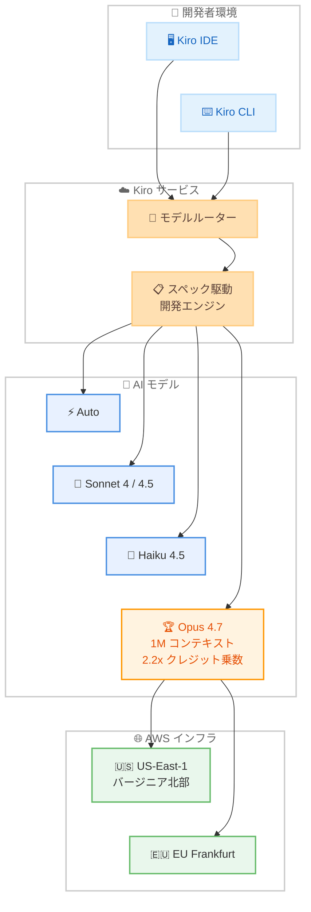

# Kiro - Claude Opus 4.7 モデルサポート

**リリース日**: 2026 年 4 月 17 日
**サービス**: Kiro
**機能**: Claude Opus 4.7 サポート

📊 [このアップデートのインフォグラフィックを見る](https://takech9203.github.io/aws-news-summary/20260417-kiro-opus-4-7.html)

## 概要

Kiro IDE および CLI が Claude Opus 4.7 をサポートしました。Claude Opus 4.7 は Anthropic の最新かつ最も高性能な Opus モデルであり、Claude Opus 4.6 からの直接アップグレードとして、複雑で長時間にわたるコーディングタスクにおいて大幅に強化された性能を提供します。

Opus 4.7 は前世代の Opus 4.6 と比較して、より多くのプロダクションタスクを解決し、長いセッションにわたって複雑な指示をより正確に遂行します。複数のファイルやツールにまたがるマルチステップの実装を処理し、結果を返す前に自らの出力を検証し、指示内容に対する追従性が大幅に向上しています。この改善は Kiro のスペック駆動開発にも反映され、大規模なコードベースや広範な変更において、詳細なスペックを高い忠実度で実装に反映できるようになっています。

**アップデート前の課題**

- Opus 4.6 では長時間のセッションにおいて、計画、ツール使用、実行、レビューを行き来するワークフローで指示からのドリフトが発生することがあった
- 大規模コードベースに対する広範な変更において、スペックから実装への忠実度に改善の余地があった
- 複数ファイル・複数ツールにまたがるマルチステップ実装での精度に限界があった

**アップデート後の改善**

- Opus 4.7 により長時間セッションでの指示追従性が向上し、ワークフロー間のドリフトが低減
- スペック駆動開発において、大規模コードベースへの広範な変更を高い忠実度で実装可能に
- 自己検証機能によりマルチステップ実装の精度が向上し、出力を返す前に自ら結果を確認

## アーキテクチャ図



Kiro のモデルルーターを通じて、開発者は IDE または CLI から Claude Opus 4.7 を選択可能です。Opus 4.7 は US-East-1 および EU Frankfurt リージョンでの推論に対応しており、クロスリージョン推論もサポートされています。

## サービスアップデートの詳細

### 主要機能

1. **Claude Opus 4.7 モデル統合**
   - Kiro IDE と CLI の両方で Claude Opus 4.7 を選択可能
   - Anthropic の最新かつ最も高性能な Opus モデル
   - Opus 4.6 からの直接アップグレードとして提供
   - 実験的サポートとして段階的にロールアウト

2. **コーディング性能の大幅向上**
   - SWE-bench Pro でのエージェントコーディング: 64.3% (Opus 4.6 の 53.4% から約 20% 向上)
   - SWE-bench Verified でのエージェントコーディング: 87.6% (Opus 4.6 の 80.8% から向上)
   - Terminal Bench 2.0 でのエージェントターミナルコーディング: 69.4% (Opus 4.6 の 65.4% から向上)
   - 長時間セッションでの複雑な指示への追従性が大幅に改善

3. **スペック駆動開発の精度向上**
   - 詳細なスペックを高い忠実度で実装に反映
   - 大規模コードベースでの広範な変更に対応
   - 計画、ツール使用、実行、レビューのワークフロー間でのドリフトを低減

4. **自己検証機能**
   - 結果を返す前に自らの出力を検証
   - マルチステップ実装での一貫性と精度を確保
   - 指示内容への追従性を強化

## 技術仕様

### モデル仕様

| 項目 | 詳細 |
|------|------|
| モデル名 | Claude Opus 4.7 |
| 提供元 | Anthropic |
| コンテキストウィンドウ | 1M トークン |
| クレジット乗数 | 2.2x (Opus 4.6 と同一) |
| サポートステータス | 実験的サポート |

### ベンチマーク比較

| ベンチマーク | Opus 4.7 | Opus 4.6 | GPT-5.4 | Gemini 3.1 Pro |
|-------------|----------|----------|---------|---------------|
| SWE-bench Pro | 64.3% | 53.4% | 57.7% | 54.2% |
| SWE-bench Verified | 87.6% | 80.8% | N/A | 80.6% |
| Terminal Bench 2.0 | 69.4% | 65.4% | 75.1% | 68.5% |
| GPQA Diamond | 94.2% | 91.3% | 94.4% | 94.3% |
| CharXiv Reasoning | 82.1% | 69.1% | N/A | N/A |
| MMLU | 91.5% | 91.1% | N/A | 92.6% |
| MCP-Atlas | 77.3% | 75.8% | 68.1% | 73.9% |
| OSWorld-Verified | 78.0% | 72.7% | 75.0% | N/A |

### 推論リージョン

| リージョン | 状況 |
|-----------|------|
| AWS US-East-1 (バージニア北部) | 利用可能 |
| AWS Europe (フランクフルト) | 利用可能 |
| クロスリージョン推論 | 今後サポート拡大予定 |

### 対応プラン

| プラン | 利用可否 | 備考 |
|--------|----------|------|
| Kiro Free | 利用不可 | 対象外 |
| Kiro Pro | 利用可能 | 段階的ロールアウト |
| Kiro Pro+ | 利用可能 | 段階的ロールアウト |
| Kiro Power | 利用可能 | 段階的ロールアウト |

### 認証要件

初期ロールアウトでは AWS IAM Identity Center でログインしている Kiro Pro、Pro+、Power ユーザーの一部が対象です。今後、より広範な利用が可能になる予定です。

## 設定方法

### 前提条件

1. Kiro IDE または CLI がインストール済みであること
2. Kiro Pro、Pro+、または Power プランに加入していること
3. AWS IAM Identity Center で US-East-1 または EU Frankfurt リージョンにログインしていること (初期ロールアウト)

### 手順

#### ステップ 1: Kiro の更新

```bash
# Kiro IDE の場合: アプリケーションを再起動して最新バージョンに更新
# Kiro CLI の場合: 最新バージョンをダウンロード
```

Kiro IDE を使用している場合はアプリケーションを再起動します。CLI を使用している場合は最新バージョンをダウンロードしてインストールします。最新の利用可能なモデルが自動的に反映されます。

#### ステップ 2: モデルの選択

Kiro IDE または CLI のモデル選択メニューから Claude Opus 4.7 を選択します。モデル一覧に Opus 4.7 が表示されない場合は、段階的ロールアウトの対象にまだ含まれていない可能性があります。

#### ステップ 3: 利用開始

選択後、Claude Opus 4.7 を使用してコーディングタスクやスペック駆動開発を開始できます。クレジット乗数は 2.2x が適用されるため、Auto モードと比較してクレジット消費が多くなる点に注意してください。

## メリット

### ビジネス面

- **プロダクションタスクの解決率向上**: Opus 4.6 と比較して SWE-bench Pro で約 20% の性能向上により、より多くの実用的なタスクを自動化
- **開発セッションの品質向上**: 長時間セッションでのドリフト低減により、手戻りが減少し開発効率が向上
- **コスト効率の維持**: Opus 4.6 と同じ 2.2x クレジット乗数で、性能が大幅に向上

### 技術面

- **マルチステップ実装の精度向上**: 複数ファイル・複数ツールにまたがる実装での一貫性が向上
- **自己検証によるエラー削減**: 出力を返す前に自ら検証することで、手動レビューの負担を軽減
- **スペック駆動開発の忠実度向上**: 詳細なスペックを高い精度で実装に反映し、大規模コードベースでの変更品質が改善

## デメリット・制約事項

### 制限事項

- 実験的サポートとして段階的にロールアウト中であり、全ユーザーが即座に利用可能ではない
- 初期ロールアウトは AWS IAM Identity Center でログインしている US-East-1 および EU Frankfurt リージョンのユーザーに限定
- クレジット乗数が 2.2x であり、Auto モードや Sonnet と比較してクレジット消費が大きい
- Kiro Free プランでは利用不可

### 考慮すべき点

- クレジット消費量が増加するため、月間使用量の管理が重要
- 全てのタスクに Opus 4.7 が必要なわけではなく、タスクの複雑さに応じた Auto モードやほかのモデルの使い分けが推奨
- 実験的サポートのため、今後の仕様変更やロールアウト範囲の拡大に注意が必要

## ユースケース

### ユースケース 1: 大規模コードベースの包括的リファクタリング

**シナリオ**: 数十万行規模のレガシーコードベースにおいて、複数のモジュールにまたがるアーキテクチャ変更を実施するプロジェクト

**効果**: Opus 4.7 の向上したマルチステップ実装能力と自己検証機能により、複数ファイルにわたる変更を一貫した品質で実行し、長時間セッションでも指示からのドリフトなく作業を完了

### ユースケース 2: スペック駆動による新機能の高忠実度実装

**シナリオ**: 大規模既存プロジェクトに対して詳細なスペックを定義し、既存コードとの整合性を保ちながら新機能を実装

**効果**: Opus 4.7 のスペック駆動開発の精度向上により、計画からツール使用、実行、レビューまでの一連のワークフローを高い忠実度で遂行し、スペックと実装のギャップを最小化

### ユースケース 3: 複雑なエージェントワークフローの自律実行

**シナリオ**: CI/CD パイプラインのレビュー自動化や、複数のサブエージェントを活用した開発タスクの自動化

**効果**: Opus 4.7 の強化された指示追従性と自己検証機能により、複雑なマルチステップタスクをより少ない人的監視で確実に実行し、出力品質の信頼性を向上

## 料金

Kiro はクレジットベースの料金体系を採用しています。Claude Opus 4.7 使用時のクレジット乗数は 2.2x で、Opus 4.6 と同一です。

| プラン | 月額料金 | 月間クレジット | 超過料金 |
|--------|----------|---------------|----------|
| Kiro Free | $0 | 50 | 不可 |
| Kiro Pro | $20 | 1,000 | $0.04/クレジット |
| Kiro Pro+ | $40 | 2,000 | $0.04/クレジット |
| Kiro Power | $200 | 10,000 | $0.04/クレジット |

Auto モードと比較して、Opus 4.7 を明示的に選択した場合のクレジット消費は 2.2 倍になります。クレジットは小数第 2 位まで計測されます。

## 利用可能リージョン

グローバル (モデル推論は初期ロールアウトとして AWS US-East-1 および AWS Europe Frankfurt。クロスリージョン推論サポートと広範な利用は今後拡大予定)

## 関連サービス・機能

- **Amazon Bedrock Claude Opus 4.7**: Claude Opus 4.7 は Amazon Bedrock でも利用可能。API 経由での直接利用が必要な場合は Bedrock を参照
- **Claude Opus 4.6**: Opus 4.7 の前世代モデル。同じ 2.2x クレジット乗数で引き続き Kiro で利用可能
- **Kiro スペック駆動開発**: Opus 4.7 の主要な活用先。スペックから実装への忠実度が向上
- **Kiro CLI**: IDE と同様に Opus 4.7 を利用可能。CI/CD ワークフローやターミナルベースの開発に活用

## 参考リンク

- 📊 [インフォグラフィック](https://takech9203.github.io/aws-news-summary/20260417-kiro-opus-4-7.html)
- [公式ブログ - Opus 4.7 is now available in Kiro](https://kiro.dev/blog/opus-4-7/)
- [Changelog](https://kiro.dev/changelog/)
- [Kiro ダウンロード](https://kiro.dev/downloads/)
- [Kiro 料金ページ](https://kiro.dev/pricing/)
- [Kiro ドキュメント](https://kiro.dev/docs/)

## まとめ

Claude Opus 4.7 の Kiro サポートにより、複雑で長時間にわたるコーディングタスクの解決能力が大幅に向上しました。SWE-bench Pro で 64.3% という高いスコアを達成し、マルチステップ実装での自己検証機能やスペック駆動開発の忠実度向上など、開発者にとって実用的な改善が多数含まれています。Kiro Pro 以上のプランをご利用で AWS IAM Identity Center をお使いの方は、Kiro を再起動して Claude Opus 4.7 をお試しください。
