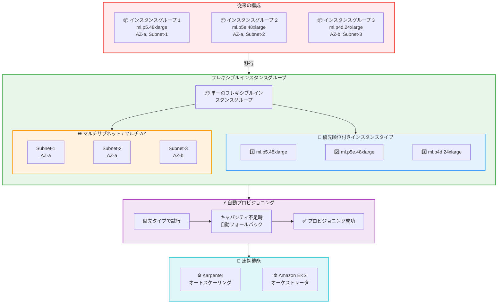

# Amazon SageMaker HyperPod - フレキシブルインスタンスグループ

**リリース日**: 2026 年 4 月 17 日
**サービス**: Amazon SageMaker HyperPod
**機能**: Flexible Instance Groups

📊 [このアップデートのインフォグラフィックを見る](https://takech9203.github.io/aws-news-summary/20260417-sagemaker-hyperpod-flexible-instance-groups.html)

## 概要

Amazon SageMaker HyperPod がフレキシブルインスタンスグループをサポートしました。この機能により、単一のインスタンスグループ内で複数のインスタンスタイプと複数のサブネットを指定できるようになります。HyperPod でトレーニングや推論のワークロードを実行するユーザーは、キャパシティの耐障害性、コスト最適化、サブネット活用のために複数のインスタンスタイプとアベイラビリティゾーンにまたがる構成が必要になることが多くあります。

従来は、インスタンスタイプとアベイラビリティゾーンの組み合わせごとに個別のインスタンスグループを作成・管理する必要がありました。これにより、クラスター構成、スケーリング、パッチ適用、モニタリングにおいて運用上のオーバーヘッドが発生していました。フレキシブルインスタンスグループでは、新しい `InstanceRequirements` パラメータを使用してインスタンスタイプの優先順位付きリストを定義し、単一のインスタンスグループ内で複数のアベイラビリティゾーンにまたがるサブネットを指定できます。

HyperPod は最も優先度の高いインスタンスタイプから順にプロビジョニングを行い、キャパシティが利用できない場合は自動的に優先度の低いタイプにフォールバックします。これにより、個別のインスタンスグループ間で手動でリトライする必要がなくなります。この機能は EKS オーケストレータを使用する SageMaker HyperPod クラスターで利用可能です。

**アップデート前の課題**

- インスタンスタイプとアベイラビリティゾーンの組み合わせごとに個別のインスタンスグループを作成・管理する必要があった
- クラスター構成、スケーリング、パッチ適用、モニタリングにおいて運用上のオーバーヘッドが大きかった
- キャパシティが不足した場合、手動で別のインスタンスグループにリトライする必要があった
- サブネットの枯渇を回避するために複数のインスタンスグループを手動で管理する必要があった
- Karpenter オートスケーリング使用時にも、複数のインスタンスグループを個別に参照する必要があった

**アップデート後の改善**

- 単一のインスタンスグループ内で複数のインスタンスタイプを優先順位付きリストとして定義可能になった
- 単一のインスタンスグループ内で複数のアベイラビリティゾーンにまたがるサブネットを指定可能になった
- キャパシティ不足時に自動的に優先度の低いインスタンスタイプへフォールバックする仕組みが導入された
- トレーニングワークロードでアベイラビリティゾーン内のマルチサブネット分散によりサブネット枯渇を回避可能になった
- Karpenter オートスケーリングが単一のフレキシブルインスタンスグループからサポート対象のインスタンスタイプを自動検出し、Pod 要件に基づいて最適なタイプとアベイラビリティゾーンをプロビジョニングするようになった

## アーキテクチャ図



従来は複数のインスタンスグループを個別に管理する必要がありましたが、フレキシブルインスタンスグループにより単一のグループで複数のインスタンスタイプとサブネットを管理し、自動フォールバックによるプロビジョニングが実現されます。

## サービスアップデートの詳細

### 主要機能

1. **優先順位付きインスタンスタイプ指定**
   - `InstanceRequirements` パラメータで複数のインスタンスタイプを優先順位付きリストとして定義
   - HyperPod は最も優先度の高いタイプから順にプロビジョニングを試行
   - キャパシティが利用できない場合、自動的に次の優先度のタイプにフォールバック

2. **マルチサブネット / マルチ AZ サポート**
   - 単一のインスタンスグループ内で複数のアベイラビリティゾーンにまたがるサブネットを指定可能
   - トレーニングワークロードではアベイラビリティゾーン内のマルチサブネット分散によりサブネット枯渇を回避
   - 推論ワークロードでは自動的な優先度ベースのフォールバックにより可用性を向上

3. **Karpenter オートスケーリング統合**
   - Karpenter がフレキシブルインスタンスグループからサポート対象のインスタンスタイプを自動検出
   - Pod の要件に基づいて最適なインスタンスタイプとアベイラビリティゾーンを自動選択
   - 単一のフレキシブルインスタンスグループを参照するだけでオートスケーリングが機能

## 技術仕様

### InstanceRequirements パラメータ

| 項目 | 詳細 |
|------|------|
| パラメータ名 | `InstanceRequirements` |
| 設定可能な値 | `InstanceTypes` - インスタンスタイプの優先順位付きリスト |
| 対応 API | `CreateCluster`, `UpdateCluster`, `DescribeCluster`, `BatchAddClusterNodes` |
| 対応オーケストレータ | EKS |
| 設定方法 | AWS API, AWS CLI, AWS マネジメントコンソール |

### レスポンスの新規フィールド

| 項目 | 詳細 |
|------|------|
| `CurrentInstanceTypes` | 現在プロビジョニングされているインスタンスタイプのリスト |
| `DesiredInstanceTypes` | 希望するインスタンスタイプのリスト |
| `InstanceTypeDetails` | インスタンスタイプごとの現在のカウントとスレッド情報 |

### API 変更履歴

| 日付 | サービス | 変更内容 |
|------|----------|----------|
| 2026/04/10 | [Amazon SageMaker Service](https://awsapichanges.com/archive/changes/974e23-api.sagemaker.html) | 1 new 4 updated api methods - StartClusterHealthCheck 新規追加、CreateCluster / UpdateCluster / DescribeCluster / BatchAddClusterNodes にフレキシブルインスタンスグループサポートを追加 |
| 2026/04/17 | [Amazon SageMaker Service](https://awsapichanges.com/archive/changes/2da070-api.sagemaker.html) | 4 updated api methods - CreateCluster / DescribeCluster / DescribeClusterNode / UpdateCluster に NetworkInterface と LifeCycleConfig.OnInitComplete を追加 |

### API リクエスト例

```json
{
    "ClusterName": "my-hyperpod-cluster",
    "InstanceGroups": [
        {
            "InstanceGroupName": "training-group",
            "InstanceCount": 4,
            "InstanceRequirements": {
                "InstanceTypes": [
                    "ml.p5.48xlarge",
                    "ml.p5e.48xlarge",
                    "ml.p4d.24xlarge"
                ]
            },
            "LifeCycleConfig": {
                "SourceS3Uri": "s3://my-bucket/lifecycle-scripts/",
                "OnCreate": "on_create.sh"
            },
            "ExecutionRole": "arn:aws:iam::123456789012:role/HyperPodRole"
        }
    ],
    "VpcConfig": {
        "SecurityGroupIds": ["sg-12345678"],
        "Subnets": [
            "subnet-aaaa1111",
            "subnet-bbbb2222",
            "subnet-cccc3333"
        ]
    },
    "Orchestrator": {
        "Eks": {
            "ClusterArn": "arn:aws:eks:us-east-1:123456789012:cluster/my-eks-cluster"
        }
    }
}
```

## 設定方法

### 前提条件

1. Amazon SageMaker HyperPod が利用可能なリージョンの AWS アカウント
2. EKS オーケストレータを使用する HyperPod クラスター (Slurm オーケストレータでは利用不可)
3. 適切な IAM ロールと VPC 設定 (複数のサブネットを含む)
4. 使用するインスタンスタイプに対するサービスクォータの確保

### 手順

#### ステップ 1: フレキシブルインスタンスグループを含むクラスターの作成

```bash
aws sagemaker create-cluster \
    --cluster-name my-flexible-cluster \
    --instance-groups '[
        {
            "InstanceGroupName": "gpu-training",
            "InstanceCount": 4,
            "InstanceRequirements": {
                "InstanceTypes": [
                    "ml.p5.48xlarge",
                    "ml.p5e.48xlarge",
                    "ml.p4d.24xlarge"
                ]
            },
            "LifeCycleConfig": {
                "SourceS3Uri": "s3://my-bucket/scripts/",
                "OnCreate": "on_create.sh"
            },
            "ExecutionRole": "arn:aws:iam::123456789012:role/HyperPodRole"
        }
    ]' \
    --vpc-config '{
        "SecurityGroupIds": ["sg-12345678"],
        "Subnets": ["subnet-aaaa1111", "subnet-bbbb2222", "subnet-cccc3333"]
    }' \
    --orchestrator '{
        "Eks": {
            "ClusterArn": "arn:aws:eks:us-east-1:123456789012:cluster/my-eks"
        }
    }'
```

`InstanceRequirements.InstanceTypes` に優先順位の高い順にインスタンスタイプを指定します。`VpcConfig.Subnets` に複数のアベイラビリティゾーンにまたがるサブネットを指定します。

#### ステップ 2: 既存クラスターの更新

```bash
aws sagemaker update-cluster \
    --cluster-name my-existing-cluster \
    --instance-groups '[
        {
            "InstanceGroupName": "gpu-training",
            "InstanceCount": 8,
            "InstanceRequirements": {
                "InstanceTypes": [
                    "ml.p5.48xlarge",
                    "ml.p5e.48xlarge"
                ]
            },
            "LifeCycleConfig": {
                "SourceS3Uri": "s3://my-bucket/scripts/",
                "OnCreate": "on_create.sh"
            },
            "ExecutionRole": "arn:aws:iam::123456789012:role/HyperPodRole"
        }
    ]'
```

`UpdateCluster` API を使用して既存のクラスターにフレキシブルインスタンスグループを適用できます。

#### ステップ 3: クラスターの状態確認

```bash
aws sagemaker describe-cluster \
    --cluster-name my-flexible-cluster
```

レスポンスの `InstanceRequirements.CurrentInstanceTypes` と `InstanceTypeDetails` フィールドで、実際にプロビジョニングされたインスタンスタイプとその数を確認できます。

## メリット

### ビジネス面

- **運用コスト削減**: 複数のインスタンスグループを個別に管理する必要がなくなり、クラスター構成・スケーリング・パッチ適用・モニタリングの運用オーバーヘッドが大幅に軽減される
- **コスト最適化**: 優先順位付きのインスタンスタイプ指定により、コスト効率の良いインスタンスタイプを優先的に使用しつつ、キャパシティ不足時には代替タイプにフォールバックできる
- **可用性の向上**: マルチ AZ / マルチサブネット構成と自動フォールバックにより、ワークロードの継続性が向上する

### 技術面

- **自動フォールバック**: キャパシティ不足時に手動でのリトライが不要になり、プロビジョニングの信頼性が向上する
- **サブネット枯渇の回避**: アベイラビリティゾーン内のマルチサブネット分散により、大規模トレーニングジョブでのサブネット IP アドレス枯渇リスクを軽減する
- **Karpenter 統合の簡素化**: 単一のフレキシブルインスタンスグループを参照するだけで Karpenter が最適なインスタンスタイプと AZ を自動選択するため、オートスケーリング設定が簡素化される

## デメリット・制約事項

### 制限事項

- EKS オーケストレータを使用する HyperPod クラスターでのみ利用可能 (Slurm オーケストレータは非対応)
- フレキシブルインスタンスグループ内のインスタンスタイプは互換性のある構成である必要がある (異なるアーキテクチャの混在には注意が必要)
- 使用する全てのインスタンスタイプに対してサービスクォータを事前に確保する必要がある

### 考慮すべき点

- 優先順位付きリストの順序設計が重要であり、パフォーマンス要件とコストのバランスを考慮して適切に設定する必要がある
- フォールバック先のインスタンスタイプでもワークロードが正常に動作することを事前にテストしておくことが推奨される
- 既存のクラスターをフレキシブルインスタンスグループに移行する場合、`UpdateCluster` API で設定を更新する必要がある

## ユースケース

### ユースケース 1: 大規模モデルトレーニング

**シナリオ**: 大規模言語モデル (LLM) のトレーニングを実行する場合、最新の GPU インスタンスを優先的に使用したいが、キャパシティが不足する場合は代替インスタンスにフォールバックしたい。

**実装例**:
```json
{
    "InstanceGroupName": "llm-training",
    "InstanceCount": 16,
    "InstanceRequirements": {
        "InstanceTypes": [
            "ml.p5.48xlarge",
            "ml.p5e.48xlarge",
            "ml.p4d.24xlarge"
        ]
    }
}
```

**効果**: 最新の ml.p5.48xlarge を優先しつつ、キャパシティ不足時には ml.p5e.48xlarge や ml.p4d.24xlarge に自動フォールバックし、トレーニングジョブの開始までの待ち時間を最小化できる。

### ユースケース 2: マルチ AZ 推論サービング

**シナリオ**: 高可用性が求められる推論ワークロードを複数のアベイラビリティゾーンに分散させ、障害時の影響を最小限に抑えたい。

**実装例**:
```json
{
    "InstanceGroupName": "inference-serving",
    "InstanceCount": 8,
    "InstanceRequirements": {
        "InstanceTypes": [
            "ml.g5.12xlarge",
            "ml.g6.12xlarge",
            "ml.g6e.12xlarge"
        ]
    }
}
```

VpcConfig に複数の AZ にまたがるサブネットを指定:
```json
{
    "Subnets": [
        "subnet-az1a-001",
        "subnet-az1b-001",
        "subnet-az1c-001"
    ]
}
```

**効果**: 複数の AZ に自動的にインスタンスが分散され、単一 AZ の障害時にも推論サービスが継続可能。手動でのインスタンスグループ管理が不要になる。

### ユースケース 3: Karpenter によるオートスケーリング

**シナリオ**: Kubernetes ベースの ML ワークロードで、Pod の要求に応じてインスタンスを自動的にスケールアウトしたい。Karpenter を使用して最適なインスタンスタイプを自動選択させたい。

**実装例**:
```json
{
    "InstanceGroupName": "karpenter-managed",
    "InstanceCount": 2,
    "MinInstanceCount": 2,
    "InstanceRequirements": {
        "InstanceTypes": [
            "ml.g5.xlarge",
            "ml.g5.2xlarge",
            "ml.g6.xlarge",
            "ml.g6.2xlarge"
        ]
    }
}
```

クラスター作成時に AutoScaling を有効化:
```json
{
    "AutoScaling": {
        "Mode": "Enable",
        "AutoScalerType": "Karpenter"
    }
}
```

**効果**: Karpenter がフレキシブルインスタンスグループから利用可能なインスタンスタイプを自動検出し、Pod のリソース要件に基づいて最適なインスタンスタイプと AZ を選択してプロビジョニングする。複数のインスタンスグループを個別に管理する必要がなくなる。

## 料金

フレキシブルインスタンスグループ機能自体には追加料金は発生しません。料金は実際にプロビジョニングされたインスタンスの使用量に基づいて課金されます。

- SageMaker HyperPod の料金は使用するインスタンスタイプと使用時間に応じて決定される
- フォールバック先のインスタンスタイプによって料金が変動する可能性があるため、優先順位リストの設計時にコストを考慮することが重要

詳細は [Amazon SageMaker 料金ページ](https://aws.amazon.com/sagemaker/pricing/) を参照してください。

## 利用可能リージョン

SageMaker HyperPod がサポートされている全ての AWS リージョンでフレキシブルインスタンスグループが利用可能です (EKS オーケストレータ使用時)。

主要な対応リージョン:

- 米国東部 (バージニア北部) - us-east-1
- 米国東部 (オハイオ) - us-east-2
- 米国西部 (オレゴン) - us-west-2
- アジアパシフィック (東京) - ap-northeast-1
- アジアパシフィック (シドニー) - ap-southeast-2
- 欧州 (フランクフルト) - eu-central-1
- 欧州 (アイルランド) - eu-west-1

最新の対応リージョンについては [AWS リージョン別サービス一覧](https://aws.amazon.com/about-aws/global-infrastructure/regional-product-services/) を参照してください。

## 関連サービス・機能

- **Amazon EKS**: HyperPod のフレキシブルインスタンスグループは EKS オーケストレータを使用するクラスターで利用可能。EKS がコンテナオーケストレーションの基盤として機能する
- **Karpenter**: Kubernetes ネイティブのオートスケーラーとして、フレキシブルインスタンスグループと統合してインスタンスタイプの自動選択と AZ 最適化を実行する
- **Amazon SageMaker Training**: HyperPod 上でのモデルトレーニングがフレキシブルインスタンスグループの恩恵を最も受けるワークロードの一つ
- **Amazon VPC**: マルチサブネット / マルチ AZ 構成の基盤として、サブネットの設計と IP アドレス管理が重要になる

## 参考リンク

- 📊 [インフォグラフィック](https://takech9203.github.io/aws-news-summary/20260417-sagemaker-hyperpod-flexible-instance-groups.html)
- [公式発表 (What's New)](https://aws.amazon.com/about-aws/whats-new/2026/04/sagemaker-hyperpod-flexible-instance-groups/)
- [Amazon SageMaker HyperPod ドキュメント](https://docs.aws.amazon.com/sagemaker/latest/dg/sagemaker-hyperpod.html)
- [Amazon SageMaker 料金ページ](https://aws.amazon.com/sagemaker/pricing/)
- [SageMaker API リファレンス - CreateCluster](https://docs.aws.amazon.com/sagemaker/latest/APIReference/API_CreateCluster.html)
- [AWS API Changes - SageMaker (2026/04/10)](https://awsapichanges.com/archive/changes/974e23-api.sagemaker.html)
- [AWS API Changes - SageMaker (2026/04/17)](https://awsapichanges.com/archive/changes/2da070-api.sagemaker.html)

## まとめ

Amazon SageMaker HyperPod のフレキシブルインスタンスグループは、大規模な ML ワークロードを運用するチームにとって重要なアップデートです。複数のインスタンスタイプとサブネットを単一のグループで管理でき、自動フォールバックにより運用負荷を大幅に削減します。特に Karpenter との統合により、EKS ベースの HyperPod クラスターでのオートスケーリングがさらに簡素化されるため、EKS オーケストレータを使用している場合は早期の導入検討を推奨します。
