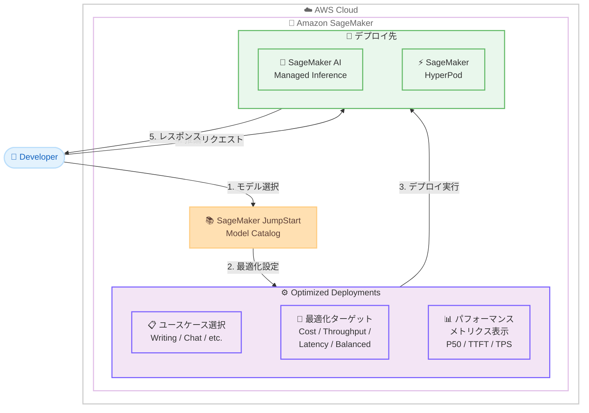

# Amazon SageMaker JumpStart - 基盤モデルの最適化デプロイメント

**リリース日**: 2026 年 4 月 17 日
**サービス**: Amazon SageMaker JumpStart
**機能**: Optimized Deployments for Foundation Models

## 概要

AWS は、Amazon SageMaker JumpStart に「Optimized Deployments」機能を追加しました。この機能により、基盤モデルを特定のユースケースやパフォーマンス要件に合わせた事前構成済みの設定でデプロイできるようになります。従来はモデルデプロイ時にインスタンスタイプ、推論コンテナ、最適化パラメータなどを個別に選定・設定する必要がありましたが、今回のアップデートにより、ユースケースと最適化ターゲットを選択するだけで最適な構成が自動的に適用されます。

ユーザーは、生成型ライティングやチャット形式のインタラクションなどのユースケース固有の構成を選択し、さらにコスト最適化、スループット最適化、レイテンシー最適化、バランス型パフォーマンスの 4 つの最適化ターゲットから目的に応じた設定を選ぶことができます。デプロイ先は SageMaker AI Managed Inference エンドポイントまたは SageMaker HyperPod クラスターです。

対応モデルには Meta Llama 3.1/3.2 系列、Microsoft Phi-3、Mistral AI モデル (Mistral-Small-24B-Instruct-2501 を含む)、Qwen 2/3 シリーズ (マルチモーダルの Qwen2-VL を含む)、Google Gemma、TII Falcon3 が含まれます。デプロイ前に P50 レイテンシー、TTFT (Time To First Token)、スループットなどのパフォーマンスメトリクスを確認できる点も大きな特徴です。

**アップデート前の課題**

- 基盤モデルのデプロイ時にインスタンスタイプ、コンテナ設定、量子化オプション、バッチサイズなどを手動で選定・調整する必要があり、ML エンジニアリングの専門知識が求められていた
- ユースケースごとに異なるパフォーマンス特性 (レイテンシー重視、スループット重視、コスト重視) を実現するための最適な構成を試行錯誤で見つける必要があった
- デプロイ前にモデルの実際のパフォーマンス指標を把握する手段が限られており、デプロイ後にベンチマークを実施してから調整する非効率なワークフローが発生していた

**アップデート後の改善**

- ユースケースと最適化ターゲットを選択するだけで、事前構成済みの最適なデプロイメント設定が自動的に適用されるようになった
- コスト最適化、スループット最適化、レイテンシー最適化、バランス型の 4 つの最適化ターゲットから目的に応じた構成を即座に選択可能になった
- デプロイ前に P50 レイテンシー、TTFT、スループットなどの主要パフォーマンスメトリクスを確認でき、デプロイ判断の精度が大幅に向上した

## アーキテクチャ図



この図は、開発者が SageMaker JumpStart でモデルを選択し、Optimized Deployments でユースケースと最適化ターゲットを設定した上で、パフォーマンスメトリクスを確認してから Managed Inference または HyperPod にデプロイするワークフローを示しています。

## サービスアップデートの詳細

### 主要機能

1. **ユースケース固有の構成選択**
   - 生成型ライティング (Generative Writing)、チャット形式のインタラクション (Chat-style Interactions) など、特定のユースケースに最適化されたデプロイメント構成を選択可能
   - ユースケースに応じてモデルの推論パラメータ、バッチ処理設定、コンテナ構成が自動的に最適化される
   - 複数のユースケース構成をテストし、要件に最も適した構成を比較検討可能

2. **4 つの最適化ターゲット**
   - **コスト最適化 (Cost-optimized)**: 推論コストを最小限に抑える構成で、開発・テスト環境やバッチ処理に適する
   - **スループット最適化 (Throughput-optimized)**: 単位時間あたりの処理リクエスト数を最大化する構成で、大量リクエストの処理に適する
   - **レイテンシー最適化 (Latency-optimized)**: 応答時間を最小限に抑える構成で、リアルタイム対話型アプリケーションに適する
   - **バランス型 (Balanced)**: コスト、スループット、レイテンシーのバランスを取った構成で、汎用的な本番環境に適する

3. **デプロイ前パフォーマンスメトリクス表示**
   - P50 レイテンシー (中央値の応答時間) をデプロイ前に確認可能
   - TTFT (Time To First Token) により、最初のトークンが生成されるまでの時間を事前に把握
   - スループット (Tokens Per Second) により、単位時間あたりの処理能力を定量的に評価
   - これらのメトリクスにより、デプロイ前に構成の妥当性を判断し、不要なリソース浪費を回避

4. **幅広い基盤モデルのサポート**
   - Meta Llama 3.1 および 3.2 の各バリアント
   - Microsoft Phi-3
   - Mistral AI モデル (Mistral-Small-24B-Instruct-2501 を含む)
   - Qwen 2 および 3 シリーズ (マルチモーダルの Qwen2-VL を含む)
   - Google Gemma
   - TII Falcon3

5. **柔軟なデプロイメントターゲット**
   - SageMaker AI Managed Inference エンドポイントへのデプロイにより、フルマネージドなサーバーレスまたはプロビジョンド推論環境を利用可能
   - SageMaker HyperPod クラスターへのデプロイにより、大規模な GPU クラスター上での高性能推論を実現

## 技術仕様

### 最適化ターゲット比較

| 最適化ターゲット | 主な特徴 | 推奨ユースケース | パフォーマンス特性 |
|-----------------|---------|-----------------|-------------------|
| コスト最適化 | 最小コストの構成 | 開発/テスト、バッチ処理 | レイテンシーやスループットよりコストを優先 |
| スループット最適化 | 最大処理量の構成 | 大量リクエスト処理、データパイプライン | 高い同時実行性、バッチ処理の効率化 |
| レイテンシー最適化 | 最小応答時間の構成 | リアルタイムチャット、対話型 AI | 低 TTFT、低 P50 レイテンシー |
| バランス型 | 均衡のとれた構成 | 汎用本番環境 | コスト・速度・処理量のバランス |

### 対応モデル一覧

| モデルファミリー | 含まれるバリアント | 主な特徴 |
|----------------|-------------------|---------|
| Meta Llama 3.1 | 各サイズバリアント | 汎用的な言語理解・生成 |
| Meta Llama 3.2 | 各サイズバリアント | 改善された推論能力 |
| Microsoft Phi-3 | Phi-3 系列 | コンパクトで高性能 |
| Mistral AI | Mistral-Small-24B-Instruct-2501 等 | 効率的な指示追従 |
| Qwen 2 | Qwen2-VL 含むマルチモーダル | テキスト+画像理解 |
| Qwen 3 | 各サイズバリアント | 最新の推論能力 |
| Google Gemma | Gemma 系列 | オープンモデル |
| TII Falcon3 | Falcon3 系列 | 多言語対応 |

### パフォーマンスメトリクス

| メトリクス | 説明 | 用途 |
|-----------|------|------|
| P50 レイテンシー | リクエストの 50% が完了する応答時間 | 一般的なユーザー体験の指標 |
| TTFT | 最初のトークンが生成されるまでの時間 | ストリーミング応答の体感速度の指標 |
| スループット | 単位時間あたりの生成トークン数 | 処理能力とキャパシティプランニングの指標 |

### API 変更履歴

| 日付 | サービス | 変更内容 |
|------|----------|----------|
| 2026/04/17 | [Amazon SageMaker Service](https://awsapichanges.com/archive/changes/2da070-api.sagemaker.html) | 4 updated api methods - CreateCluster、DescribeCluster、DescribeClusterNode、UpdateCluster に NetworkInterface と LifeCycleConfig の拡張 |

## 設定方法

### 前提条件

1. AWS アカウントと Amazon SageMaker へのアクセス権限
2. SageMaker JumpStart のモデルカタログへのアクセス権限
3. SageMaker エンドポイントまたは HyperPod クラスターの作成権限
4. 対象モデルに必要な GPU インスタンスのサービスクォータ

### 手順

#### ステップ 1: SageMaker JumpStart でモデルを選択

AWS マネジメントコンソールから Amazon SageMaker サービスを開き、左側のナビゲーションメニューから「JumpStart」を選択します。モデルカタログから対象の基盤モデル (例: Meta Llama 3.2、Mistral-Small-24B-Instruct-2501 など) を検索し、モデル詳細ページを開きます。

#### ステップ 2: Optimized Deployments の構成を選択

モデル詳細ページで「Optimized Deployments」セクションを確認します。以下の設定を行います。

1. ユースケースを選択 (例: Generative Writing、Chat-style Interactions)
2. 最適化ターゲットを選択 (Cost-optimized、Throughput-optimized、Latency-optimized、Balanced)

#### ステップ 3: パフォーマンスメトリクスを確認

選択した構成に対応するパフォーマンスメトリクスが表示されます。P50 レイテンシー、TTFT、スループットの値を確認し、要件を満たしているか検証します。異なる最適化ターゲットのメトリクスを比較し、最適な構成を決定します。

#### ステップ 4: デプロイの実行

```python
from sagemaker.jumpstart.model import JumpStartModel

# Optimized Deployments を使用したデプロイ例
model = JumpStartModel(
    model_id="meta-textgeneration-llama-3-2-8b",
    model_version="*"
)

# エンドポイントにデプロイ
predictor = model.deploy()

# 推論を実行
response = predictor.predict({
    "inputs": "Explain the benefits of optimized model deployment.",
    "parameters": {
        "max_new_tokens": 512,
        "temperature": 0.7
    }
})
```

このコードは、JumpStartModel クラスを使用して Llama 3.2 モデルを SageMaker エンドポイントとしてデプロイし、推論リクエストを送信します。Optimized Deployments の構成はコンソールで設定した内容が反映されます。model_id は SageMaker JumpStart のドキュメントまたはコンソールから正確な値を確認してください。

#### ステップ 5: デプロイ後の検証

```python
import boto3

# エンドポイントのメトリクスを確認
cloudwatch = boto3.client("cloudwatch")

response = cloudwatch.get_metric_statistics(
    Namespace="AWS/SageMaker",
    MetricName="ModelLatency",
    Dimensions=[
        {
            "Name": "EndpointName",
            "Value": "your-endpoint-name"
        },
    ],
    StartTime="2026-04-17T00:00:00Z",
    EndTime="2026-04-17T23:59:59Z",
    Period=300,
    Statistics=["Average", "p50"]
)
```

このコードは、デプロイ済みエンドポイントの ModelLatency メトリクスを CloudWatch から取得し、実際のパフォーマンスが Optimized Deployments で事前に表示された値と一致しているか確認します。

## メリット

### ビジネス面

- **デプロイ時間の大幅短縮**: ユースケースと最適化ターゲットを選択するだけで最適な構成が適用されるため、モデルデプロイまでの時間を大幅に短縮可能
- **コストの予測可能性向上**: デプロイ前にパフォーマンスメトリクスを確認できるため、インフラコストの見積もり精度が向上し、予算計画が立てやすくなる
- **ML エンジニアリングの専門知識不要**: 事前構成済みの最適化設定により、ML インフラの専門知識がなくても適切なデプロイメント構成を選択可能

### 技術面

- **パフォーマンスの透明性**: P50 レイテンシー、TTFT、スループットの事前表示により、SLA 要件に基づいたデプロイ判断が可能
- **柔軟なデプロイメントオプション**: Managed Inference と HyperPod の 2 つのデプロイ先により、ワークロードの規模と特性に応じた最適な実行環境を選択可能
- **幅広いモデルエコシステム**: Meta、Microsoft、Mistral AI、Alibaba Cloud、Google、TII の主要モデルプロバイダーのモデルに対応し、単一のインターフェースで管理可能

## デメリット・制約事項

### 制限事項

- 対応モデルは現時点で公表されているモデル (Llama 3.1/3.2、Phi-3、Mistral、Qwen 2/3、Gemma、Falcon3) に限定されており、すべての JumpStart モデルが Optimized Deployments に対応しているわけではない
- ユースケース構成の種類は事前定義されたものに限られるため、非常に特殊なユースケースでは手動での最適化が依然として必要になる場合がある
- デプロイ前に表示されるパフォーマンスメトリクスは標準的なベンチマーク条件下の値であり、実際のワークロードパターンによっては異なる結果となる可能性がある

### 考慮すべき点

- 最適化ターゲットの選択はトレードオフの関係にあるため、コスト最適化を選択した場合はレイテンシーやスループットが犠牲になる可能性がある点を理解した上で選択する必要がある
- HyperPod クラスターへのデプロイは大規模な GPU リソースが前提となるため、対応するインスタンスタイプのサービスクォータ引き上げが必要になる場合がある
- マルチモーダルモデル (Qwen2-VL 等) の場合、テキストのみの推論とマルチモーダル推論ではパフォーマンス特性が異なる点に注意が必要

## ユースケース

### ユースケース 1: リアルタイムチャットボットのデプロイ

**シナリオ**: EC サイトの顧客対応チャットボットを構築しており、ユーザー体験向上のため低レイテンシーが最重要要件である場合

**実装例**:
```python
from sagemaker.jumpstart.model import JumpStartModel

# レイテンシー最適化でチャットモデルをデプロイ
model = JumpStartModel(
    model_id="meta-textgeneration-llama-3-2-8b"
)
predictor = model.deploy()

# チャット形式の推論
response = predictor.predict({
    "inputs": (
        "<|system|>You are a helpful customer service assistant "
        "for an e-commerce platform.</s>\n"
        "<|user|>I'd like to return the shoes I ordered last week. "
        "What's the process?</s>\n"
        "<|assistant|>"
    ),
    "parameters": {
        "max_new_tokens": 256,
        "temperature": 0.3
    }
})
```

**効果**: レイテンシー最適化の構成により、TTFT が最小化され、ユーザーがメッセージを送信してから最初の応答が表示されるまでの待ち時間が短縮されます。事前にメトリクスを確認することで、SLA 要件 (例: TTFT 500ms 以内) を満たす構成を選択できます。

### ユースケース 2: 大量コンテンツ生成パイプライン

**シナリオ**: マーケティング部門が数百件の商品説明文やブログ記事を一括生成するバッチ処理パイプラインを構築したい場合

**実装例**:
```python
from sagemaker.jumpstart.model import JumpStartModel
import json

# スループット最適化でライティングモデルをデプロイ
model = JumpStartModel(
    model_id="mistral-small-24b-instruct-2501"
)
predictor = model.deploy()

# バッチ処理でコンテンツを生成
products = [
    {"name": "Wireless Headphones", "features": ["noise-canceling", "30h battery"]},
    {"name": "Smart Watch", "features": ["heart rate", "GPS", "waterproof"]},
]

for product in products:
    response = predictor.predict({
        "inputs": (
            f"Write a compelling product description for {product['name']} "
            f"with features: {', '.join(product['features'])}."
        ),
        "parameters": {
            "max_new_tokens": 512,
            "temperature": 0.8
        }
    })
```

**効果**: スループット最適化の構成により、単位時間あたりの処理リクエスト数が最大化され、大量のコンテンツ生成タスクを効率的に処理できます。コスト最適化と比較して処理速度が向上するため、バッチジョブの完了時間を短縮できます。

### ユースケース 3: コスト効率の良い開発・プロトタイピング環境

**シナリオ**: AI 開発チームが複数の基盤モデルを評価・比較するためのプロトタイピング環境を低コストで構築したい場合

**実装例**:
```python
from sagemaker.jumpstart.model import JumpStartModel

# コスト最適化で複数モデルを評価
model_ids = [
    "meta-textgeneration-llama-3-2-8b",
    "google-gemma-7b",
    "tii-falcon3-7b"
]

for model_id in model_ids:
    model = JumpStartModel(model_id=model_id)
    predictor = model.deploy()

    # 評価タスクを実行
    response = predictor.predict({
        "inputs": "Summarize the key benefits of cloud computing in 3 bullet points.",
        "parameters": {
            "max_new_tokens": 256,
            "temperature": 0.5
        }
    })
    print(f"Model: {model_id}")
    print(f"Response: {response}")

    # 評価完了後にエンドポイントを削除
    predictor.delete_endpoint()
```

**効果**: コスト最適化の構成により、各モデルの評価に必要な最小限のインフラコストでデプロイが可能になります。デプロイ前のメトリクス表示により、評価前にモデルごとのパフォーマンス特性を把握でき、不要なデプロイを回避できます。

## 料金

SageMaker JumpStart の Optimized Deployments 機能自体に追加料金は発生しません。料金は、モデルをホストする SageMaker エンドポイントまたは HyperPod クラスターのインスタンスタイプと稼働時間に基づいて課金されます。

### 料金例

| デプロイ構成 | 推定インスタンスタイプ | 月額料金 (概算・30 日稼働) |
|------------|---------------------|--------------------------|
| 小規模モデル - コスト最適化 | ml.g5.2xlarge | 約 $1,100 USD |
| 中規模モデル - バランス型 | ml.g5.12xlarge | 約 $4,200 USD |
| 大規模モデル - スループット最適化 | ml.p4d.24xlarge | 約 $24,000 USD |

注: 実際の料金はリージョン、モデル、選択した最適化ターゲットにより異なります。最新の料金情報は [Amazon SageMaker 料金ページ](https://aws.amazon.com/sagemaker/pricing/) をご確認ください。Optimized Deployments が推奨するインスタンスタイプは最適化ターゲットにより変動します。

## 利用可能リージョン

SageMaker JumpStart の Optimized Deployments は、SageMaker JumpStart が利用可能なリージョンで提供されます。対応モデルとリージョンの組み合わせについては、SageMaker JumpStart コンソールのモデルカタログまたは [Amazon SageMaker のリージョン別サービス一覧](https://aws.amazon.com/about-aws/global-infrastructure/regional-product-services/) をご確認ください。

## 関連サービス・機能

- **Amazon SageMaker AI Managed Inference**: Optimized Deployments のデプロイ先の 1 つで、フルマネージドな推論エンドポイントを提供
- **Amazon SageMaker HyperPod**: Optimized Deployments のデプロイ先の 1 つで、大規模 GPU クラスターでの高性能推論を提供
- **Amazon SageMaker Studio**: JumpStart モデルカタログのブラウズと Optimized Deployments の構成を行うための統合開発環境
- **Amazon Bedrock**: フルマネージドな基盤モデルサービスとして、API ベースのモデル利用を提供する別の選択肢

## 参考リンク

- [公式発表 (What's New)](https://aws.amazon.com/about-aws/whats-new/2026/04/sagemaker-jumpstart-optimized-deployments/)
- [Amazon SageMaker JumpStart ドキュメント](https://docs.aws.amazon.com/sagemaker/latest/dg/studio-jumpstart.html)
- [SageMaker Python SDK での基盤モデル使用方法](https://docs.aws.amazon.com/sagemaker/latest/dg/jumpstart-foundation-models-use-python-sdk.html)
- [Amazon SageMaker 料金](https://aws.amazon.com/sagemaker/pricing/)

## まとめ

Amazon SageMaker JumpStart の Optimized Deployments 機能は、基盤モデルのデプロイにおける設定の複雑さを大幅に軽減し、ユースケースとパフォーマンス要件に基づいた最適なデプロイメントを実現する重要なアップデートです。特にデプロイ前のパフォーマンスメトリクス表示は、インフラコストの予測可能性を高め、試行錯誤を削減する実用的な改善です。Meta Llama、Mistral、Qwen、Gemma、Falcon3 など幅広いモデルに対応しているため、基盤モデルの評価・デプロイを効率化したい組織は、この機能を活用してモデルデプロイのワークフローを即座に改善できます。
